> **生产环境安全提示**
>
> 本文档包含可直接执行的运维命令。执行前请确认：当前目标集群与 Namespace 是否正确；是否具备足够的 RBAC 权限；是否已在非生产环境验证。命令风险等级标注：🔴 高风险（可能造成数据丢失或服务中断）、🟡 中风险（会修改集群状态，但通常可回滚）、🟢 低风险/只读（信息收集，无副作用）。


<!-- condition: kubectl get events -A | grep -E 'Forbidden|Denied|Unauthorized' 显示 RBAC 相关拒绝事件 -->

# RBAC 异常 FTA 树

## 适用范围与说明
- **目标**：覆盖权限拒绝、权限过宽与策略漂移的关键成因与路径。
- **范围**：Role/ClusterRole、Binding、ServiceAccount、鉴权链路、审计与回滚。
- **符号**：
  - **OR 门**：任一子事件成立即可触发父事件
  - **AND 门**：所有子事件同时成立才触发父事件

---

## Mermaid FTA 树

```mermaid
flowchart TD
  TE[顶事件: RBAC 权限异常]
  OR0{{OR}}
  TE --> OR0

  OR0 --> ROLE[Role/ClusterRole 异常]
  OR0 --> BIND[Binding 异常]
  OR0 --> SA[ServiceAccount 异常]
  OR0 --> AUTH[鉴权链路异常]
  OR0 --> AUDIT[审计/回滚缺失]

  %% Role/ClusterRole 异常分支 - 扩展到3-4层
  ROLE_OR{{OR}}
  ROLE --> ROLE_OR
  ROLE_OR --> ROLE1[权限不足]
  ROLE_OR --> ROLE2[权限过宽]
  ROLE_OR --> ROLE3[Role 配置错误]

  ROLE1_OR{{OR}}
  ROLE1 --> ROLE1_OR
  ROLE1_OR --> ROLE1A[缺少必要 verbs]
  ROLE1_OR --> ROLE1B[缺少必要 resources]
  ROLE1_OR --> ROLE1C[apiGroups 配置错误]

  ROLE2_OR{{OR}}
  ROLE2 --> ROLE2_OR
  ROLE2_OR --> ROLE2A[使用 * 通配符]
  ROLE2_OR --> ROLE2B[cluster-admin 滥用]
  ROLE2_OR --> ROLE2C[危险权限未限制]

  ROLE3_OR{{OR}}
  ROLE3 --> ROLE3_OR
  ROLE3_OR --> ROLE3A[语法错误]
  ROLE3_OR --> ROLE3B[resourceNames 配置错误]

  %% Binding 异常分支 - 扩展到3-4层 + AND 门
  BIND_OR{{OR}}
  BIND --> BIND_OR
  BIND_OR --> BIND1[Binding 缺失]
  BIND_OR --> BIND2[Binding 配置错误]
  BIND_OR --> BIND3[跨命名空间问题]

  BIND1_AND{{AND}}
  BIND1 --> BIND1_AND
  BIND1_AND --> BIND1A[Role 存在]
  BIND1_AND --> BIND1B[RoleBinding 未创建]

  BIND2_OR{{OR}}
  BIND2 --> BIND2_OR
  BIND2_OR --> BIND2A[subjects 配置错误]
  BIND2_OR --> BIND2B[roleRef 引用错误]

  BIND3_OR{{OR}}
  BIND3 --> BIND3_OR
  BIND3_OR --> BIND3A[RoleBinding 引用 ClusterRole 失败]
  BIND3_OR --> BIND3B[ClusterRoleBinding 跨 NS 问题]

  %% ServiceAccount 异常分支 - 扩展到3-4层
  SA_OR{{OR}}
  SA --> SA_OR
  SA_OR --> SA1[SA Token 问题]
  SA_OR --> SA2[SA 不存在]
  SA_OR --> SA3[SA 配置问题]

  SA1_OR{{OR}}
  SA1 --> SA1_OR
  SA1_OR --> SA1A[Token 过期]
  SA1_OR --> SA1B[Token 未挂载]
  SA1_OR --> SA1C[Token 签名无效]

  SA2_OR{{OR}}
  SA2 --> SA2_OR
  SA2_OR --> SA2A[SA 被删除]
  SA2_OR --> SA2B[SA 未创建]

  SA3_OR{{OR}}
  SA3 --> SA3_OR
  SA3_OR --> SA3A[automountServiceAccountToken 禁用]
  SA3_OR --> SA3B[imagePullSecrets 缺失]

  %% 鉴权链路异常分支 - 扩展到3-4层 + AND 门
  AUTH_OR{{OR}}
  AUTH --> AUTH_OR
  AUTH_OR --> AUTH1[API Server 鉴权问题]
  AUTH_OR --> AUTH2[Webhook 鉴权问题]
  AUTH_OR --> AUTH3[聚合鉴权问题]

  AUTH1_OR{{OR}}
  AUTH1 --> AUTH1_OR
  AUTH1_OR --> AUTH1A[RBAC 模式未启用]
  AUTH1_OR --> AUTH1B[鉴权顺序问题]

  AUTH2_AND{{AND}}
  AUTH2 --> AUTH2_AND
  AUTH2_AND --> AUTH2A[Webhook 不可用]
  AUTH2_AND --> AUTH2B[failurePolicy 为 Deny]

  AUTH3_OR{{OR}}
  AUTH3 --> AUTH3_OR
  AUTH3_OR --> AUTH3A[聚合 API 权限问题]
  AUTH3_OR --> AUTH3B[extension-apiserver-authentication 问题]

  %% 审计/回滚缺失分支 - 扩展到3-4层
  AUDIT_OR{{OR}}
  AUDIT --> AUDIT_OR
  AUDIT_OR --> AUD1[审计问题]
  AUDIT_OR --> AUD2[回滚问题]
  AUDIT_OR --> AUD3[权限漂移]

  AUD1_OR{{OR}}
  AUD1 --> AUD1_OR
  AUD1_OR --> AUD1A[审计未启用]
  AUD1_OR --> AUD1B[审计策略不完整]

  AUD2_OR{{OR}}
  AUD2 --> AUD2_OR
  AUD2_OR --> AUD2A[无历史版本]
  AUD2_OR --> AUD2B[回滚操作失败]

  AUD3_OR{{OR}}
  AUD3 --> AUD3_OR
  AUD3_OR --> AUD3A[权限逐渐扩大]
  AUD3_OR --> AUD3B[无定期审查]
```



---

## 生产级观测与证据
- **事件**：`Forbidden`、`Unauthorized`、`access denied`。
- **关键指标**：鉴权拒绝率、审计事件数量、RBAC 变更频率。
- **关键日志**：`apiserver` 审计日志、鉴权 Webhook 日志、应用错误日志。
- **配置核对**：Role/ClusterRole、RoleBinding/ClusterRoleBinding、ServiceAccount、鉴权模式。

---

## JSON 工作流（含与/或门控件）

```json
{
  "flow_steps": [
    { "name": "开始", "action": "start", "step": "start_rbac_fta", "next_step": "event_rbac_abnormal" },
    { "name": "顶事件: RBAC 权限异常", "action": "event", "step": "event_rbac_abnormal", "description": "权限拒绝/越权", "next_step": "gate_root_or" },
    { "name": "根因 OR 门", "action": "gate_or", "step": "gate_root_or", "control": "or_gate", "gate_type": "OR", "next_steps": ["cat_role","cat_bind","cat_sa","cat_auth","cat_audit"] },

    { "name": "Role/ClusterRole 异常", "action": "category", "step": "cat_role", "next_step": "gate_role_or" },
    { "name": "Role OR 门", "action": "gate_or", "step": "gate_role_or", "control": "or_gate", "gate_type": "OR", "next_steps": ["cat_insufficient","cat_overwide","cat_role_config"] },

    { "name": "权限不足", "action": "category", "step": "cat_insufficient", "next_step": "gate_insufficient_or" },
    { "name": "权限不足 OR 门", "action": "gate_or", "step": "gate_insufficient_or", "control": "or_gate", "gate_type": "OR", "next_steps": ["evt_missing_verbs","evt_missing_resources","evt_wrong_apigroups"] },
    { "name": "缺少必要 verbs", "action": "event", "step": "evt_missing_verbs", "severity": "high", "probability": "common", "mttr_minutes": 10, "detection": { "events": ["Forbidden"], "metrics": ["apiserver_authorization_decisions_total{decision=\"deny\"} 增加"], "logs": ["RBAC: access denied for verb"] }, "remediation": { "manual_steps": ["添加必要的 verbs (get/list/watch/create/update/patch/delete)", "使用 kubectl auth can-i 测试"], "auto_actions": ["kubectl auth can-i <verb> <resource> --as=<user>"] } },
    { "name": "缺少必要 resources", "action": "event", "step": "evt_missing_resources", "severity": "high", "probability": "common", "mttr_minutes": 10, "detection": { "events": ["Forbidden"], "metrics": ["apiserver_authorization_decisions_total{decision=\"deny\"} 增加"], "logs": ["RBAC: access denied for resource"] }, "remediation": { "manual_steps": ["添加必要的 resources", "检查 API 资源名称"], "auto_actions": ["kubectl api-resources"] } },
    { "name": "apiGroups 配置错误", "action": "event", "step": "evt_wrong_apigroups", "severity": "high", "probability": "common", "mttr_minutes": 10, "detection": { "events": ["Forbidden"], "metrics": [], "logs": ["RBAC: no matching rule for apiGroup"] }, "remediation": { "manual_steps": ["检查 apiGroups 配置", "核心 API 使用空字符串 \"\""], "auto_actions": ["kubectl api-resources --api-group=<group>"] } },

    { "name": "权限过宽", "action": "category", "step": "cat_overwide", "next_step": "gate_overwide_or" },
    { "name": "权限过宽 OR 门", "action": "gate_or", "step": "gate_overwide_or", "control": "or_gate", "gate_type": "OR", "next_steps": ["evt_wildcard_abuse","evt_clusteradmin_abuse","evt_dangerous_perm"] },
    { "name": "使用 * 通配符", "action": "event", "step": "evt_wildcard_abuse", "severity": "medium", "probability": "common", "mttr_minutes": 30, "detection": { "events": [], "metrics": [], "logs": ["audit: wildcard permissions used"] }, "remediation": { "manual_steps": ["审查使用 * 的 Role", "替换为具体权限"], "auto_actions": ["kubectl get clusterroles -o yaml | grep -A5 'rules:' | grep '*'"] } },
    { "name": "cluster-admin 滥用", "action": "event", "step": "evt_clusteradmin_abuse", "severity": "high", "probability": "medium", "mttr_minutes": 30, "detection": { "events": [], "metrics": ["cluster-admin binding 数量"], "logs": ["audit: cluster-admin binding created"] }, "remediation": { "manual_steps": ["审查 cluster-admin 绑定", "改用最小权限原则"], "auto_actions": ["kubectl get clusterrolebindings -o wide | grep cluster-admin"] } },
    { "name": "危险权限未限制", "action": "event", "step": "evt_dangerous_perm", "severity": "high", "probability": "medium", "mttr_minutes": 30, "detection": { "events": [], "metrics": [], "logs": [] }, "remediation": { "manual_steps": ["审查 secrets/exec/portforward 等敏感权限", "添加 resourceNames 限制"], "auto_actions": ["使用 OPA/Kyverno 策略限制"] } },

    { "name": "Role 配置错误", "action": "category", "step": "cat_role_config", "next_step": "gate_role_config_or" },
    { "name": "Role 配置 OR 门", "action": "gate_or", "step": "gate_role_config_or", "control": "or_gate", "gate_type": "OR", "next_steps": ["evt_syntax_error","evt_resourcenames_error"] },
    { "name": "语法错误", "action": "event", "step": "evt_syntax_error", "severity": "high", "probability": "rare", "mttr_minutes": 15, "detection": { "events": ["创建失败"], "metrics": [], "logs": ["invalid Role spec"] }, "remediation": { "manual_steps": ["检查 YAML 语法", "验证 API 版本"], "auto_actions": ["kubectl apply --dry-run=server -f role.yaml"] } },
    { "name": "resourceNames 配置错误", "action": "event", "step": "evt_resourcenames_error", "severity": "medium", "probability": "medium", "mttr_minutes": 15, "detection": { "events": ["Forbidden"], "metrics": [], "logs": ["RBAC: resourceName not matched"] }, "remediation": { "manual_steps": ["检查 resourceNames 配置", "确认资源名称正确"], "auto_actions": ["修正 resourceNames"] } },

    { "name": "Binding 异常", "action": "category", "step": "cat_bind", "next_step": "gate_bind_or" },
    { "name": "Binding OR 门", "action": "gate_or", "step": "gate_bind_or", "control": "or_gate", "gate_type": "OR", "next_steps": ["cat_bind_missing","cat_bind_config","cat_bind_crossns"] },

    { "name": "Binding 缺失", "action": "category", "step": "cat_bind_missing", "next_step": "gate_bind_missing_and" },
    { "name": "Binding 缺失 AND 门", "action": "gate_and", "step": "gate_bind_missing_and", "control": "and_gate", "gate_type": "AND", "description": "Role 存在但 RoleBinding 未创建导致权限无法生效", "next_steps": ["evt_role_exists","evt_binding_not_created"] },
    { "name": "Role 存在", "action": "event", "step": "evt_role_exists", "severity": "low", "probability": "common", "mttr_minutes": 5, "detection": { "events": [], "metrics": [], "logs": [] }, "remediation": { "manual_steps": ["确认 Role 已创建"], "auto_actions": ["kubectl get role <name>"] } },
    { "name": "RoleBinding 未创建", "action": "event", "step": "evt_binding_not_created", "severity": "high", "probability": "common", "mttr_minutes": 10, "detection": { "events": ["Forbidden"], "metrics": [], "logs": ["RBAC: no binding found"] }, "remediation": { "manual_steps": ["创建 RoleBinding", "关联 Role 与 Subject"], "auto_actions": ["kubectl create rolebinding <name> --role=<role> --serviceaccount=<ns>:<sa>"] } },

    { "name": "Binding 配置错误", "action": "category", "step": "cat_bind_config", "next_step": "gate_bind_config_or" },
    { "name": "Binding 配置 OR 门", "action": "gate_or", "step": "gate_bind_config_or", "control": "or_gate", "gate_type": "OR", "next_steps": ["evt_subjects_error","evt_roleref_error"] },
    { "name": "subjects 配置错误", "action": "event", "step": "evt_subjects_error", "severity": "high", "probability": "common", "mttr_minutes": 10, "detection": { "events": ["Forbidden"], "metrics": [], "logs": ["RBAC: subject not matched"] }, "remediation": { "manual_steps": ["检查 subjects 配置", "确认 kind/name/namespace"], "auto_actions": ["kubectl describe rolebinding <name>"] } },
    { "name": "roleRef 引用错误", "action": "event", "step": "evt_roleref_error", "severity": "high", "probability": "common", "mttr_minutes": 10, "detection": { "events": [], "metrics": [], "logs": ["roleRef: not found"] }, "remediation": { "manual_steps": ["检查 roleRef 配置", "确认 Role/ClusterRole 存在"], "auto_actions": ["kubectl get role/clusterrole <name>"] } },

    { "name": "跨命名空间问题", "action": "category", "step": "cat_bind_crossns", "next_step": "gate_bind_crossns_or" },
    { "name": "跨 NS OR 门", "action": "gate_or", "step": "gate_bind_crossns_or", "control": "or_gate", "gate_type": "OR", "next_steps": ["evt_rolebinding_clusterrole","evt_clusterrolebinding_ns"] },
    { "name": "RoleBinding 引用 ClusterRole 失败", "action": "event", "step": "evt_rolebinding_clusterrole", "severity": "medium", "probability": "rare", "mttr_minutes": 15, "detection": { "events": [], "metrics": [], "logs": ["roleRef: ClusterRole not found"] }, "remediation": { "manual_steps": ["确认 ClusterRole 存在", "检查 roleRef 配置"], "auto_actions": ["kubectl get clusterrole <name>"] } },
    { "name": "ClusterRoleBinding 跨 NS 问题", "action": "event", "step": "evt_clusterrolebinding_ns", "severity": "medium", "probability": "rare", "mttr_minutes": 15, "detection": { "events": [], "metrics": [], "logs": [] }, "remediation": { "manual_steps": ["理解 ClusterRoleBinding 作用域", "改用 RoleBinding 限制到特定 NS"], "auto_actions": ["调整 Binding 类型"] } },

    { "name": "ServiceAccount 异常", "action": "category", "step": "cat_sa", "next_step": "gate_sa_or" },
    { "name": "SA OR 门", "action": "gate_or", "step": "gate_sa_or", "control": "or_gate", "gate_type": "OR", "next_steps": ["cat_token","cat_sa_exist","cat_sa_config"] },

    { "name": "SA Token 问题", "action": "category", "step": "cat_token", "next_step": "gate_token_or" },
    { "name": "Token OR 门", "action": "gate_or", "step": "gate_token_or", "control": "or_gate", "gate_type": "OR", "next_steps": ["evt_token_expired","evt_token_not_mounted","evt_token_invalid"] },
    { "name": "Token 过期", "action": "event", "step": "evt_token_expired", "severity": "high", "probability": "medium", "mttr_minutes": 15, "detection": { "events": ["Unauthorized"], "metrics": [], "logs": ["token expired"] }, "remediation": { "manual_steps": ["检查 Token 有效期", "重新挂载 Token"], "auto_actions": ["重启 Pod 获取新 Token"] } },
    { "name": "Token 未挂载", "action": "event", "step": "evt_token_not_mounted", "severity": "high", "probability": "medium", "mttr_minutes": 10, "detection": { "events": ["Unauthorized"], "metrics": [], "logs": ["no token found"] }, "remediation": { "manual_steps": ["检查 automountServiceAccountToken", "确认 Token 卷挂载"], "auto_actions": ["kubectl describe pod <name>"] } },
    { "name": "Token 签名无效", "action": "event", "step": "evt_token_invalid", "severity": "critical", "probability": "rare", "mttr_minutes": 30, "detection": { "events": ["Unauthorized"], "metrics": [], "logs": ["invalid token signature"] }, "remediation": { "manual_steps": ["检查 SA Token 签名密钥", "确认 API Server 配置"], "auto_actions": ["检查 --service-account-signing-key-file"] } },

    { "name": "SA 不存在", "action": "category", "step": "cat_sa_exist", "next_step": "gate_sa_exist_or" },
    { "name": "SA 存在 OR 门", "action": "gate_or", "step": "gate_sa_exist_or", "control": "or_gate", "gate_type": "OR", "next_steps": ["evt_sa_deleted","evt_sa_not_created"] },
    { "name": "SA 被删除", "action": "event", "step": "evt_sa_deleted", "severity": "high", "probability": "rare", "mttr_minutes": 15, "detection": { "events": ["Pod 启动失败"], "metrics": [], "logs": ["ServiceAccount not found"] }, "remediation": { "manual_steps": ["重新创建 SA", "检查删除原因"], "auto_actions": ["kubectl create sa <name>"] } },
    { "name": "SA 未创建", "action": "event", "step": "evt_sa_not_created", "severity": "high", "probability": "medium", "mttr_minutes": 10, "detection": { "events": ["Pod 启动失败"], "metrics": [], "logs": ["ServiceAccount not found"] }, "remediation": { "manual_steps": ["创建 SA", "配置必要权限"], "auto_actions": ["kubectl create sa <name>"] } },

    { "name": "SA 配置问题", "action": "category", "step": "cat_sa_config", "next_step": "gate_sa_config_or" },
    { "name": "SA 配置 OR 门", "action": "gate_or", "step": "gate_sa_config_or", "control": "or_gate", "gate_type": "OR", "next_steps": ["evt_automount_disabled","evt_imagepullsecrets_missing"] },
    { "name": "automountServiceAccountToken 禁用", "action": "event", "step": "evt_automount_disabled", "severity": "medium", "probability": "medium", "mttr_minutes": 10, "detection": { "events": ["Unauthorized"], "metrics": [], "logs": ["no token mounted"] }, "remediation": { "manual_steps": ["启用 automountServiceAccountToken", "或手动挂载 Token"], "auto_actions": ["kubectl patch sa <name> -p '{\"automountServiceAccountToken\":true}'"] } },
    { "name": "imagePullSecrets 缺失", "action": "event", "step": "evt_imagepullsecrets_missing", "severity": "medium", "probability": "common", "mttr_minutes": 10, "detection": { "events": ["ImagePullBackOff"], "metrics": [], "logs": ["unauthorized to pull image"] }, "remediation": { "manual_steps": ["添加 imagePullSecrets 到 SA", "或在 Pod spec 中指定"], "auto_actions": ["kubectl patch sa <name> -p '{\"imagePullSecrets\":[{\"name\":\"<secret>\"}]}'"] } },

    { "name": "鉴权链路异常", "action": "category", "step": "cat_auth", "next_step": "gate_auth_or" },
    { "name": "鉴权 OR 门", "action": "gate_or", "step": "gate_auth_or", "control": "or_gate", "gate_type": "OR", "next_steps": ["cat_apiserver_auth","cat_webhook_auth","cat_agg_auth"] },

    { "name": "API Server 鉴权问题", "action": "category", "step": "cat_apiserver_auth", "next_step": "gate_apiserver_auth_or" },
    { "name": "API Server 鉴权 OR 门", "action": "gate_or", "step": "gate_apiserver_auth_or", "control": "or_gate", "gate_type": "OR", "next_steps": ["evt_rbac_not_enabled","evt_auth_order"] },
    { "name": "RBAC 模式未启用", "action": "event", "step": "evt_rbac_not_enabled", "severity": "critical", "probability": "rare", "mttr_minutes": 30, "detection": { "events": [], "metrics": [], "logs": ["RBAC not enabled"] }, "remediation": { "manual_steps": ["启用 RBAC 鉴权模式", "检查 --authorization-mode"], "auto_actions": ["添加 RBAC 到 authorization-mode"] } },
    { "name": "鉴权顺序问题", "action": "event", "step": "evt_auth_order", "severity": "medium", "probability": "rare", "mttr_minutes": 20, "detection": { "events": [], "metrics": [], "logs": ["authorization: order issue"] }, "remediation": { "manual_steps": ["检查 authorization-mode 顺序", "确保 RBAC 在链路中"], "auto_actions": ["调整 authorization-mode 顺序"] } },

    { "name": "Webhook 鉴权问题", "action": "category", "step": "cat_webhook_auth", "next_step": "gate_webhook_auth_and" },
    { "name": "Webhook 鉴权 AND 门", "action": "gate_and", "step": "gate_webhook_auth_and", "control": "and_gate", "gate_type": "AND", "description": "Webhook 不可用且 failurePolicy 为 Deny 导致所有请求被拒绝", "next_steps": ["evt_webhook_unavailable","evt_failure_deny"] },
    { "name": "Webhook 不可用", "action": "event", "step": "evt_webhook_unavailable", "severity": "critical", "probability": "rare", "mttr_minutes": 20, "detection": { "events": [], "metrics": [], "logs": ["authorization webhook: connection refused"] }, "remediation": { "manual_steps": ["检查 Webhook 服务状态", "恢复 Webhook 服务"], "auto_actions": ["kubectl get pods -n <webhook-ns>"] } },
    { "name": "failurePolicy 为 Deny", "action": "event", "step": "evt_failure_deny", "severity": "high", "probability": "medium", "mttr_minutes": 10, "detection": { "events": [], "metrics": [], "logs": ["webhook: denied due to failurePolicy"] }, "remediation": { "manual_steps": ["临时修改 failurePolicy", "修复 Webhook 服务"], "auto_actions": ["修改 failurePolicy 为 Ignore"] } },

    { "name": "聚合鉴权问题", "action": "category", "step": "cat_agg_auth", "next_step": "gate_agg_auth_or" },
    { "name": "聚合鉴权 OR 门", "action": "gate_or", "step": "gate_agg_auth_or", "control": "or_gate", "gate_type": "OR", "next_steps": ["evt_agg_api_perm","evt_extension_auth"] },
    { "name": "聚合 API 权限问题", "action": "event", "step": "evt_agg_api_perm", "severity": "high", "probability": "rare", "mttr_minutes": 20, "detection": { "events": ["Forbidden"], "metrics": [], "logs": ["aggregated API: authorization denied"] }, "remediation": { "manual_steps": ["检查聚合 API 权限配置", "授予必要权限"], "auto_actions": ["kubectl auth can-i --list --as=<user>"] } },
    { "name": "extension-apiserver-authentication 问题", "action": "event", "step": "evt_extension_auth", "severity": "high", "probability": "rare", "mttr_minutes": 20, "detection": { "events": [], "metrics": [], "logs": ["extension-apiserver-authentication: error"] }, "remediation": { "manual_steps": ["检查 ConfigMap 配置", "确认 CA 证书正确"], "auto_actions": ["kubectl get cm -n kube-system extension-apiserver-authentication"] } },

    { "name": "审计/回滚缺失", "action": "category", "step": "cat_audit", "next_step": "gate_audit_or" },
    { "name": "审计 OR 门", "action": "gate_or", "step": "gate_audit_or", "control": "or_gate", "gate_type": "OR", "next_steps": ["cat_audit_issue","cat_rollback_issue","cat_drift"] },

    { "name": "审计问题", "action": "category", "step": "cat_audit_issue", "next_step": "gate_audit_issue_or" },
    { "name": "审计问题 OR 门", "action": "gate_or", "step": "gate_audit_issue_or", "control": "or_gate", "gate_type": "OR", "next_steps": ["evt_audit_disabled","evt_audit_incomplete"] },
    { "name": "审计未启用", "action": "event", "step": "evt_audit_disabled", "severity": "medium", "probability": "medium", "mttr_minutes": 30, "detection": { "events": [], "metrics": [], "logs": [] }, "remediation": { "manual_steps": ["启用 API Server 审计", "配置审计策略"], "auto_actions": ["配置 --audit-log-path 和 --audit-policy-file"] } },
    { "name": "审计策略不完整", "action": "event", "step": "evt_audit_incomplete", "severity": "low", "probability": "medium", "mttr_minutes": 20, "detection": { "events": [], "metrics": [], "logs": [] }, "remediation": { "manual_steps": ["调整审计策略级别", "增加 RBAC 审计规则"], "auto_actions": ["修改审计策略文件"] } },

    { "name": "回滚问题", "action": "category", "step": "cat_rollback_issue", "next_step": "gate_rollback_issue_or" },
    { "name": "回滚问题 OR 门", "action": "gate_or", "step": "gate_rollback_issue_or", "control": "or_gate", "gate_type": "OR", "next_steps": ["evt_no_history","evt_rollback_fail"] },
    { "name": "无历史版本", "action": "event", "step": "evt_no_history", "severity": "medium", "probability": "common", "mttr_minutes": 30, "detection": { "events": [], "metrics": [], "logs": [] }, "remediation": { "manual_steps": ["建立 RBAC 备份机制", "使用 GitOps 管理"], "auto_actions": ["配置版本管理"] } },
    { "name": "回滚操作失败", "action": "event", "step": "evt_rollback_fail", "severity": "high", "probability": "rare", "mttr_minutes": 20, "detection": { "events": [], "metrics": [], "logs": ["rollback failed"] }, "remediation": { "manual_steps": ["手动恢复配置", "检查回滚脚本"], "auto_actions": ["kubectl apply -f <backup>"] } },

    { "name": "权限漂移", "action": "category", "step": "cat_drift", "next_step": "gate_drift_or" },
    { "name": "漂移 OR 门", "action": "gate_or", "step": "gate_drift_or", "control": "or_gate", "gate_type": "OR", "next_steps": ["evt_perm_creep","evt_no_review"] },
    { "name": "权限逐渐扩大", "action": "event", "step": "evt_perm_creep", "severity": "medium", "probability": "common", "mttr_minutes": 60, "detection": { "events": [], "metrics": ["RBAC 资源变更率"], "logs": ["audit: permission added"] }, "remediation": { "manual_steps": ["定期审查权限", "清理不必要权限"], "auto_actions": ["使用 rbac-lookup 工具分析"] } },
    { "name": "无定期审查", "action": "event", "step": "evt_no_review", "severity": "low", "probability": "common", "mttr_minutes": 60, "detection": { "events": [], "metrics": [], "logs": [] }, "remediation": { "manual_steps": ["建立定期审查机制", "使用自动化工具"], "auto_actions": ["配置定期 RBAC 审计任务"] } },

    { "name": "结束", "action": "end", "step": "end_rbac_fta" }
  ]
}
```

---

## 版本适配（1.19–1.30）
- **1.19–1.23**：部分审计字段不全，需补充审计链路与鉴权事件映射；SA Token 投射卷功能需确认。
- **1.24–1.27**：PSP 移除后 RBAC 与准入策略的权限边界需重新校验；BoundServiceAccountTokenVolume 默认启用。
- **1.28–1.30**：稳定 API 为主，审计证据链路需与策略回滚一致；关注 ValidatingAdmissionPolicy 与 RBAC 的交互。
- **共性**：遵循 `fta-methodology-and-agentic-practices.md` 中的"版本适配基线"。

## Related

- [[技能/skill-23-job-cronjob-failure|Job/CronJob 故障诊断与修复 / Job & CronJob Failure Diagnosis & Remediation]] — Cross-reference
- [[生态参考/topic-index/security-index|Security 安全知识图谱索引]]


<!-- risk-assessed -->
