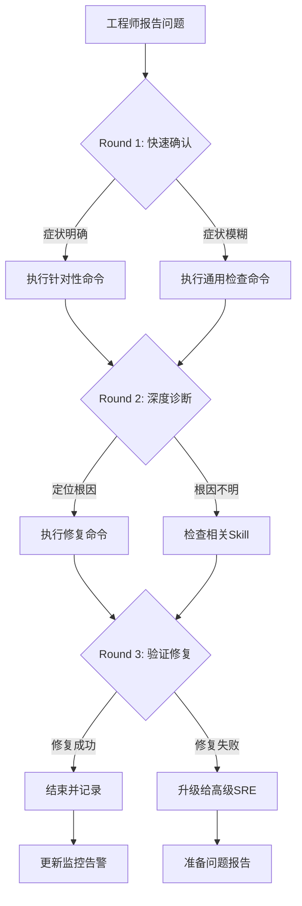

> **生产环境安全提示**
>
> 本文档包含可直接执行的运维命令。执行前请确认：当前目标集群与 Namespace 是否正确；是否具备足够的 RBAC 权限；是否已在非生产环境验证。命令风险等级标注：🔴 高风险（可能造成数据丢失或服务中断）、🟡 中风险（会修改集群状态，但通常可回滚）、🟢 低风险/只读（信息收集，无副作用）。


# K8s Performance Bottleneck 诊断与修复

性能问题是 [[Kubernetes|Kubernetes]] 生产环境中最具挑战性的问题类型之一。CPU 节流、内存 OOM、磁盘 IO 饱和、网络延迟都可能导致应用响应变慢甚至不可用。

本 [[SKILL|Skill]] 覆盖 Pod/节点/集群级别的性能瓶颈诊断和修复，包括资源优化、调度调整、应用级优化等。

## 何时使用此 Skill

| 症状 | 检测方法 | 置信度 |
|------|---------|--------|
| Pod CPU 使用率接近 limit | `kubectl top pod` | 0.95 |
| Pod 被 OOMKilled | `kubectl get pod` + Events | 0.95 |
| 节点负载高 | `kubectl top node` | 0.90 |
| 应用 P99 延迟突增 | [[Prometheus|Prometheus]]/Grafana | 0.90 |
| 磁盘 IO 等待高 | node_exporter iowait | 0.85 |
| CPU Throttling | `container_cpu_cfs_throttled_seconds_total` | 0.95 |

**排除条件**: 节点 NotReady → SKILL-NODE-001; HPA 不工作 → SKILL-AUTO-001

## 快速分级（2 分钟内完成）

```
影响范围
├── 核心服务 P99 > SLA ──────────→ P0（15min 内修复）
├── 生产环境延迟异常 ────────────→ P1（30min 内修复）
├── 成本优化（资源浪费） ────────→ P2（2h 内处理）
└── 单 Pod 性能问题 ─────────────→ P2（2h 内处理）
```

**立即升级条件**:
- 核心服务延迟超过 SLA 且持续恶化
- 多个节点同时高负载
- 集群级别资源耗尽

## 执行流程

```
# 🟢 低风险：只读/信息收集，通常无副作用
工单/告警触发
    │
    ▼
┌──────────────┐    脚本: scripts/diagnose-quick.sh
│ Phase 1      │    内容: kubectl top + metrics 快速检查（只读）
│ 快速检查      │    Step: D1.1-D1.6
└──────┬───────┘
       │ 无法确认根因
       ▼
┌──────────────┐    内容: 应用 profiling / 节点分析
│ Phase 2      │
│ 深度分析      │
└──────┬───────┘
       │ 确认根因
       ▼
┌──────────────┐    参考: reference/remediation-playbook.md
│ 修复操作      │    风险: LOW → MEDIUM → HIGH
│ REM-001~006  │
└──────┬───────┘
       │
       ▼
┌──────────────┐    脚本: scripts/verify-performance.sh
│ 验证确认      │    检查: 资源使用率/延迟
└──────────────┘
```
## 可用脚本

| 脚本 | 用途 | 参数 | 风险 |
|------|------|------|------|
| `scripts/diagnose-quick.sh` | 性能瓶颈快速诊断 | `NAMESPACE` `POD_NAME` (optional) | 只读 |
| `scripts/verify-performance.sh` | 修复后验证 | `NAMESPACE` `POD_NAME` (optional) | 只读 |

## 根因概览 (6 种)

| RC ID | 根因 | 概率 | 首选修复 | 风险 |
|-------|------|------|---------|------|
| RC-001 | CPU limit 过低导致节流 | 高 | REM-001 调整 limit | LOW |
| RC-002 | 内存 limit 过低导致 OOM | 高 | REM-002 调整 limit | LOW |
| RC-003 | 节点资源饱和 | 中 | REM-003 扩容/调度 | MEDIUM |
| RC-004 | 应用级性能问题 | 中 | REM-004 应用优化 | MEDIUM |
| RC-005 | 磁盘 IO 饱和 | 中 | REM-005 IO 优化 | MEDIUM |
| RC-006 | 网络延迟/带宽不足 | 低 | REM-006 网络优化 | MEDIUM |

## 关联资源

| 资源 | 路径 |
|------|------|
| 修复操作手册 | [reference/remediation-playbook.md](./reference/remediation-playbook.md) |
| 单文件完整版 | [../17-performance-bottleneck.md](../17-performance-bottleneck.md) |

## Related

- observability/07-tools/index|Observability Tools 知识图谱索引]]
- Platform Engineering 知识图谱索引


## 远程顾问信息收集

> 作为远程顾问，我**无法直接连接你的集群**。请帮我收集以下信息，我会根据你提供的内容给出准确的诊断建议。

### 第一步：快速确认（30 秒内回答）

1. **影响范围**：这个问题影响多少个节点 / Pod / 命名空间？
2. **紧急程度**：业务是否已中断？是否有用户投诉？
3. **发生时间**：问题是突然发生还是逐渐恶化？最近是否有变更？

### 第二步：关键信息（请提供你能获取的）

4. **kubectl 版本**：`kubectl version --short` 的输出
5. **K8s 集群版本**：`kubectl get nodes -o wide` 中的 VERSION 列
6. **节点状态**：控制平面节点是否正常？工作节点是否正常？

### 第三步：诊断信息（按需补充）

> 如果以下命令你无法执行，请直接告诉我「无法执行」，我会提供替代方案。

7. **相关组件日志**：`kubectl logs -n <namespace> <pod>` 的最后 30 行
8. **节点资源**：`kubectl top nodes` 或 `kubectl describe node <node>` 的 Capacity/Allocated resources
9. **近期变更**：最近 24 小时是否有部署、扩缩容、配置变更？

### 如果信息不足

如果你目前只能提供部分信息，**请从第一步开始**。我会根据已有信息先给出初步判断，并告诉你还需要收集什么。

> **替代沟通方式**：如果你不方便执行命令，也可以直接描述你看到的页面/告警内容，我会帮你解读。


## 命令替代方案

> 如果你无法执行以下命令，请参考对应的替代方案。

### 通用替代方案

| 原命令 | 无法执行的原因 | 替代方案 A | 替代方案 B |
|:---|:---|:---|:---|
| `kubectl get pods` | 无 kubectl 权限 | 通过集群管理控制台查看 Pod 列表 | 请有权限的同事执行并截图 |
| `kubectl logs <pod>` | 无日志权限 | 查看应用自身的日志文件（/var/log/） | 使用日志聚合系统（如 ELK/Loki）查询 |
| `kubectl describe node <node>` | 无节点查看权限 | 查看监控系统的节点仪表盘 | 使用 `kubectl get node -o yaml`（如权限允许） |
| `ssh <node>` | 无法 SSH 到节点 | 使用 `kubectl debug node/<node> -it --image=busybox` | 通过跳板机访问：`ssh -J bastion <node>` |
| `systemctl status kubelet` | 无法进入节点 | 查看节点上的 kubelet 日志：`kubectl logs -n kube-system <kubelet-pod>` | 查看容器运行时日志 |
| `docker/crictl` | 无容器运行时权限 | 使用 `kubectl exec` 进入容器检查 | 查看容器运行时的事件 |

### 如果以上都无法执行

如果你因为安全策略、网络隔离或权限限制无法执行任何诊断命令：

1. **请收集你能访问的任何信息**：
   - 监控系统的截图
   - 告警通知的内容
   - 应用自身的错误页面/日志
   - 最近是否有变更（部署、扩缩容、配置更新）

2. **如果信息严重不足**：
   - 我会根据你描述的症状给出最可能的根因和修复建议
   - 但请注意：**信息不足时建议的置信度会降低**
   - 如果问题影响严重，建议立即升级给有权限的高级 SRE

3. **紧急情况下**：
   - 如果业务已中断且你无法执行任何操作
   - 请立即联系有集群管理员权限的同事
   - 同时可以准备以下信息以便快速交接：
     - 问题发生时间
     - 影响范围
     - 已尝试的操作
     - 当前的任何异常观察

## 异常反馈处理

以下场景工程师可能给出异常反馈，需准备应对：

- **CPU高但无热点进程** → 检查内核开销和系统调用频率

- **内存泄漏定位困难** → 使用pprof或jemalloc分析

- **网络延迟高** → 检查TCP重传率和缓冲区大小

- **磁盘I/O瓶颈** → 区分顺序/随机I/O和IOPS/吞吐


## 相关Skill交叉引用

本Skill诊断过程中可能涉及的其他Skill：

- [[脚本/video-scripts/node-notready.md|node notready]]

- k8s-autoscaling

- [[最佳实践/scenarios/monitoring-alerting.md|monitoring alerting]]


当本Skill的诊断步骤无法定位根因时，建议按上述顺序排查相关Skill。


## 远程顾问特别提示

> 作为部署在客户环境之外的远程顾问，以下场景需要特别注意：

### 信息收集优先级
1. **集群版本和发行版** — 不同发行版（EKS/GKE/ACK/OpenShift）的诊断路径差异很大
2. **网络拓扑** — 是否需要VPN/堡垒机？是否有专门的运维跳板机？
3. **变更时间线** — 近24小时内的所有变更（部署、配置更新、节点操作）
4. **监控数据** — 能否提供Prometheus/Grafana截图或导出数据？

### 受限场景处理
| 限制 | 应对策略 |
|:---|:---|
| 工程师无kubectl权限 | 指导使用Dashboard或提供只读kubeconfig |
| 无法SSH节点 | 依赖kubectl debug/node-shell或云平台控制台 |
| 无法访问日志 | 要求导出关键日志片段或使用日志系统查询 |
| 网络隔离无法下载工具 | 使用容器镜像内置工具或busybox |
| 安全策略禁止执行命令 | 转为配置审查和文档指导 |

### 沟通模板
- **开场**："我是远程SRE顾问，无法直接连接您的集群。请按步骤执行命令并反馈结果。"
- **确认**："请执行上述命令，将输出贴回给我。如有任何异常请立即说明。"
- **升级**："当前情况需要升级处理。请同时联系贵司高级SRE，我会准备详细报告。"
- **结束**："问题已定位，请按上述步骤修复。修复后请验证并反馈结果。如有反复随时联系。"

## 预防性措施

### 性能基线
1. **基准测试**：每个服务上线前完成性能基准测试
2. **容量规划**：基于基准测试和业务增长预测容量
3. **压力测试**：定期执行压力测试验证极限容量
4. **混沌测试**：使用Chaos Monkey验证问题恢复

### 优化清单
- [ ] CPU limits >= requests * 1.5
- [ ] 使用anti-affinity分散Pod
- [ ] 启用CPU Manager静态策略
- [ ] 大页内存支持（如需要）
- [ ] 网络策略优化（减少iptables规则）
- [ ] 本地缓存（Redis/Memcached）

## 诊断决策流程



## 工具速查表

| 工具 | 用途 | 典型命令 |
|:---|:---|:---|
| kubectl | Kubernetes CLI | `kubectl get/describe/logs/exec` |
| jq | JSON处理 | `kubectl get ... -o json | jq ...` |
| openssl | 证书检查 | `openssl x509 -in <cert> -noout -dates` |
| tcpdump | 网络抓包 | `tcpdump -i any port <port> -n` |
| strace | 系统调用追踪 | `strace -p <pid> -f` |
| iostat/vmstat | IO/内存监控 | `iostat -x 1` |
| journalctl | 系统日志 | `journalctl -u <service> -f` |
| crictl | 容器运行时 | `crictl ps/logs/inspect` |

## 远程顾问执行清单

- [ ] 确认工程师身份和环境访问权限
- [ ] 收集集群版本、发行版、网络拓扑
- [ ] 确认问题影响范围和紧急程度
- [ ] 指导执行Round 1命令并收集输出
- [ ] 分析输出，选择Round 2分支
- [ ] 指导执行Round 2命令并收集输出
- [ ] 定位根因，提供修复方案
- [ ] 指导执行修复命令并验证
- [ ] 确认修复成功，更新相关文档
- [ ] 评估是否需要升级或事后复盘


## 相关概念

- [[概念/kubernetes-architecture-overview.md|Kubernetes 架构概览]] — Kubernetes 架构设计与性能优化基础


<!-- risk-assessed -->
