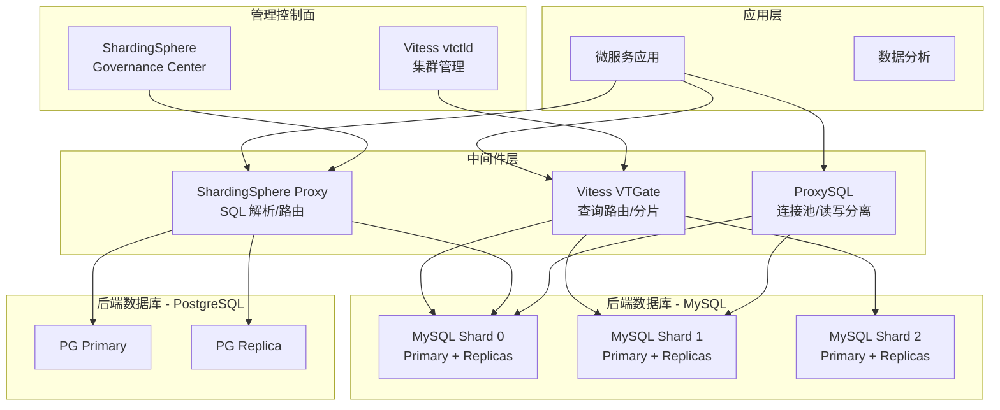

> **生产环境安全提示**
>
> 本文档包含可直接执行的运维命令。执行前请确认：当前目标集群与 Namespace 是否正确；是否具备足够的 RBAC 权限；是否已在非生产环境验证。命令风险等级标注：🔴 高风险（可能造成数据丢失或服务中断）、🟡 中风险（会修改集群状态，但通常可回滚）、🟢 低风险/只读（信息收集，无副作用）。


# 数据库中间件 [[Kubernetes|Kubernetes]] 企业级实践

> **适用版本**: [[Vitess|Vitess]] v21.0 / ShardingSphere v5.5 / ProxySQL v2.7  
> **最后更新**: 2026-04-26  
> **难度**: 高级 → 专家

---

<!-- chunk: 概述 -->## 概述

数据库中间件是解决关系型数据库水平扩展、读写分离、数据分片和连接池化等问题的核心组件。在 Kubernetes 环境中，数据库中间件的部署和管理面临新的挑战：如何与 K8s [[Service|Service]] 发现机制集成、如何管理有状态的数据库分片拓扑、如何实现中间件本身的弹性伸缩和高可用。

本文档深入探讨三大主流数据库中间件在 K8s 上的实践：Vitess（CNCF Graduated，MySQL 水平扩展）、Apache ShardingSphere（分布式数据库代理）、ProxySQL（高性能 MySQL 代理）。内容覆盖 Operator 部署、分片策略、连接池模式、读写分离、性能调优和监控告警。

## 数据库中间件的演进与定位

数据库中间件的出现源于关系型数据库在水平扩展能力上的天然局限。传统的关系型数据库（MySQL、PostgreSQL）采用单机架构，垂直扩展存在硬件上限，主从复制只能解决读扩展问题而无法解决写扩展和数据容量扩展问题。数据库中间件通过在应用和数据库之间引入代理层，实现了透明的数据分片、查询路由和连接管理。

Vitess 是这一领域的标杆项目。它起源于 YouTube 内部的 MySQL 扩展需求，2018 年进入 CNCF 孵化，2021 年毕业为 CNCF Graduated 项目。Vitess 的核心设计理念是将 MySQL 的运维最佳实践产品化：通过 VTGate 提供兼容 MySQL 协议的查询入口，通过 VTTablet 管理 MySQL 实例的生命周期，通过 VReplication 实现跨分片的数据迁移。

Apache ShardingSphere 采取了不同的技术路线。它最初是当当网开源的 Sharding-JDBC，后来捐赠给 Apache 基金会并发展成为包含 Sharding-JDBC（客户端模式）和 ShardingSphere Proxy（代理模式）的完整生态。ShardingSphere 的优势在于支持多种后端数据库（MySQL、PostgreSQL、Oracle），提供丰富的分片算法和分布式事务方案。

ProxySQL 则专注于 MySQL 代理层的极致优化。它是一个高性能的 MySQL 代理服务器，支持查询缓存、查询路由、读写分离、连接池和多路复用。ProxySQL 的核心优势在于其灵活的查询规则引擎：可以根据正则表达式匹配 SQL 语句，将不同的查询路由到不同的后端服务器组。

---

<!-- chunk: 架构设计 -->## 架构设计

## 数据库中间件总体架构



## 中间件选型对比

| 维度 | Vitess | ShardingSphere | ProxySQL |
|:---|:---|:---|:---|
| 核心功能 | MySQL 分片 + 代理 | 多数据库分片代理 | MySQL 读写分离 + 连接池 |
| 数据库支持 | MySQL only | MySQL + PG + 异构 | MySQL + MariaDB |
| 分片能力 | 自动/手动分片 | 灵活分片算法 | 不支持分片 |
| 连接池 | 内建 | 内建（HikariCP） | 核心能力 |
| 读写分离 | 支持 | 支持 | 核心能力 |
| K8s 支持 | Operator（原生） | Helm / 手动 | Helm / 手动 |
| 查询路由 | 基于分片键 | 基于分片算法 | 基于规则匹配 |
| CNCF 状态 | Graduated | Apache 顶级项目 | 独立项目 |
| 适用规模 | 超大规模（YouTube） | 中大规模 | 中小规模 |

---

<!-- chunk: 核心组件配置 -->## 核心组件配置

## Vitess Operator on K8s

> ⚠️ **🟡 中危变更** — 变更集群资源状态，建议先 --dry-run 或 diff 确认
> - `helm upgrade/install`：部署/升级 release
> - `kubectl apply/create/replace`：创建/变更集群资源

``` bash
# 🟡 中风险：会修改集群/资源状态，执行前请确认目标、影响范围与授权
# Install Vitess Operator
kubectl apply -f https://raw.githubusercontent.com/vitessio/vitess/v21.0.0/deploy/operator.yaml

# Or using Helm
helm repo add vitess https://vitess.io/helm-charts
helm install vitess-operator vitess/vitess-operator \
  --namespace vitess \
  --create-namespace \
  --set image.tag=v21.0.0

# Verify operator is running
kubectl get pods -n vitess -l control-plane=controller-manager
echo "Expected output:"
echo "NAME                                      READY   STATUS    RESTARTS   AGE"
echo "vitess-operator-controller-manager-xxx   1/1     Running   0          60s"
```
## Vitess 集群部署

```yaml
# vitess-cluster.yaml
apiVersion: planetscale.com/v2
kind: VitessCluster
metadata:
  name: production-vitess
  namespace: vitess
spec:
  images:
    vtgate: vitess/vtgate:v21.0.0
    vttablet: vitess/vttablet:v21.0.0
    vtbackup: vitess/vtbackup:v21.0.0
    vtctld: vitess/vtctld:v21.0.0
    mysqld: vitess/mysqld:v21.0.0
    vtorc: vitess/vtorc:v21.0.0

  globalLockserver:
    etcd:
      servers:
        - address: etcd-0.etcd:2379
        - address: etcd-1.etcd:2379
        - address: etcd-2.etcd:2379

  vtgate:
    replicas: 3
    resources:
      requests:
        cpu: "2"
        memory: "4Gi"
      limits:
        cpu: "4"
        memory: "8Gi"
    flags:
      web_port: "15001"
      grpc_port: "15999"
      mysql_server_port: "15306"
      query_cache_size: "1000000"
      normalize_queries: "true"
      enable_buffer: "true"
      buffer_size: "10"
      buffer_max_failover_duration: "30s"
      consistency_replication: "primary"
    affinity:
      podAntiAffinity:
        preferredDuringSchedulingIgnoredDuringExecution:
          - weight: 100
            podAffinityTerm:
              labelSelector:
                matchLabels:
                  vitessCluster: production-vitess
                  component: vtgate
              topologyKey: kubernetes.io/hostname

  keyspaces:
    - name: commerce
      replication:
        enforce: true
      shards:
        - shard: "-80"
          databases:
            - name: commerce
          replication:
            enforce: true
          tabletPools:
            - type: replicas
              replicas: 3
              vttablet:
                resources:
                  requests:
                    cpu: "4"
                    memory: "8Gi"
                  limits:
                    cpu: "8"
                    memory: "16Gi"
                mysql:
                  resources:
                    requests:
                      cpu: "4"
                      memory: "8Gi"
                    limits:
                      cpu: "8"
                      memory: "16Gi"
                flags:
                  queryserver-config-pool-size: "500"
                  queryserver-config-stream-pool-size: "100"
                  queryserver-config-transaction-cap: "500"
                  queryserver-config-query-timeout: "60"
                  tabletauth: "mysql"
                mysqldFlags: |
                  innodb_buffer_pool_size=4G
                  innodb_log_file_size=1G
                  innodb_flush_log_at_trx_commit=2
                  max_connections=5000
                  sync_binlog=100
              backup:
                schedule: "0 2 * * *"
                retention: "7d"
        - shard: "80-"
          databases:
            - name: commerce
          tabletPools:
            - type: replicas
              replicas: 3
              vttablet:
                resources:
                  requests:
                    cpu: "4"
                    memory: "8Gi"
                  limits:
                    cpu: "8"
                    memory: "16Gi"

  vtord:
    replicas: 3
    resources:
      requests:
        cpu: "500m"
        memory: "512Mi"
```

## Vitess VReplication 工作流配置

```yaml
apiVersion: planetscale.com/v2
kind: VReplicationWorkflow
metadata:
  name: move-orders
  namespace: vitess
spec:
  sourceKeyspace: commerce
  targetKeyspace: commerce_orders
  workflow: orders_migration
  cell: zone1
  tables:
    - table: orders
      columns: '*'
  approach: copy
  vreplication:
    copyPhaseDuration: "1h"
    delayThreshold: "30s"
```

## ShardingSphere Proxy on K8s

```yaml
# shardingsphere-proxy-deployment.yaml
apiVersion: apps/v1
kind: Deployment
metadata:
  name: shardingsphere-proxy
  namespace: middleware
spec:
  replicas: 3
  selector:
    matchLabels:
      app: shardingsphere-proxy
  template:
    metadata:
      labels:
        app: shardingsphere-proxy
    spec:
      containers:
        - name: shardingsphere-proxy
          image: apache/shardingsphere-proxy:5.5.0
          ports:
            - containerPort: 3307
          env:
            - name: PORT
              value: "3307"
          resources:
            requests:
              cpu: "2"
              memory: "4Gi"
            limits:
              cpu: "4"
              memory: "8Gi"
          volumeMounts:
            - name: config
              mountPath: /opt/shardingsphere-proxy/conf
      volumes:
        - name: config
          configMap:
            name: shardingsphere-config
---
apiVersion: v1
kind: Service
metadata:
  name: shardingsphere-proxy
  namespace: middleware
spec:
  selector:
    app: shardingsphere-proxy
  ports:
    - port: 3307
      targetPort: 3307
  type: ClusterIP
---
apiVersion: autoscaling/v2
kind: HorizontalPodAutoscaler
metadata:
  name: shardingsphere-proxy-hpa
  namespace: middleware
spec:
  scaleTargetRef:
    apiVersion: apps/v1
    kind: Deployment
    name: shardingsphere-proxy
  minReplicas: 3
  maxReplicas: 10
  metrics:
    - type: Resource
      resource:
        name: cpu
        target:
          type: Utilization
          averageUtilization: 70
```

## ShardingSphere 分片配置

```yaml
# shardingsphere-config ConfigMap
apiVersion: v1
kind: ConfigMap
metadata:
  name: shardingsphere-config
  namespace: middleware
data:
  server.yaml: |
    mode:
      type: Cluster
      repository:
        type: ZooKeeper
        props:
          namespace: governance_ds
          server-lists: zookeeper:2181
          retryIntervalMilliseconds: 500
          timeToLiveSeconds: 60
          maxRetries: 3
          operationTimeoutMilliseconds: 500
    
    authority:
      users:
        - user: root@%
          password: root_password
        - user: app_user@%
          password: app_password
      privilege:
        type: ALL_PERMITTED
    
    props:
      max-connections-size-per-query: 5
      kernel-executor-size: 16
      proxy-frontend-database-type: MySQL
      sql-show: false
      check-table-metadata-enabled: false
      proxy-frontend-max-connections: 10000
  
  config-sharding.yaml: |
    databaseName: sharding_db
    
    dataSources:
      ds_0:
        url: jdbc:mysql://mysql-shard-0.db.svc.cluster.local:3306/commerce_0
        username: root
        password: root_password
        connectionTimeoutMilliseconds: 30000
        idleTimeoutMilliseconds: 60000
        maxLifetimeMilliseconds: 1800000
        maxPoolSize: 200
        minPoolSize: 10
      ds_1:
        url: jdbc:mysql://mysql-shard-1.db.svc.cluster.local:3306/commerce_1
        username: root
        password: root_password
        connectionTimeoutMilliseconds: 30000
        idleTimeoutMilliseconds: 60000
        maxLifetimeMilliseconds: 1800000
        maxPoolSize: 200
        minPoolSize: 10
      ds_2:
        url: jdbc:mysql://mysql-shard-2.db.svc.cluster.local:3306/commerce_2
        username: root
        password: root_password
        connectionTimeoutMilliseconds: 30000
        idleTimeoutMilliseconds: 60000
        maxLifetimeMilliseconds: 1800000
        maxPoolSize: 200
        minPoolSize: 10
    
    rules:
      - !SHARDING
        tables:
          t_order:
            actualDataNodes: ds_${0..2}.t_order_${0..15}
            tableStrategy:
              standard:
                shardingColumn: order_id
                shardingAlgorithmName: t_order_inline
            keyGenerateStrategy:
              column: order_id
              keyGeneratorName: snowflake
          t_order_item:
            actualDataNodes: ds_${0..2}.t_order_item_${0..15}
            tableStrategy:
              standard:
                shardingColumn: order_id
                shardingAlgorithmName: t_order_item_inline
            keyGenerateStrategy:
              column: order_item_id
              keyGeneratorName: snowflake
          t_user:
            actualDataNodes: ds_${user_id % 3}.t_user
            databaseStrategy:
              standard:
                shardingColumn: user_id
                shardingAlgorithmName: user_db_inline
        
        bindingTables:
          - t_order, t_order_item
        
        shardingAlgorithms:
          t_order_inline:
            type: INLINE
            props:
              algorithm-expression: ds_${Math.abs(order_id.hashCode()) % 3}.t_order_${order_id % 16}
          t_order_item_inline:
            type: INLINE
            props:
              algorithm-expression: ds_${Math.abs(order_id.hashCode()) % 3}.t_order_item_${order_id % 16}
          user_db_inline:
            type: INLINE
            props:
              algorithm-expression: ds_${user_id % 3}
        
        keyGenerators:
          snowflake:
            type: SNOWFLAKE
            props:
              worker-id: 1
```

## ProxySQL on K8s

```yaml
apiVersion: apps/v1
kind: Deployment
metadata:
  name: proxysql
  namespace: middleware
spec:
  replicas: 3
  selector:
    matchLabels:
      app: proxysql
  template:
    metadata:
      labels:
        app: proxysql
    spec:
      containers:
        - name: proxysql
          image: proxysql/proxysql:2.7.0
          ports:
            - containerPort: 6033
              name: mysql
            - containerPort: 6032
              name: admin
            - containerPort: 6080
              name: web
          resources:
            requests:
              cpu: "1"
              memory: "2Gi"
            limits:
              cpu: "2"
              memory: "4Gi"
          volumeMounts:
            - name: config
              mountPath: /etc/proxysql
            - name: data
              mountPath: /var/lib/proxysql
          livenessProbe:
            exec:
              command:
                - mysqladmin
                - ping
                - -h
                - "127.0.0.1"
                - -P
                - "6032"
                - -u
                - admin
                - -padmin
            initialDelaySeconds: 30
            periodSeconds: 10
          readinessProbe:
            exec:
              command:
                - mysqladmin
                - ping
                - -h
                - "127.0.0.1"
                - -P
                - "6032"
                - -u
                - admin
                - -padmin
            initialDelaySeconds: 5
            periodSeconds: 5
      volumes:
        - name: config
          configMap:
            name: proxysql-config
        - name: data
          emptyDir: {}
---
apiVersion: v1
kind: ConfigMap
metadata:
  name: proxysql-config
  namespace: middleware
data:
  proxysql.cnf: |
    datadir="/var/lib/proxysql"
    admin_variables=
    {
        admin_credentials="admin:admin;radmin:radmin"
        mysql_ifaces="0.0.0.0:6032"
        web_enabled=true
        web_port=6080
        restapi_enabled=true
    }
    mysql_variables=
    {
        threads=8
        max_connections=10000
        default_query_delay=0
        default_query_timeout=36000000
        have_compress=true
        poll_timeout=2000
        interfaces="0.0.0.0:6033"
        default_schema="information_schema"
        stacksize=1048576
        server_version="8.4.0"
        connect_timeout_server=3000
        monitor_username="monitor_user"
        monitor_password="monitor_password"
        monitor_history=600000
        monitor_connect_interval=60000
        monitor_ping_interval=10000
        monitor_read_only_interval=1500
        monitor_read_only_timeout=500
        ping_interval_server_msec=120000
        ping_timeout_server=500
        commands_stats=true
        sessions_sort=true
        connect_retries_on_failure=10
    }
    mysql_servers=
    (
        {address="mysql-master-0.db.svc.cluster.local",port=3306,hostgroup=10,weight=1000,max_connections=500},
        {address="mysql-slave-0.db.svc.cluster.local",port=3306,hostgroup=20,weight=500,max_connections=500},
        {address="mysql-slave-1.db.svc.cluster.local",port=3306,hostgroup=20,weight=500,max_connections=500},
        {address="mysql-slave-2.db.svc.cluster.local",port=3306,hostgroup=20,weight=500,max_connections=500}
    )
    mysql_users=
    (
        {username="app_user",password="app_password",default_hostgroup=10,active=1,max_connections=1000},
        {username="readonly_user",password="readonly_password",default_hostgroup=20,active=1,max_connections=1000}
    )
    mysql_query_rules=
    (
        {rule_id=1,active=1,match_digest="^SELECT.*FOR UPDATE",destination_hostgroup=10,apply=1},
        {rule_id=2,active=1,match_digest="^SELECT.*LOCK IN SHARE MODE",destination_hostgroup=10,apply=1},
        {rule_id=3,active=1,match_digest="^SELECT",destination_hostgroup=20,apply=1}
    )
```

---

<!-- chunk: ProxySQL 管理变量参考 -->## ProxySQL 管理变量参考

## ProxySQL Admin 变量表

| 变量名 | 默认值 | 说明 | 推荐值 |
|:---|:---|:---|:---|
| `admin_credentials` | admin:admin | 管理接口凭据 | 使用强密码 |
| `mysql_ifaces` | 0.0.0.0:6032 | 管理接口监听地址 | 限制为内网 |
| `web_enabled` | false | 启用 Web 管理界面 | true |
| `web_port` | 6080 | Web 界面端口 | 6080 |
| `restapi_enabled` | false | 启用 REST API | true |

## ProxySQL MySQL 变量表

| 变量名 | 默认值 | 说明 | 推荐值 |
|:---|:---|:---|:---|
| `threads` | 4 | 工作线程数 | CPU 核数 × 2 |
| `max_connections` | 100k | 最大客户端连接数 | 应用总连接 × 2 |
| `default_query_timeout` | 36000000 | 查询超时 (ms) | 600000 (10min) |
| `connect_timeout_server` | 1000 | 后端连接超时 (ms) | 3000 |
| `monitor_username` | — | 监控用户名 | monitor_user |
| `monitor_password` | — | 监控密码 | 强密码 |
| `monitor_history` | 600000 | 监控历史保留 (ms) | 600000 |
| `monitor_connect_interval` | 60000 | 连接检查间隔 (ms) | 60000 |
| `monitor_ping_interval` | 10000 | Ping 检查间隔 (ms) | 10000 |
| `monitor_read_only_interval` | 1000 | 只读检查间隔 (ms) | 1500 |
| `ping_interval_server_msec` | 10000 | 后端 Ping 间隔 (ms) | 120000 |
| `ping_timeout_server` | 200 | 后端 Ping 超时 (ms) | 500 |
| `free_connections_pct` | 10 | 空闲连接百分比 | 10 |
| `connection_max_age_ms` | 0 | 连接最大生命周期 | 28800000 (8h) |
| `connect_retries_on_failure` | 5 | 连接失败重试次数 | 10 |
| `connection_warming` | false | 连接预热 | true |
| `max_stmts_per_connection` | 20 | 每连接最大 prepared stmt | 200 |
| `hostgroup_manager_verbose` | 1 | 日志详细级别 | 1 |
| `threshold_resultset_size` | 4MB | 结果集大小阈值 | 16MB |

---

<!-- chunk: 分片策略完整示例 -->## 分片策略完整示例

## Hash 分片示例

```yaml
Hash分片策略:
  原理: shard_index = hash(sharding_key) % shard_count
  优点: 数据分布均匀, 热点分散
  缺点: 扩容需迁移数据, 范围查询需扫描所有分片
  
  Vitess配置:
    VIndex类型: hash
    分片键: user_id
    分片数: 2 (keyspace id范围: -80, 80-)
    路由: SELECT * FROM users WHERE user_id = 123
      → hash(123) = 0x7B → falls in shard "-80"
  
  ShardingSphere配置:
    算法类型: MOD
    分片键: user_id
    分片数: 3
    表达式: ds_${user_id % 3}
```

## Range 分片示例

```yaml
Range分片策略:
  原理: 按分片键值范围分配到不同分片
  优点: 范围查询高效, 扩容简单
  缺点: 热点问题 (最新数据集中在一个分片)
  
  典型场景: 按时间分片
  
  Vitess配置:
    分片键: created_at (按月)
    分片规则:
      - shard "2024-01": 2024-01-01 ~ 2024-01-31
      - shard "2024-02": 2024-02-01 ~ 2024-02-29
      - shard "2024-03": 2024-03-01 ~ 2024-03-31
    
  ShardingSphere配置:
    算法类型: INTERVAL
    分片键: order_date
    配置:
      datetimeLower: "2024-01-01"
      datetimeUpper: "2025-01-01"
      shardingSeconds: "2592000"  # 30 days
```

## 一致性哈希分片示例

```yaml
Consistent_Hash分片策略:
  原理: 一致性哈希环, 虚拟节点
  优点: 扩缩容只影响相邻节点, 数据迁移少
  缺点: 实现复杂, 需要虚拟节点均衡
  
  ShardingSphere配置:
    算法类型: COSID_MOD
    分片键: order_id
    配置:
      mod: 4
      virtualNodeCount: 128
```

## Vitess VIndex 完整配置

```yaml
Vitess_VIndex分片配置:
  基本VIndex (Primary VIndex):
    类型: hash
    作用: 决定数据存储在哪个分片
    配置示例:
      CREATE TABLE orders (
        order_id BIGINT NOT NULL,
        user_id BIGINT NOT NULL,
        total DECIMAL(10,2),
        PRIMARY KEY (order_id)
      ) ENGINE=InnoDB;
      
      ALTER TABLE orders ADD VINDEX (user_id) 
        USING hash;  # user_id 决定分片路由

  Lookup VIndex (辅助索引):
    类型: lookup_hash
    作用: 非分片键查询的辅助路由
    配置示例:
      ALTER TABLE orders ADD VINDEX (order_id)
        USING lookup_hash
        WITH (table='orders_lookup', from='order_id', to='user_id');
    
    查询流程:
      1. SELECT * FROM orders WHERE order_id = 100
      2. VTGate 查找 lookup 表: 100 → user_id = 456
      3. hash(456) → 确定分片
      4. 路由到正确的分片执行查询

  其他VIndex类型:
    range: 范围分片
    region_json: JSON 字段地理分区
    numeric_static_map: 静态映射表
    unicode_loose_md5: 字符串分片
```

---

<!-- chunk: 性能调优 -->## 性能调优

## 连接池模式对比

| 连接池模式 | 实现方式 | 复用粒度 | 优点 | 缺点 |
|:---|:---|:---|:---|:---|
| Session ProxySQL | 连接绑定到会话 | 会话级 | 简单，兼容性好 | 连接利用率低 |
| Transaction ProxySQL | 事务间复用连接 | 事务级 | 高复用率，推荐 | 需确保事务内无状态依赖 |
| Statement PgBouncer | 语句间复用连接 | 语句级 | 最高复用率 | 不支持事务，有限制 |
| Vitess VTGate | 内建连接池 | 事务级 | 透明，无需客户端配置 | 依赖VTGate实现 |

## 连接池容量计算

```yaml
连接池容量计算公式:
  基本公式:
    pool_size = (平均查询时间ms × 目标QPS) / 1000
    示例: (5ms × 10000 QPS) / 1000 = 50 connections
  
  安全系数:
    reserve_pool_size = pool_size × 20%
    max_client_conn = pool_size × 应用实例数 × 1.5
  
  ProxySQL推荐配置:
    max_connections: 应用总连接数 × 1.5
    default_pool_size: max_connections / (hostgroup_count × 2)
    free_connections_pct: 10
  
  PgBouncer推荐配置:
    max_client_conn: 应用总连接数 × 1.5
    default_pool_size: PostgreSQL max_connections / pooler_count × 0.8
    reserve_pool_size: default_pool_size × 0.2
    reserve_pool_timeout: 5
  
  Vitess VTGate推荐配置:
    queryserver-config-pool-size: 目标并发连接数
    queryserver-config-transaction-cap: 同时活跃事务数
    queryserver-config-stream-pool-size: 流式查询连接数
```

## 分片策略性能对比

| 分片策略 | 算法 | 优点 | 缺点 | 适用场景 |
|:---|:---|:---|:---|:---|
| Hash (取模) | `user_id % N` | 数据分布均匀 | 扩容需迁移数据 | 用户维度查询 |
| Range (范围) | `order_date` 范围 | 天然时间分区 | 热点问题 | 时序数据 |
| Consistent Hash | 一致性哈希 | 扩缩容迁移少 | 实现复杂 | 动态扩容场景 |
| Vitess Vindex | 可插拔索引 | 灵活路由 | 学习成本高 | 复杂业务 |
| ShardingSphere Inline | 表达式分片 | 配置简单 | 功能有限 | 简单分片 |

---

<!-- chunk: 性能基准测试结果 -->## 性能基准测试结果

## 测试环境

```yaml
测试环境:
  Kubernetes集群: 3节点, 每节点 16C/64GB
  存储: NVMe SSD, 100GB
  网络: 10Gbps
  
  数据库:
    MySQL 8.4: innodb_buffer_pool_size=16G
    ProxySQL: threads=8
    Vitess: vtgate 3副本, vttablet 6副本 (2 shard)
    ShardingSphere: 3副本, 3 shard (6 MySQL)
  
  测试工具: sysbench 1.1, oltp_read_write
  数据量: 10张表, 每张 1000万行
  并发数: 50, 100, 200, 500, 1000
```

## 基准测试结果表

| 配置 | 并发数 | QPS | P95 延迟 (ms) | P99 延迟 (ms) | 连接利用率 |
|:---|:---|:---|:---|:---|:---|
| MySQL 直连 | 50 | 12,450 | 4.2 | 8.1 | 85% |
| MySQL 直连 | 100 | 18,200 | 6.8 | 14.3 | 95% |
| MySQL 直连 | 200 | 16,800 | 15.6 | 38.2 | 99% (瓶颈) |
| MySQL + ProxySQL | 50 | 11,800 | 4.8 | 9.2 | 45% |
| MySQL + ProxySQL | 100 | 19,500 | 5.9 | 11.8 | 62% |
| MySQL + ProxySQL | 200 | 24,100 | 9.2 | 18.5 | 78% |
| MySQL + ProxySQL | 500 | 28,600 | 18.4 | 35.6 | 89% |
| MySQL + ProxySQL | 1000 | 26,200 | 42.1 | 85.3 | 96% |
| Vitess (2 shard) | 50 | 10,200 | 6.1 | 12.4 | 38% |
| Vitess (2 shard) | 100 | 17,800 | 7.5 | 14.8 | 55% |
| Vitess (2 shard) | 200 | 28,500 | 8.8 | 16.2 | 72% |
| Vitess (2 shard) | 500 | 42,300 | 14.2 | 28.6 | 85% |
| Vitess (2 shard) | 1000 | 48,600 | 22.8 | 45.1 | 92% |
| ShardingSphere (3 shard) | 50 | 9,800 | 6.5 | 13.1 | 40% |
| ShardingSphere (3 shard) | 100 | 16,500 | 8.2 | 16.4 | 58% |
| ShardingSphere (3 shard) | 200 | 26,800 | 10.1 | 20.3 | 74% |
| ShardingSphere (3 shard) | 500 | 38,200 | 17.6 | 34.8 | 86% |
| ShardingSphere (3 shard) | 1000 | 44,100 | 26.3 | 52.7 | 93% |

## 基准测试结论

```yaml
测试结论:
  场景一_低并发_50-100:
    推荐: MySQL 直连或 ProxySQL
    原因: 直连延迟最低, ProxySQL 连接池提供边际改善
    QPS: 12K-20K
  
  场景二_中并发_100-500:
    推荐: ProxySQL 或 Vitess
    原因: 连接池缓解连接瓶颈, 分片提升吞吐
    QPS: 20K-42K
  
  场景三_高并发_500+:
    推荐: Vitess (2+ shard) 或 ShardingSphere
    原因: 分片线性扩展写能力, 连接池化降低后端压力
    QPS: 40K-50K+
  
  场景四_极致性能:
    推荐: Vitess 4+ shard
    原因: YouTube 验证, 支持数千 MySQL 实例管理
    QPS: 100K+ (线性扩展)
```

---

<!-- chunk: 高可用与容灾 -->## 高可用与容灾

## ProxySQL 高可用部署

```yaml
apiVersion: v1
kind: Service
metadata:
  name: proxysql
  namespace: middleware
spec:
  selector:
    app: proxysql
  ports:
    - port: 6033
      targetPort: 6033
      name: mysql
  type: ClusterIP
  sessionAffinity: ClientIP
  sessionAffinityConfig:
    clientIP:
      timeoutSeconds: 3600
---
apiVersion: policy/v1
kind: PodDisruptionBudget
metadata:
  name: proxysql-pdb
  namespace: middleware
spec:
  minAvailable: 2
  selector:
    matchLabels:
      app: proxysql
```

## Vitess 自动故障转移

```yaml
Vitess故障转移流程 (via vtorc):
  Step_1_故障检测:
    操作: vtorc通过healthcheck检测Primary tablet不可用
    判定: 连续健康检查失败（默认3次）
    耗时: ~10秒
  
  Step_2_候选选择:
    操作: vtorc选择最合适的Replica提升
    依据: 复制位置/GTID最新的Replica
    条件: Replica健康且数据最新
  
  Step_3_执行切换:
    操作: 执行PlannedReparentShard或EmergencyReparentShard
    优先: PlannedReparent（优雅切换）
    兜底: EmergencyReparent（强制切换）
  
  Step_4_拓扑更新:
    操作: 更新etcd中的shard record
    范围: 所有VTGate感知新Primary
  
  Step_5_流量切换:
    操作: VTGate自动感知新Primary
    影响: 应用连接无感切换
    RTO: ~30秒
  
  Step_6_复制恢复:
    操作: 旧Primary作为Replica加入
    条件: 旧Primary恢复后自动接入
  
  关键参数:
    RTO: ~30秒
    RPO: 取决于复制模式
      半同步: ~0（零丢失）
      异步: < 1秒（可能丢失少量事务）
```

---

<!-- chunk: 监控告警 -->## 监控告警

## Prometheus 监控配置

```yaml
groups:
  - name: middleware.rules
    rules:
      - alert: ProxySQLDown
        expr: up{job="proxysql"} == 0
        for: 2m
        labels:
          severity: critical
        annotations:
          summary: "ProxySQL 实例宕机"

      - alert: ProxySQLConnectionPoolExhausted
        expr: proxysql_client_connections_connected / proxysql_client_connections_total > 0.9
        for: 5m
        labels:
          severity: warning
        annotations:
          summary: "ProxySQL 连接池即将耗尽"

      - alert: VitessVTGateDown
        expr: up{job="vtgate"} == 0
        for: 2m
        labels:
          severity: critical
        annotations:
          summary: "Vitess VTGate 实例宕机"

      - alert: VitessTabletDown
        expr: vitess_tablet_health == 0
        for: 5m
        labels:
          severity: critical
        annotations:
          summary: "Vitess Tablet 不健康"

      - alert: ShardingSphereProxyHighLatency
        expr: histogram_quantile(0.99, rate(ss_proxy_request_latency_bucket[5m])) > 1
        for: 5m
        labels:
          severity: warning
        annotations:
          summary: "ShardingSphere Proxy P99 延迟超过 1 秒"
```

---

<!-- chunk: 运维管理 -->## 运维管理

## Vitess 运维脚本

> ⚠️ **🟡 中危变更** — 变更集群资源状态，建议先 --dry-run 或 diff 确认
> - `kubectl exec`：进入容器执行命令，可能改变容器状态

``` bash
# 🟡 中风险：会修改集群/资源状态，执行前请确认目标、影响范围与授权
#!/bin/bash
# vitess_ops.sh - Vitess Operations Management Script
set -euo pipefail

K8S_NS="vitess"
CLUSTER="production-vitess"
KEYSPACE="commerce"

status() {
    echo "=== Vitess Cluster Status ==="
    echo "Cluster: $CLUSTER"
    echo "Keyspace: $KEYSPACE"
    echo "Namespace: $K8S_NS"
    echo ""

    echo "--- Cluster Health ---"
    kubectl get vitesscluster "$CLUSTER" -n "$K8S_NS" \
      -o jsonpath='{.status.conditions[?(@.type=="Ready")].status}' 2>/dev/null && echo " (Ready)" || echo "Unknown"
    echo ""

    echo "--- VTGate Pods ---"
    kubectl get pods -n "$K8S_NS" -l "component=vtgate" -o wide 2>/dev/null || echo "No VTGate pods found"
    echo ""

    echo "--- VTTablet Pods ---"
    kubectl get pods -n "$K8S_NS" -l "component=vttablet" -o wide 2>/dev/null || echo "No VTTablet pods found"
    echo ""

    echo "--- Shard Status ---"
    kubectl exec -n "$K8S_NS" deploy/vtctld -- vtctlclient \
        --server vtctld:15999 GetShards "$KEYSPACE" 2>/dev/null || echo "Unable to get shard status"
    echo ""

    echo "--- VReplication Workflows ---"
    kubectl exec -n "$K8S_NS" deploy/vtctld -- vtctlclient \
        --server vtctld:15999 Workflow --keyspace="$KEYSPACE" show all 2>/dev/null || echo "No workflows"
}

vertical_split() {
    local table="${1:?Table name required}"
    local target_keyspace="${2:?Target keyspace required}"
    echo "Moving table $table from $KEYSPACE to keyspace $target_keyspace..."
    echo "This will create a VReplication workflow to copy data."
    kubectl exec -n "$K8S_NS" deploy/vtctld -- vtctlclient \
        --server vtctld:15999 MoveTables --workflow "move_${table}" create \
        --source "$KEYSPACE" --tables "$table" --target "$target_keyspace"
    echo "Workflow created. Use 'switchtraffic' and 'complete' to finalize."
}

reshard() {
    local source_shards="${1:?Source shards required e.g. -80,80-}"
    local target_shards="${2:?Target shards required e.g. -40,40-80,80-}"
    echo "Resharding from [$source_shards] to [$target_shards]..."
    echo "Keyspace: $KEYSPACE"
    local workflow_name="reshard_$(date +%s)"
    kubectl exec -n "$K8S_NS" deploy/vtctld -- vtctlclient \
        --server vtctld:15999 Reshard --workflow "$workflow_name" create \
        --source_shards "$source_shards" --target_shards "$target_shards"
    echo "Reshard workflow '$workflow_name' created."
}

case "${1:-status}" in
    status)  status ;;
    split)   vertical_split "${2:?}" "${3:?}" ;;
    reshard) reshard "${2:?}" "${3:?}" ;;
    *)       echo "Usage: $0 {status|split <table> <keyspace>|reshard <source> <target>}" ;;
esac
```
---

<!-- chunk: 最佳实践 -->## 最佳实践

## 中间件选型决策树

| 需求场景 | 推荐方案 | 理由 |
|:---|:---|:---|
| 仅需读写分离 | ProxySQL | 简单高效，对应用透明 |
| MySQL 分片 2-8 个 | ShardingSphere | 灵活分片，侵入性小 |
| MySQL 分片 > 10 个 | Vitess | 经过 YouTube 规模验证 |
| 异构数据库代理 | ShardingSphere | 支持 MySQL + PG + 异构 |
| PostgreSQL 扩展 | CloudNativePG / CockroachDB | 原生分布式，无需中间件 |
| 高性能连接池 | ProxySQL | 多路复用，10-50x 复用率 |

## 灰度切换

```bash
# ProxySQL Traffic Gradual Migration
# Step 1: Route 20% of read traffic to new cluster
mysql -h proxysql -P6032 -uadmin -padmin -e "
  UPDATE mysql_servers SET weight = 200 WHERE hostname='new-slave-0' AND hostgroup=20;
  UPDATE mysql_servers SET weight = 800 WHERE hostname='old-slave-0' AND hostgroup=20;
  LOAD MYSQL SERVERS TO RUNTIME;
  SAVE MYSQL SERVERS TO DISK;
"
echo "Traffic split: 20% new / 80% old"

# Step 2: After verification, shift to 50/50
mysql -h proxysql -P6032 -uadmin -padmin -e "
  UPDATE mysql_servers SET weight = 500 WHERE hostname='new-slave-0' AND hostgroup=20;
  UPDATE mysql_servers SET weight = 500 WHERE hostname='old-slave-0' AND hostgroup=20;
  LOAD MYSQL SERVERS TO RUNTIME;
  SAVE MYSQL SERVERS TO DISK;
"
echo "Traffic split: 50% new / 50% old"

# Step 3: Full cutover
mysql -h proxysql -P6032 -uadmin -padmin -e "
  UPDATE mysql_servers SET weight = 1000 WHERE hostname='new-slave-0' AND hostgroup=20;
  UPDATE mysql_servers SET weight = 0 WHERE hostname='old-slave-0' AND hostgroup=20;
  LOAD MYSQL SERVERS TO RUNTIME;
  SAVE MYSQL SERVERS TO DISK;
"
echo "Traffic split: 100% new / 0% old"
```

---

<!-- chunk: 故障排查 -->## 故障排查

## 常见问题速查表

| 问题现象 | 可能原因 | 排查方法 | 解决方案 |
|:---|:---|:---|:---|
| ProxySQL 连接拒绝 | max_connections 达上限 | `SHOW GLOBAL STATUS LIKE 'Connections'` | 增大 max_connections |
| Vitess 查询路由错误 | Vindex 配置不当 | `VExplain ALL` 分析 | 修正 Vindex 定义 |
| ShardingSphere 路由异常 | 分片规则冲突 | 查看 proxy 日志 | 修复分片规则 |
| 连接池耗尽 | 慢查询/长事务 | 监控活跃连接 | 优化查询/设置超时 |
| 分片数据不均 | 分片键选择不当 | 各 shard 数据量统计 | 重新选择分片键/reshard |
| VTGate OOM | 查询结果集过大 | 监控内存使用 | 限制结果集大小/streaming |
| 跨分片事务超时 | 分布式事务耗时 | 查看事务日志 | 避免跨分片事务 |

## ProxySQL 故障排查脚本

```bash
#!/bin/bash
# proxysql_diag.sh - ProxySQL Diagnostic Script
set -euo pipefail

PROXYSQL_HOST="${1:-proxysql.middleware.svc.cluster.local}"
PROXYSQL_ADMIN_PORT="${2:-6032}"
ADMIN_USER="admin"
ADMIN_PASS="admin"

echo "=== ProxySQL Diagnostic Report ==="
echo "Target: $PROXYSQL_HOST:$PROXYSQL_ADMIN_PORT"
echo "Time: $(date)"
echo ""

echo "[1] Global Status"
mysql -h "$PROXYSQL_HOST" -P"$PROXYSQL_ADMIN_PORT" -u"$ADMIN_USER" -p"$ADMIN_PASS" -e "
  SELECT Variable_Name, Variable_Value 
  FROM stats.stats_mysql_global 
  WHERE Variable_Name IN (
    'ProxySQL_Uptime', 'Active_Transactions', 'Client_Connections_connected',
    'Client_Connections_created', 'Server_Connections_connected',
    'Server_Connections_created', 'Questions', 'Slow_Queries',
    'Server_Connections_aborted', 'Client_Connections_aborted'
  ) ORDER BY Variable_Name;" 2>/dev/null || echo "Unable to connect to ProxySQL admin"

echo ""
echo "[2] Connection Pool Status"
mysql -h "$PROXYSQL_HOST" -P"$PROXYSQL_ADMIN_PORT" -u"$ADMIN_USER" -p"$ADMIN_PASS" -e "
  SELECT hostgroup, srv_host, srv_port, status, ConnUsed, ConnFree, 
         ConnOK, ConnERR, Queries, Bytes_data_sent 
  FROM stats.stats_mysql_connection_pool;" 2>/dev/null || true

echo ""
echo "[3] Top 10 Slow Queries"
mysql -h "$PROXYSQL_HOST" -P"$PROXYSQL_ADMIN_PORT" -u"$ADMIN_USER" -p"$ADMIN_PASS" -e "
  SELECT digest_text, count_star, sum_time/1000 as sum_time_ms, 
         min_time/1000 as min_time_ms, max_time/1000 as max_time_ms
  FROM stats.stats_mysql_query_digest 
  ORDER BY sum_time DESC LIMIT 10;" 2>/dev/null || true

echo ""
echo "[4] Backend Server Status"
mysql -h "$PROXYSQL_HOST" -P"$PROXYSQL_ADMIN_PORT" -u"$ADMIN_USER" -p"$ADMIN_PASS" -e "
  SELECT hostgroup_id, hostname, port, status, weight, max_connections, 
         max_latency_ms, alive
  FROM mysql_servers;" 2>/dev/null || true

echo ""
echo "=== Diagnostic Complete ==="
```

---

**文档版本**: v1.0  
**最后更新**: 2026-04-26  
**适用版本**: Vitess v21.0 / ShardingSphere v5.5 / ProxySQL v2.7

---

<!-- chunk: Obsidian 相关文档 -->## Obsidian 相关文档

- domain-28-enterprise-database-middleware MOC
- [[数据库中间件/README.md|Domain 16: 企业级数据库与中间件运维 (Enterprise Database & Middleware Op...]]
- Domain-28 企业数据库与中间件 — 开源项目索引
- MySQL 企业级数据库运维管理
- PostgreSQL 企业级数据库高可用架构
- 分布式数据库企业级实践深度指南
- MongoDB 企业级数据库运维深度实践
- Redis 企业级缓存运维深度实践
- Redis Kubernetes Operator 企业级实践
- Kafka Kubernetes 企业级实践 — Strimzi Operator 深度指南
- CloudNativePG 企业级 PostgreSQL 运维指南

## See Also

- 02-postgresql-enterprise-database
- 03-distributed-database-enterprise
- 05-mongodb-enterprise-database
- 06-redis-enterprise-cache


<!-- risk-assessed -->
