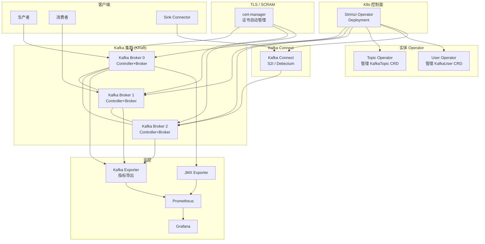

> **生产环境安全提示**
>
> 本文档包含可直接执行的运维命令。执行前请确认：当前目标集群与 Namespace 是否正确；是否具备足够的 RBAC 权限；是否已在非生产环境验证。命令风险等级标注：🔴 高风险（可能造成数据丢失或服务中断）、🟡 中风险（会修改集群状态，但通常可回滚）、🟢 低风险/只读（信息收集，无副作用）。


# Kafka [[Kubernetes|Kubernetes]] 企业级实践 — [[Strimzi|Strimzi]] Operator 深度指南

> **适用版本**: Apache Kafka 3.9 / Strimzi 0.45  
> **最后更新**: 2026-04-26  
> **难度**: 中级 → 高级

---

<!-- chunk: 概述 -->## 概述

Apache Kafka 是分布式流处理平台的行业标准，在企业级架构中承担着事件驱动架构的核心枢纽角色。从日志收集、实时数据处理、微服务异步通信到 CDC 数据管道，Kafka 的应用场景极其广泛。Strimzi 是 CNCF Sandbox 级别的 Kafka Operator，提供了在 Kubernetes 上运行 Kafka 的声明式管理方案。

Strimzi 的核心价值在于：将 Kafka 集群（包括 Broker、ZooKeeper 或 KRaft）、Kafka Connect、Kafka MirrorMaker、Kafka Bridge 等组件全部通过 CRD 管理，实现自动化部署、滚动升级、证书管理、Topic 和 User 的声明式管理。Strimzi 0.45 支持 Kafka 3.9 和 KRaft 模式（无需 ZooKeeper），标志着 Kafka on K8s 进入新阶段。

本文档系统覆盖 Strimzi Operator 的部署配置、Topic 管理、Consumer Group 监控、Exactly-Once 语义实现、以及企业级运维实践。对于面向生产环境的完整 Kafka on Kubernetes 运维指南（KRaft 与 ZooKeeper 选型、Strimzi Operator 部署、Topic/Partition/Replica 设计、吞吐调优、监控告警、升级与灾难恢复），参见 [[数据库中间件/03-message-queues/06-kafka-kubernetes-production-guide|Kafka Kubernetes 生产指南]]。

## Kafka 架构核心概念深度解析

Kafka 的架构设计围绕三个核心抽象展开：Topic（主题）、Partition（分区）和 Consumer Group（消费者组）。理解这三个概念及其交互方式，是正确使用和调优 Kafka 的基础。

**Topic 和 Partition** 是 Kafka 数据组织的核心。Topic 是逻辑上的消息分类，Partition 是 Topic 的物理分片。每个 Partition 是一个有序的、不可变的追加日志（Append-Only Log），消息在 Partition 内有一个唯一的偏移量（Offset）。Partition 的数量直接决定了并行度：一个 Topic 的最大消费吞吐量等于 Partition 数量乘以单个 Consumer 的处理能力。但 Partition 数量不是越多越好：过多的 Partition 会增加 Broker 的内存开销（每个 Partition 对应若干文件句柄和内存缓冲区）、增加 Leader 选举时间、以及增加 Controller 的管理负担。经验法则是每个 Broker 的 Partition 数量不超过 1000-2000 个。

**Consumer Group** 是 Kafka 实现消费伸缩性的关键机制。同一个 Consumer Group 中的 Consumer 共同分担一个 Topic 的所有 Partition 的消费任务，每个 Partition 最多只能被同一个 Group 中的一个 Consumer 消费。这意味着 Consumer 的数量不应超过 Partition 的数量，多余的 Consumer 将处于空闲状态。当 Group 中的 Consumer 发生变化（加入或离开）时，Kafka 会触发 Rebalance 操作重新分配 Partition。Rebalance 期间消费者无法处理消息，因此频繁的 Rebalance 会导致消费延迟。Kafka 2.4+ 引入了 Sticky Partition Assignment 策略和 Cooperative Incremental Rebalancing 协议，显著减少了 Rebalance 的影响范围。

**Offset 管理**是消费者端的关键机制。Consumer 需要定期提交已消费消息的 Offset，以便在重启或 Rebalance 后从上次的位置继续消费。Offset 可以自动提交（`enable.auto.commit=true`）或手动提交（`commitSync`/`commitAsync`）。生产环境建议使用手动提交，确保每条消息处理完成后再提交 Offset，避免消息丢失。但手动提交需要权衡 Exactly-Once 语义和吞吐量：每条消息都同步提交可以确保不丢消息但吞吐量很低，异步提交吞吐量高但可能在宕机时丢失少量消息。

## Strimzi Operator 的设计理念

Strimzi 采用了"声明式状态管理"的设计理念。用户通过 CRD 描述期望的 Kafka 集群状态（多少个 Broker、什么配置、什么存储），Strimzi Operator 负责将当前状态向期望状态收敛。这种模式与 K8s 原生控制器的工作方式一致，使得 Kafka 集群的管理体验与 K8s 中其他资源（Deployment、Service、ConfigMap）保持一致。

Strimzi 的核心 CRD 包括：`Kafka`（定义集群）、`KafkaTopic`（定义 Topic）、`KafkaUser`（定义用户和权限）、`KafkaConnect`（定义 Connect 集群）、`KafkaMirrorMaker2`（定义跨集群复制）和 `KafkaRebalance`（定义再均衡任务）。通过这些 CRD，用户可以使用 `kubectl` 命令完成所有 Kafka 管理操作，无需直接使用 Kafka 的命令行工具。

Strimzi 的安全模型值得一提。它支持三种认证方式：TLS 双向认证、SCRAM-SHA-512 和 OAuth 2.0。所有认证方式都可以通过 `KafkaUser` CRD 声明式管理，Operator 自动创建证书或密码并配置到 Broker 和客户端。授权方面支持简单 ACL 和 OPA（Open Policy Agent）集成。对于企业环境，Strimzi 还支持与 LDAP 集成进行用户认证，以及通过 cert-manager 自动管理证书轮换。

---

<!-- chunk: 架构设计 -->## 架构设计

## Strimzi Kafka 架构图



## KRaft vs ZooKeeper

| 维度 | KRaft (推荐) | ZooKeeper (传统) |
|:---|:---|:---|
| 架构复杂度 | 低（无 ZK 依赖） | 高（需额外维护 ZK） |
| 元数据管理 | Kafka 内部 Raft | 外部 ZooKeeper |
| 运维成本 | 低 | 高 |
| Partition 限制 | 百万级 | 十万级 |
| 控制器故障转移 | 快速（Raft 选举） | 较慢（ZK 选举） |
| Strimzi 支持 | 0.35+ | 全版本 |

---

<!-- chunk: 核心组件配置 -->## 核心组件配置

## Strimzi Operator 安装

> ⚠️ **🟡 中危变更** — 变更集群资源状态，建议先 --dry-run 或 diff 确认
> - `helm upgrade/install`：部署/升级 release

``` bash
# 🟡 中风险：会修改集群/资源状态，执行前请确认目标、影响范围与授权
helm repo add strimzi https://strimzi.io/charts/
helm install strimzi-kafka strimzi/strimzi-kafka-operator \
  --namespace kafka \
  --create-namespace \
  --set image.tag=0.45.0 \
  --set watchAnyNamespace=false \
  --set resources.requests.cpu=200m \
  --set resources.requests.memory=256Mi \
  --set resources.limits.cpu=1 \
  --set resources.limits.memory=512Mi \
  --set logLevel=INFO
```
## 生产级 Kafka 集群 (KRaft)

```yaml
apiVersion: kafka.strimzi.io/v1beta2
kind: Kafka
metadata:
  name: production-kafka
  namespace: kafka
spec:
  kafka:
    version: 3.9.0
    replicas: 3
    listeners:
      - name: tls
        port: 9093
        type: internal
        tls: true
        authentication:
          type: tls
      - name: external
        port: 9094
        type: loadbalancer
        tls: true
        authentication:
          type: scram-sha-512
        configuration:
          bootstrap:
            host: kafka-bootstrap.company.com
          brokers:
            - broker: 0
              host: kafka-broker-0.company.com
            - broker: 1
              host: kafka-broker-1.company.com
            - broker: 2
              host: kafka-broker-2.company.com
    config:
      offsets.topic.replication.factor: 3
      transaction.state.log.replication.factor: 3
      transaction.state.log.min.isr: 2
      default.replication.factor: 3
      min.insync.replicas: 2
      log.retention.hours: 168
      log.retention.bytes: 107374182400
      log.segment.bytes: 1073741824
      num.network.threads: 8
      num.io.threads: 16
      socket.send.buffer.bytes: 102400
      socket.receive.buffer.bytes: 102400
      socket.request.max.bytes: 104857600
      num.partitions: 12
      num.recovery.threads.per.data.dir: 4
      log.cleanup.policy: delete
      log.compaction.threads: 2
      auto.create.topics.enable: false
      delete.topic.enable: true
      controlled.shutdown.enable: true
      controlled.shutdown.max.retries: 3
      group.initial.rebalance.delay.ms: 3000
      linger.ms: 10
      batch.size: 65536
      compression.type: lz4
      message.max.bytes: 10485760
    resources:
      requests:
        cpu: "4"
        memory: "8Gi"
      limits:
        cpu: "8"
        memory: "16Gi"
    jvmOptions:
      -Xms: "4g"
      -Xmx: "4g"
      -XX:
        MetaspaceSize: "256m"
        MaxMetaspaceSize: "512m"
        +UseG1GC: true
        MaxGCPauseMillis: "50"
        InitiatingHeapOccupancyPercent: "35"
    storage:
      type: jbod
      volumes:
        - id: 0
          type: persistent-claim
          size: 500Gi
          storageClass: local-ssd
          deleteClaim: false
          overrides:
            - broker: 0
              storageClass: local-ssd
            - broker: 1
              storageClass: local-ssd
            - broker: 2
              storageClass: local-ssd
    affinity:
      podAntiAffinity:
        requiredDuringSchedulingIgnoredDuringExecution:
          - labelSelector:
              matchLabels:
                strimzi.io/cluster: production-kafka
                strimzi.io/name: production-kafka-kafka
            topologyKey: kubernetes.io/hostname
    topologySpreadConstraints:
      - maxSkew: 1
        topologyKey: topology.kubernetes.io/zone
        whenUnsatisfiable: DoNotSchedule
        labelSelector:
          matchLabels:
            strimzi.io/cluster: production-kafka
    tolerations:
      - key: "dedicated"
        operator: "Equal"
        value: "kafka"
        effect: "NoSchedule"
    metricsConfig:
      type: jmxPrometheusExporter
      valueFrom:
        configMapKeyRef:
          name: kafka-metrics-config
          key: kafka-metrics.yaml

  kafkaExporter:
    image: quay.io/strimzi/kafka:0.45.0-kafka-3.9.0
    groupRegex: ".*"
    topicRegex: ".*"
    logging: info
    resources:
      requests:
        cpu: "200m"
        memory: "256Mi"
      limits:
        cpu: "500m"
        memory: "512Mi"

  entityOperator:
    topicOperator:
      resources:
        requests:
          cpu: "200m"
          memory: "256Mi"
        limits:
          cpu: "500m"
          memory: "512Mi"
      logging:
        type: inline
        loggers:
          rootLogger.level: INFO
    userOperator:
      resources:
        requests:
          cpu: "200m"
          memory: "256Mi"
        limits:
          cpu: "500m"
          memory: "512Mi"

  cruiseControl:
    metricsConfig:
      type: jmxPrometheusExporter
      valueFrom:
        configMapKeyRef:
          name: kafka-metrics-config
          key: cc-metrics.yaml
    resources:
      requests:
        cpu: "1"
        memory: "1Gi"
      limits:
        cpu: "2"
        memory: "2Gi"
    config:
      goals: >
        com.linkedin.kafka.cruisecontrol.analyzer.goals.RackAwareGoal,
        com.linkedin.kafka.cruisecontrol.analyzer.goals.ReplicaCapacityGoal,
        com.linkedin.kafka.cruisecontrol.analyzer.goals.DiskCapacityGoal,
        com.linkedin.kafka.cruisecontrol.analyzer.goals.NetworkInboundCapacityGoal,
        com.linkedin.kafka.cruisecontrol.analyzer.goals.NetworkOutboundCapacityGoal,
        com.linkedin.kafka.cruisecontrol.analyzer.goals.CpuCapacityGoal,
        com.linkedin.kafka.cruisecontrol.analyzer.goals.ReplicaDistributionGoal,
        com.linkedin.kafka.cruisecontrol.analyzer.goals.PotentialNwOutGoal,
        com.linkedin.kafka.cruisecontrol.analyzer.goals.DiskUsageDistributionGoal,
        com.linkedin.kafka.cruisecontrol.analyzer.goals.NetworkInboundUsageDistributionGoal,
        com.linkedin.kafka.cruisecontrol.analyzer.goals.NetworkOutboundUsageDistributionGoal,
        com.linkedin.kafka.cruisecontrol.analyzer.goals.CpuUsageDistributionGoal,
        com.linkedin.kafka.cruisecontrol.analyzer.goals.TopicReplicaDistributionGoal,
        com.linkedin.kafka.cruisecontrol.analyzer.goals.LeaderReplicaDistributionGoal,
        com.linkedin.kafka.cruisecontrol.analyzer.goals.LeaderBytesInDistributionGoal
```

---

<!-- chunk: Topic 管理 -->## Topic 管理

## 声明式 Topic 管理

```yaml
apiVersion: kafka.strimzi.io/v1beta2
kind: KafkaTopic
metadata:
  name: orders
  namespace: kafka
  labels:
    strimzi.io/cluster: production-kafka
spec:
  partitions: 12
  replicas: 3
  config:
    retention.ms: 604800000
    retention.bytes: 10737418240
    cleanup.policy: delete
    compression.type: lz4
    min.insync.replicas: 2
    max.message.bytes: 10485760
    segment.bytes: 536870912
    segment.ms: 86400000
---
apiVersion: kafka.strimzi.io/v1beta2
kind: KafkaTopic
metadata:
  name: user-events
  namespace: kafka
  labels:
    strimzi.io/cluster: production-kafka
spec:
  partitions: 24
  replicas: 3
  config:
    retention.ms: 2592000000
    cleanup.policy: compact,delete
    compression.type: lz4
    min.insync.replicas: 2
    min.compaction.lag.ms: 3600000
    delete.retention.ms: 86400000
    segment.bytes: 536870912
---
apiVersion: kafka.strimzi.io/v1beta2
kind: KafkaTopic
metadata:
  name: cdc-changes
  namespace: kafka
  labels:
    strimzi.io/cluster: production-kafka
spec:
  partitions: 12
  replicas: 3
  config:
    retention.ms: 604800000
    cleanup.policy: delete
    compression.type: zstd
    min.insync.replicas: 2
```

## Topic 运维脚本

> ⚠️ **🟡 中危变更** — 变更集群资源状态，建议先 --dry-run 或 diff 确认
> - `kubectl exec`：进入容器执行命令，可能改变容器状态

``` bash
# 🟡 中风险：会修改集群/资源状态，执行前请确认目标、影响范围与授权
#!/bin/bash
# kafka_topic_ops.sh - Kafka Topic 管理脚本
set -euo pipefail

KAFKA_NS="kafka"
CLUSTER="production-kafka"
BOOTSTRAP="production-kafka-kafka-bootstrap.${KAFKA_NS}.svc.cluster.local:9093"

list_topics() {
    kubectl exec -n "$KAFKA_NS" "production-kafka-kafka-0" -- \
        bin/kafka-topics.sh --bootstrap-server "$BOOTSTRAP" --list \
        --command-config /tmp/kafka.properties
}

describe_topic() {
    local topic="${1:?Topic name required}"
    kubectl exec -n "$KAFKA_NS" "production-kafka-kafka-0" -- \
        bin/kafka-topics.sh --bootstrap-server "$BOOTSTRAP" --describe --topic "$topic" \
        --command-config /tmp/kafka.properties
}

alter_partitions() {
    local topic="${1:?Topic name required}"
    local partitions="${2:?Partition count required}"
    echo "Altering topic $topic to $partitions partitions..."
    kubectl exec -n "$KAFKA_NS" "production-kafka-kafka-0" -- \
        bin/kafka-topics.sh --bootstrap-server "$BOOTSTRAP" --alter \
        --topic "$topic" --partitions "$partitions" \
        --command-config /tmp/kafka.properties
}

case "${1:-list}" in
    list)           list_topics ;;
    describe)       describe_topic "${2:?}" ;;
    alter-partitions) alter_partitions "${2:?}" "${3:?}" ;;
    *)              echo "Usage: $0 {list|describe <topic>|alter-partitions <topic> <n>}" ;;
esac
```
---

<!-- chunk: Consumer Group 监控 -->## Consumer Group 监控

## Consumer Group 管理脚本

> ⚠️ **🟡 中危变更** — 变更集群资源状态，建议先 --dry-run 或 diff 确认
> - `kubectl exec`：进入容器执行命令，可能改变容器状态

``` bash
# 🟡 中风险：会修改集群/资源状态，执行前请确认目标、影响范围与授权
#!/bin/bash
# kafka_consumer_ops.sh - Consumer Group 管理
set -euo pipefail

KAFKA_NS="kafka"
BOOTSTRAP="production-kafka-kafka-bootstrap.${KAFKA_NS}.svc.cluster.local:9093"
PROPS="--command-config /tmp/kafka.properties"

list_groups() {
    echo "=== Consumer Groups ==="
    kubectl exec -n "$KAFKA_NS" "production-kafka-kafka-0" -- \
        bin/kafka-consumer-groups.sh --bootstrap-server "$BOOTSTRAP" --list $PROPS
}

group_lag() {
    local group="${1:?Group name required}"
    echo "=== Consumer Group: $group ==="
    kubectl exec -n "$KAFKA_NS" "production-kafka-kafka-0" -- \
        bin/kafka-consumer-groups.sh --bootstrap-server "$BOOTSTRAP" \
        --describe --group "$group" $PROPS
}

reset_offset() {
    local group="${1:?Group name required}"
    local topic="${2:?Topic name required}"
    local to="${3:?reset to: earliest|latest|to-datetime}"
    echo "Resetting offset for group=$group, topic=$topic, to=$to"
    kubectl exec -n "$KAFKA_NS" "production-kafka-kafka-0" -- \
        bin/kafka-consumer-groups.sh --bootstrap-server "$BOOTSTRAP" \
        --group "$group" --reset-offsets --topic "$topic" \
        --to-"$to" --execute $PROPS
}

case "${1:-list}" in
    list)    list_groups ;;
    lag)     group_lag "${2:?}" ;;
    reset)   reset_offset "${2:?}" "${3:?}" "${4:?}" ;;
    *)       echo "Usage: $0 {list|lag <group>|reset <group> <topic> <to>}" ;;
esac
```
---

<!-- chunk: Exactly-Once 语义 -->## Exactly-Once 语义

## 事务性 Producer 配置

```yaml
apiVersion: kafka.strimzi.io/v1beta2
kind: KafkaUser
metadata:
  name: transactional-producer
  namespace: kafka
  labels:
    strimzi.io/cluster: production-kafka
spec:
  authentication:
    type: tls
  authorization:
    type: simple
    acls:
      - resource:
          type: topic
          name: orders
        operations: [Write, Describe]
      - resource:
          type: topic
          name: __transaction_state
        operations: [Write, Describe, Read]
      - resource:
          type: transactionalId
          name: order-producer-txn
        operations: [Describe, Write]
```

## Exactly-Once 配置要点

```
Kafka Exactly-Once 语义实现:

Producer 端:
  enable.idempotence = true
  transactional.id = "unique-producer-txn-id"
  acks = all
  retries = Integer.MAX_VALUE
  max.in.flight.requests.per.connection = 5 (幂等模式下)

Consumer 端:
  isolation.level = read_committed (只读取已提交的事务消息)

Broker 端:
  min.insync.replicas = 2
  transaction.state.log.replication.factor = 3
  transaction.state.log.min.isr = 2

配置链路:
  Producer (事务写入) → Broker (持久化+事务日志) → Consumer (read_committed)
```

---

<!-- chunk: 监控告警 -->## 监控告警

## Kafka Exporter + JMX 监控

```yaml
apiVersion: monitoring.coreos.com/v1
kind: ServiceMonitor
metadata:
  name: kafka-metrics
  namespace: kafka
  labels:
    release: prometheus
spec:
  selector:
    matchLabels:
      strimzi.io/cluster: production-kafka
  namespaceSelector:
    matchNames:
      - kafka
  endpoints:
    - port: tcp-prometheus
      interval: 15s
      path: /metrics
    - port: tcp-kafka-exporter
      interval: 30s
      path: /metrics
```

## 告警规则

```yaml
groups:
  - name: kafka.rules
    rules:
      - alert: KafkaBrokerDown
        expr: kafka_server_broker_state < 1 or absent(kafka_server_broker_state)
        for: 2m
        labels:
          severity: critical
        annotations:
          summary: "Kafka Broker {{ $labels.pod }} 宕机"

      - alert: KafkaUnderReplicatedPartitions
        expr: kafka_server_replicamanager_underreplicatedpartitions > 0
        for: 5m
        labels:
          severity: warning
        annotations:
          summary: "存在未充分复制的 Partition"

      - alert: KafkaOfflinePartitions
        expr: kafka_controller_kafkacontroller_offlinepartitionscount > 0
        for: 2m
        labels:
          severity: critical
        annotations:
          summary: "存在离线 Partition"

      - alert: KafkaConsumerGroupLag
        expr: kafka_consumergroup_group_lag > 100000
        for: 10m
        labels:
          severity: warning
        annotations:
          summary: "Consumer Group {{ $labels.group }} 积压超过 10 万条"

      - alert: KafkaDiskUsageHigh
        expr: kafka_log_log_size_value / (500 * 1024^3) > 0.85
        for: 10m
        labels:
          severity: warning
        annotations:
          summary: "Kafka Broker 磁盘使用超过 85%"

      - alert: KafkaActiveController
        expr: count(kafka_controller_kafkacontroller_activecontrollercount == 1) by (cluster) != 1
        for: 5m
        labels:
          severity: critical
        annotations:
          summary: "没有活跃的 Controller 或存在多个 Controller"
```

---

<!-- chunk: 运维管理 -->## 运维管理

## 综合运维脚本

> ⚠️ **🟡 中危变更** — 变更集群资源状态，建议先 --dry-run 或 diff 确认
> - `kubectl apply/create/replace`：创建/变更集群资源
> - `kubectl label/annotate`：改元数据可能影响选择器/控制器

``` bash
# 🟡 中风险：会修改集群/资源状态，执行前请确认目标、影响范围与授权
#!/bin/bash
# strimzi_ops.sh - Strimzi Kafka 运维脚本
set -euo pipefail

KAFKA_NS="kafka"
CLUSTER="production-kafka"

status() {
    echo "=== Kafka Cluster Status ==="
    kubectl get kafka "$CLUSTER" -n "$KAFKA_NS" -o jsonpath='{.status.conditions[?(@.type=="Ready")].status}'

    echo ""
    echo "--- Pods ---"
    kubectl get pods -n "$KAFKA_NS" -l "strimzi.io/cluster=$CLUSTER" -o wide

    echo ""
    echo "--- PVCs ---"
    kubectl get pvc -n "$KAFKA_NS" -l "strimzi.io/cluster=$CLUSTER"

    echo ""
    echo "--- Topics ---"
    kubectl get kafkatopics -n "$KAFKA_NS"
}

restart_broker() {
    local pod="${1:?Pod name required}"
    echo "Rolling restart of broker: $pod"
    kubectl annotate pod "$pod" -n "$KAFKA_NS" strimzi.io/manual-rolling-update="true"
    echo "Annotated for rolling update. Operator will handle restart."
}

cruise_control_rebalance() {
    echo "Triggering Cruise Control rebalance..."
    kubectl apply -f - <<EOF
apiVersion: kafka.strimzi.io/v1beta2
kind: KafkaRebalance
metadata:
  name: production-rebalance
  namespace: $KAFKA_NS
  labels:
    strimzi.io/cluster: $CLUSTER
spec:
  mode: full
  goals:
    - DiskCapacityGoal
    - CpuCapacityGoal
    - ReplicaDistributionGoal
    - DiskUsageDistributionGoal
    - CpuUsageDistributionGoal
    - TopicReplicaDistributionGoal
    - LeaderReplicaDistributionGoal
EOF
    echo "Rebalance proposal created. Run 'kubectl get kafkrebalance' to check status."
}

case "${1:-status}" in
    status)     status ;;
    restart)    restart_broker "${2:?}" ;;
    rebalance)  cruise_control_rebalance ;;
    *)          echo "Usage: $0 {status|restart <pod>|rebalance}" ;;
esac
```
---

<!-- chunk: 最佳实践 -->## 最佳实践

## 0. Kafka on K8s 生产部署检查清单

将 Kafka 部署到 Kubernetes 生产环境之前，需要完成一系列系统性检查。Kafka 是有状态的、对性能敏感的分布式系统，其部署质量直接影响业务的稳定性和数据可靠性。

**硬件与存储规划**：Kafka 对磁盘 I/O 性能极为敏感，尤其是在高吞吐量场景下。生产环境必须使用本地 NVMe SSD 存储（`local-ssd` StorageClass），绝对不要使用网络存储。每个 Broker 的磁盘容量应根据消息保留策略和预期吞吐量计算：`磁盘容量 = 日均写入量 × 保留天数 × 副本数 × 1.2（安全系数）`。例如，日均写入 100GB、保留 7 天、3 副本，则需要 `100 × 7 × 3 × 1.2 = 2520GB` 的原始存储。JVM 堆内存建议 4-8GB（Kafka 的消息处理依赖操作系统的 Page Cache，不需要过大的 JVM 堆）。

**KRaft 模式部署**：Strimzi 0.35+ 支持 KRaft 模式，无需部署 ZooKeeper。对于新部署的集群，强烈推荐使用 KRaft 模式。Controller 和 Broker 可以合并部署（`combined` 模式，适合中小规模）或分离部署（`isolated` 模式，适合大规模）。生产环境推荐 `isolated` 模式，3 个专用 Controller 节点 + N 个 Broker 节点，Controller 使用较小的资源（2核/4GB），Broker 使用较大的资源（8核/16GB+）。

**网络配置**：Kafka Broker 之间的通信和客户端连接需要分开考虑。在 K8s 中，推荐使用 `internal` 类型 listener（ClusterIP Service）处理集群内部通信，使用 `loadbalancer` 或 `nodeport` 类型 listener 处理外部客户端连接。如果所有生产者和消费者都在 K8s 集群内部，则只需要 `internal` listener。跨命名空间或跨集群访问需要配置 NetworkPolicy 允许相应流量。

**安全配置**：生产环境必须启用认证和加密。推荐使用 TLS 双向认证（`authentication.type: tls`）进行集群内部通信，使用 SCRAM-SHA-512（`authentication.type: scram-sha-512`）进行外部客户端认证。通过 `KafkaUser` CRD 为每个应用创建独立的用户和 ACL，遵循最小权限原则。所有 listener 都应启用 TLS 加密。

**Topic 管理**：生产环境应关闭 `auto.create.topics.enable`，通过 `KafkaTopic` CRD 声明式管理所有 Topic。每个 Topic 的 Partition 数量需要根据消费并行度需求设定（建议初始值为目标 Consumer 实例数的 1-2 倍）。Replication Factor 应设为 3（或至少 2），确保单节点问题时数据不丢失。`min.insync.replicas` 应设为 2，配合 Producer 的 `acks=all` 使用。

**监控体系**：Kafka 的监控需要覆盖 Broker 层面和 Consumer Group 层面。Broker 层面通过 JMX Exporter 采集 JVM 指标和 Kafka 内部指标（消息速率、请求延迟、磁盘使用、ISR 状态等）。Consumer Group 层面通过 Kafka Exporter 采集 Lag 指标。关键告警规则包括：Broker 宕机、Under-replicated Partition、Consumer Group Lag 过大、磁盘使用率超过 85%。

## 1. Partition 数量规划

```
Partition 数量计算:
  partitions = max(target_throughput / producer_throughput, target_throughput / consumer_throughput)

示例:
  目标吞吐量: 100 MB/s
  单 Producer: 10 MB/s
  单 Consumer: 20 MB/s
  Partitions = max(100/10, 100/20) = max(10, 5) = 10

注意:
  - Partitions 过多增加 Leader 选举开销和内存占用
  - 建议单个 Broker 不超过 1000-2000 Partitions
  - 预估未来增长，适当预留
```

## 2. 资源配置建议

| 规模 | Brokers | CPU (per broker) | 内存 (per broker) | 磁盘 (per broker) |
|:---|:---|:---|:---|:---|
| 小型 | 3 | 2/4 核 | 4/8 GB | 200GB |
| 中型 | 5 | 4/8 核 | 8/16 GB | 500GB |
| 大型 | 7+ | 8/16 核 | 16/32 GB | 1TB+ |

---

<!-- chunk: 故障排查 -->## 故障排查

## 常见问题速查表

| 问题现象 | 可能原因 | 排查方法 | 解决方案 |
|:---|:---|:---|:---|
| Broker CrashLoop | 磁盘满/配置错误 | `kubectl logs <pod>` | 清理磁盘/修复配置 |
| Under-replicated | Broker 宕机/网络慢 | `kafka-topics --describe` | 恢复 Broker/检查网络 |
| Consumer Lag 持续增长 | 消费太慢/分区不均 | Consumer Group describe | 增加 Consumer/调整分区 |
| `NOT_ENOUGH_REPLICAS` | ISR < min.insync.replicas | Broker 日志 | 恢复下线 Broker |
| Topic 创建失败 | auto.create=false | 检查 KafkaTopic CRD | 手动创建 Topic |
| TLS 握手失败 | 证书过期/配置错误 | Broker 日志 | 更新证书/检查 CA |
| Strimzi Operator 不响应 | RBAC 问题 | Operator 日志 | 检查 ClusterRole |
| Rebalance 超时 | Group 太大 | `group.initial.rebalance.delay.ms` | 增大超时 |

---

**文档版本**: v1.0  
**最后更新**: 2026-04-26  
**适用版本**: Apache Kafka 3.9 / Strimzi 0.45

---

<!-- chunk: Obsidian 相关文档 -->## Obsidian 相关文档

- domain-28-enterprise-database-middleware MOC
- [[数据库中间件/README.md|Domain 16: 企业级数据库与中间件运维 (Enterprise Database & Middleware Op...]]
- Domain-28 企业数据库与中间件 — 开源项目索引
- MySQL 企业级数据库运维管理
- PostgreSQL 企业级数据库高可用架构
- 分布式数据库企业级实践深度指南
- 数据库中间件 Kubernetes 企业级实践
- MongoDB 企业级数据库运维深度实践
- Redis 企业级缓存运维深度实践
- Redis Kubernetes Operator 企业级实践
- CloudNativePG 企业级 PostgreSQL 运维指南

## See Also

- 06-redis-enterprise-cache
- 07-redis-kubernetes-operator
- 99-cloudnativepg-enterprise-guide
- 01-mysql-enterprise-database


<!-- risk-assessed -->
