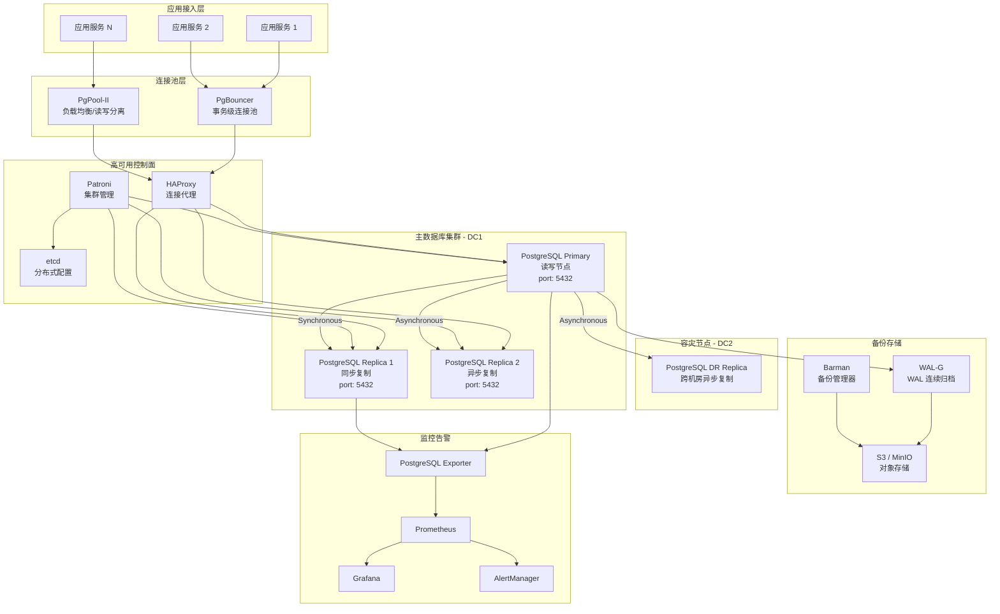

> **生产环境安全提示**
>
> 本文档包含可直接执行的运维命令。执行前请确认：当前目标集群与 Namespace 是否正确；是否具备足够的 RBAC 权限；是否已在非生产环境验证。命令风险等级标注：🔴 高风险（可能造成数据丢失或服务中断）、🟡 中风险（会修改集群状态，但通常可回滚）、🟢 低风险/只读（信息收集，无副作用）。


# PostgreSQL 企业级数据库高可用架构

> **适用版本**: PostgreSQL 15 ~ 17  
> **最后更新**: 2026-04-26  
> **难度**: 中级 → 高级

---

<!-- chunk: 概述 -->## 概述

PostgreSQL 是全球功能最丰富的开源对象关系型数据库系统，以其 ANSI-SQL 合规性、丰富的扩展生态、出色的并发控制（MVCC）机制和卓越的可扩展性而闻名。2026 年 PostgreSQL 17 版本在逻辑复制、并行查询、JSON 操作、性能诊断等方面持续增强，进一步巩固了其在企业级数据库市场的领先地位。

企业级 PostgreSQL 运维的核心挑战在于：如何构建零数据丢失的高可用集群（Patroni + [[etcd|etcd]]）、如何实现大规模连接池化（PgBouncer）、如何设计高效的备份恢复策略（WAL-G / Barman + S3）、以及如何建立全链路可观测体系（pg_stat_statements + [[Prometheus|Prometheus]]）。本文档将从架构设计到故障排查，系统性地覆盖这些主题。

PostgreSQL 的核心优势包括：完整的 ACID 事务支持、多版本并发控制（MVCC）、丰富的数据类型（JSONB、GIS、UUID、数组）、强大的扩展系统（PostGIS、TimescaleDB、pgvector）、以及活跃的社区生态。在 K8s 环境中，[[CloudNativePG|CloudNativePG]]、Zalando Postgres Operator、Crunchy PGO 等三个主流 Operator 可供选择。对于 K8s 上的完整生产部署指南（高可用架构、Patroni/CloudNativePG 选型、备份与 PITR、连接池、监控告警与故障转移），参见 [[数据库中间件/数据库/16-postgresql-kubernetes-production-guide|PostgreSQL on Kubernetes 生产指南]]。

---

<!-- chunk: 架构设计 -->## 架构设计

## 企业级 PostgreSQL 高可用架构



## PostgreSQL 进程模型

```mermaid
graph LR
    subgraph "客户端进程"
        C1[Backend Process 1]
        C2[Backend Process 2]
        CN[Backend Process N]
    end

    subgraph "Postmaster"
        PM[Postmaster Main<br/>连接管理]
    end

    subgraph "后台进程"
        AUTOVAC[autovacuum launcher]
        BGWRITER[bgwriter<br/>后台写进程]
        CHECKPT[checkpointer<br/>检查点进程]
        WALW[walwriter<br/>WAL 写进程]
        STATS[stats collector<br/>统计收集]
        ARCH[archiver<br/>WAL 归档]
        LOGCOLL[log collector<br/>日志收集]
    end

    subgraph "共享内存"
        SHARED_BUF[Shared Buffers]
        WAL_BUF[WAL Buffer]
        CLOG[clog<br/>事务状态]
        LOCKT[Lock Table]
    end

    subgraph "存储"
    DATA[数据文件<br/>tablespace/relfilenode]
    WAL_FILES[WAL 文件<br/>pg_wal/]
    END

    C1 --> PM
    C2 --> PM
    CN --> PM
    PM --> C1
    PM --> C2
    PM --> CN

    C1 --> SHARED_BUF
    C2 --> SHARED_BUF
    SHARED_BUF --> DATA
    WAL_BUF --> WAL_FILES
    BGWRITER --> SHARED_BUF
    CHECKPT --> SHARED_BUF
    CHECKPT --> WAL_FILES
    WALW --> WAL_BUF
    ARCH --> WAL_FILES
```

---

<!-- chunk: 核心组件配置 -->## 核心组件配置

## PostgreSQL 主节点完整配置

```ini
# postgresql.conf - PostgreSQL 17 生产优化配置
# 适用场景: 64GB 内存 / NVMe SSD / 16 核 CPU

# ============================================================
# 连接配置
# ============================================================
listen_addresses              = '*'
port                          = 5432
max_connections               = 300
superuser_reserved_connections = 3
unix_socket_directories       = '/var/run/postgresql'
tcp_keepalives_idle           = 600
tcp_keepalives_interval       = 30
tcp_keepalives_count          = 3

# ============================================================
# 内存配置
# ============================================================
shared_buffers                = 16GB
effective_cache_size          = 48GB
work_mem                      = 32MB
maintenance_work_mem          = 1GB
autovacuum_work_mem           = 256MB
temp_buffers                  = 16MB
huge_pages                    = try

# ============================================================
# WAL 配置
# ============================================================
wal_level                     = replica
wal_buffers                   = 64MB
wal_writer_delay              = 200ms
wal_writer_flush_after        = 1MB
wal_keep_size                 = 2GB
max_wal_size                  = 8GB
min_wal_size                  = 2GB
checkpoint_completion_target  = 0.9
checkpoint_timeout            = 15min
checkpoint_flush_after        = 256kB
checkpoint_warning            = 30s
archive_mode                  = on
archive_command               = 'wal-g wal-push %p'
archive_timeout               = 60

# ============================================================
# 复制配置
# ============================================================
max_wal_senders               = 10
max_replication_slots         = 10
wal_sender_delay              = 200ms
hot_standby                   = on
hot_standby_feedback          = on
wal_receiver_status_interval  = 10s
max_standby_archive_delay     = 30s
max_standby_streaming_delay   = 30s
wal_log_hints                 = on

# ============================================================
# 查询优化
# ============================================================
random_page_cost              = 1.1
seq_page_cost                 = 1.0
cpu_tuple_cost                = 0.01
cpu_index_tuple_cost          = 0.005
cpu_operator_cost             = 0.0025
effective_io_concurrency      = 200
parallel_setup_cost           = 100
parallel_tuple_cost           = 0.01
min_parallel_table_scan_size  = 8MB
min_parallel_index_scan_size  = 512kB
max_parallel_workers_per_gather = 4
max_parallel_workers          = 8
max_parallel_maintenance_workers = 4
jit                           = on

# ============================================================
# 自动清理
# ============================================================
autovacuum                    = on
autovacuum_max_workers        = 4
autovacuum_naptime            = 1min
autovacuum_vacuum_threshold   = 50
autovacuum_analyze_threshold  = 50
autovacuum_vacuum_scale_factor = 0.1
autovacuum_analyze_scale_factor = 0.05
autovacuum_vacuum_cost_delay  = 2ms
autovacuum_vacuum_cost_limit  = 1000
autovacuum_freeze_max_age     = 200000000
autovacuum_multixact_freeze_max_age = 400000000
log_autovacuum_min_duration   = 0

# ============================================================
# 日志配置
# ============================================================
logging_collector             = on
log_destination               = 'stderr'
log_directory                 = 'log'
log_filename                  = 'postgresql-%Y-%m-%d_%H%M%S.log'
log_rotation_age              = 1d
log_rotation_size             = 100MB
log_min_duration_statement    = 500
log_checkpoints               = on
log_connections               = on
log_disconnections            = on
log_lock_waits                = on
log_temp_files                = 0
log_line_prefix               = '%t [%p]: [%l-1] user=%u,db=%d,app=%a,client=%h '
log_statement                 = 'ddl'
log_replication_commands      = on

# ============================================================
# 统计信息
# ============================================================
track_activities              = on
track_counts                  = on
track_io_timing               = on
track_functions               = all
stats_temp_directory          = 'pg_stat_tmp'
shared_preload_libraries      = 'pg_stat_statements,auto_explain'

# pg_stat_statements
pg_stat_statements.max        = 10000
pg_stat_statements.track      = all
pg_stat_statements.track_utility = on
pg_stat_statements.save       = on

# auto_explain
auto_explain.log_min_duration = 3000
auto_explain.log_analyze      = true
auto_explain.log_verbose      = true
auto_explain.log_nested_statements = true

# ============================================================
# 安全配置
# ============================================================
ssl                           = on
ssl_cert_file                 = '/etc/ssl/certs/postgresql.crt'
ssl_key_file                  = '/etc/ssl/private/postgresql.key'
ssl_ca_file                   = '/etc/ssl/certs/ca.crt'
ssl_min_protocol_version      = 'TLSv1.2'
ssl_prefer_server_ciphers     = on
password_encryption           = scram-sha-256

# ============================================================
# 锁与等待
# ============================================================
deadlock_timeout              = 5s
lock_wait_timeout             = 30s
idle_in_transaction_session_timeout = 600000
statement_timeout             = 0
```

## Patroni 高可用配置

```yaml
# patroni.yml - Patroni 生产配置
scope: postgres-cluster
namespace: /service/
name: postgresql0

restapi:
  listen: 0.0.0.0:8008
  connect_address: 192.168.1.10:8008
  authentication:
    username: patroni
    password: "${PATRONI_REST_PASSWORD}"

etcd:
  hosts: etcd-0:2379,etcd-1:2379,etcd-2:2379
  username: patroni
  password: "${ETCD_PASSWORD}"

bootstrap:
  dcs:
    ttl: 30
    loop_wait: 10
    retry_timeout: 10
    maximum_lag_on_failover: 1048576
    maximum_lag_on_syncnode: -1
    synchronous_mode: true
    synchronous_mode_strict: false
    postgresql:
      use_pg_rewind: true
      use_slots: true
      parameters:
        wal_level: replica
        hot_standby: "on"
        max_wal_senders: 10
        max_replication_slots: 10
        wal_log_hints: "on"
        max_connections: 300
        shared_buffers: "16GB"
        effective_cache_size: "48GB"
        checkpoint_timeout: "15min"
        archive_mode: "on"
        archive_timeout: "60"
        archive_command: "wal-g wal-push %p"
      synchronous_standby_names: "*"

  initdb:
    - encoding: UTF8
    - locale: en_US.UTF-8
    - data-checksums
    - auth-local: trust

  pg_hba:
    - local   all             all                                   trust
    - host    replication     replicator   127.0.0.1/32            scram-sha-256
    - host    replication     replicator   192.168.1.0/24          scram-sha-256
    - host    all             all          192.168.1.0/24          scram-sha-256
    - hostssl all             all          0.0.0.0/0               scram-sha-256
    - host    all             all          ::/0                     scram-sha-256

  users:
    admin:
      password: "${PG_ADMIN_PASSWORD}"
      options:
        - createrole
        - createdb
    replicator:
      password: "${PG_REPL_PASSWORD}"
      options:
        - replication

postgresql:
  listen: 0.0.0.0:5432
  connect_address: 192.168.1.10:5432
  data_dir: /var/lib/postgresql/17/main
  bin_dir: /usr/lib/postgresql/17/bin
  pgpass: /tmp/pgpass
  authentication:
    replication:
      username: replicator
      password: "${PG_REPL_PASSWORD}"
    superuser:
      username: postgres
      password: "${PG_SUPER_PASSWORD}"
  parameters:
    shared_preload_libraries: "pg_stat_statements,auto_explain"
    pg_stat_statements.max: "10000"
    pg_stat_statements.track: "all"

tags:
  nofailover: false
  noloadbalance: false
  clonefrom: false
  promote: false

watchdog:
  mode: automatic
  device: /dev/watchdog
  safety_margin: -1
```

## PgBouncer 连接池配置

```ini
# pgbouncer.ini - PgBouncer 生产配置
[databases]
production_db = host=127.0.0.1 port=5432 dbname=production_db
production_db_ro = host=192.168.1.11 port=5432 dbname=production_db

[pgbouncer]
listen_addr = 0.0.0.0
listen_port = 6432
unix_socket_dir = /var/run/postgresql
unix_socket_mode = 0777
auth_type = scram-sha-256
auth_file = /etc/pgbouncer/userlist.txt
admin_users = pgbouncer_admin
stats_users = pgbouncer_stats
pool_mode = transaction
server_reset_query = DISCARD ALL
server_reset_query_always = 0
server_check_query = SELECT 1
server_check_delay = 30
server_lifetime = 3600
server_idle_timeout = 600
server_connect_timeout = 15
server_login_retry = 3
query_timeout = 30
query_wait_timeout = 60
client_idle_timeout = 0
client_login_timeout = 15
autodb_idle_timeout = 3600
max_client_conn = 10000
default_pool_size = 25
min_pool_size = 5
reserve_pool_size = 5
reserve_pool_timeout = 3
max_db_connections = 0
max_user_connections = 0
pkt_buf = 4096
tcp_defer_accept = 0
tcp_socket_buffer = 0
tcp_keepalive = 1
tcp_keepcnt = 3
tcp_keepidle = 600
tcp_keepintvl = 30
tcp_user_timeout = 0
idle_transaction_timeout = 600
disable_pqexec = 0

[users]
app_user = pool_mode=transaction max_user_connections=200
```

---

<!-- chunk: 性能调优 -->## 性能调优

## 内存参数计算公式

```
PostgreSQL 内存分配参考（64GB 物理内存）：

shared_buffers            = 物理内存 × 25% = 16GB
effective_cache_size      = 物理内存 × 75% = 48GB
work_mem                  = (物理内存 - shared_buffers) / (max_connections × 3) ≈ 32MB
maintenance_work_mem      = 物理内存 × 1.5% = ~1GB
autovacuum_work_mem       = 物理内存 × 0.4% = ~256MB
wal_buffers               = shared_buffers × 0.03% = ~64MB（最大 64MB）

work_mem 精确计算：
work_mem = (总可用内存 - shared_buffers - OS保留) / (max_connections × avg_parallel_workers)
        = (64GB - 16GB - 4GB) / (300 × 2)
        = 44GB / 600
        = ~75MB → 建议设为 32MB（保守值，避免极端情况 OOM）
```

## 关键性能参数对照表

| 参数 | 默认值 | 推荐值（64GB/SSD） | 说明 |
|:---|:---|:---|:---|
| `shared_buffers` | 128MB | 16GB | 共享缓冲池，存储热数据页 |
| `effective_cache_size` | 4GB | 48GB | 查询规划器参考的可用缓存 |
| `work_mem` | 4MB | 32MB | 排序/哈希操作内存上限 |
| `random_page_cost` | 4.0 | 1.1 | SSD 环境降低随机 IO 代价 |
| `effective_io_concurrency` | 1 | 200 | SSD 环境提高并发 IO 数 |
| `max_parallel_workers_per_gather` | 2 | 4 | 并行查询 worker 数 |
| `checkpoint_completion_target` | 0.9 | 0.9 | 检查点写出的时间比例 |
| `max_wal_size` | 1GB | 8GB | WAL 最大累积量 |
| `wal_buffers` | -1(auto) | 64MB | WAL 缓冲区 |
| `autovacuum_max_workers` | 3 | 4 | 自动清理工作进程数 |

## 查询性能诊断 SQL

```sql
-- 1. Top 20 最耗时的查询
SELECT query, calls, total_exec_time, mean_exec_time,
       rows, shared_blks_hit, shared_blks_read
FROM pg_stat_statements
ORDER BY total_exec_time DESC
LIMIT 20;

-- 2. 缓存命中率（目标 > 99%）
SELECT
    datname,
    blks_hit,
    blks_read,
    ROUND(blks_hit::numeric / NULLIF(blks_hit + blks_read, 0) * 100, 2) AS cache_hit_pct
FROM pg_stat_database
WHERE datname NOT IN ('postgres', 'template0', 'template1');

-- 3. 表膨胀检测
SELECT
    schemaname,
    tablename,
    pg_size_pretty(pg_total_relation_size(schemaname||'.'||tablename)) AS total_size,
    n_dead_tup,
    n_live_tup,
    ROUND(n_dead_tup::numeric / NULLIF(n_live_tup + n_dead_tup, 0) * 100, 2) AS dead_tuple_pct,
    last_autovacuum,
    last_autoanalyze
FROM pg_stat_user_tables
WHERE n_dead_tup > 10000
ORDER BY n_dead_tup DESC;

-- 4. 索引使用率分析
SELECT
    schemaname,
    tablename,
    indexname,
    idx_scan,
    idx_tup_read,
    idx_tup_fetch,
    pg_size_pretty(pg_relation_size(indexrelid)) AS index_size
FROM pg_stat_user_indexes
WHERE idx_scan < 50
  AND pg_relation_size(indexrelid) > 1024 * 1024
ORDER BY pg_relation_size(indexrelid) DESC;

-- 5. 锁等待分析
SELECT
    blocked.pid AS blocked_pid,
    blocked.query AS blocked_query,
    blocking.pid AS blocking_pid,
    blocking.query AS blocking_query,
    blocked.mode AS blocked_mode,
    EXTRACT(EPOCH FROM (now() - blocked.query_start)) AS blocked_seconds
FROM pg_locks blocked
JOIN pg_locks blocking ON blocked.locktype = blocking.locktype
    AND blocked.database IS NOT DISTINCT FROM blocking.database
    AND blocked.relation IS NOT DISTINCT FROM blocking.relation
    AND blocked.page IS NOT DISTINCT FROM blocking.page
    AND blocked.tuple IS NOT DISTINCT FROM blocking.tuple
    AND blocked.virtualxid IS NOT DISTINCT FROM blocking.virtualxid
    AND blocked.transactionid IS NOT DISTINCT FROM blocking.transactionid
    AND blocked.pid != blocking.pid
    AND NOT blocked.granted
JOIN pg_stat_activity blocked ON blocked.pid = blocked.pid
JOIN pg_stat_activity blocking ON blocking.pid = blocking.pid;

-- 6. 复制延迟监控
SELECT
    client_addr,
    state,
    sync_state,
    sent_lsn,
    replay_lsn,
    pg_wal_lsn_diff(sent_lsn, replay_lsn) AS lag_bytes,
    replay_lag
FROM pg_stat_replication;

-- 7. 活跃连接分析
SELECT
    datname,
    state,
    COUNT(*) AS conn_count,
    COUNT(*) FILTER (WHERE wait_event_type IS NOT NULL) AS waiting_count,
    MAX(EXTRACT(EPOCH FROM (now() - query_start))) AS max_query_seconds
FROM pg_stat_activity
WHERE pid != pg_backend_pid()
GROUP BY datname, state
ORDER BY conn_count DESC;
```

---

<!-- chunk: 高可用与容灾 -->## 高可用与容灾

## Patroni 集群管理操作

```bash
#!/bin/bash
# patroni_ops.sh - Patroni 集群管理脚本

PATRONI_PORT=8008
PATRONI_HOST="localhost"

# 查看集群状态
cluster_status() {
    patronictl -c /etc/patroni/patroni.yml list
    echo ""
    echo "--- Detailed Info ---"
    curl -s "http://${PATRONI_HOST}:${PATRONI_PORT}/cluster" | jq .
}

# 手动切换（switchover）
switchover() {
    local candidate="${1:-}"
    echo "Current cluster state:"
    patronictl -c /etc/patroni/patroni.yml list

    if -n "$candidate"; then
        echo "Switching over to $candidate..."
        patronictl -c /etc/patroni/patroni.yml switchover --master pg-cluster --candidate "$candidate" --force
    else
        patronictl -c /etc/patroni/patroni.yml switchover --master pg-cluster --force
    fi

    echo "New cluster state:"
    patronictl -c /etc/patroni/patroni.yml list
}

# 重新加载配置
reload_config() {
    patronictl -c /etc/patroni/patroni.yml reload pg-cluster
}

# 重新初始化失败的节点
reinit_node() {
    local node="$1"
    echo "Reinitializing node: $node"
    patronictl -c /etc/patroni/patroni.yml reinit pg-cluster "$node" --force
}

case "${1:-status}" in
    status)     cluster_status ;;
    switchover) switchover "${2:-}" ;;
    reload)     reload_config ;;
    reinit)     reinit_node "${2:?Node name required}" ;;
    *)          echo "Usage: $0 {status|switchover [node]|reload|reinit <node>}" ;;
esac
```

## 跨机房容灾方案

```yaml
# 跨机房容灾架构配置
disaster_recovery:
  primary_dc: "dc-beijing"
  dr_dc: "dc-shanghai"

  replication:
    method: "streaming_replication"
    mode: "async"
    slot_name: "dc_shanghai_slot"
    application_name: "dc_shanghai_repl"

  failover:
    rto: "15 minutes"
    rpo: "5 seconds"
    auto_failover: false
    procedure:
      - "验证主机房问题不可恢复"
      - "提升 DR 机房 replica 为主"
      - "更新 DNS/VIP 指向新主"
      - "通知应用层刷新连接"
      - "恢复后反向同步数据"

  consistency_check:
    schedule: "0 */4 * * *"
    tool: "pg_comparator"
    report_channel: "#dba-alerts"
```

---

<!-- chunk: 备份恢复 -->## 备份恢复

## WAL-G 备份配置

> ⚠️ **🔴 灾难性操作** — 含不可逆命令，执行前必须满足变更窗口+双人复核+事前备份+回滚方案
> - `rm -rf (系统/数据路径)`：删除系统或数据文件，可能摧毁节点或丢失全部数据

```bash
#!/bin/bash
# pg_walg_backup.sh - WAL-G 备份管理脚本
set -euo pipefail

# WAL-G 环境变量
export WALG_S3_PREFIX="s3://company-pg-backups/production"
export AWS_ACCESS_KEY_ID="${AWS_ACCESS_KEY}"
export AWS_SECRET_ACCESS_KEY="${AWS_SECRET_KEY}"
export AWS_REGION="cn-north-1"
export WALG_COMPRESSION_METHOD="zstd"
export WALG_DELTA_MAX_STEPS=7
export PGHOST="/var/run/postgresql"

FULL_BACKUP_CRON="0 2 * * 0"
INCR_BACKUP_CRON="0 2 * * 1-6"
RETENTION_DAYS=30

full_backup() {
    echo "$(date): Starting full backup..."
    wal-g backup-push /var/lib/postgresql/17/main --full
    echo "$(date): Full backup completed"
}

incremental_backup() {
    echo "$(date): Starting incremental backup..."
    wal-g backup-push /var/lib/postgresql/17/main
    echo "$(date): Incremental backup completed"
}

verify_backup() {
    echo "$(date): Verifying backups..."
    wal-g verify
    echo "$(date): Backup verification passed"
}

list_backups() {
    wal-g backup-list
}

cleanup_backups() {
    echo "$(date): Cleaning up old backups (retention: ${RETENTION_DAYS} days)..."
    wal-g delete retain 7d --confirm
    echo "$(date): Cleanup completed"
}

restore_to_latest() {
    echo "!!! PRODUCTION RESTORE !!!"
    echo "Target: latest backup"
    read -p "Are you sure? (yes/no): " confirm
    "$confirm" != "yes" && echo "Aborted" && exit 1

    sudo -u postgres pg_ctlcluster 17 main stop
    rm -rf /var/lib/postgresql/17/main/*  # ⚠️ 删除系统/数据文件
    wal-g backup-fetch /var/lib/postgresql/17/main LATEST

    cat > /var/lib/postgresql/17/main/recovery.signal <<EOF
restore_command = 'wal-g wal-fetch %f %p'
recovery_target = 'immediate'
recovery_target_action = 'promote'
EOF

    sudo -u postgres pg_ctlcluster 17 main start
    echo "Restore completed"
}

point_in_time_restore() {
    local target_time="${1:?Usage: point_in_time_restore '2026-04-26 15:30:00+08'}"
    echo "!!! PITR RESTORE to $target_time !!!"
    read -p "Are you sure? (yes/no): " confirm
    "$confirm" != "yes" && echo "Aborted" && exit 1

    sudo -u postgres pg_ctlcluster 17 main stop
    rm -rf /var/lib/postgresql/17/main/*  # ⚠️ 删除系统/数据文件
    wal-g backup-fetch /var/lib/postgresql/17/main LATEST

    cat > /var/lib/postgresql/17/main/recovery.signal <<EOF
restore_command = 'wal-g wal-fetch %f %p'
recovery_target_time = '${target_time}'
recovery_target_action = 'promote'
EOF

    sudo -u postgres pg_ctlcluster 17 main start
    echo "PITR restore completed to $target_time"
}

case "${1:-help}" in
    full)      full_backup ;;
    incr)      incremental_backup ;;
    verify)    verify_backup ;;
    list)      list_backups ;;
    cleanup)   cleanup_backups ;;
    restore)   restore_to_latest ;;
    pitr)      point_in_time_restore "${2:?Target time required}" ;;
    *)
        echo "Usage: $0 {full|incr|verify|list|cleanup|restore|pitr <time>}"
        ;;
esac
```

---

<!-- chunk: 监控告警 -->## 监控告警

## Prometheus Exporter 配置

```yaml
scrape_configs:
  - job_name: 'postgresql'
    static_configs:
      - targets:
          - 'pg-exporter-0:9187'
          - 'pg-exporter-1:9187'
          - 'pg-exporter-2:9187'
        labels:
          cluster: 'production-pg'
    scrape_interval: 15s
    params:
      collect[]:
        - pg_stat_bgwriter
        - pg_stat_database
        - pg_stat_user_tables
        - pg_statio_user_tables
        - pg_stat_replication
        - pg_stat_activity
        - pg_stat_statements
        - pg_settings
```

## 生产级告警规则

```yaml
groups:
  - name: postgresql.rules
    rules:
      - alert: PostgreSQLDown
        expr: pg_up == 0
        for: 1m
        labels:
          severity: critical
          team: dba
        annotations:
          summary: "PostgreSQL 实例宕机"
          description: "实例 {{ $labels.instance }} 已宕机超过 1 分钟"

      - alert: PostgreSQLReplicationLag
        expr: pg_replication_lag > 30
        for: 5m
        labels:
          severity: warning
          team: dba
        annotations:
          summary: "PostgreSQL 复制延迟"
          description: "从库延迟 {{ $value }} 秒"

      - alert: PostgreSQLReplicationByteLag
        expr: pg_replication_lag_bytes > 1073741824
        for: 5m
        labels:
          severity: warning
          team: dba
        annotations:
          summary: "复制字节延迟超过 1GB"

      - alert: PostgreSQLConnectionsHigh
        expr: pg_stat_activity_count / pg_settings_max_connections > 0.85
        for: 5m
        labels:
          severity: warning
          team: dba
        annotations:
          summary: "连接使用率超过 85%"

      - alert: PostgreSQLCacheHitRateLow
        expr: |
          rate(pg_stat_database_blks_hit[5m]) /
          (rate(pg_stat_database_blks_hit[5m]) + rate(pg_stat_database_blks_read[5m])) < 0.95
        for: 10m
        labels:
          severity: warning
          team: dba
        annotations:
          summary: "缓存命中率低于 95%"

      - alert: PostgreSQLDeadTuplesHigh
        expr: |
          pg_stat_user_tables_n_dead_tup /
          (pg_stat_user_tables_n_live_tup + pg_stat_user_tables_n_dead_tup) > 0.2
        for: 30m
        labels:
          severity: warning
          team: dba
        annotations:
          summary: "死元组占比超过 20%"

      - alert: PostgreSQLTransactionWraparound
        expr: pg_database_xid_age > 1500000000
        for: 1h
        labels:
          severity: critical
          team: dba
        annotations:
          summary: "事务 ID 即将耗尽（距 wraparound 不足 200M）"

      - alert: PostgreSQLTableBloat
        expr: |
          (pg_stat_user_tables_n_dead_tup * pg_relation_size_bytes) /
          pg_settings_block_size > 1073741824
        for: 1h
        labels:
          severity: info
          team: dba
        annotations:
          summary: "表膨胀超过 1GB"
```

---

<!-- chunk: 运维管理 -->## 运维管理

## 综合运维脚本

```bash
#!/bin/bash
# pg_ops.sh - PostgreSQL 运维管理脚本
set -euo pipefail

PSQL="psql -U postgres -At"

cmd_health() {
    echo "=== PostgreSQL Health Check $(date) ==="

    echo ""
    echo "--- Uptime ---"
    $PSQL -c "SELECT pg_postmaster_start_time(), now() - pg_postmaster_start_time() AS uptime;"

    echo ""
    echo "--- Connections ---"
    $PSQL -c "
        SELECT state, COUNT(*) AS cnt
        FROM pg_stat_activity
        WHERE pid != pg_backend_pid()
        GROUP BY state ORDER BY cnt DESC;
    "

    echo ""
    echo "--- Replication ---"
    $PSQL -c "
        SELECT client_addr, state, sync_state,
               pg_wal_lsn_diff(sent_lsn, replay_lsn) AS lag_bytes,
               replay_lag
        FROM pg_stat_replication;
    "

    echo ""
    echo "--- Cache Hit Rate ---"
    $PSQL -c "
        SELECT datname,
               ROUND(blks_hit::numeric / NULLIF(blks_hit + blks_read, 0) * 100, 2) AS hit_pct
        FROM pg_stat_database
        WHERE datname NOT IN ('postgres','template0','template1');
    "

    echo ""
    echo "--- Dead Tuples (Top 10) ---"
    $PSQL -c "
        SELECT schemaname||'.'||tablename AS tbl,
               n_dead_tup,
               ROUND(n_dead_tup::numeric / NULLIF(n_live_tup + n_dead_tup, 0) * 100, 2) AS dead_pct,
               last_autovacuum
        FROM pg_stat_user_tables
        WHERE n_dead_tup > 10000
        ORDER BY n_dead_tup DESC LIMIT 10;
    "

    echo ""
    echo "--- Blocking Queries ---"
    $PSQL -c "
        SELECT blocked.pid, blocked.query, blocking.pid AS blocked_by,
               EXTRACT(EPOCH FROM (now() - blocked.query_start)) AS wait_seconds
        FROM pg_locks blocked
        JOIN pg_locks blocking ON blocked.locktype = blocking.locktype
            AND blocked.database IS NOT DISTINCT FROM blocking.database
            AND blocked.relation IS NOT DISTINCT FROM blocking.relation
            AND NOT blocked.granted AND blocked.pid != blocking.pid
        JOIN pg_stat_activity blocked ON blocked.pid = blocked.pid
        JOIN pg_stat_activity blocking ON blocking.pid = blocking.pid
        LIMIT 10;
    "

    echo ""
    echo "--- Disk Usage ---"
    $PSQL -c "
        SELECT pg_size_pretty(pg_database_size(datname)) AS db_size, datname
        FROM pg_database
        WHERE datistemplate = false
        ORDER BY pg_database_size(datname) DESC;
    "
}

cmd_vacuum() {
    echo "=== Vacuum Analysis ==="
    $PSQL -c "
        SELECT 'VACUUM ANALYZE ' || schemaname || '.' || tablename || ';'
        FROM pg_stat_user_tables
        WHERE n_dead_tup > 100000
          OR (n_dead_tup::numeric / NULLIF(n_live_tup + n_dead_tup, 0)) > 0.1
        ORDER BY n_dead_tup DESC;
    " | while read sql; do
        echo "Executing: $sql"
        $PSQL -c "$sql"
    done
}

cmd_reindex() {
    echo "=== Reindex Analysis ==="
    $PSQL -c "
        SELECT 'REINDEX INDEX CONCURRENTLY ' || schemaname || '.' || indexname || ';'
        FROM pg_stat_user_indexes
        WHERE idx_scan < 10
          AND pg_relation_size(indexrelid) > 100 * 1024 * 1024
        ORDER BY pg_relation_size(indexrelid) DESC;
    " | while read sql; do
        echo "Executing: $sql"
        $PSQL -c "$sql"
    done
}

case "${1:-help}" in
    health)  cmd_health ;;
    vacuum)  cmd_vacuum ;;
    reindex) cmd_reindex ;;
    *)       echo "Usage: $0 {health|vacuum|reindex}" ;;
esac
```

---

<!-- chunk: 最佳实践 -->## 最佳实践

## 0. 生产环境部署清单

PostgreSQL 生产环境部署需要在硬件选型、操作系统调优和数据库参数配置三个层面进行系统性优化。以下清单基于多个大规模 PostgreSQL 集群（数据量 10TB+、QPS 10万+）的运维经验总结。

**硬件规划原则**：PostgreSQL 对存储 I/O 性能极为敏感，尤其是在 checkpoint 和 autovacuum 期间。生产环境强烈推荐使用 NVMe SSD 存储，IOPS 不低于 30000。内存配置建议 64GB 以上，`shared_buffers` 设置为物理内存的 25%（注意不要超过 40%，因为 OS 文件缓存同样重要）。网络方面，主从复制链路延迟应低于 1ms，推荐使用万兆网络。

**操作系统优化**：调整 `vm.dirty_background_ratio=5` 和 `vm.dirty_ratio=10`，避免大量脏页一次性刷新导致的 IO 尖峰。设置 `vm.overcommit_memory=2` 防止 OOM Killer 误杀 PostgreSQL 进程。配置 Transparent Huge Pages 为 `madvise` 模式（或直接关闭），避免 THP 导致的内存碎片问题。文件系统推荐使用 XFS，挂载参数添加 `noatime,nodiratime` 减少不必要的元数据更新。

**连接池设计**：PostgreSQL 的进程模型（每个连接一个进程）意味着高并发场景下连接数过多会消耗大量内存。生产环境必须使用 PgBouncer 做事务级连接池（`pool_mode=transaction`），将应用侧的数千连接复用到 PostgreSQL 侧的数百连接。`default_pool_size` 建议设置为 `max_connections / 4`，`max_client_conn` 设置为应用总连接数的 1.5 倍。

**Vacuum 管理策略**：PostgreSQL 的 MVCC 机制意味着频繁的 UPDATE 和 DELETE 操作会产生大量死元组（Dead Tuples），如果不及时清理会导致表膨胀（Bloat）和查询性能下降。默认的 `autovacuum_vacuum_scale_factor=0.2` 对于大表来说过于保守（一张 10 亿行的表需要变更 2 亿行才触发 vacuum）。建议对写入频繁的大表设置更激进的参数：

```sql
ALTER TABLE large_table SET (
    autovacuum_vacuum_scale_factor = 0.02,
    autovacuum_analyze_scale_factor = 0.01,
    autovacuum_vacuum_cost_delay = 2,
    autovacuum_vacuum_cost_limit = 2000
);
```

同时，建议启用 `log_autovacuum_min_duration=0` 记录所有 autovacuum 操作，以便监控 vacuum 频率和耗时，及时调整参数。

## 1. 连接池设计

- 使用 PgBouncer 做事务级连接池，`pool_mode = transaction`
- `default_pool_size` 设置为 `(max_connections × 0.8) / pool_count`
- 应用层使用 `PgBouncer` 端口（6432），不直连 PostgreSQL
- 读写分离使用 PgBouncer 配置不同数据库指向主/从节点

## 2. Vacuum 管理策略

```sql
-- 对写入频繁的大表设置更激进的 autovacuum 参数
ALTER TABLE orders SET (
    autovacuum_vacuum_scale_factor = 0.05,
    autovacuum_analyze_scale_factor = 0.02,
    autovacuum_vacuum_cost_delay = 2,
    autovacuum_vacuum_cost_limit = 2000
);

-- 监控 vacuum 进度
SELECT pid, datname, relid::regclass, phase,
       heap_blks_total, heap_blks_scanned, heap_blks_vacuumed,
       index_vacuum_count
FROM pg_stat_progress_vacuum;
```

## 3. 分区表设计

```sql
-- 按月声明式分区（PostgreSQL 17）
CREATE TABLE access_logs (
    id BIGINT GENERATED ALWAYS AS IDENTITY,
    user_id BIGINT NOT NULL,
    path TEXT NOT NULL,
    method TEXT NOT NULL,
    status_code SMALLINT NOT NULL,
    response_time_ms INTEGER,
    created_at TIMESTAMPTZ NOT NULL DEFAULT now()
) PARTITION BY RANGE (created_at);

CREATE TABLE access_logs_2026_01 PARTITION OF access_logs
    FOR VALUES FROM ('2026-01-01') TO ('2026-02-01');
CREATE TABLE access_logs_2026_02 PARTITION OF access_logs
    FOR VALUES FROM ('2026-02-01') TO ('2026-03-01');
CREATE TABLE access_logs_2026_03 PARTITION OF access_logs
    FOR VALUES FROM ('2026-03-01') TO ('2026-04-01');
CREATE TABLE access_logs_2026_04 PARTITION OF access_logs
    FOR VALUES FROM ('2026-04-01') TO ('2026-05-01');
CREATE TABLE access_logs_default PARTITION OF access_logs DEFAULT;

-- 定期维护脚本：创建下月分区 + 归档旧分区
-- CREATE TABLE access_logs_2026_05 PARTITION OF access_logs
--     FOR VALUES FROM ('2026-05-01') TO ('2026-06-01');
-- DETACH PARTITION access_logs_2025_12 CONCURRENTLY;
```

---

<!-- chunk: 故障排查 -->## 故障排查

## 常见问题速查表

| 问题现象 | 可能原因 | 排查方法 | 解决方案 |
|:---|:---|:---|:---|
| `FATAL: sorry, too many clients already` | 连接数耗尽 | `SELECT count(*) FROM pg_stat_activity;` | 增加 `max_connections`，配置 PgBouncer |
| `ERROR: deadlock detected` | 死锁 | 查看 `log_lock_waits` 日志 | 调整事务访问顺序 |
| 复制延迟持续增大 | 大事务/长查询 | `pg_stat_replication` + `pg_stat_activity` | 优化长事务，检查 `wal_keep_size` |
| `ERROR: relation "xxx" does not exist` | search_path 问题或表不存在 | `SET search_path` 检查 | 修改 `search_path`，检查 schema |
| `WARNING: checkpoint is occurring too frequently` | `max_wal_size` 太小 | 查看 `pg_stat_bgwriter` | 增大 `max_wal_size` |
| 表查询变慢 | 膨胀/统计信息过期 | `pg_stat_user_tables` | `VACUUM ANALYZE`，检查 `n_dead_tup` |
| `ERROR: cannot execute INSERT in a read-only transaction` | 连接到从库 | 检查连接目标 | 使用 Proxy/HAProxy 路由写操作到主库 |
| `FATAL: the database system is starting up` | 正在恢复 | `pg_is_in_recovery()` | 等待恢复完成，检查 `recovery_target` |
| WAL 归档堆积 | 归档命令失败 | 查看 `pg_stat_archiver` | 检查 S3 连接和权限 |
| `ERROR: out of memory` | work_mem 过大 | `SHOW work_mem` | 降低 `work_mem`，减少 `max_connections` |

---

**文档版本**: v2.0  
**最后更新**: 2026-04-26  
**适用版本**: PostgreSQL 15 ~ 17

---

<!-- chunk: Obsidian 相关文档 -->## Obsidian 相关文档

- domain-28-enterprise-database-middleware MOC
- [[数据库中间件/README.md|Domain 16: 企业级数据库与中间件运维 (Enterprise Database & Middleware Op...]]
- Domain-28 企业数据库与中间件 — 开源项目索引
- MySQL 企业级数据库运维管理
- 分布式数据库企业级实践深度指南
- 数据库中间件 Kubernetes 企业级实践
- MongoDB 企业级数据库运维深度实践
- Redis 企业级缓存运维深度实践
- Redis Kubernetes Operator 企业级实践
- Kafka Kubernetes 企业级实践 — Strimzi Operator 深度指南
- CloudNativePG 企业级 PostgreSQL 运维指南

## See Also

- 99-cloudnativepg-enterprise-guide
- 01-mysql-enterprise-database
- 03-distributed-database-enterprise
- 04-database-middleware-kubernetes


<!-- risk-assessed -->
