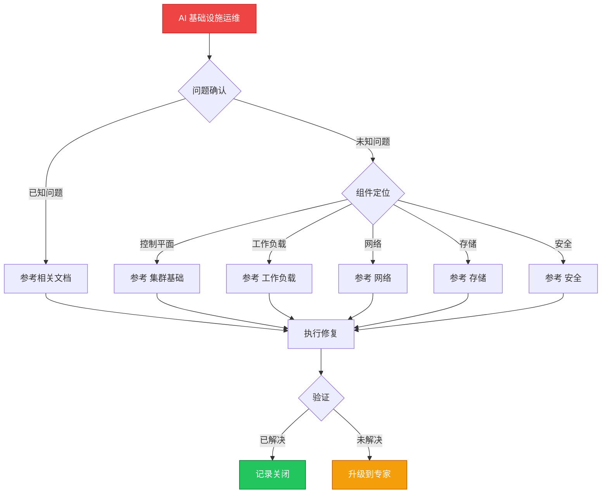

> **生产环境安全提示**
>
> 本文档包含可直接执行的运维命令。执行前请确认：当前目标集群与 Namespace 是否正确；是否具备足够的 RBAC 权限；是否已在非生产环境验证。命令风险等级标注：🔴 高风险（可能造成数据丢失或服务中断）、🟡 中风险（会修改集群状态，但通常可回滚）、🟢 低风险/只读（信息收集，无副作用）。


# 场景: AI 基础设施运维

> **场景 ID**: SC-10
> **英文**: AI Infrastructure Operations
> **最后更新**: 2026-05-20

---

## 场景概述

AI 基础设施是 [[Kubernetes|Kubernetes]] 的新兴场景。

---

## 快速决策树



---

## 相关文档

- [[AI基础设施/README.md|README]]
- [[AI基础设施/AI-Agents/README.md|README]]


---

## FTA 故障树

暂无专项 FTA


---

## 操作技能

暂无专项技能卡片


---

## 关联场景

| 关联场景 | 说明 |
|---|---|

## 生产案例

### 案例1：GPU 节点驱动升级导致训练任务全部失败

| 时间 | 事件 |
|---|---|
| 10:00 | 运维升级 GPU 驱动 535→550，未驱逐 Pod |
| 10:05 | 所有 GPU Pod 报 CUDA initialization error |
| 10:10 | 训练任务全部失败，检查点丢失 |
| 11:00 | 回滚驱动 + 从检查点恢复训练 |

**根因**：驱动升级未遵循 drain→升级→验证→uncordon 流程。

**修复**：
```bash
# 🟡 正确流程：先驱逐再升级
kubectl drain <gpu-node> --ignore-daemonsets --delete-emptydir-data
# 升级驱动后验证
nvidia-smi  # 确认驱动版本
kubectl get nodes -o json | jq '.items[].status.allocatable["nvidia.com/gpu"]'
kubectl uncordon <gpu-node>
```

### 案例2：推理服务 GPU 显存 OOM

- **现象**：推理服务 Pod OOMKilled，GPU 显存使用率 99%
- **诊断**：`nvidia-smi` 显示显存泄漏，batch size 过大
- **修复**：调整 batch size + 配置 `nvidia.com/gpu-memory` 资源限制 + 启用 MPS

## 面试要点

1. **Q：AI 基础设施运维与普通 K8s 运维的核心差异？**
   A：GPU 资源管理(驱动/显存/拓扑)、大文件存储(模型权重/数据集)、长时任务容错(检查点)、高带宽网络(RDMA/InfiniBand)。

2. **Q：GPU 集群调度需要考虑哪些因素？**
   A：GPU 拓扑(NVLink/PCIe)、显存容量、GPU 型号匹配、网络亲和性(RDMA)、存储 IOPS(数据加载)、抢占策略。

3. **Q：如何保障分布式训练任务的可靠性？**
   A：定期保存检查点、使用弹性训练框架(torch elastic)、配置 Pod 失败重试、监控 NCCL 通信状态、节点故障自动替换。

## Related

- [[实体/kudig-metadata-index.md|README]].md|README]]
- [[实体/kubernetes.md|kubernetes]]


<!-- risk-assessed -->
