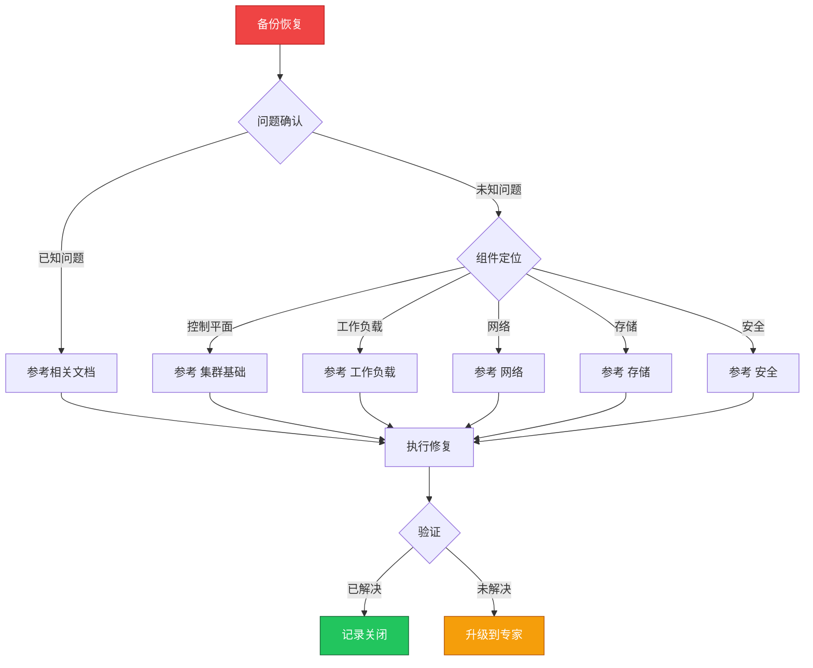

> **生产环境安全提示**
>
> 本文档包含可直接执行的运维命令。执行前请确认：当前目标集群与 Namespace 是否正确；是否具备足够的 RBAC 权限；是否已在非生产环境验证。命令风险等级标注：🔴 高风险（可能造成数据丢失或服务中断）、🟡 中风险（会修改集群状态，但通常可回滚）、🟢 低风险/只读（信息收集，无副作用）。


# 场景: 备份恢复

> **场景 ID**: SC-07
> **英文**: Backup & Restore
> **最后更新**: 2026-05-20

---

## 场景概述

备份恢复是业务连续性的保障。

---

## 快速决策树



---

## 相关文档

- [[可靠性/README.md|README]]
- [[集群基础/README.md|README]]


---

## FTA 故障树

- [[故障诊断/FTA故障树/list/backup-restore-fta.md|backup restore fta]]
- [[故障诊断/FTA故障树/list/etcd-fta.md|etcd fta]]


---

## 操作技能

暂无专项技能卡片


---

## 关联场景

| 关联场景 | 说明 |
|---|---|

## 生产案例

### 案例1：etcd 备份恢复失败导致集群不可用

| 时间 | 事件 |
|---|---|
| 01:00 | 误操作删除了关键 namespace |
| 01:05 | 尝试从 etcd 备份恢复 |
| 01:15 | 发现备份文件损坏，上次成功备份是 3 天前 |
| 02:00 | 使用 3 天前备份恢复，丢失部分数据 |

**根因**：备份未验证 + 备份频率不足 + 未定期演练恢复。

**修复**：
```bash
# 🟢 验证备份完整性
ETCDCTL_API=3 etcdctl snapshot status backup.db --write-out=table
# 🔴 恢复 etcd（停止所有控制平面组件）
ETCDCTL_API=3 etcdctl snapshot restore backup.db --data-dir=/var/lib/etcd-restored
# 🟡 重启控制平面
systemctl restart kubelet
```

### 案例2：Velero 备份遗漏 PV 数据

- **现象**：恢复后应用数据为空
- **诊断**：Velero 配置未包含 PV 快照
- **修复**：配置 VolumeSnapshotLocation + 验证备份包含 PV

## 面试要点

1. **Q：K8s 备份策略应包含哪些内容？**
   A：etcd 数据(集群状态)、PV 数据(应用数据)、Secret/ConfigMap、自定义资源(CRD)。频率：etcd 每小时，PV 每天。

2. **Q：备份恢复的关键注意事项？**
   A：定期验证备份可恢复、演练恢复流程、记录 RPO/RTO、备份加密存储、异地备份、版本兼容性。

3. **Q：Velero 的工作原理？**
   A：备份：导出 K8s 资源 YAML + 触发 PV 快照→存储到对象存储。恢复：重建资源 + 恢复 PV 数据。支持定时备份和跨集群迁移。

## Related

- [[实体/kudig-metadata-index.md|README]].md|README]]
- [[技能/backup-restore-fta.md|backup-restore-fta]]
- [[技能/etcd-fta.md|etcd-fta]]

- 13-backup-demo-video

<!-- risk-assessed -->
