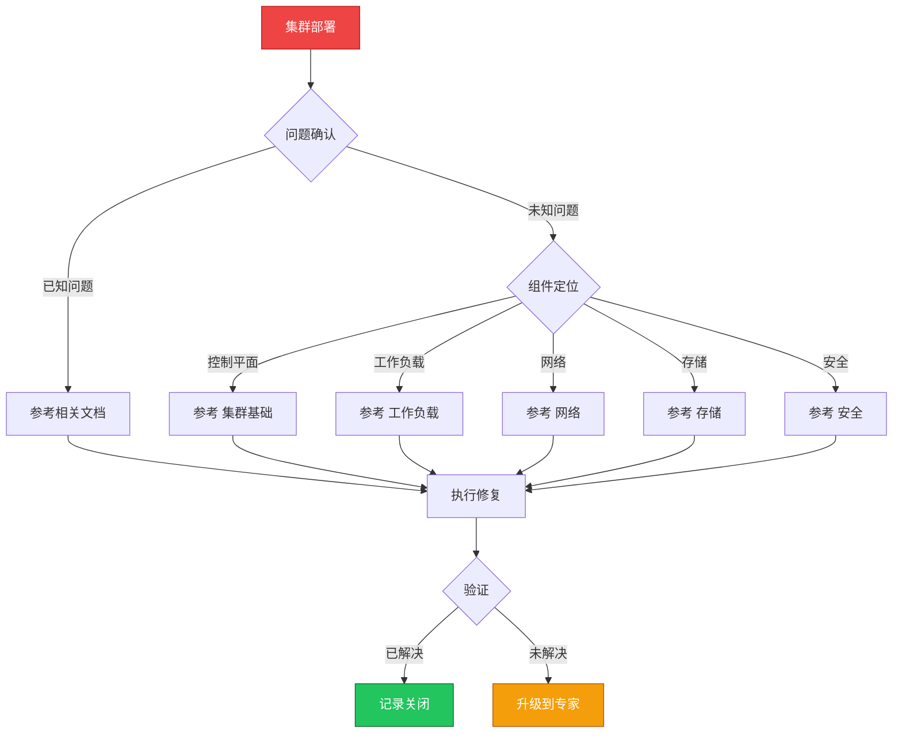

> **生产环境安全提示**
>
> 本文档包含可直接执行的运维命令。执行前请确认：当前目标集群与 Namespace 是否正确；是否具备足够的 RBAC 权限；是否已在非生产环境验证。命令风险等级标注：🔴 高风险（可能造成数据丢失或服务中断）、🟡 中风险（会修改集群状态，但通常可回滚）、🟢 低风险/只读（信息收集，无副作用）。


# 场景: 集群部署

> **场景 ID**: SC-01
> **英文**: Cluster Deployment
> **最后更新**: 2026-05-20

---

## 场景概述

集群部署是从零开始构建 [[Kubernetes|Kubernetes]] 生产环境的第一步。本文档汇总了 KUDIG 知识库中所有与集群部署相关的文档、技能和故障树。

---

## 快速决策树



---

## 相关文档

- 集群基础/12-cluster-deployment-patterns.md
- 集群基础/06-cluster-configuration-parameters.md
- 集群基础/07-upgrade-paths-strategy.md
- 集群基础/03-plane-high-availability.md
- [[平台工程/README.md|README]]
- [[发布变更/部署方案/README.md|README]]


---

## FTA 故障树

- [[故障诊断/FTA故障树/list/apiserver-fta.md|apiserver fta]]
- [[故障诊断/FTA故障树/list/etcd-fta.md|etcd fta]]
- [[故障诊断/FTA故障树/list/node-fta.md|node fta]]


---

## 操作技能

暂无专项技能卡片


---

## 关联场景

| 关联场景 | 说明 |
|---|---|

## 生产案例

### 案例1：kubeadm 初始化失败导致集群无法启动

| 时间 | 事件 |
|---|---|
| 09:00 | 执行 kubeadm init 初始化集群 |
| 09:05 | 报错：端口 6443 已被占用 |
| 09:10 | 发现上次初始化残留进程未清理 |
| 09:20 | kubeadm reset 后重新初始化成功 |

**根因**：上次初始化失败后未执行 reset，残留进程占用端口。

**修复**：
```bash
# 🔴 重置集群（清除所有状态）
kubeadm reset -f
rm -rf /etc/kubernetes/manifests /var/lib/etcd
systemctl restart kubelet
# 🟡 重新初始化
kubeadm init --config=cluster-config.yaml
```

### 案例2：节点加入失败 - 证书过期

- **现象**：kubeadm join 报证书验证失败
- **诊断**：join token 已过期（默认 24h）
- **修复**：重新生成 token + 重新执行 join

## 面试要点

1. **Q：生产集群部署的关键考虑？**
   A：高可用控制平面(3+ master)、etcd 独立部署、网络规划(Pod/Service CIDR)、证书管理、备份策略、监控部署。

2. **Q：kubeadm vs 托管集群 vs 二进制部署？**
   A：kubeadm：灵活、学习用。托管(EKS/AKS)：省心、生产推荐。二进制：完全控制、复杂。生产建议托管或 kubeadm HA。

3. **Q：集群初始化后的必做事项？**
   A：部署 CNI、配置 RBAC、部署监控、配置备份、设置证书轮转、部署 Ingress、配置网络策略、启用审计日志。

## Related

- [[实体/kudig-metadata-index.md|README]].md|README]]
- [[技能/apiserver-fta.md|apiserver-fta]]
- [[技能/etcd-fta.md|etcd-fta]]
- [[实体/kubernetes.md|kubernetes]]


<!-- risk-assessed -->
