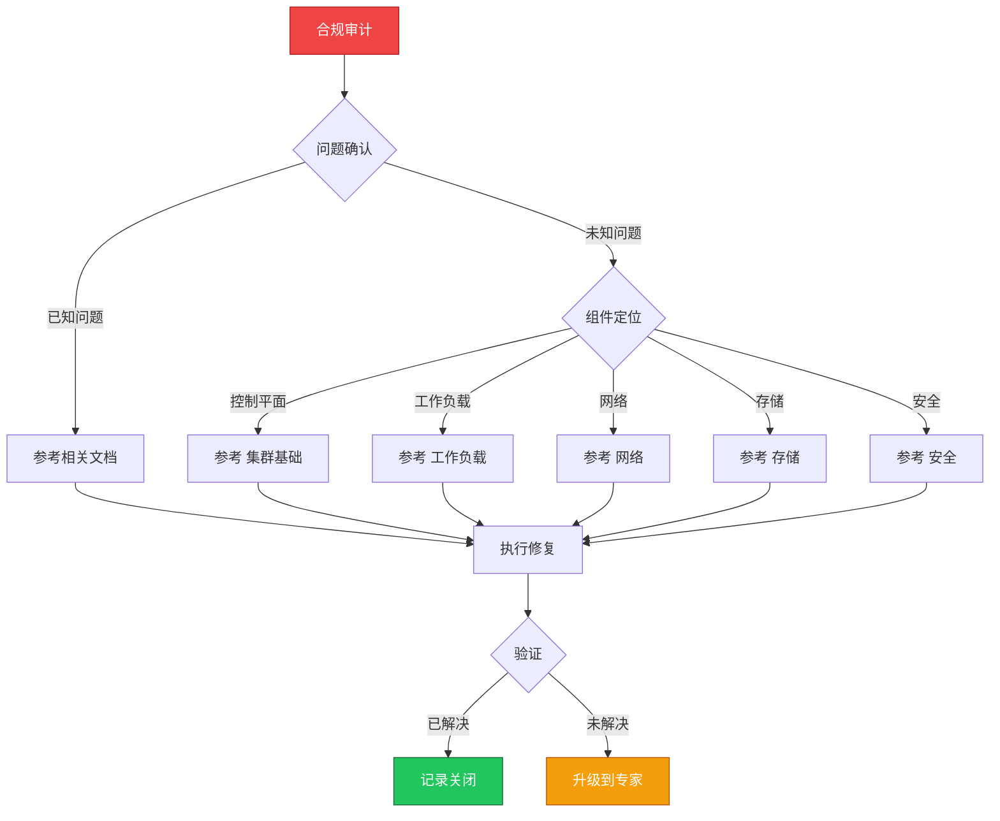

> **生产环境安全提示**
>
> 本文档包含可直接执行的运维命令。执行前请确认：当前目标集群与 Namespace 是否正确；是否具备足够的 RBAC 权限；是否已在非生产环境验证。命令风险等级标注：🔴 高风险（可能造成数据丢失或服务中断）、🟡 中风险（会修改集群状态，但通常可回滚）、🟢 低风险/只读（信息收集，无副作用）。


# 场景: 合规审计

> **场景 ID**: SC-20
> **英文**: Compliance & Audit
> **最后更新**: 2026-05-20

---

## 场景概述

合规审计是企业级 K8s 的基础要求。

---

## 快速决策树



---

## 相关文档

- [[安全/README.md|README]]
- [[安全/README.md|README]]
- [[安全/README.md|README]]


---

## FTA 故障树

- [[故障诊断/FTA故障树/list/rbac-fta.md|rbac fta]]


---

## 操作技能

暂无专项技能卡片


---

## 关联场景

| 关联场景 | 说明 |
|---|---|

## 生产案例

### 案例1：安全审计发现特权容器泛滥

| 时间 | 事件 |
|---|---|
| 季度审计 | 发现 45% Pod 使用 privileged: true |
| 分析 | 开发者为调试方便添加特权，未清理 |
| 第2周 | 部署 OPA Gatekeeper 策略强制检查 |
| 月末 | 特权容器降至 2%（仅必要组件） |

**根因**：缺乏准入控制策略，无自动化合规检查。

**修复**：
```bash
# 🟢 扫描特权容器
kubectl get pods -A -o json | jq '.items[] | select(.spec.containers[].securityContext.privileged==true) | .metadata.name'
# 🟡 部署 OPA Gatekeeper 策略
kubectl apply -f constrainttemplate-privileged.yaml
kubectl apply -f constraint-no-privileged.yaml
```

### 案例2：RBAC 权限过大导致安全事件

- **现象**：开发人员误删生产 namespace
- **诊断**：ClusterRoleBinding 绑定了 cluster-admin
- **修复**：最小权限原则重构 RBAC + 启用审计日志 + 关键操作审批流

## 面试要点

1. **Q：K8s 合规审计的核心检查项？**
   A：RBAC 最小权限、Pod Security Standards、网络策略、Secret 加密、审计日志、镜像来源、特权容器、hostPath 使用。

2. **Q：如何实现自动化合规检查？**
   A：OPA Gatekeeper/Kyverno 准入控制 + CI/CD 策略扫描 + 定期安全扫描(Trivy) + 审计日志分析 + 合规报告自动生成。

3. **Q：CIS Benchmark 在 K8s 中的应用？**
   A：使用 kube-bench 扫描集群配置，覆盖 API Server、kubelet、etcd、网络、RBAC 等 200+ 检查项，输出合规报告和修复建议。

## Related

- [[实体/kudig-metadata-index.md|README]].md|README]]
- [[系统基础/速查卡/k8s.md|k8s]]
- [[概念/supply-chain-security.md|supply-chain-security]]
- [[系统基础/知识字典/security/cloud-native-security.md|cloud-native-security]]


<!-- risk-assessed -->
