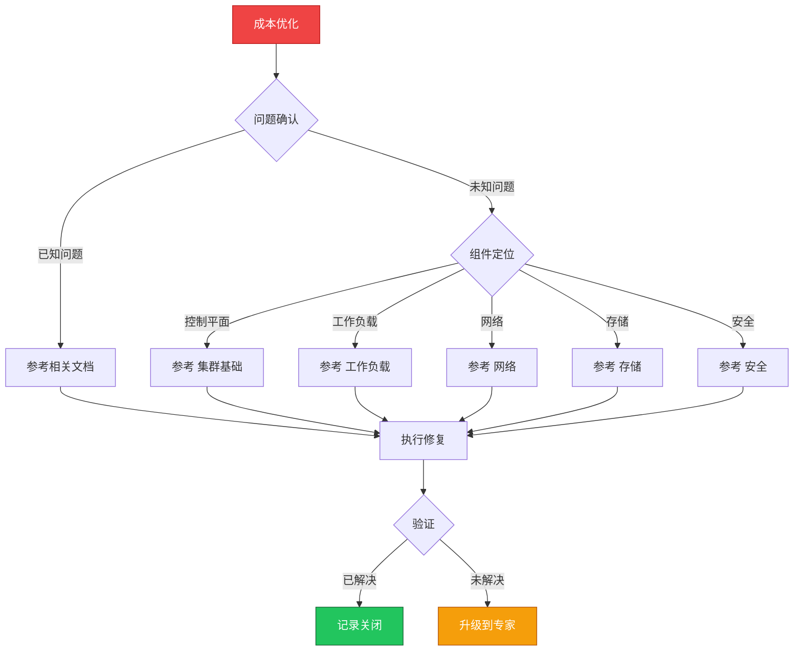

> **生产环境安全提示**
>
> 本文档包含可直接执行的运维命令。执行前请确认：当前目标集群与 Namespace 是否正确；是否具备足够的 RBAC 权限；是否已在非生产环境验证。命令风险等级标注：🔴 高风险（可能造成数据丢失或服务中断）、🟡 中风险（会修改集群状态，但通常可回滚）、🟢 低风险/只读（信息收集，无副作用）。


# 场景: 成本优化

> **场景 ID**: SC-19
> **英文**: Cost Optimization
> **最后更新**: 2026-05-20

---

## 场景概述

成本优化直接影响云基础设施的 ROI。

---

## 快速决策树



---

## 相关文档

- [[生产运维/README.md|README]]
- [[平台工程/README.md|README]]


---

## FTA 故障树

- [[故障诊断/FTA故障树/list/hpa-fta.md|hpa fta]]


---

## 操作技能

暂无专项技能卡片


---

## 关联场景

| 关联场景 | 说明 |
|---|---|

## 生产案例

### 案例1：资源过度分配导致集群成本浪费 60%

| 时间 | 事件 |
|---|---|
| 月初 | FinOps 审计发现集群 CPU 平均利用率仅 15% |
| 分析 | 80% 工作负载 requests 远超实际使用 |
| 第2周 | 部署 VPA 推荐 + 调整 requests |
| 月末 | 集群成本降低 45% |

**根因**：缺乏资源右sizing 机制，开发者随意设置大 requests。

**修复**：
```bash
# 🟢 查看资源使用率
kubectl top pods -A --sort-by=cpu
# 🟡 部署 VPA 获取推荐值
kubectl apply -f vpa-recommender.yaml
# 🟢 查看 VPA 推荐
kubectl get vpa -A -o json | jq '.items[].status.recommendation'
```

### 案例2：未清理的测试环境持续产生费用

- **现象**：云账单持续增长，发现 200+ 废弃 namespace
- **诊断**：缺乏资源生命周期管理，测试环境无 TTL
- **修复**：实施 namespace TTL 策略 + 定期清理 CronJob + 标签强制要求

## 面试要点

1. **Q：K8s 成本优化的核心策略有哪些？**
   A：资源右sizing(VPA推荐)、节点自动伸缩(CA)、抢占式实例、资源配额(LimitRange)、闲置资源回收、多租户共享。

2. **Q：如何建立 FinOps 实践？**
   A：成本可视化(kubecost)→资源标签强制→部门成本分摊→右sizing自动化→定期审计报告→预算告警。

3. **Q：requests 和 limits 设置对成本的影响？**
   A：requests 决定调度(影响节点数量)，limits 决定上限。过大 requests 导致资源浪费，过小导致 OOM/节流。建议 requests=P95使用量，limits=峰值×1.5。

## Related

- [[实体/kudig-metadata-index.md|README]].md|README]]
- [[故障诊断/FTA故障树/list/vpa-fta.md|vpa-fta]]


<!-- risk-assessed -->
