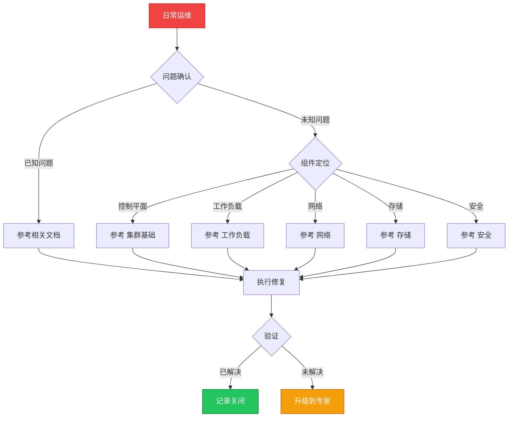

> **生产环境安全提示**
>
> 本文档包含可直接执行的运维命令。执行前请确认：当前目标集群与 Namespace 是否正确；是否具备足够的 RBAC 权限；是否已在非生产环境验证。命令风险等级标注：🔴 高风险（可能造成数据丢失或服务中断）、🟡 中风险（会修改集群状态，但通常可回滚）、🟢 低风险/只读（信息收集，无副作用）。


# 场景: 日常运维

> **场景 ID**: SC-09
> **英文**: Daily Operations
> **最后更新**: 2026-05-20

---

## 场景概述

日常运维是保障集群稳定的基础工作。

---

## 快速决策树



---

## 相关文档

- [[平台工程/README.md|README]]
- 集群基础/05-kubectl-commands-reference.md
- [[故障诊断/技能体系/README.md|README]]


---

## FTA 故障树

暂无专项 FTA


---

## 操作技能

- [[故障诊断/技能体系/MOC.md|所有操作技能]]


---

## 关联场景

| 关联场景 | 说明 |
|---|---|

## 生产案例

### 案例1：日常巡检遗漏导致证书过期

| 时间 | 事件 |
|---|---|
| 09:00 | 日常巡检仅检查 Pod 状态，未检查证书有效期 |
| 14:30 | API Server 客户端证书过期，kubectl 全部报错 |
| 14:35 | 触发 P0 告警，运维紧急介入 |
| 15:00 | 使用 kubeadm certs renew 恢复 |

**根因**：巡检清单缺少证书检查项，日常 ops 流程不完善。

**修复**：
```bash
# 🟢 检查证书有效期
kubeadm certs check-expiration
# 🟡 续期所有证书
kubeadm certs renew all
systemctl restart kubelet
```

### 案例2：日志轮转未配置导致磁盘满

- **现象**：节点 DiskPressure，Pod 被驱逐
- **诊断**：`df -h` 发现 /var/log 占 95%，容器日志未轮转
- **修复**：配置 kubelet `containerLogMaxSize: 100Mi` + `containerLogMaxFiles: 5`

## 面试要点

1. **Q：日常运维巡检应包含哪些核心检查项？**
   A：节点状态(Ready/资源)、Pod 异常(CrashLoop/Pending)、证书有效期、etcd 健康、磁盘使用率、API Server 延迟、关键组件日志错误。

2. **Q：如何设计自动化日常巡检？**
   A：CronJob 定时执行巡检脚本 → 输出结构化报告 → 异常项触发告警 → 集成到 ChatOps 通知渠道。关键指标：节点 Ready 率、Pod 成功率、资源水位。

3. **Q：日常运维中哪些操作风险最高？**
   A：etcd 数据修改(🔴)、节点 drain/cordon(🟡)、RBAC 变更(🟡)、证书轮转(🟡)。应遵循变更窗口+回滚预案+灰度验证三原则。

## Related

- [[实体/kudig-metadata-index.md|README]].md|README]]
- MOC.md|MOC]]
- 05-kubectl-commands-reference


<!-- risk-assessed -->
