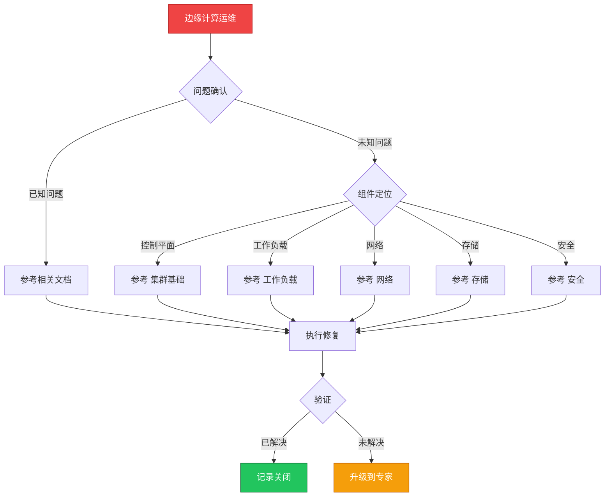

> **生产环境安全提示**
>
> 本文档包含可直接执行的运维命令。执行前请确认：当前目标集群与 Namespace 是否正确；是否具备足够的 RBAC 权限；是否已在非生产环境验证。命令风险等级标注：🔴 高风险（可能造成数据丢失或服务中断）、🟡 中风险（会修改集群状态，但通常可回滚）、🟢 低风险/只读（信息收集，无副作用）。


# 场景: 边缘计算运维

> **场景 ID**: SC-18
> **英文**: Edge Computing Operations
> **最后更新**: 2026-05-20

---

## 场景概述

边缘计算将 K8s 延伸到 IoT 和边缘场景。

---

## 快速决策树



---

## 相关文档

- [[专项技术/README.md|README]]
- [[KubeEdge]].md]]


---

## FTA 故障树

暂无专项 FTA


---

## 操作技能

暂无专项技能卡片


---

## 关联场景

| 关联场景 | 说明 |
|---|---|

## 生产案例

### 案例1：边缘节点网络断连后 Pod 状态不一致

| 时间 | 事件 |
|---|---|
| 02:00 | 边缘站点网络中断，与中心集群失联 |
| 02:05 | 中心侧 Node NotReady，Pod 被标记为 Terminating |
| 02:10 | 边缘侧 Pod 实际仍在运行（网络分区） |
| 03:00 | 网络恢复，出现重复 Pod 和状态冲突 |

**根因**：未配置边缘自治模式，网络分区时中心侧强制驱逐。

**修复**：
```bash
# 🟡 启用边缘自治（以 KubeEdge 为例）
# 配置 edgecore 离线自治
kubectl edit node <edge-node>  # 添加 edge-autonomy annotation
# 🟢 检查边缘节点状态
kubectl get nodes -l node-role.kubernetes.io/edge=
```

### 案例2：边缘 OTA 升级失败导致批量节点失联

- **现象**：批量 OTA 升级后 30% 边缘节点失联
- **诊断**：新版本 edgecore 与中心侧版本不兼容
- **修复**：回滚 edgecore 版本 + 分批升级策略（每批 ≤10%）

## 面试要点

1. **Q：边缘计算场景下 K8s 运维的核心挑战是什么？**
   A：网络不稳定(分区自治)、资源受限(轻量化运行时)、大规模节点管理(批量运维)、离线运行能力(本地缓存+自治)。

2. **Q：边缘节点与中心失联时如何保证业务连续性？**
   A：启用边缘自治模式，边缘侧缓存 Pod/ConfigMap/Secret，本地决策重启策略，网络恢复后状态同步对账。

3. **Q：边缘集群升级与中心集群有何不同？**
   A：分批灰度(每批≤10%)、支持回滚、离线包预分发、版本兼容性矩阵验证、升级窗口避开业务高峰。

## Related

- [[实体/kudig-metadata-index.md|README]].md|README]]
- [[系统基础/速查卡/k8s.md|k8s]]
- 09-edge-computing-kubeedge


<!-- risk-assessed -->
