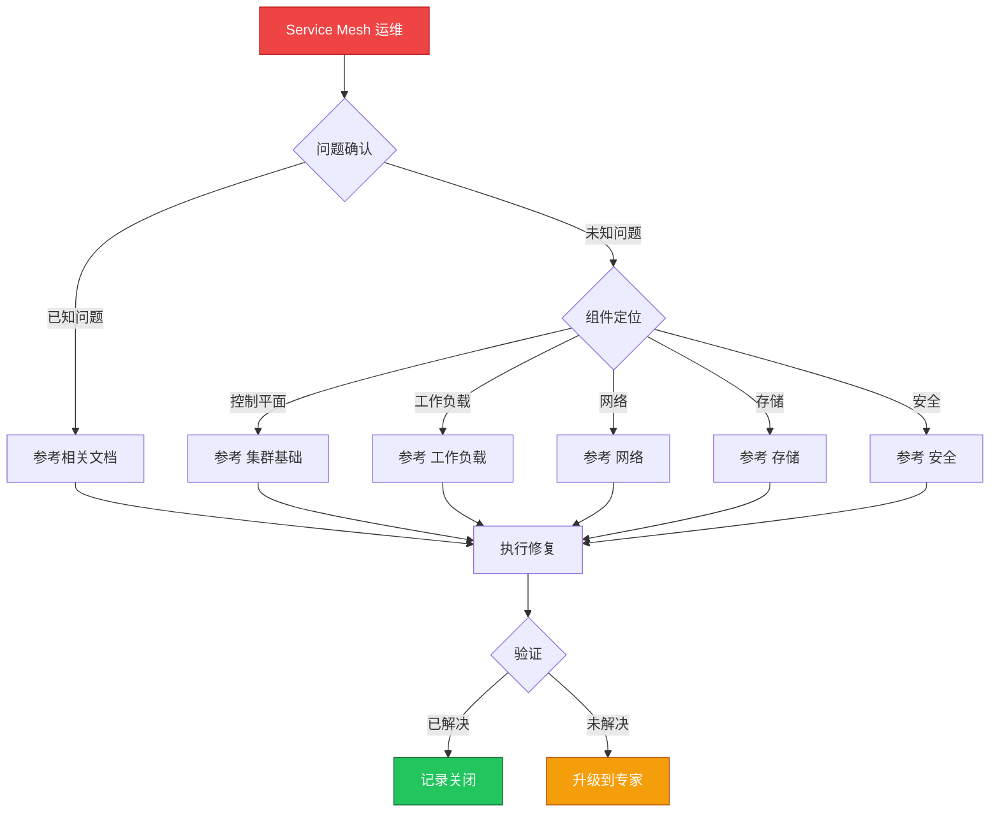

> **生产环境安全提示**
>
> 本文档包含可直接执行的运维命令。执行前请确认：当前目标集群与 Namespace 是否正确；是否具备足够的 RBAC 权限；是否已在非生产环境验证。命令风险等级标注：🔴 高风险（可能造成数据丢失或服务中断）、🟡 中风险（会修改集群状态，但通常可回滚）、🟢 低风险/只读（信息收集，无副作用）。


# 场景: [[Service|Service]]Service Mesh）|Service Mesh]] 运维

> **场景 ID**: SC-16
> **英文**: Service Mesh Operations
> **最后更新**: 2026-05-20

---

## 场景概述

Service Mesh 为微服务提供服务间治理能力。

---

## 快速决策树



---

## 相关文档

- [[网络/README.md|README]]


---

## FTA 故障树

- [[故障诊断/FTA故障树/list/gateway-api-fta.md|gateway api fta]]
- [[故障诊断/FTA故障树/list/ingress-fta.md|ingress fta]]


---

## 操作技能

暂无专项技能卡片


---

## 关联场景

| 关联场景 | 说明 |
|---|---|

## 生产案例

### 案例1：Istio Sidecar 注入导致服务启动失败

| 时间 | 事件 |
|---|---|
| 10:00 | 部署新版本，Pod 一直 Init:0/2 |
| 10:05 | 发现 istio-init 容器等待网络就绪超时 |
| 10:10 | 确认 NetworkPolicy 阻止了 sidecar 初始化 |
| 10:30 | 调整 NetworkPolicy 允许 sidecar 通信 |

**根因**：NetworkPolicy 未考虑 sidecar 流量需求。

**修复**：
```bash
# 🟢 检查 sidecar 状态
kubectl get pods -o json | jq '.items[].spec.containers[] | select(.name=="istio-proxy")'
# 🟡 检查 istio-init 日志
kubectl logs <pod> -c istio-init
# 🟡 调整 NetworkPolicy
kubectl apply -f allow-istio-system.yaml
```

### 案例2：服务网格升级导致流量中断

- **现象**：Istio 升级后部分服务 503
- **诊断**：新版本 Envoy 与旧版 sidecar 不兼容
- **修复**：滚动重启所有 sidecar + 版本一致性检查

## 面试要点

1. **Q：服务网格的核心价值和挑战？**
   A：价值：流量管理、可观测性、mTLS 安全。挑战：性能开销(2-5ms)、复杂度增加、升级风险、资源消耗。

2. **Q：Istio 流量管理的关键概念？**
   A：VirtualService(路由规则)、DestinationRule(负载均衡/熔断)、Gateway(入口流量)、Sidecar(出口流量控制)。

3. **Q：服务网格故障排查思路？**
   A：检查 sidecar 状态→istioctl analyze→Envoy 日志→Pilot 日志→NetworkPolicy→mTLS 配置→版本一致性。

## Related

- [[实体/kudig-metadata-index.md|README]].md|README]]
- [[故障诊断/FTA故障树/list/ingress-fta.md|ingress-fta]]
- [[系统基础/知识字典/networking/service-mesh.md|service-mesh]]


<!-- risk-assessed -->
