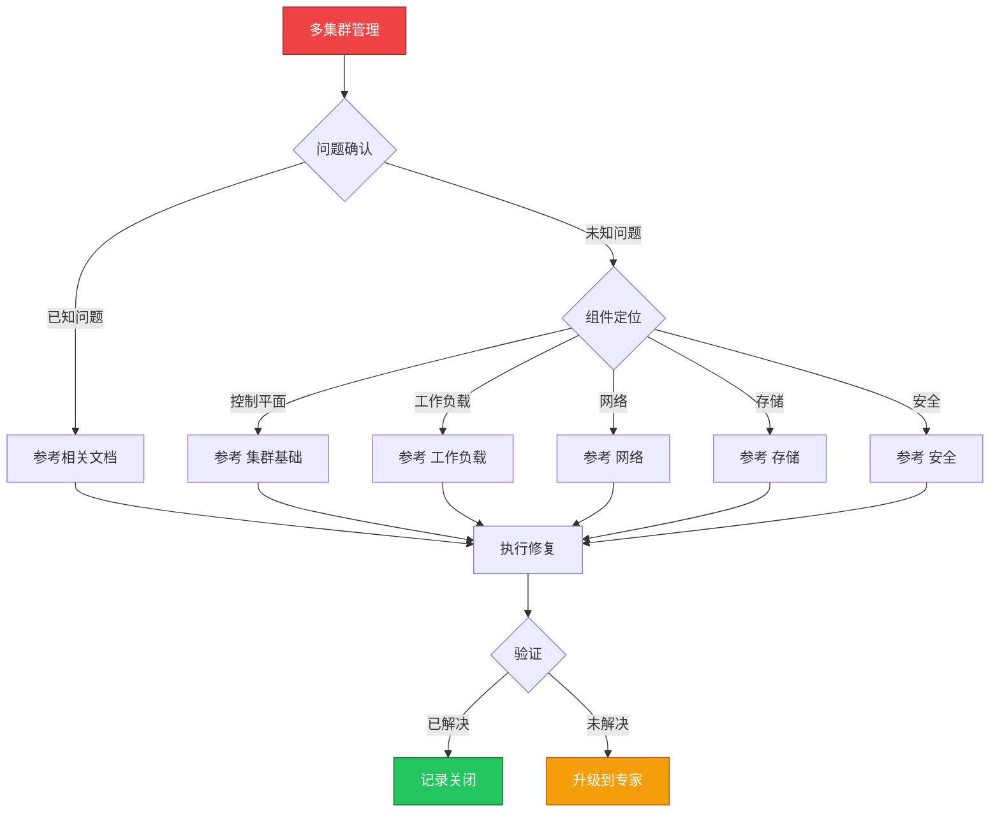

> **生产环境安全提示**
>
> 本文档包含可直接执行的运维命令。执行前请确认：当前目标集群与 Namespace 是否正确；是否具备足够的 RBAC 权限；是否已在非生产环境验证。命令风险等级标注：🔴 高风险（可能造成数据丢失或服务中断）、🟡 中风险（会修改集群状态，但通常可回滚）、🟢 低风险/只读（信息收集，无副作用）。


# 场景: 多集群管理

> **场景 ID**: SC-17
> **英文**: Multi-Cluster Management
> **最后更新**: 2026-05-20

---

## 场景概述

多集群是大规模生产环境的常见架构。

---

## 快速决策树



---

## 相关文档

- [[平台工程/README.md|README]]
- [[云厂商/README.md|README]]


---

## FTA 故障树

暂无专项 FTA


---

## 操作技能

暂无专项技能卡片


---

## 关联场景

| 关联场景 | 说明 |
|---|---|

## 生产案例

### 案例1：多集群配置同步不一致导致服务异常

| 时间 | 事件 |
|---|---|
| 10:00 | 更新 ConfigMap，仅应用到集群 A |
| 10:30 | 集群 B 服务因配置缺失报错 |
| 11:00 | 手动同步配置到所有集群 |
| 后续 | 部署 Cluster API + GitOps 统一配置管理 |

**根因**：缺乏多集群配置同步机制。

**修复**：
```bash
# 🟢 检查多集群配置一致性
for ctx in cluster-a cluster-b cluster-c; do
  echo "=== $ctx ==="
  kubectl --context=$ctx get configmap app-config -o yaml | md5sum
done
# 🟡 使用 GitOps 统一配置
argocd app create app-config --repo https://git.example.com/config --dest-server https://kubernetes.default.svc
```

### 案例2：跨集群服务发现失败

- **现象**：集群 A 无法访问集群 B 的服务
- **诊断**：未配置跨集群服务发现，DNS 无法解析
- **修复**：部署服务网格多集群模式 + 配置跨集群 DNS

## 面试要点

1. **Q：多集群架构的常见模式？**
   A：主从模式(管理+工作)、对等模式(独立集群)、联邦模式(KubeFed)、服务网格多集群(Istio multi-cluster)。

2. **Q：多集群管理的核心挑战？**
   A：配置一致性、服务发现、流量调度、安全互信、版本统一、监控聚合、成本控制。

3. **Q：多集群流量调度策略？**
   A：基于地域(就近访问)、基于权重(灰度发布)、基于健康检查(故障转移)、基于成本(资源优化)。工具：Istio、Linkerd、Submariner。

## Related

- [[实体/kudig-metadata-index.md|README]].md|README]]


<!-- risk-assessed -->
