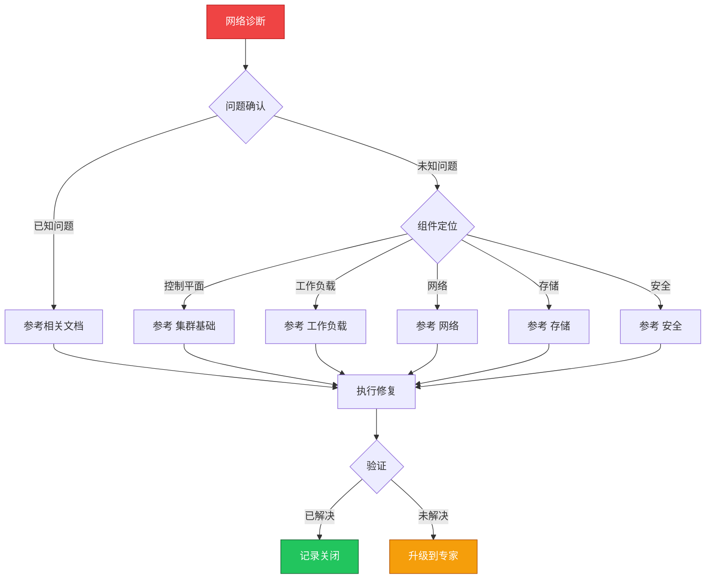

> **生产环境安全提示**
>
> 本文档包含可直接执行的运维命令。执行前请确认：当前目标集群与 Namespace 是否正确；是否具备足够的 RBAC 权限；是否已在非生产环境验证。命令风险等级标注：🔴 高风险（可能造成数据丢失或服务中断）、🟡 中风险（会修改集群状态，但通常可回滚）、🟢 低风险/只读（信息收集，无副作用）。


# 场景: 网络诊断

> **场景 ID**: SC-11
> **英文**: Network Diagnosis
> **最后更新**: 2026-05-20

---

## 场景概述

网络问题是 K8s 运维中最常见的问题类型。

---

## 快速决策树



---

## 相关文档

- [[网络/README.md|README]]
- [[网络/README.md|README]]
- [[网络/README.md|Domain 03: [[网络诊断速查卡|Networking]] — Terway 专题]]


---

## FTA 故障树

- [[故障诊断/FTA故障树/list/dns-fta.md|dns fta]]
- [[故障诊断/FTA故障树/list/service-fta.md|service fta]]
- [[故障诊断/FTA故障树/list/ingress-fta.md|ingress fta]]
- [[故障诊断/FTA故障树/list/networkpolicy-fta.md|networkpolicy fta]]
- [[故障诊断/FTA故障树/list/service-fta.md|service fta]]


---

## 操作技能

暂无专项技能卡片


---

## 关联场景

| 关联场景 | 说明 |
|---|---|

## 生产案例

### 案例1：Pod 间通信间歇性超时

| 时间 | 事件 |
|---|---|
| 10:00 | 服务 A 调用服务 B 间歇性超时 |
| 10:10 | tcpdump 抓包发现部分包丢失 |
| 10:20 | 确认节点 MTU 不一致导致分片丢包 |
| 10:40 | 统一 MTU 配置后恢复 |

**根因**：不同节点 MTU 配置不一致，CNI 未正确处理。

**修复**：
```bash
# 🟢 检查节点 MTU
ip link show | grep mtu
# 🟡 检查 CNI 配置
cat /etc/cni/net.d/*.conf | jq '.mtu'
# 🟡 统一 MTU 配置
ip link set eth0 mtu 1450
# 重启 CNI 插件
kubectl rollout restart ds kube-flannel-ds -n kube-system
```

### 案例2：Service 无法访问但 Pod 直接访问正常

- **现象**：通过 Service IP 访问超时，直接访问 Pod IP 正常
- **诊断**：kube-proxy iptables 规则未正确生成
- **修复**：重启 kube-proxy + 检查 Endpoint 状态

## 面试要点

1. **Q：K8s 网络故障排查的分层思路？**
   A：Pod内(网络命名空间)→节点(CNI/路由)→Service(kube-proxy/iptables)→DNS(CoreDNS)→Ingress(控制器)→外部(负载均衡)。

2. **Q：常见的网络问题有哪些？**
   A：DNS 解析失败、Pod 间不通、Service 无法访问、Ingress 502、MTU 不匹配、NetworkPolicy 阻断、CNI 插件故障。

3. **Q：网络诊断的常用工具？**
   A：kubectl exec + curl/nslookup、tcpdump、ipvsadm、iptables-save、CNI 日志、kube-proxy 日志、网络策略检查。

## Related

- [[实体/kudig-metadata-index.md|README]].md|README]]
- [[系统基础/速查卡/k8s.md|k8s]]
- [[技能/网络/service/service-fta.md|service-fta]]
- [[故障诊断/FTA故障树/list/dns-fta.md|dns-fta]]
- [[故障诊断/FTA故障树/list/ingress-fta.md|ingress-fta]]


<!-- risk-assessed -->
