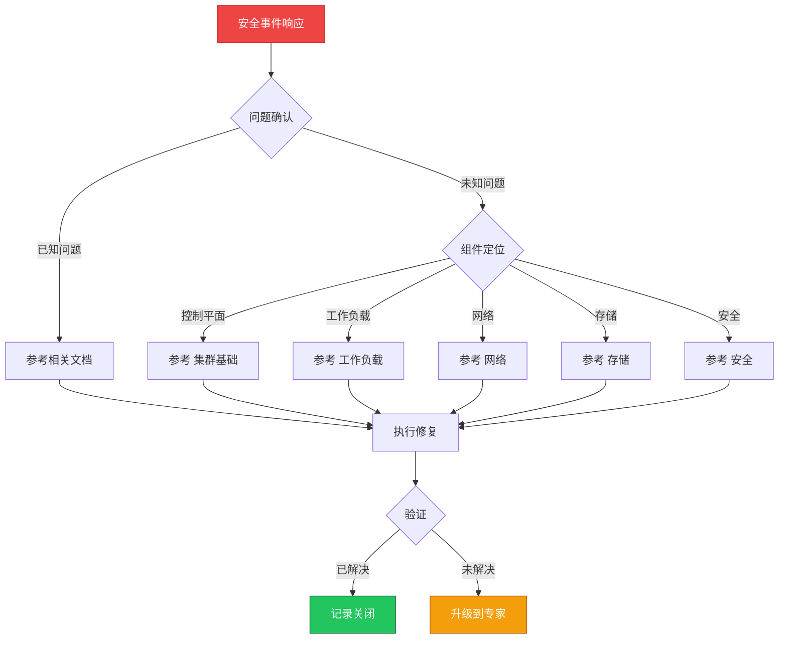

> **生产环境安全提示**
>
> 本文档包含可直接执行的运维命令。执行前请确认：当前目标集群与 Namespace 是否正确；是否具备足够的 RBAC 权限；是否已在非生产环境验证。命令风险等级标注：🔴 高风险（可能造成数据丢失或服务中断）、🟡 中风险（会修改集群状态，但通常可回滚）、🟢 低风险/只读（信息收集，无副作用）。


# 场景: 安全事件响应

> **场景 ID**: SC-13
> **英文**: Security Incident Response
> **最后更新**: 2026-05-20

---

## 场景概述

安全事件需要快速、系统化的响应。

---

## 快速决策树



---

## 相关文档

- [[安全/README.md|README]]
- [[安全/README.md|README]]
- supply-chain-security/README.md]]


---

## FTA 故障树

- [[故障诊断/FTA故障树/list/rbac-fta.md|rbac fta]]
- [[故障诊断/FTA故障树/list/certificate-fta.md|certificate fta]]


---

## 操作技能

暂无专项技能卡片


---

## 关联场景

| 关联场景 | 说明 |
|---|---|

## 生产案例

### 案例1：容器逃逸导致节点被入侵

| 时间 | 事件 |
|---|---|
| 02:00 | 安全告警：异常进程在节点上运行 |
| 02:10 | 确认容器通过挂载 /var/run/docker.sock 逃逸 |
| 02:15 | 隔离受影响节点，保留取证 |
| 03:00 | 清除后门 + 轮转凭证 + 修复漏洞 |

**根因**：Pod 挂载了 docker.sock，未启用 Pod Security Standards。

**修复**：
```bash
# 🔴 立即隔离节点
kubectl cordon <node> && kubectl drain <node> --force
# 🟢 检查危险挂载
kubectl get pods -A -o json | jq '.items[] | select(.spec.volumes[]?.hostPath.path=="/var/run/docker.sock")'
# 🟡 启用 restricted Pod Security Standard
kubectl label ns <ns> pod-security.kubernetes.io/enforce=restricted
```

### 案例2：镜像供应链攻击

- **现象**：部署后出现异常外连行为
- **诊断**：镜像被篡改，包含挖矿程序
- **修复**：回滚到已知安全镜像 + 启用镜像签名验证 + 私有仓库强制

## 面试要点

1. **Q：K8s 安全事件应急响应流程？**
   A：发现→隔离→取证→清除→恢复→复盘。关键：保留现场证据、轮转所有凭证、检查横向移动、更新安全策略。

2. **Q：如何防止容器逃逸？**
   A：禁止特权容器、限制 capabilities、不挂载敏感 hostPath、启用 seccomp/AppArmor、使用 gVisor/Kata 强隔离、Pod Security Standards。

3. **Q：镜像供应链安全如何保障？**
   A：私有仓库强制、镜像签名验证(cosign)、漏洞扫描(Trivy)、SBOM 生成、基础镜像最小化、CI/CD 构建可重现。

## Related

- [[实体/kudig-metadata-index.md|README]].md|README]]
- [[技能/安全/certificate/certificate-fta.md|certificate-fta]]
- [[系统基础/知识字典/security/cloud-native-security.md|cloud-native-security]]


<!-- risk-assessed -->
