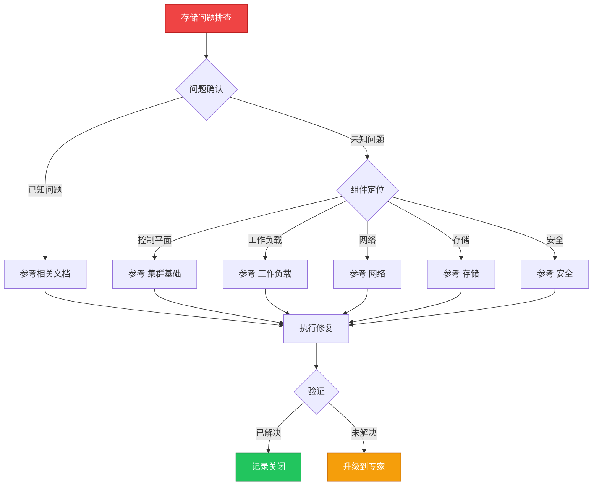

> **生产环境安全提示**
>
> 本文档包含可直接执行的运维命令。执行前请确认：当前目标集群与 Namespace 是否正确；是否具备足够的 RBAC 权限；是否已在非生产环境验证。命令风险等级标注：🔴 高风险（可能造成数据丢失或服务中断）、🟡 中风险（会修改集群状态，但通常可回滚）、🟢 低风险/只读（信息收集，无副作用）。


# 场景: 存储问题排查

> **场景 ID**: SC-12
> **英文**: Storage Issues
> **最后更新**: 2026-05-20

---

## 场景概述

存储问题直接影响应用的持久化数据。

---

## 快速决策树



---

## 相关文档

- [[存储/README.md|README]]
- [[存储/README.md|README]]


---

## FTA 故障树

- [[故障诊断/FTA故障树/list/csi-fta.md|csi fta]]
- [[故障诊断/FTA故障树/list/csi-fta.md|csi fta]]
- [[故障诊断/FTA故障树/list/csi-fta.md|csi fta]]


---

## 操作技能

暂无专项技能卡片


---

## 关联场景

| 关联场景 | 说明 |
|---|---|

## 生产案例

### 案例1：PV 容量不足导致数据库写入失败

| 时间 | 事件 |
|---|---|
| 03:00 | 数据库 Pod 报 "No space left on device" |
| 03:05 | 应用写入全部失败，触发 P0 告警 |
| 03:15 | 确认 PV 使用率 100%，StorageClass 未启用扩容 |
| 03:30 | 手动扩容 PV 后恢复 |

**根因**：未配置存储监控告警 + StorageClass 未启用 allowVolumeExpansion。

**修复**：
```bash
# 🟡 扩容 PVC（需 StorageClass 支持）
kubectl patch pvc <pvc-name> -p '{"spec":{"resources":{"requests":{"storage":"100Gi"}}}}'
# 🟢 检查扩容状态
kubectl get pvc <pvc-name> -o jsonpath='{.status.conditions}'
```

### 案例2：存储后端故障导致多节点 IO hang

- **现象**：多个 Pod IO 超时，节点 load 飙升
- **诊断**：CSI driver 日志显示存储后端连接超时
- **修复**：切换存储后端 + 配置 IO 超时 + 启用多路径

## 面试要点

1. **Q：PV/PVC/StorageClass 的关系？**
   A：StorageClass 定义存储类型和参数，PVC 是用户申请，PV 是实际资源。动态供给：PVC→StorageClass→自动创建PV。

2. **Q：存储故障排查的核心思路？**
   A：分层排查：Pod(mount状态)→PVC(Bound?)→PV(状态)→CSI driver(日志)→存储后端(连接/容量)。

3. **Q：如何防止存储容量不足？**
   A：监控 PVC 使用率(>80%告警)、启用自动扩容、设置容量配额、定期清理快照、容量规划预留 30% buffer。

## Related

- [[实体/kudig-metadata-index.md|README]].md|README]]
- [[技能/存储/csi-storage/csi-fta.md|csi-fta]]
- storage


<!-- risk-assessed -->
