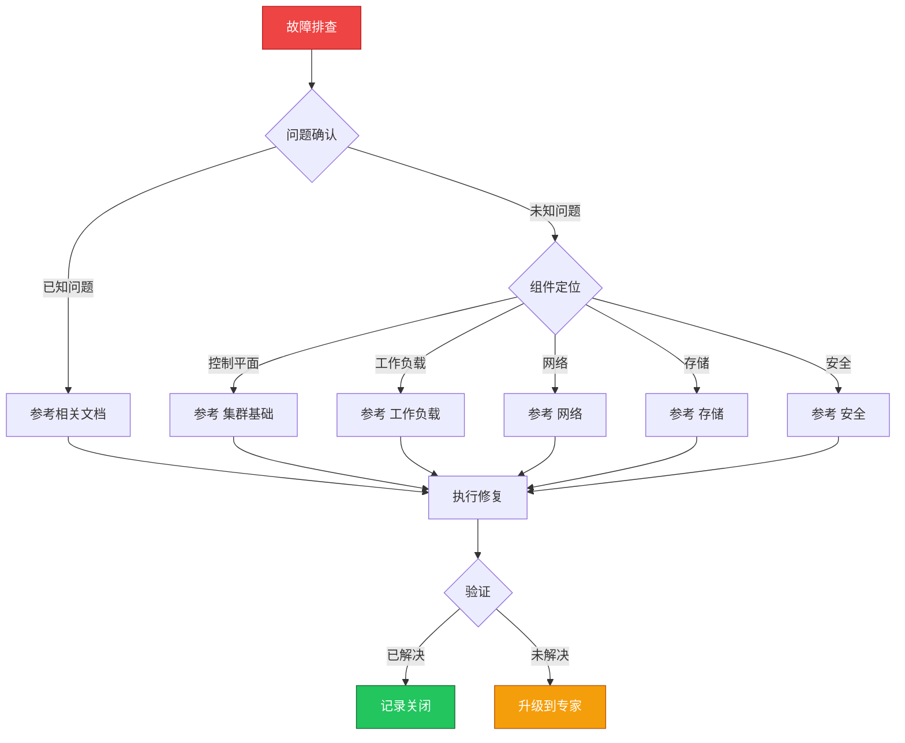

> **生产环境安全提示**
>
> 本文档包含可直接执行的运维命令。执行前请确认：当前目标集群与 Namespace 是否正确；是否具备足够的 RBAC 权限；是否已在非生产环境验证。命令风险等级标注：🔴 高风险（可能造成数据丢失或服务中断）、🟡 中风险（会修改集群状态，但通常可回滚）、🟢 低风险/只读（信息收集，无副作用）。


# 场景: 故障排查

> **场景 ID**: SC-03
> **英文**: Troubleshooting
> **最后更新**: 2026-05-20

---

## 场景概述

故障排查是 SRE 和运维工程师的核心能力。本场景汇总了通用排查方法论、组件级故障树、和操作技能卡片。

---

## 快速决策树



---

## 相关文档

- [[故障诊断/README.md|README]]
- [[故障诊断/高级排障/README.md|README]]
- 集群基础/16-troubleshooting-guide.md


---

## FTA 故障树

- [[故障诊断/FTA故障树/MOC.md|所有 FTA 故障树]]


---

## 操作技能

- [[故障诊断/技能体系/MOC.md|所有操作技能]]


---

## 关联场景

| 关联场景 | 说明 |
|---|---|

## 生产案例

### 案例1：DNS 解析间歇性失败导致服务抖动

| 时间 | 事件 |
|---|---|
| 14:00 | 多个服务报 DNS 解析超时 |
| 14:05 | 重启 CoreDNS 后短暂恢复 |
| 14:30 | 再次出现，发现 ndots:5 导致大量无效查询 |
| 15:00 | 调整 ndots:2 + 启用 NodeLocal DNSCache |

**根因**：ndots 配置不当 + CoreDNS 资源不足。

**修复**：
```bash
# 🟢 检查 DNS 解析
kubectl exec -it <pod> -- nslookup kubernetes.default
# 🟡 调整 ndots 配置
kubectl edit deploy <app>  # dnsConfig.options: [{name: ndots, value: "2"}]
# 🟡 部署 NodeLocal DNSCache
kubectl apply -f nodelocaldns.yaml
```

### 案例2：节点 NotReady 但 Pod 仍在运行

- **现象**：kubectl 显示节点 NotReady，但业务正常
- **诊断**：kubelet 与 API Server 心跳超时，实际节点正常
- **修复**：检查网络连通性 + 调整 node-monitor-grace-period

## 面试要点

1. **Q：故障排查的方法论是什么？**
   A：FTA(故障树分析)自上而下、FEBM(基于证据)自下而上。核心：观察现象→形成假设→验证假设→确认根因→修复验证。

2. **Q：Pod CrashLoopBackOff 的排查思路？**
   A：kubectl logs(上次日志)→kubectl describe(事件)→检查资源限制→检查依赖服务→检查配置正确性→检查镜像版本。

3. **Q：如何建立高效排障体系？**
   A：完善监控告警(Prometheus)+集中日志(ELK)+链路追踪(Jaeger)+FTA知识库+Runbook自动化+定期故障演练。

## Related

- [[实体/kudig-metadata-index.md|README]].md|README]]
- MOC.md|MOC]]
- [[平台工程/代码分析/cluster-delete/12-troubleshooting.md|12-troubleshooting]]


<!-- risk-assessed -->
