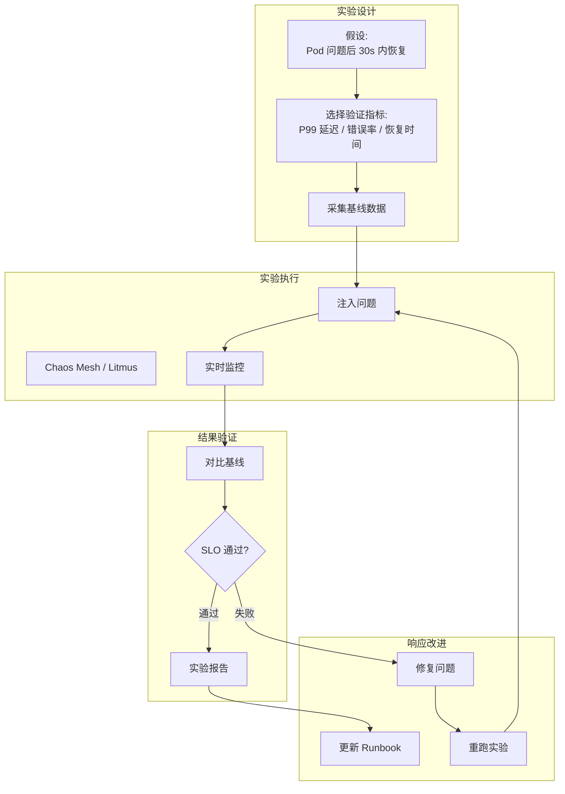
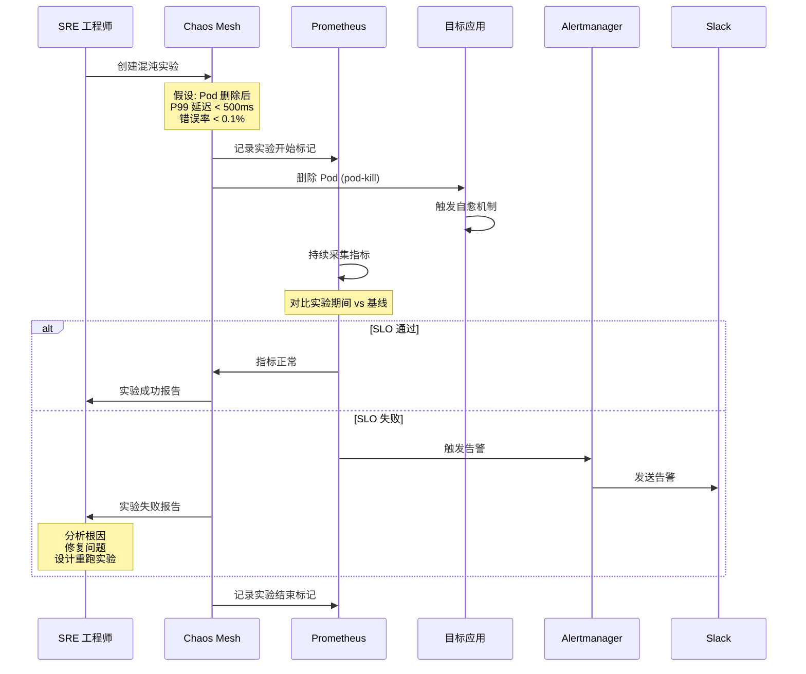
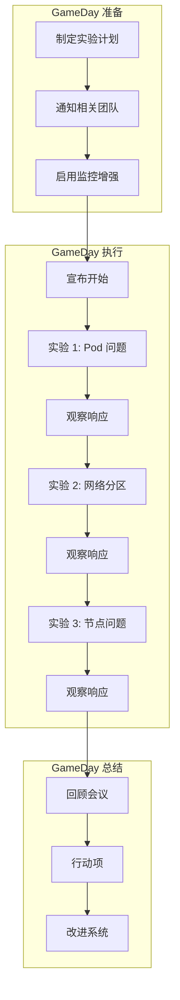
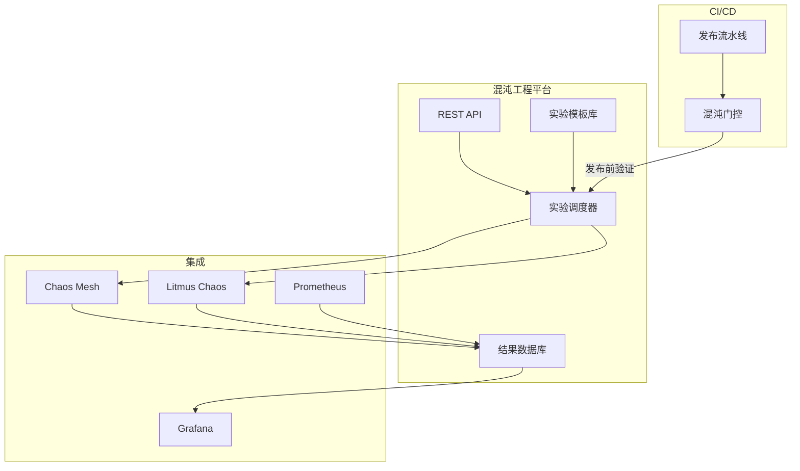

# 混沌工程与可观测性融合

## 概述

混沌工程通过在生产环境注入问题来验证系统韧性，可观测性通过采集和分析系统信号来理解系统行为。两者的交汇点在于：**混沌实验的可信度依赖于可观测性——你无法验证"系统在问题中是否表现正确"，除非你能够看到系统在问题中的真实行为。** 本页连接 可靠性 的混沌工程方法论与 可观测性 的监控体系，展示如何将可观测性注入混沌实验的全生命周期——从实验设计、执行监控到结果验证。

## 核心连接

| 域 | 核心能力 | 融合的桥接作用 |
|---|---|---|
| **Reliability (domain-09)** | 故障注入、韧性验证、游戏日 | 混沌实验定义"注入什么问题"和"期望什么结果" |
| **Observability (domain-06)** | 指标、日志、追踪、告警 | 可观测性提供"实际发生了什么"的数据支撑 |

**关键洞察：混沌工程不是"故意搞破坏"，而是"有假设地验证"。** 每个混沌实验都包含一个假设："如果 X 发生，系统应该在 Y 时间内恢复到 Z 状态。" 可观测性是验证这个假设的唯一手段。

## 架构图

### 混沌工程可观测性闭环



### Chaos Mesh 实验监控架构

```mermaid
graph TB
    subgraph Controller["Chaos Mesh"]
        CM[Chaos Controller]
        Dashboard[Chaos Dashboard]
    end
    subgraph Targets["目标工作负载"]
        P1[Pod A]
        P2[Pod B]
        P3[Pod C]
    end
    subgraph Observability["可观测性栈"]
        Prom[Prometheus]
        Loki[Loki]
        Tempo[Tempo]
        Grafana[Grafana]
        Alert[Alertmanager]
    end
    subgraph Events["事件关联"]
        E[实验事件<br/>开始/结束/恢复]
        M[指标异常
        L[日志异常]
        T[追踪异常]
    end

    CM -->|注入问题| P1
    CM -->|记录事件| E
    P1 -->|指标| Prom
    P1 -->|日志| Loki
    P1 -->|追踪| Tempo
    Prom --> M
    Loki --> L
    Tempo --> T
    E --> Grafana
    M --> Grafana
    L --> Grafana
    T --> Grafana
    M -->|SLO 违反| Alert
```

### 混沌实验与 SLO 验证流程



## 核心机制

### 混沌实验的可观测性设计

每个混沌实验需要回答三个问题：

| 问题 | 可观测性来源 | 关键指标 |
|---|---|---|
| **问题是否生效？** | 事件日志、Chaos Dashboard | 实验状态、目标 Pod/节点状态 |
| **系统如何响应？** | 指标、日志、追踪 | 延迟、错误率、吞吐量、恢复时间 |
| **是否达到预期？** | SLO 对比、基线偏离 | 与基线对比的差异是否在可接受范围 |

### 实验基线采集

```bash
# 实验前基线采集脚本
#!/bin/bash
EXPERIMENT_NAME="pod-failure-payment"
DURATION=300  # 5 分钟

# 采集基线指标
echo "采集基线指标..."
 Baseline_P99=$(curl -s "http://prometheus:9090/api/v1/query?query=histogram_quantile(0.99,sum(rate(http_request_duration_seconds_bucket[5m])))" | jq -r '.data.result[0].value[1]')
 Baseline_ErrorRate=$(curl -s "http://prometheus:9090/api/v1/query?query=sum(rate(http_requests_total{status=~'5..'}[5m]))/sum(rate(http_requests_total[5m]))" | jq -r '.data.result[0].value[1]')
 Baseline_RPS=$(curl -s "http://prometheus:9090/api/v1/query?query=sum(rate(http_requests_total[5m]))" | jq -r '.data.result[0].value[1]')

# 记录基线到实验记录
cat > /tmp/${EXPERIMENT_NAME}_baseline.json <<EOF
{
  "experiment": "$EXPERIMENT_NAME",
  "baseline_p99_latency": $Baseline_P99,
  "baseline_error_rate": $Baseline_ErrorRate,
  "baseline_rps": $Baseline_RPS,
  "timestamp": "$(date -u +%Y-%m-%dT%H:%M:%SZ)"
}
EOF
```

### Chaos Mesh 实验定义 + 监控集成

```yaml
# Chaos Mesh 实验：Pod 问题 + SLO 验证
apiVersion: chaos-mesh.org/v1alpha1
kind: PodChaos
metadata:
  name: pod-failure-payment
  namespace: chaos-testing
  annotations:
    # 实验元数据，用于可观测性关联
    experiment.purpose: "验证支付服务在 Pod 问题时的恢复能力"
    experiment.owner: "sre-team"
    experiment.slo.p99_latency: "0.5"
    experiment.slo.error_rate: "0.001"
    experiment.baseline.duration: "300s"
spec:
  action: pod-kill
  mode: one
  selector:
    namespaces:
      - production
    labelSelectors:
      app: payment-service
  duration: "30s"
  gracePeriod: 0
---
# 实验期间的 SLO 监控告警规则
apiVersion: monitoring.coreos.com/v1
kind: PrometheusRule
metadata:
  name: chaos-experiment-slo
spec:
  groups:
    - name: chaos-slo
      rules:
        - alert: ChaosExperimentSLOViolation
          expr: |
            (
              histogram_quantile(0.99,
                sum(rate(http_request_duration_seconds_bucket[5m])) by (le)
              )
            ) > 0.5
          for: 1m
          labels:
            severity: critical
            chaos_experiment: "pod-failure-payment"
          annotations:
            summary: "混沌实验期间 P99 延迟超过 500ms"
            description: "实验 {{ $labels.chaos_experiment }} 触发了 SLO 违反"

        - alert: ChaosExperimentErrorRate
          expr: |
            sum(rate(http_requests_total{status=~"5.."}[1m]))
            /
            sum(rate(http_requests_total[1m]))
            > 0.001
          for: 1m
          labels:
            severity: critical
            chaos_experiment: "pod-failure-payment"
          annotations:
            summary: "混沌实验期间错误率超过 0.1%"
```

### 网络混沌 + 追踪关联

```yaml
# 网络延迟实验
apiVersion: chaos-mesh.org/v1alpha1
kind: NetworkChaos
metadata:
  name: network-latency-api-db
  annotations:
    experiment.purpose: "验证 API 到数据库的网络延迟影响"
    experiment.target: "api-service -> database"
spec:
  action: delay
  mode: all
  selector:
    namespaces:
      - production
    labelSelectors:
      app: api-service
  delay:
    latency: "200ms"
    correlation: "100"
    jitter: "0ms"
  direction: to
  target:
    selector:
      namespaces:
        - production
      labelSelectors:
        app: database
    mode: all
  duration: "300s"
```

```promql
# 追踪分析：网络延迟实验期间的服务链路
# 查看 api-service 到 database 的延迟分布
histogram_quantile(0.99,
  sum by (le) (
    rate(traces_spanmetrics_latency_bucket{
      span_name="query_database",
      service_name="api-service"
    }[5m])
  )
)

# 错误率追踪
traceql: '{service.name="api-service" && status=error && duration>200ms}'
```

### 混沌实验与游戏日 (GameDay)



## 最佳实践

### 1. 分层混沌实验策略

```
混沌实验分层:
┌─────────────────────────────────────────┐
│  层1: 组件级混沌                          │
│  → Pod 问题、容器 OOM                     │
│  → 验证 Pod 自愈、重启策略                 │
│  → 频率: 每周自动运行                      │
├─────────────────────────────────────────┤
│  层2: 节点级混沌                          │
│  → 节点宕机、网络分区、磁盘满              │
│  → 验证集群调度、数据持久化                │
│  → 频率: 每月 GameDay                     │
├─────────────────────────────────────────┤
│  层3: 应用级混沌                          │
│  → 依赖服务问题、超时、返回错误             │
│  → 验证熔断、降级、重试                    │
│  → 频率: 每季度大型演练                    │
├─────────────────────────────────────────┤
│  层4: 区域级混沌                          │
│  → 整个可用区问题                          │
│  → 验证跨区域灾备、流量切换                │
│  → 频率: 每年灾备演练                      │
└─────────────────────────────────────────┘
```

### 2. 安全护栏设计

```yaml
# 混沌实验安全护栏
apiVersion: chaos-mesh.org/v1alpha1
kind: Schedule
metadata:
  name: safe-pod-chaos
spec:
  schedule: "0 2 * * 1"  # 每周一凌晨 2 点
  concurrencyPolicy: Forbid
  type: PodChaos
  podChaos:
    action: pod-kill
    mode: one
    selector:
      namespaces:
        - production
      labelSelectors:
        app: payment-service
      # 安全护栏：排除关键 Pod
      expressionSelectors:
        - key: chaos-mesh.org/exclude
          operator: NotIn
          values: ["true"]
    duration: "30s"
    # 自动终止：超过 5 分钟自动恢复
    gracePeriod: 5
```

**安全护栏清单：**
- [ ] 实验期间有 SRE On-call 待命
- [ ] 实验有自动终止时间（TTL）
- [ ] 关键服务（支付、认证）有排除标签
- [ ] 生产环境实验需审批流程
- [ ] 实验期间暂停非紧急发布
- [ ] 一键停止实验的紧急按钮

### 3. 可观测性增强配置

```yaml
# 实验期间增强监控采集频率
apiVersion: v1
kind: ConfigMap
metadata:
  name: prometheus-enhanced-scrape
  namespace: monitoring
data:
  prometheus.yml: |
    scrape_configs:
      - job_name: 'chaos-targets'
        scrape_interval: 5s  # 实验期间提升至 5s
        scrape_timeout: 3s
        kubernetes_sd_configs:
          - role: pod
            namespaces:
              names:
                - production
        relabel_configs:
          - source_labels: [__meta_kubernetes_pod_label_chaos_experiment]
            action: keep
            regex: .+
        metric_relabel_configs:
          - source_labels: [__name__]
            regex: 'http_request_duration_seconds.*|http_requests_total.*|container_cpu.*|container_memory.*'
            action: keep
```

### 4. 混沌实验自动化平台



```yaml
# CI 中的混沌门控
stages:
  - build
  - test
  - chaos-gate
  - deploy

chaos-gate:
  stage: chaos-gate
  image: chaos-mesh/chaosctl:latest
  script:
    - chaosctl run --template pod-failure --target payment-service --duration 300
    - chaosctl validate --slo p99-latency --threshold 0.5
    - chaosctl validate --slo error-rate --threshold 0.001
  only:
    - main
```

### 5. 实验结果度量

| 度量指标 | 定义 | 目标 |
|---|---|---|
| **MTTR** (Mean Time To Recovery) | 故障注入到服务恢复的时间 | < 60s |
| **SLO 保持率** | 实验期间 SLO 未违反的比例 | > 95% |
| **检测时间** | 问题发生到告警触发的时间 | < 30s |
| **误报率** | 混沌实验导致的非预期告警比例 | < 5% |
| **实验覆盖率** | 已覆盖的关键服务比例 | > 80% |

## 工具推荐

| 工具 | 角色 | 与可观测性的集成 |
|---|---|---|
| **Chaos Mesh** | 混沌实验平台 | 原生 Prometheus 指标，实验事件导出 |
| **Litmus Chaos** | 混沌实验平台 | CloudNative 项目，[[实体/argo.md|Argo Workflows]] 集成 |
| **Gremlin** | SaaS 混沌平台 | 商业方案，丰富的可观测性集成 |
| **Prometheus** | 指标存储 | 实验期间指标采集和 SLO 验证 |
| **Grafana** | 可视化 | 混沌实验 Dashboard，实时观察 |
| **[[实体/jaeger.md|Jaeger]]** | 分布式追踪 | 追踪实验期间的请求链路 |
| **PagerDuty** | On-call | 实验期间告警升级 |

## 张力与权衡

| 张力 | 详情 |
|---|---|
| **实验真实度 vs 安全风险** | 越接近真实的问题（如生产环境网络分区）越能发现真实问题，但风险也越大。需要在"发现未知问题"和"避免已知风险"之间平衡。 |
| **自动化频率 vs 团队疲劳** | 频繁的自动化混沌实验（如每天）可能导致团队对告警麻木（"又是混沌实验触发的告警"）。需要区分"混沌告警"和"真实告警"的优先级。 |
| **实验覆盖度 vs 执行成本** | 覆盖所有服务的所有问题类型需要巨大的时间和计算成本。优先覆盖核心业务路径（如支付链路）是务实的选择。 |
| **基线稳定性 vs 环境变化** | 混沌实验的基线需要稳定，但 K8s 环境持续变化（发布、扩缩容）。基线的"有效期"可能只有几天。 |
| **游戏日参与 vs 日常压力** | GameDay 需要跨团队协作，但日常工作压力可能让团队视其为负担。需要领导层明确支持和资源分配。 |

## 开放问题

- **混沌实验与 CI/CD 的冲突：** 发布期间运行混沌实验可能导致无法区分"发布引入的 bug"和"混沌实验发现的 bug"。是否需要"发布冻结窗口"？
- **多租户环境的混沌隔离：** 在共享集群中，对 A 团队的命名空间注入问题是否会影响 B 团队？如何设计 namespace 级的故障隔离？
- **混沌实验的数据污染：** 混沌实验期间产生的错误日志和指标会污染正常的监控数据。如何在分析时排除混沌实验期间的"异常"数据？
- **AI 驱动的混沌实验：** 能否用 AI 分析历史故障模式，自动生成混沌实验场景？当前这一方向仍处于早期探索阶段。

## 相关 Domain

- 可靠性/04-chaos-engineering
- 可靠性/05-sre-practices
- 可观测性/02-metrics
- 可观测性/05-alerting
- 可观测性/06-slo-sli
- [[概念/chaos-drill-integration.md|chaos-drill-integration]]

> *This page synthesizes patterns across multiple sources and domains.* ^[inferred]
## Related

- [[实体/prometheus.md|Prometheus (entities)]]
- [[实体/chaos-mesh.md|Chaos Mesh [entities]]]
- [[实体/litmus.md|LitmusChaos]]
