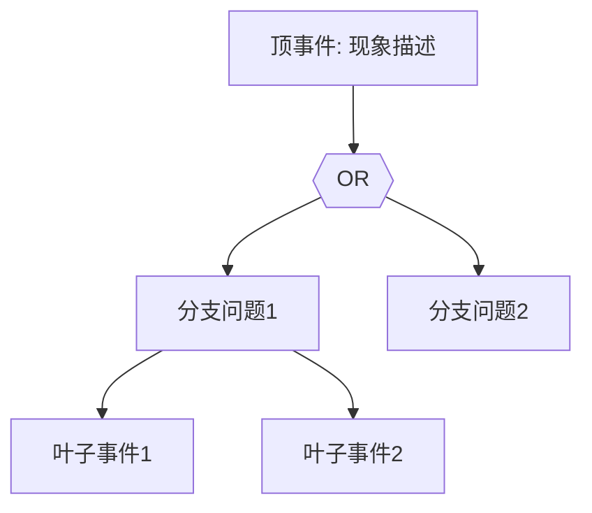

> **生产环境安全提示**
>
> 本文档包含可直接执行的运维命令。执行前请确认：当前目标集群与 Namespace 是否正确；是否具备足够的 RBAC 权限；是否已在非生产环境验证。命令风险等级标注：🔴 高风险（可能造成数据丢失或服务中断）、🟡 中风险（会修改集群状态，但通常可回滚）、🟢 低风险/只读（信息收集，无副作用）。


# CNCF 项目 FTA 索引

> **最后更新**: 2026-05 | **索引项目**: 20+ CNCF 项目

---

## 1. 索引概览

| 分类 | 项目数 | 文档链接 |
|:-----|:------:|:---------|
| **网络与 CNI** | 8 | [查看](#2-网络与-cni) |
| **存储** | 4 | [查看](#3-存储) |
| **服务网格** | 3 | [查看](#4-服务网格) |
| **可观测性** | 5 | [查看](#5-可观测性) |
| **安全** | 4 | [查看](#6-安全) |
| **核心组件** | 8 | [查看](#7-核心组件) |

---

## 2. 网络与 CNI

### 2.1 CNI 插件

| 项目 | FTA 文档 | 故障排查指南 | 核心问题 |
|:-----|:---------|:-------------|:---------|
| **Flannel** | [flannel-fta.md](../故障诊断/FTA故障树/list/flannel-fta.md) | [08-flannel-troubleshooting](../故障诊断/高级排障/03-networking/08-flannel-troubleshooting.md) | VXLAN/host-gw 路由 |
| **Calico** | [calico-fta.md](../故障诊断/FTA故障树/list/calico-fta.md) | [05-calico-troubleshooting](../故障诊断/高级排障/03-networking/05-calico-troubleshooting.md) | [[实体/networkpolicy.md|NetworkPolicy]] |
| **[[Cilium|Cilium]]** | [cilium-fta.md](../故障诊断/FTA故障树/list/cilium-fta.md) | [99-cilium-ebpf-network-guide](../网络/99-cilium-ebpf-network-guide.md) | eBPF/XDP |
| **[[Antrea|Antrea]]** | (待补充) | - | - |
| **Kube-OVN** | (待补充) | - | - |
| **CNI 通用** | [01-cni-troubleshooting.md](../故障诊断/高级排障/03-networking/01-cni-troubleshooting.md) | - | CNI 配置/插件 |

### 2.2 网络组件

| 项目 | FTA 文档 | 故障排查指南 | 核心问题 |
|:-----|:---------|:-------------|:---------|
| **CoreDNS** | [dns-fta.md](../故障诊断/FTA故障树/list/dns-fta.md) | [02-dns-troubleshooting](../故障诊断/高级排障/03-networking/02-dns-troubleshooting.md) | DNS 解析 |
| **Gateway API** | [gateway-api-fta.md](../故障诊断/FTA故障树/list/gateway-api-fta.md) | - | HTTP 路由 |
| **Ingress** | [03-service-ingress-troubleshooting.md](../故障诊断/高级排障/03-networking/03-service-ingress-troubleshooting.md) | - | Service/Ingress |

### 2.3 多集群网络

| 项目 | FTA 文档 | 核心问题 |
|:-----|:---------|:---------|
| **Submariner** | (待补充) | 跨集群连接 |
| **Kubeslice** | (待补充) | 多集群服务网格 |

---

## 3. 存储

| 项目 | FTA 文档 | 故障排查指南 | 核心问题 |
|:-----|:---------|:-------------|:---------|
| **Rook/Ceph** | [csi-fta.md](../故障诊断/FTA故障树/list/csi-fta.md) | [存储故障排查](../故障诊断/高级排障/04-storage/01-storage-troubleshooting.md) | OSD/PG |
| **Longhorn** | (待补充) | - | 副本/快照 |
| **CSI** | [csi-fta.md](../故障诊断/FTA故障树/list/csi-fta.md) | [CSI 故障排查](../故障诊断/高级排障/04-storage/02-csi-troubleshooting.md) | 驱动/挂载 |
| **OpenEBS** | (待补充) | - | - |

---

## 4. 服务网格

| 项目 | FTA 文档 | 故障排查指南 | 核心问题 |
|:-----|:---------|:-------------|:---------|
| **Istio** | (待补充) | Service Mesh 故障排查](../故障诊断/高级排障/structural-03-networking/06-service-mesh-troubleshooting.md) | Sidecar/流量 |
| **Linkerd** | (待补充) | - | 代理/心跳 |
| **Envoy** | (待补充) | - | 代理配置 |

---

## 5. 可观测性

### 5.1 监控

| 项目 | FTA 文档 | 核心问题 |
|:-----|:---------|:---------|
| **Prometheus** | (待补充) | 采集/告警 |
| **Thanos** | (待补充) | 存储/查询 |
| **Alertmanager** | (待补充) | 告警路由 |

### 5.2 日志与追踪

| 项目 | FTA 文档 | 核心问题 |
|:-----|:---------|:---------|
| **Loki** | (待补充) | 日志存储 |
| **Jaeger** | (待补充) | 链路追踪 |

---

## 6. 安全

| 项目 | FTA 文档 | 核心问题 |
|:-----|:---------|:---------|
| **cert-manager** | [certificate-fta.md](../故障诊断/FTA故障树/list/certificate-fta.md) | 证书续期 |
| **SPIFFE/SPIRE** | (待补充) | 身份认证 |
| **OPA/Gatekeeper** | (待补充) | 策略执行 |
| **Falco** | (待补充) | 运行时检测 |

---

## 7. 核心组件

### 7.1 Kubernetes 核心

| 项目 | FTA 文档 | 故障排查指南 | 核心问题 |
|:-----|:---------|:-------------|:---------|
| **API Server** | [apiserver-fta.md](../故障诊断/FTA故障树/list/apiserver-fta.md) | [API Server 排障](../故障诊断/高级排障/01-kubernetes-core/01-apiserver-troubleshooting.md) | 认证/授权 |
| **etcd** | [etcd-fta.md](../故障诊断/FTA故障树/list/etcd-fta.md) | [etcd 故障排查](../故障诊断/高级排障/01-kubernetes-core/02-etcd-troubleshooting.md) | 共识/存储 |
| **Controller Manager** | [controller-manager-fta.md](../故障诊断/FTA故障树/list/controller-manager-fta.md) | - | 控制器循环 |
| **Scheduler** | (待补充) | - | 调度决策 |
| **Kubelet** | (待补充) | [Kubelet 故障排查](../故障诊断/高级排障/01-kubernetes-core/03-kubelet-troubleshooting.md) | 状态同步 |
| **[[概念/container-runtime.md|Container Runtime]]** | (待补充) | - | 容器启动 |

### 7.2 工作负载

| 项目 | FTA 文档 | 故障排查指南 | 核心问题 |
|:-----|:---------|:-------------|:---------|
| **Deployment** | [deployment-fta.md](../故障诊断/FTA故障树/list/deployment-fta.md) | [Workload 排障](../故障诊断/高级排障/02-workloads/01-deployment-rolling-troubleshooting.md) | 滚动更新 |
| **DaemonSet** | [daemonset-fta.md](../故障诊断/FTA故障树/list/daemonset-fta.md) | - | 节点分布 |
| **StatefulSet** | (待补充) | [StatefulSet 排障](../故障诊断/高级排障/02-workloads/03-statefulset-troubleshooting.md) | 持久标识 |
| **Pod** | (待补充) | [Pod 故障排查](../故障诊断/高级排障/02-workloads/02-pod-lifecycle-troubleshooting.md) | 调度/启动 |
| **Job/CronJob** | (待补充) | - | 执行失败 |

### 7.3 生态组件

| 项目 | FTA 文档 | 核心问题 |
|:-----|:---------|:---------|
| **Cluster Autoscaler** | [cluster-autoscaler-fta.md](../故障诊断/FTA故障树/list/cluster-autoscaler-fta.md) | 扩缩容 |
| **GPU** | [gpu-fta.md](../故障诊断/FTA故障树/list/gpu-fta.md) | GPU 调度 |
| **Operator/CRD** | [crd-operator-fta.md](../故障诊断/FTA故障树/list/crd-operator-fta.md) | CRD/Operator |
| **Cloud Provider** | [cloud-provider-fta.md](../故障诊断/FTA故障树/list/cloud-provider-fta.md) | 云厂商集成 |
| **Backup/Restore** | [backup-restore-fta.md](../故障诊断/FTA故障树/list/backup-restore-fta.md) | 备份恢复 |
| **GitOps (Argo CD)** | gitops-argocd-fta.md](../故障诊断/FTA故障树/list/gitops-argocd-fta.md) | 同步失败 |
| **集群升级** | [cluster-upgrade-fta.md](../故障诊断/FTA故障树/list/cluster-upgrade-fta.md) | 版本升级 |

---

## 8. FTA 缺失项目

以下项目需要补充 FTA 文档：

### 高优先级 (需补充)

| 项目 | 分类 | 建议 |
|:-----|:-----|:-----|
| **Istio** | 服务网格 | 流量管理/Sidecar 问题 |
| **Prometheus** | 监控 | 采集失败/告警问题 |
| **Rook/Ceph** | 存储 | OSD/PG 问题 |
| **etcd** | 核心 | Leader 选举/磁盘 |
| **API Server** | 核心 | 认证/授权问题 |

### 中优先级 (建议补充)

| 项目 | 分类 |
|:-----|:-----|
| **Longhorn** | 存储 |
| **Linkerd** | 服务网格 |
| **Loki** | 日志 |
| **Jaeger** | 追踪 |
| **Thanos** | 监控 |
| **Kubelet** | 核心 |

### 低优先级 (可选)

| 项目 |
|:-----|
| **Antrea** |
| **Kube-OVN** |
| **Submariner** |
| **SPIFFE/SPIRE** |
| **OPA** |
| **Falco** |

---

## 9. FTA 贡献指南

### 9.1 FTA 编写规范

```markdown
# [项目名] FTA 树

## 适用范围与说明
- **目标**: 
- **范围**: 
- **符号说明**: 

## Mermaid FTA 树


## 常见问题场景
### 场景 1: [描述]
**诊断路径**: ...
```

### 9.2 顶事件定义原则

1. **用户可感知**: 应该是用户能直接观察到的现象
2. **可量化**: 可以明确判断是否发生
3. **根因导向**: 指向具体的技术问题

### 9.3 文档存放位置

- FTA 索引文档: `故障诊断/FTA故障树/list/[项目名]-fta.md`
- 故障排查指南: `故障诊断/高级排障/structural-[分类]/[序号]-[项目名]-troubleshooting.md`

---

## 10. 相关资源

### 10.1 故障排查索引

- [Kubernetes 核心故障排查](../故障诊断/高级排障/01-kubernetes-core/)
- [网络故障排查](../故障诊断/高级排障/03-networking/)
- [存储故障排查](../故障诊断/高级排障/04-storage/)
- [工作负载故障排查](../故障诊断/高级排障/02-workloads/)

### 10.2 FTA 方法论

- [FTA 方法论与 Agentic 实践](./fta-methodology-and-agentic-practices.md)
- [FTA 故障树构建过程](./05-fta-construction-process.md)
- [FTA 起源与演进](./01-fta-origin-and-evolution.md)

### 10.3 CNCF 资源

- CNCF 集成实践指南](./01-cncf-integration-guide.md)
- [CNCF 学习路径](./02-cncf-learning-paths.md)
- [CNCF 项目选型指南](./03-cncf-selection-guide.md)

---

**维护者**: KUDIG Team | **最后更新**: 2026-05

---

## Obsidian 相关文档

- 生态参考 MOC
- [[生态参考/README.md|Domain-34: CNCF Landscape 开源项目]]
- Domain-34 CNCF Landscape — 开源项目索引
- CNCF 集成实践指南
- CNCF 学习路径
- CNCF 项目选型指南

## See Also

- 02-cncf-learning-paths
- 03-cncf-selection-guide
- 01-cncf-integration-guide
- 02-cncf-learning-paths


<!-- risk-assessed -->
