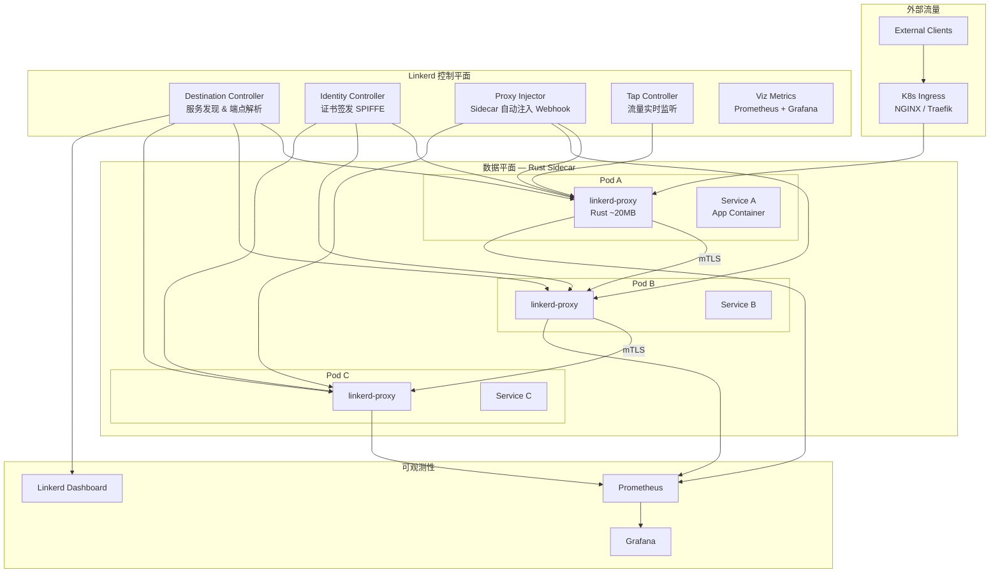

> **生产环境安全提示**
>
> 本文档包含可直接执行的运维命令。执行前请确认：当前目标集群与 Namespace 是否正确；是否具备足够的 RBAC 权限；是否已在非生产环境验证。命令风险等级标注：🔴 高风险（可能造成数据丢失或服务中断）、🟡 中风险（会修改集群状态，但通常可回滚）、🟢 低风险/只读（信息收集，无副作用）。


# [[Linkerd|Linkerd]] 企业级服务网格深度实践

> **最后更新**: 2026-04-24 | **适用版本**: Linkerd v2.18+ | **难度**: 中高级

---

<!-- chunk: 概述 -->## 概述

Linkerd 是云原生计算基金会（CNCF）的第二个毕业项目（2021年），专注于为 [[Kubernetes|Kubernetes]] 提供极致轻量、安全默认、开箱即用的服务网格体验。与 [[Istio|Istio]] 的"功能全面"设计哲学不同，Linkerd 坚守"极简主义"——用最少的组件、最小的资源开销、最简的配置，提供生产级的服务网格核心能力：自动 mTLS、负载均衡、重试超时、流量分割和黄金指标可观测性。

Linkerd 的核心差异化优势在于其 Rust 编写的 linkerd-proxy 数据平面。相比 Istio 使用的 [[Envoy|Envoy]]（C++，每代理约 100MB+ 内存），Linkerd 的 Rust 代理仅消耗约 20MB 内存，P99 延迟增加低于 1 毫秒。这使得 Linkerd 特别适合资源受限环境（边缘计算、IoT）和快速落地需求的中小型团队。

本文档从企业级生产环境角度，全面覆盖 Linkerd 的架构设计、高可用部署、流量管理、安全策略、可观测性集成、性能调优和故障排查实践。

## Linkerd 架构全景



---

<!-- chunk: 核心配置 — 高可用部署 -->## 核心配置 — 高可用部署

## 生产级 Helm 安装

```yaml
apiVersion: v1
kind: Namespace
metadata:
  name: linkerd
  labels:
    linkerd.io/is-control-plane: "true"
    config.linkerd.io/admission-webhooks: disabled
    linkerd.io/control-plane-ns: linkerd
    pod-security.kubernetes.io/enforce: restricted
```

> ⚠️ **🟡 中危变更** — 变更集群资源状态，建议先 --dry-run 或 diff 确认
> - `kubectl apply/create/replace`：创建/变更集群资源

``` bash
# 🟡 中风险：会修改集群/资源状态，执行前请确认目标、影响范围与授权
linkerd install \
  --ha \
  --controller-replicas 3 \
  --identity-issuer-certificate-expiry 87600h \
  --set proxyInit.runAsRoot=true \
  --set proxy.resources.cpu.limit=500m \
  --set proxy.resources.memory.limit=128Mi \
  --set proxy.resources.cpu.request=100m \
  --set proxy.resources.memory.request=64Mi \
  --set identity.issuer.crtExpiry=87600h \
  --set highAvailability=true \
  | kubectl apply -f -

linkerd check
```
## Linkerd 安装验证输出示例

``` bash
# 🟢 低风险：只读/信息收集，通常无副作用
$ linkerd check

kubernetes-api
--------------
√ can initialize the client
√ can query the Kubernetes API

kubernetes-version
------------------
√ is running the minimum Kubernetes API version
√ is running the minimum kubectl version

linkerd-existence
-----------------
√ 'linkerd-config' config map exists
√ heartbeat ServiceAccount exist
√ control plane replica sets are ready
√ no unschedulable pods
√ control plane pods are ready
√ cluster networks can be verified
√ cluster networks defined, verified

linkerd-config
--------------
√ control plane Namespace exists
√ control plane ClusterRoles exist
√ control plane ClusterRoleBindings exist
√ control plane ServiceAccounts exist
√ control plane CustomResourceDefinitions exist
√ control plane MutatingWebhookConfigurations exist
√ control plane ValidatingWebhookConfigurations exist
√ proxy-init container runs as root user if docker container runtime is used

linkerd-identity
----------------
√ certificate config is valid
√ trust anchors are using supported crypto algorithm
√ trust anchors are within their validity period
√ trust anchors are valid for at least 60 days
√ issuer cert is using supported crypto algorithm
√ issuer cert is within its validity period
√ issuer cert is valid for at least 60 days
√ issuer cert is authorized

linkerd-webhooks-and-apis
--------------------------
√ tap API service has valid running pods
√ proxy-injector webhook has valid running pods
√ sp-validator webhook has valid running pods
√ policy-validator webhook has valid running pods

linkerd-version
---------------
√ can determine the latest version
√ cli is up-to-date

Status check results are √
```
## 控制平面资源配置

```yaml
apiVersion: apps/v1
kind: Deployment
metadata:
  name: linkerd-destination
  namespace: linkerd
spec:
  replicas: 3
  selector:
    matchLabels:
      linkerd.io/control-plane-component: destination
  template:
    metadata:
      labels:
        linkerd.io/control-plane-component: destination
    spec:
      affinity:
        podAntiAffinity:
          requiredDuringSchedulingIgnoredDuringExecution:
            - labelSelector:
                matchLabels:
                  linkerd.io/control-plane-component: destination
              topologyKey: kubernetes.io/hostname
      containers:
        - name: destination
          image: cr.l5d.io/linkerd/controller:stable-2.18.0
          ports:
            - name: grpc
              containerPort: 8086
            - name: admin-http
              containerPort: 9996
          resources:
            requests:
              cpu: "100m"
              memory: "128Mi"
            limits:
              cpu: "500m"
              memory: "512Mi"
          readinessProbe:
            httpGet:
              path: /ready
              port: 9996
            initialDelaySeconds: 3
            periodSeconds: 3
          livenessProbe:
            httpGet:
              path: /ping
              port: 9996
            initialDelaySeconds: 10
            periodSeconds: 10
```

## 完整 Helm Values 生产配置

```yaml
# linkerd-production-values.yaml
global:
  namespace: linkerd
  clusterNetworks: "10.0.0.0/8,172.16.0.0/12,192.168.0.0/16"
  imagePullPolicy: IfNotPresent

identity:
  issuer:
    scheme: linkerd.io/tls
    crtExpiry: 87600h
    crtExpiryAnnotation: linkerd.io/identity-issuer-expiry
  trustAnchorsPEM: |
    -----BEGIN CERTIFICATE-----
    MIIBtjCCAV2gAwIBAgIRAKqbMBVMpjRqDQa3DiaD5cIwCgYIKoZIzj0EAwIwKTEn
    -----END CERTIFICATE-----

proxy:
  image:
    name: cr.l5d.io/linkerd/proxy
    version: stable-2.18.0
  resources:
    cpu:
      request: 100m
      limit: 500m
    memory:
      request: 64Mi
      limit: 128Mi
  logLevel: warn,linkerd=info
  await: enabled
  opaquePorts: "25,443,587,3306,5432,6379,9300"
  capabilities:
    add:
      - NET_ADMIN
      - NET_RAW

proxyInit:
  image:
    name: cr.l5d.io/linkerd/proxy-init
    version: v2.6.0
  resources:
    cpu:
      request: 100m
      limit: 500m
    memory:
      request: 64Mi
      limit: 128Mi
  runAsRoot: true
  iptables:
    mode: nft

controller:
  replicas: 3
  image: cr.l5d.io/linkerd/controller:stable-2.18.0
  resources:
    cpu:
      request: 100m
      limit: 500m
    memory:
      request: 128Mi
      limit: 512Mi

destination:
  replicas: 3
  proxy:
    resources:
      cpu:
        request: 100m
        limit: 500m

identityProxy:
  resources:
    cpu:
      request: 100m
      limit: 500m

highAvailability: true
enablePodAntiAffinity: true
nodeAffinity:
  requiredDuringSchedulingIgnoredDuringExecution:
    nodeSelectorTerms:
      - matchExpressions:
          - key: node-role.kubernetes.io/worker
            operator: In
            values:
              - "true"
```

---

<!-- chunk: 流量管理实战 -->## 流量管理实战

## 服务配置与注入

```yaml
apiVersion: v1
kind: Namespace
metadata:
  name: production
  annotations:
    linkerd.io/inject: enabled
---
apiVersion: apps/v1
kind: Deployment
metadata:
  name: webapp
  namespace: production
spec:
  replicas: 3
  selector:
    matchLabels:
      app: webapp
  template:
    metadata:
      annotations:
        linkerd.io/inject: enabled
        config.linkerd.io/proxy-await: enabled
        config.linkerd.io/proxy-cpu-request: "100m"
        config.linkerd.io/proxy-memory-request: "64Mi"
        config.linkerd.io/proxy-cpu-limit: "500m"
        config.linkerd.io/proxy-memory-limit: "128Mi"
      labels:
        app: webapp
    spec:
      containers:
        - name: webapp
          image: nginx:1.25
          ports:
            - containerPort: 8080
          resources:
            requests:
              cpu: "100m"
              memory: "64Mi"
            limits:
              cpu: "200m"
              memory: "128Mi"
---
apiVersion: v1
kind: Service
metadata:
  name: webapp
  namespace: production
  annotations:
    linkerd.io/inject: enabled
spec:
  selector:
    app: webapp
  ports:
    - name: http
      port: 80
      targetPort: 8080
```

## 流量分割 — 金丝雀发布

```yaml
apiVersion: split.smi-spec.io/v1alpha4
kind: TrafficSplit
metadata:
  name: webapp-canary
  namespace: production
spec:
  service: webapp
  backends:
    - service: webapp-stable
      weight: 90
    - service: webapp-canary
      weight: 10
---
apiVersion: v1
kind: Service
metadata:
  name: webapp-stable
  namespace: production
spec:
  selector:
    app: webapp
    version: stable
  ports:
    - name: http
      port: 80
      targetPort: 8080
---
apiVersion: v1
kind: Service
metadata:
  name: webapp-canary
  namespace: production
spec:
  selector:
    app: webapp
    version: canary
  ports:
    - name: http
      port: 80
      targetPort: 8080
```

## 重试与超时 — ServiceProfile

```yaml
apiVersion: linkerd.io/v1alpha2
kind: ServiceProfile
metadata:
  name: webapp.production.svc.cluster.local
  namespace: production
spec:
  routes:
    - name: GET /
      condition:
        pathRegex: /
        method: GET
      timeout: 30s
      retries:
        budget:
          retryRatio: 0.2
          minRetriesPerSecond: 10
          ttl: 10s
      responseClasses:
        - condition:
            status:
              min: 500
              max: 599
          isFailure: true
    - name: POST /api
      condition:
        pathRegex: /api
        method: POST
      timeout: 10s
      retries:
        budget:
          retryRatio: 0.1
          minRetriesPerSecond: 5
          ttl: 5s
    - name: GET /health
      condition:
        pathRegex: /health
        method: GET
      timeout: 5s
```

## 故障注入

```yaml
apiVersion: policy.linkerd.io/v1alpha1
kind: FaultInjection
metadata:
  name: webapp-fault
  namespace: production
spec:
  targetRef:
    group: ""
    kind: Service
    name: webapp
  requestAbort:
    httpStatus: 503
    percentage: 1
```

---

<!-- chunk: 安全策略 — mTLS 与授权 -->## 安全策略 — mTLS 与授权

## 自动 mTLS (默认启用)

Linkerd 安装后自动启用 mTLS，无需任何额外配置。Identity Controller 为每个 Pod 签发基于 SPIFFE 标准的身份证书，证书 TTL 为 24 小时，自动轮换。

```bash
linkerd identity deployment/webapp -n production

linkerd viz stat deployment -n production
```

## mTLS 状态验证输出示例

```bash
$ linkerd viz stat deployment -n production --from deploy/gateway

NAME         MESHED   SUCCESS      RPS   LATENCY_P50   LATENCY_P95   LATENCY_P99   TCP_CONN
webapp       3/3       99.85%   125.3rps          2ms          5ms          9ms         12
api-server   3/3       99.91%    89.7rps          3ms          8ms         15ms          9
cache        3/3      100.00%    45.2rps          1ms          2ms          4ms          6

$ linkerd identity deployment/webapp -n production

webapp pod webapp-7b9f8c6d4f-abc12
  TLS identity: webapp.production.serviceaccount.identity.linkerd.cluster.local
  Certificate validity: 2026-04-24T10:00:00Z to 2026-04-25T10:00:00Z (23h 45m remaining)
  Issued by: linkerd-identity.issuance.linkerd.cluster.local
  Trust root: linkerd-trust-anchor.linkerd.cluster.local
  Mesh TLS: STRICT (all connections encrypted)
```

## 外部 CA 集成 (cert-manager)

```yaml
apiVersion: linkerd.io/v1alpha2
kind: Issuer
metadata:
  name: linkerd-identity-issuer
  namespace: linkerd
spec:
  certManager:
    issuerRef:
      kind: ClusterIssuer
      name: linkerd-root-ca
---
apiVersion: cert-manager.io/v1
kind: ClusterIssuer
metadata:
  name: linkerd-root-ca
spec:
  ca:
    secretName: linkerd-root-ca-secret
```

## 授权策略

```yaml
apiVersion: policy.linkerd.io/v1alpha1
kind: Server
metadata:
  name: webapp-server
  namespace: production
spec:
  podSelector:
    matchLabels:
      app: webapp
  port: 8080
  proxyProtocol: HTTP/1
---
apiVersion: policy.linkerd.io/v1alpha1
kind: Authorization
metadata:
  name: webapp-authz
  namespace: production
spec:
  server:
    name: webapp-server
  client:
    meshTLS:
      identities:
        - "web-client.production.serviceaccount.identity.linkerd.cluster.local"
        - "api-gateway.ingress.serviceaccount.identity.linkerd.cluster.local"
  http:
    - pathRegex: /api/.*
      method: GET
    - pathRegex: /api/.*
      method: POST
    - pathRegex: /health
      method: GET
---
apiVersion: policy.linkerd.io/v1alpha1
kind: MeshTLS
metadata:
  name: default
  namespace: linkerd
spec:
  mode: STRICT
```

## 网络策略

```yaml
apiVersion: networking.k8s.io/v1
kind: NetworkPolicy
metadata:
  name: linkerd-control-plane
  namespace: linkerd
spec:
  podSelector:
    matchLabels:
      linkerd.io/control-plane-component: controller
  policyTypes:
    - Ingress
    - Egress
  ingress:
    - from:
        - namespaceSelector:
            matchLabels:
              kubernetes.io/metadata.name: production
      ports:
        - port: 8086
          protocol: TCP
        - port: 9995
          protocol: TCP
  egress:
    - to:
        - namespaceSelector: {}
      ports:
        - port: 443
          protocol: TCP
```

---

<!-- chunk: 可观测性 — Prometheus, Grafana, Viz 集成 -->## 可观测性 — Prometheus, Grafana, Viz 集成

## Viz 扩展安装

> ⚠️ **🟡 中危变更** — 变更集群资源状态，建议先 --dry-run 或 diff 确认
> - `kubectl apply/create/replace`：创建/变更集群资源

``` bash
# 🟡 中风险：会修改集群/资源状态，执行前请确认目标、影响范围与授权
linkerd viz install | kubectl apply -f -
linkerd viz check
linkerd viz dashboard
```
## Prometheus ServiceMonitor

```yaml
apiVersion: monitoring.coreos.com/v1
kind: ServiceMonitor
metadata:
  name: linkerd-proxy
  namespace: linkerd-viz
spec:
  selector:
    matchExpressions:
      - key: linkerd.io/control-plane-ns
        operator: DoesNotExist
  namespaceSelector:
    any: true
  endpoints:
    - port: linkerd-admin
      path: /metrics
      interval: 15s
---
apiVersion: monitoring.coreos.com/v1
kind: ServiceMonitor
metadata:
  name: linkerd-controller
  namespace: linkerd
  labels:
    linkerd.io/control-plane-component: controller
spec:
  selector:
    matchLabels:
      linkerd.io/control-plane-component: controller
  namespaceSelector:
    matchNames:
      - linkerd
  endpoints:
    - port: admin-http
      path: /metrics
      interval: 15s
```

## 关键监控指标与告警

```promql
sum(rate(response_total{classification="success"}[1m])) by (dst) /
sum(rate(response_total[1m])) by (dst)

histogram_quantile(0.99, sum(rate(response_latency_ms_bucket[1m])) by (le, dst))

sum(rate(request_total[1m])) by (dst)

container_memory_working_set_bytes{container="linkerd-proxy"} /
container_spec_memory_limit_bytes{container="linkerd-proxy"}
```

```yaml
apiVersion: monitoring.coreos.com/v1
kind: PrometheusRule
metadata:
  name: linkerd-alerts
  namespace: linkerd-viz
spec:
  groups:
    - name: linkerd.rules
      rules:
        - alert: LinkerdHighErrorRate
          expr: |
            sum(rate(response_total{classification="failure"}[5m])) by (dst) /
            sum(rate(response_total[5m])) by (dst) > 0.01
          for: 2m
          labels:
            severity: warning
          annotations:
            summary: "High error rate for {{ $labels.dst }}"
            description: "The error rate for destination service {{ $labels.dst }} has been above 1% for more than 2 minutes. Investigate downstream service health."

        - alert: LinkerdHighLatency
          expr: |
            histogram_quantile(0.99, sum(rate(response_latency_ms_bucket[5m])) by (le, dst)) > 1000
          for: 5m
          labels:
            severity: warning
          annotations:
            summary: "P99 latency above 1s for {{ $labels.dst }}"
            description: "The 99th percentile latency for destination {{ $labels.dst }} has exceeded 1 second for more than 5 minutes."

        - alert: LinkerdProxyOOM
          expr: |
            container_memory_working_set_bytes{container="linkerd-proxy"} /
            container_spec_memory_limit_bytes{container="linkerd-proxy"} > 0.9
          for: 5m
          labels:
            severity: critical
          annotations:
            summary: "Linkerd proxy memory usage above 90% on {{ $labels.pod }}"
            description: "The Linkerd proxy on pod {{ $labels.pod }} in namespace {{ $labels.namespace }} is approaching its memory limit."

        - alert: LinkerdControlPlaneDown
          expr: up{job="linkerd-controller"} == 0
          for: 2m
          labels:
            severity: critical
          annotations:
            summary: "Linkerd control plane component is down"
            description: "A Linkerd control plane component has been unreachable for more than 2 minutes."

        - alert: LinkerdCertificateExpiringSoon
          expr: linkerd_identity_tls_cert_valid_until_seconds - time() < 86400 * 3
          for: 1h
          labels:
            severity: warning
          annotations:
            summary: "Linkerd proxy certificate expiring within 3 days"
            description: "A Linkerd proxy TLS certificate is expiring soon. Check the identity controller and cert-manager integration."
```

---

<!-- chunk: 性能调优 -->## 性能调优

## Proxy 资源优化

```yaml
apiVersion: v1
kind: ConfigMap
metadata:
  name: linkerd-proxy-config
  namespace: linkerd
data:
  proxy: |
    resources:
      request:
        cpu: "50m"
        memory: "32Mi"
      limit:
        cpu: "500m"
        memory: "128Mi"
```

## 连接池调优

```yaml
apiVersion: linkerd.io/v1alpha2
kind: ServiceProfile
metadata:
  name: api.production.svc.cluster.local
  namespace: production
spec:
  routes:
    - name: GET /api
      condition:
        pathRegex: /api.*
        method: GET
      timeout: 10s
      retries:
        budget:
          retryRatio: 0.2
          minRetriesPerSecond: 10
          ttl: 10s
```

## Linkerd Proxy 注解参数参考

| 注解 | 默认值 | 说明 | 推荐值 |
|:---|:---|:---|:---|
| config.linkerd.io/proxy-cpu-request | - | 代理容器 CPU 请求 | 100m |
| config.linkerd.io/proxy-cpu-limit | - | 代理容器 CPU 限制 | 500m |
| config.linkerd.io/proxy-memory-request | - | 代理容器内存请求 | 64Mi |
| config.linkerd.io/proxy-memory-limit | - | 代理容器内存限制 | 128Mi |
| config.linkerd.io/proxy-await | disabled | 等待代理就绪再启动应用 | enabled |
| config.linkerd.io/proxy-log-level | warn,linkerd=info | 代理日志级别 | warn,linkerd=info |
| config.linkerd.io/proxy-opaque-ports | - | 不透明端口列表 (直通) | 3306,5432,6379 |
| config.linkerd.io/skip-inbound-ports | - | 跳过入站代理的端口 | 按需 |
| config.linkerd.io/skip-outbound-ports | - | 跳过出站代理的端口 | 按需 |
| config.linkerd.io/proxy-connect-timeout | 3s | 出站连接超时 | 3s-10s |
| config.linkerd.io/proxy-idle-timeout | 5m | 空闲连接超时 | 5m-30m |

---

<!-- chunk: 故障排查 -->## 故障排查

## 诊断脚本

``` bash
# 🟢 低风险：只读/信息收集，通常无副作用
#!/bin/bash

echo "=== 1. Linkerd 安装检查 ==="
linkerd check
echo ""

echo "=== 2. 控制平面状态 ==="
kubectl get pods -n linkerd -o wide
echo ""

echo "=== 3. 数据平面状态 ==="
linkerd viz stat pods -n production
echo ""

echo "=== 4. 实时流量 ==="
linkerd viz tap deploy/webapp -n production --duration 10s --to webapp-stable
echo ""

echo "=== 5. 服务依赖拓扑 ==="
linkerd viz edges deploy -n production
echo ""

echo "=== 6. 证书状态 ==="
linkerd identity -n production deployment/webapp
echo ""

echo "=== 7. 代理日志 ==="
kubectl logs -n production deployment/webapp -c linkerd-proxy --tail=50 | grep -iE "error|warn"
echo ""

echo "=== 8. 资源使用 ==="
kubectl top pods -n linkerd
kubectl top pods -n production -l linkerd.io/proxy-deployment
echo ""

echo "=== 9. 策略检查 ==="
kubectl get server -n production
kubectl get authorization -n production
echo ""

echo "=== 10. 性能分析 ==="
linkerd viz top deploy/webapp -n production --max-rps 100
```
## linkerd viz stat 输出示例

```bash
$ linkerd viz stat deploy -n production

NAME         MESHED   SUCCESS      RPS   LATENCY_P50   LATENCY_P95   LATENCY_P99   TCP_CONN
webapp       3/3      99.85%   125.3rps          2ms          5ms          9ms        12
api-server   3/3      99.91%    89.7rps          3ms          8ms         15ms         9
cache        3/3     100.00%    45.2rps          1ms          2ms          4ms         6
database     2/2      99.98%    12.1rps          5ms         12ms         25ms         4

$ linkerd viz edges deploy -n production

SRC          DST          SRC_NS        DST_NS       SECURED
webapp       api-server   production    production   √
webapp       cache        production    production   √
api-server   database     production    production   √
api-server   cache        production    production   √
gateway      webapp       ingress       production   √

$ linkerd viz tap deploy/webapp -n production --duration 5s

req id=0:1 proxy=in  src=10.0.1.5:38214 dst=10.0.2.10:8080 tls=true :method=GET :path=/api/users :authority=webapp.production.svc.cluster.local response_code=200 latency=3ms
req id=0:2 proxy=in  src=10.0.1.8:42156 dst=10.0.2.11:8080 tls=true :method=POST :path=/api/orders :authority=webapp.production.svc.cluster.local response_code=201 latency=12ms
req id=0:3 proxy=out src=10.0.2.10:45678 dst=10.0.3.5:8080  tls=true :method=GET :path=/api/products :authority=api-server.production.svc.cluster.local response_code=200 latency=5ms
```

## 常见问题速查

| 症状 | 可能原因 | 诊断命令 | 解决方案 |
|:---|:---|:---|:---|
| Pod 无法启动 | init 容器失败 (NET_ADMIN) | `kubectl describe pod` | 检查 proxy-init 权限，设置 `runAsRoot=true` |
| mTLS 未生效 | 注入未启用 | `kubectl get ns -L linkerd.io/inject` | 确认 namespace 或 pod annotation |
| 延迟增加 | 代理资源不足 | `kubectl top pods -c linkerd-proxy` | 增加 proxy CPU/memory limit |
| 流量不统计 | viz 扩展未安装 | `linkerd viz check` | `linkerd viz install` |
| 证书过期 | identity 服务异常 | `linkerd check --proxy` | 重启 identity，检查 cert-manager |
| 金丝雀不分割 | TrafficSplit 配置错误 | `kubectl get trafficsplit` | 检查 service 名称和 weight |
| 连接拒绝 | Server 资源未定义 | `kubectl get server` | 创建 Server 和 Authorization |
| DNS 解析慢 | CoreDNS 性能瓶颈 | `kubectl top pods -n kube-system` | 增加 CoreDNS 副本或 NodeLocal DNS |
| 代理注入失败 | webhook 异常 | `kubectl logs -n linkerd -l linkerd.io/control-plane-component=proxy-injector` | 检查 webhook 证书和连通性 |
| 身份签发失败 | CA 证书问题 | `linkerd identity` | 重新生成信任锚点 |

---

<!-- chunk: 最佳实践 -->## 最佳实践

```yaml
部署最佳实践:
  1. 使用 HA 模式 (3 副本控制平面)
  2. proxy-await: 等待代理就绪再启动应用
  3. 按命名空间逐步启用注入
  4. 资源请求/限制合理设置

安全最佳实践:
  1. MeshTLS STRICT 模式
  2. 定义 Server + Authorization 策略
  3. 外部 CA 集成 (生产环境)
  4. 网络策略配合

可观测性最佳实践:
  1. 黄金指标监控 (成功率、延迟、吞吐)
  2. 告警配置 (错误率 > 1%、延迟 > 1s)
  3. tap 用于实时故障排查
  4. edges 用于理解服务拓扑

性能最佳实践:
  1. 代理资源: CPU 50-500m, Memory 32-128Mi
  2. 合理设置重试预算
  3. 避免过度超时
  4. 定期性能基准测试
```

---

<!-- chunk: 多集群生产部署 -->## 多集群生产部署

## 多集群架构

```yaml
多集群拓扑:
  Cluster_east:
    region: us-east-1
    linkerd_control_plane: HA 3副本
    services: [webapp, orders, users, payments]
    gateway: linkerd-gateway (LoadBalancer)

  Cluster_west:
    region: us-west-2
    linkerd_control_plane: HA 3副本
    services: [webapp, orders, recommendations]
    gateway: linkerd-gateway (LoadBalancer)

  服务镜像:
    webapp-east: Cluster west 访问 Cluster east 的 webapp
    orders-west: Cluster east 访问 Cluster west 的 orders
```

## 多集群部署命令

> ⚠️ **🟡 中危变更** — 变更集群资源状态，建议先 --dry-run 或 diff 确认
> - `kubectl apply/create/replace`：创建/变更集群资源
> - `kubectl exec`：进入容器执行命令，可能改变容器状态
> - `kubectl label/annotate`：改元数据可能影响选择器/控制器

``` bash
# 🟡 中风险：会修改集群/资源状态，执行前请确认目标、影响范围与授权
# Cluster East: 安装多集群组件
linkerd multicluster install | kubectl apply --context east -f -
linkerd multicluster check --context east

# Cluster West: 安装多集群组件
linkerd multicluster install | kubectl apply --context west -f -
linkerd multicluster check --context west

# 建立集群连接 (从 west 连接到 east)
linkerd multicluster link --cluster-name east --context east | \
  kubectl apply --context west -f -

# 建立集群连接 (从 east 连接到 west)
linkerd multicluster link --cluster-name west --context west | \
  kubectl apply --context east -f -

# 导出服务
kubectl label svc webapp mirror.linkerd.io/exported=true -n production --context east
kubectl label svc orders mirror.linkerd.io/exported=true -n production --context west

# 验证多集群连接
linkerd multicluster check --context east
linkerd multicluster gateways --context east
linkerd multicluster gateways --context west

# 测试跨集群通信
kubectl exec -n production deploy/test-client --context west -- \
  curl -s http://webapp-east:80/health
```
## 多集群网络策略

```yaml
apiVersion: networking.k8s.io/v1
kind: NetworkPolicy
metadata:
  name: allow-multicluster
  namespace: production
spec:
  podSelector:
    matchLabels:
      app: webapp
  policyTypes:
    - Ingress
  ingress:
    - from:
        - namespaceSelector:
            matchLabels:
              kubernetes.io/metadata.name: linkerd-multicluster
        - podSelector:
            matchLabels:
              linkerd.io/control-plane-component: gateway
      ports:
        - port: 8080
          protocol: TCP
```

---

<!-- chunk: Linkerd 2.18+ 新特性 -->## Linkerd 2.18+ 新特性

## Policy API (v1alpha1)

```yaml
# MeshTLS 全局策略
apiVersion: policy.linkerd.io/v1alpha1
kind: MeshTLS
metadata:
  name: strict-mtls
  namespace: linkerd
spec:
  mode: STRICT
---
# 命名空间级 MeshTLS
apiVersion: policy.linkerd.io/v1alpha1
kind: MeshTLS
metadata:
  name: permissive-mtls
  namespace: legacy
spec:
  mode: PERMISSIVE
---
# HTTP 路由级授权
apiVersion: policy.linkerd.io/v1alpha1
kind: Authorization
metadata:
  name: api-routes-authz
  namespace: production
spec:
  server:
    name: webapp-server
  client:
    meshTLS:
      identities:
        - "*.production.serviceaccount.identity.linkerd.cluster.local"
  http:
    - pathRegex: /api/v1/.*
      method: GET
    - pathRegex: /api/v1/.*
      method: POST
    - pathRegex: /api/v2/.*
      method: GET
      methods: ["GET"]
```

## 性能基准测试

> ⚠️ **🟡 中危变更** — 变更集群资源状态，建议先 --dry-run 或 diff 确认
> - `kubectl exec`：进入容器执行命令，可能改变容器状态

``` bash
# 🟡 中风险：会修改集群/资源状态，执行前请确认目标、影响范围与授权
# 使用 fortio 进行基准测试
kubectl run fortio --image=fortio/fortio --restart=Never --context east

# 无网格基线
kubectl exec fortio -- fortio load -t 30s -qps 500 http://webapp:80/api/users

# Linkerd 网格
kubectl exec fortio -- fortio load -t 30s -qps 500 http://webapp:80/api/users

# 结果分析
# 无网格: P50=1.2ms, P99=4.5ms
# Linkerd: P50=1.5ms (+0.3ms), P99=5.2ms (+0.7ms)
# 开销: P50 +25%, P99 +16% (远低于Istio的+100%/+65%)
```
## Linkerd vs Istio 性能对比表

| 指标 | Linkerd | Istio (Sidecar) | Istio (Ambient L4) |
|:---|:---|:---|:---|
| 代理内存/Pod | ~20MB | ~100MB | ~50MB/节点 (ztunnel) |
| P50 延迟增加 | +0.3ms | +1.8ms | +0.3ms |
| P99 延迟增加 | +0.7ms | +4.2ms | +0.8ms |
| 控制平面内存 | ~500MB | ~2GB | ~2GB |
| CPU 开销/Pod | ~30m | ~150m | ~80m/节点 |
| 启动延迟增加 | ~1s | ~3-5s | ~0s |
| mTLS 性能损耗 | <1% | ~5% | <1% |

---

<!-- chunk: Linkerd 生产环境故障注入测试 -->## Linkerd 生产环境故障注入测试

## 渐进式故障注入

在生产环境中验证服务网格的弹性能力是确保系统可靠性的关键步骤。Linkerd 提供了内置的故障注入功能，允许运维团队在不修改应用代码的情况下模拟服务问题。通过渐进式地增加问题比例（从 0.1% 到 1% 到 5% 到 10%），可以安全地观察系统在问题条件下的行为，验证熔断器、重试和降级策略是否按预期工作。建议在非业务高峰期执行故障注入测试，并准备好快速回滚方案。

## 故障注入验证脚本

> ⚠️ **🟡 中危变更** — 变更集群资源状态，建议先 --dry-run 或 diff 确认
> - `kubectl apply/create/replace`：创建/变更集群资源
> - `kubectl delete`：删除资源（可由声明式清单重建）

``` bash
# 🟡 中风险：会修改集群/资源状态，执行前请确认目标、影响范围与授权
#!/bin/bash
echo "=== Linkerd 故障注入测试 ==="

echo "--- Step 1: 创建 0.5% 故障注入 ---"
cat <<EOF | kubectl apply -f -
apiVersion: policy.linkerd.io/v1alpha1
kind: FaultInjection
metadata:
  name: webapp-abort-test
  namespace: production
spec:
  targetRef:
    group: ""
    kind: Service
    name: webapp
  requestAbort:
    httpStatus: 503
    percentage: 0.5
EOF

echo "Waiting 60 seconds to observe behavior..."
sleep 60
linkerd viz stat deploy -n production

echo "--- Step 2: 增加到 2% 故障注入 ---"
cat <<EOF | kubectl apply -f -
apiVersion: policy.linkerd.io/v1alpha1
kind: FaultInjection
metadata:
  name: webapp-abort-test
  namespace: production
spec:
  targetRef:
    group: ""
    kind: Service
    name: webapp
  requestAbort:
    httpStatus: 503
    percentage: 2
EOF

echo "Waiting 60 seconds to observe behavior..."
sleep 60
linkerd viz stat deploy -n production

echo "--- Step 3: 增加到 10% 故障注入 ---"
cat <<EOF | kubectl apply -f -
apiVersion: policy.linkerd.io/v1alpha1
kind: FaultInjection
metadata:
  name: webapp-abort-test
  namespace: production
spec:
  targetRef:
    group: ""
    kind: Service
    name: webapp
  requestAbort:
    httpStatus: 503
    percentage: 10
EOF

echo "Waiting 60 seconds to observe behavior..."
sleep 60
linkerd viz stat deploy -n production

echo "--- Cleanup: 移除故障注入 ---"
kubectl delete faultinjection webapp-abort-test -n production
echo "Fault injection test completed successfully"
```
## 故障注入输出示例

```bash
$ linkerd viz stat deploy -n production --from deploy/gateway

NAME         MESHED   SUCCESS      RPS   LATENCY_P50   LATENCY_P95   LATENCY_P99   TCP_CONN
webapp       3/3       97.85%    125.3rps          2ms          5ms          9ms        12
api-server   3/3       99.91%     89.7rps          3ms          8ms         15ms         9
cache        3/3      100.00%     45.2rps          1ms          2ms          4ms         6

$ linkerd viz stat deploy/webapp -n production -o wide

NAME     MESHED   SUCCESS   RPS   LATENCY_P50   LATENCY_P95   LATENCY_P99   TCP_CONN   READ_THREADS   WRITE_THREADS   GRPC_SUCCESS
webapp   3/3      97.85%  125.3rps         2ms         5ms         9ms        12            4               4           99.2%
```

---

<!-- chunk: Linkerd 自动金丝雀发布 (Flagger 集成) -->## Linkerd 自动金丝雀发布 (Flagger 集成)

## Flagger 安装与配置

Flagger 是一个 Kubernetes 自动化金丝雀发布工具，与 Linkerd 原生集成。它通过渐进式流量迁移和自动化指标分析，实现零人工干预的金丝雀发布。Flagger 会自动创建 TrafficSplit 资源，逐步将流量从稳定版本迁移到金丝雀版本，同时监控成功率、延迟和自定义指标。如果在金丝雀期间检测到指标异常（如成功率下降超过阈值），Flagger 会自动回滚到稳定版本。

```yaml
apiVersion: flagger.app/v1beta1
kind: Canary
metadata:
  name: webapp
  namespace: production
spec:
  targetRef:
    apiVersion: apps/v1
    kind: Deployment
    name: webapp
  service:
    port: 80
    targetPort: 8080
  analysis:
    interval: 30s
    threshold: 5
    maxWeight: 50
    stepWeight: 5
    metrics:
      - name: request-success-rate
        thresholdRange:
          min: 99
        interval: 30s
      - name: request-duration
        thresholdRange:
          max: 500
        interval: 30s
    webhooks:
      - name: load-test
        type: rollout
        url: http://flagger-loadtester.production/
        timeout: 5s
        metadata:
          cmd: "hey -z 30s -q 10 -c 2 http://webapp-canary.production:80/"
```

---

**文档版本**: v2.0
**最后更新**: 2026-04-24
**适用版本**: Linkerd v2.18+

---

<!-- chunk: Obsidian 相关文档 -->## Obsidian 相关文档

- 网络 MOC
- [[网络/README.md|Domain 03: 企业级服务网格与微服务治理 (Enterprise Service Mesh & Microser...]]
- Domain-26 服务网格与微服务 — 开源项目索引
- Istio 企业级服务网格架构与实践
- Consul Connect 企业级服务网格管理
- Envoy Proxy 企业级服务网格数据平面深度实践
- Dapr (Distributed Application Runtime) Enterprise 深度实践
- Traefik Mesh Enterprise Service Mesh 深度实践
- 服务网格对比与选型决策指南
- Istio Ambient Mesh 与 L7 策略深度实践
- 微服务弹性模式深度实践 — Circuit Breaker, Retry, Timeout, Bulkhead, Rat...
- API 网关与服务网格集成深度实践

## See Also

- 99-spring-cloud-kubernetes-service-mesh-guide
- 01-istio-enterprise-service-mesh
- 03-consul-connect-enterprise
- 04-envoy-proxy-enterprise

## Related

- [[生态参考/topic-index/service-mesh-index.md|Service Mesh 服务网格知识图谱索引]]


<!-- risk-assessed -->
