> **生产环境安全提示**
>
> 本文档包含可直接执行的运维命令。执行前请确认：当前目标集群与 Namespace 是否正确；是否具备足够的 RBAC 权限；是否已在非生产环境验证。命令风险等级标注：🔴 高风险（可能造成数据丢失或服务中断）、🟡 中风险（会修改集群状态，但通常可回滚）、🟢 低风险/只读（信息收集，无副作用）。


# [[Cilium|Cilium]] [[Service|Service]]Service Mesh）|Service Mesh]] 无 Sidecar 架构 (Cilium Service Mesh Sidecar-less Architecture)

> **文档版本**: v1.0 | **适用版本**: Cilium 1.14+ | **更新日期**: 2026-03-03  
> **关键词**: Cilium, eBPF, Service Mesh, Sidecar-less, mTLS, [[SPIFFE|SPIFFE]], Gateway API, L7 流量管理

---

<!-- chunk: 目录 (Table of Contents) -->## 目录 (Table of Contents)

1. [Service Mesh 演进：Sidecar → Sidecar-less](#1-service-mesh-演进sidecar--sidecar-less)
2. [Cilium Service Mesh 架构概述](#2-cilium-service-mesh-架构概述)
3. [eBPF 如何替代 Sidecar Proxy](#3-ebpf-如何替代-sidecar-proxy)
4. [mTLS 与身份验证 (SPIFFE/SPIRE)](#4-mtls-与身份验证-spiffespire)
5. [L7 流量管理](#5-l7-流量管理)
6. [Gateway API 集成](#6-gateway-api-集成)
7. [Ingress Controller 功能](#7-ingress-controller-功能)
8. [与 Istio Ambient Mesh 对比](#8-与-istio-ambient-mesh-对比)
9. [性能基准测试 (vs Envoy Sidecar)](#9-性能基准测试-vs-envoy-sidecar)
10. [迁移策略与最佳实践](#10-迁移策略与最佳实践)

---

<!-- chunk: 1. Service Mesh 演进：Sidecar → Sidecar-less -->## 1. Service Mesh 演进：Sidecar → Sidecar-less

## 1.1 Service Mesh 发展历程 (Evolution History)

Service Mesh 技术自 2016 年 Linkerd 发布以来经历了深刻演变，从最初的库集成模式，到 Sidecar 代理模式，再到如今的 Sidecar-less（无边车）模式，每一次演进都是对前代架构痛点的回应。

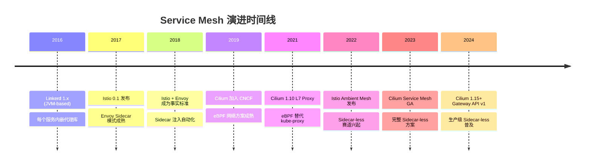

## 1.2 Sidecar 模式的固有问题 (Sidecar Mode Pain Points)

传统 Sidecar 模式在大规模生产环境中暴露出以下核心问题：

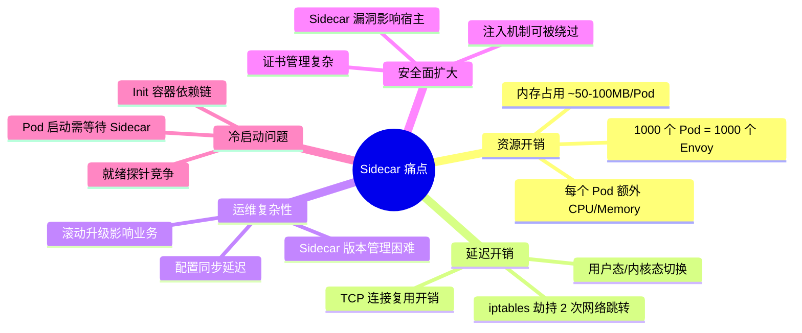

## 资源消耗量化对比

| 规模 | Sidecar 模式内存消耗 | Sidecar-less 内存消耗 | 节省比例 |
|------|---------------------|----------------------|---------|
| 100 Pod | ~5-10 GB | ~200 MB | ~95% |
| 1000 Pod | ~50-100 GB | ~500 MB | ~99% |
| 10000 Pod | ~500-1000 GB | ~2 GB | ~99.8% |

> **注意**: 上述数据基于 Envoy 默认配置，实际消耗因负载和配置不同而有所差异。

## 1.3 Sidecar-less 架构的核心思想 (Core Philosophy)

Sidecar-less 架构通过将网络代理功能下沉至内核层（eBPF）或节点层（Node-level Proxy），彻底消除每 Pod 的代理开销：

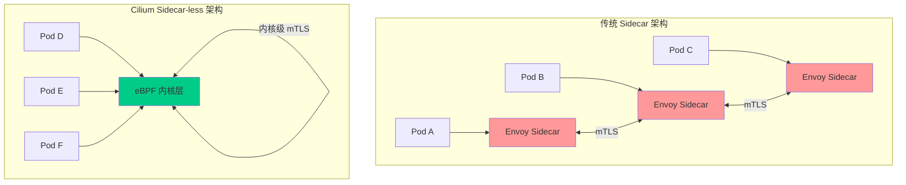

---

<!-- chunk: 2. Cilium Service Mesh 架构概述 -->## 2. Cilium Service Mesh 架构概述

## 2.1 整体架构图 (Overall Architecture)

```mermaid
graph TB
    subgraph "Kubernetes Cluster"
        subgraph "Control Plane"
            CP[Cilium Operator]
            HM[Hubble Server]
            SPIRE[SPIRE Server]
            GW[Gateway Controller]
        end
        
        subgraph "Node 1"
            CA[Cilium Agent]
            subgraph "eBPF 数据平面"
                XDP[XDP Hook]
                TC[TC Hook]
                SK[Socket Hook]
                LWT[LWT Hook]
            end
            subgraph "Pod A"
                APP_A[Application A]
            end
            subgraph "Pod B"
                APP_B[Application B]
            end
            CA --> XDP
            CA --> TC
            CA --> SK
            CA --> LWT
        end
        
        subgraph "Node 2"
            CA2[Cilium Agent]
            subgraph "eBPF 数据平面 2"
                XDP2[XDP Hook]
                TC2[TC Hook]
            end
            subgraph "Pod C"
                APP_C[Application C]
            end
            CA2 --> XDP2
            CA2 --> TC2
        end
        
        CP -->|配置分发| CA
        CP -->|配置分发| CA2
        HM -->|流量观测| CA
        HM -->|流量观测| CA2
        SPIRE -->|证书颁发| CA
        SPIRE -->|证书颁发| CA2
    end
    
    USER[外部用户] --> GW
    GW --> APP_A
    
    style CA fill:#00cc88
    style CA2 fill:#00cc88
    style eBPF 数据平面 fill:#e8f5e9
    style eBPF 数据平面 2 fill:#e8f5e9
```

## 2.2 Cilium Agent 核心组件 (Core Components)

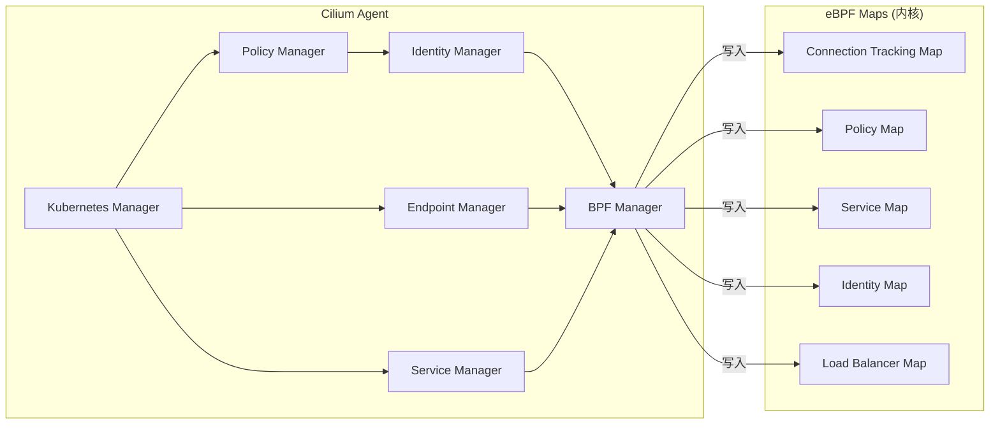

## 2.3 部署模式对比 (Deployment Modes)

Cilium Service Mesh 支持三种部署模式，适应不同场景需求：

| 模式 | 描述 | mTLS | L7 策略 | 延迟影响 | 适用场景 |
|------|------|------|---------|---------|---------|
| **纯 eBPF 模式** | 所有功能由 eBPF 实现 | TLS 终止在内核 | 受限 | 最低 | 高性能场景 |
| **Per-node Proxy 模式** | 每节点一个 Envoy | 完整 mTLS | 完整 | 中等 | 需要完整 L7 |
| **混合模式** | eBPF + 按需 Sidecar | 完整 mTLS | 完整 | 动态 | 迁移期过渡 |

## 2.4 快速部署 (Quick Installation)

```yaml
# cilium-values.yaml - Cilium Service Mesh 启用配置
kubeProxyReplacement: "true"

# 启用 Service Mesh 功能
serviceMonitor:
  enabled: true

# 启用 Hubble 可观测性
hubble:
  enabled: true
  relay:
    enabled: true
  ui:
    enabled: true
  metrics:
    enabled:
      - dns
      - drop
      - tcp
      - flow
      - icmp
      - http

# 启用 Ingress Controller
ingressController:
  enabled: true
  default: true
  loadbalancerMode: dedicated

# 启用 Gateway API
gatewayAPI:
  enabled: true

# 启用 mTLS
authentication:
  mutual:
    spire:
      enabled: true
      install:
        enabled: true
        namespace: cilium-spire
        server:
          dataStorage:
            enabled: true
            size: 1Gi

# L7 代理配置
envoy:
  enabled: true
  securityContext:
    privileged: false

# 加密配置
encryption:
  enabled: true
  type: wireguard

# 带宽管理
bandwidthManager:
  enabled: true
  bbr: true
```

> ⚠️ **🟡 中危变更** — 变更集群资源状态，建议先 --dry-run 或 diff 确认
> - `helm upgrade/install`：部署/升级 release

``` bash
# 🟡 中风险：会修改集群/资源状态，执行前请确认目标、影响范围与授权
# 使用 Helm 部署 Cilium Service Mesh
helm repo add cilium https://helm.cilium.io/
helm repo update

# 安装 Cilium（启用 Service Mesh 功能）
helm install cilium cilium/cilium \
  --version 1.15.0 \
  --namespace kube-system \
  --values cilium-values.yaml

# 验证安装状态
cilium status --wait
cilium connectivity test

# 启用 Hubble CLI
cilium hubble enable
hubble observe --follow
```
---

<!-- chunk: 3. eBPF 如何替代 Sidecar Proxy -->## 3. eBPF 如何替代 Sidecar Proxy

## 3.1 eBPF Hook 点与网络处理流程 (eBPF Hook Points)

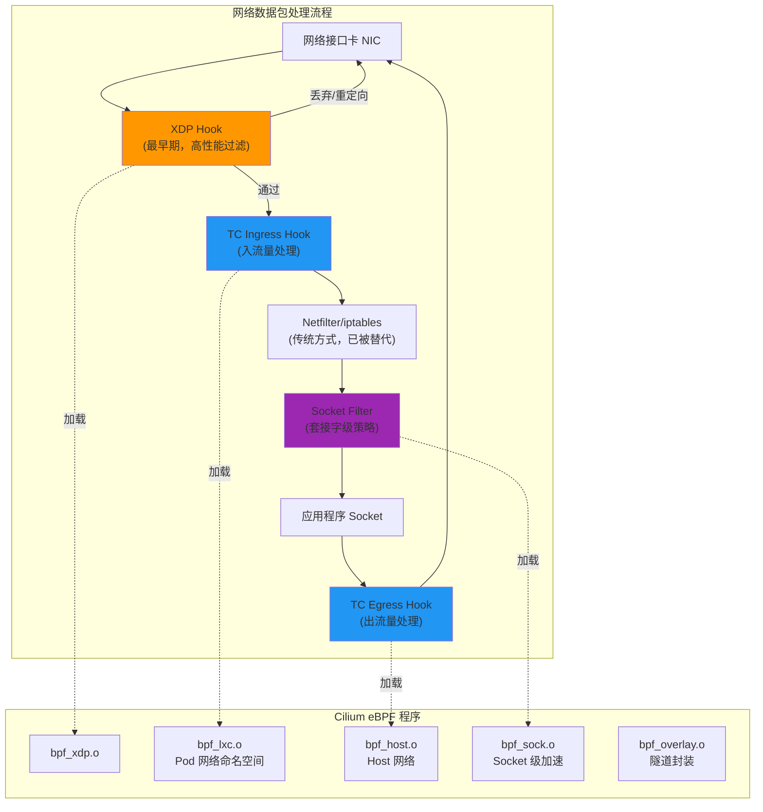

## 3.2 eBPF 实现 L4 负载均衡 (L4 Load Balancing via eBPF)

Cilium 通过 eBPF Socket 级别的重定向实现零开销的服务负载均衡，完全绕过 iptables：

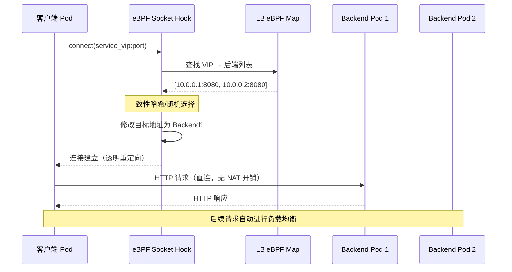

## 3.3 eBPF 实现 L7 流量感知 (L7 Traffic Awareness)

对于需要 L7 感知的场景，Cilium 使用 Per-node Envoy 而非 Per-pod Sidecar：

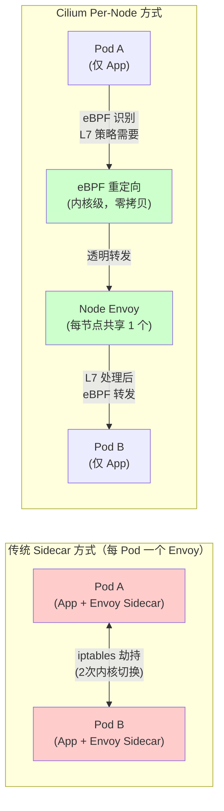

## 3.4 Cilium Network Policy 与 eBPF 映射关系

```yaml
# CiliumNetworkPolicy - L7 HTTP 策略示例
apiVersion: "cilium.io/v2"
kind: CiliumNetworkPolicy
metadata:
  name: "l7-http-policy"
  namespace: production
spec:
  endpointSelector:
    matchLabels:
      app: backend-api
  ingress:
  - fromEndpoints:
    - matchLabels:
        app: frontend
    toPorts:
    - ports:
      - port: "8080"
        protocol: TCP
      rules:
        http:
        - method: "GET"
          path: "/api/v1/.*"
          headers:
          - "X-Api-Version: v1"
        - method: "POST"
          path: "/api/v1/users"
  egress:
  - toFQDNs:
    - matchPattern: "*.internal.company.com"
    toPorts:
    - ports:
      - port: "443"
        protocol: TCP
```

## 3.5 eBPF Map 数据结构 (eBPF Map Data Structures)

eBPF 程序通过高效的内核数据结构实现网络策略：

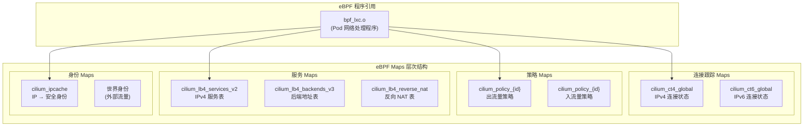

---

<!-- chunk: 4. mTLS 与身份验证 (SPIFFE/SPIRE) -->## 4. mTLS 与身份验证 (SPIFFE/SPIRE)

## 4.1 Cilium 身份模型 (Identity Model)

Cilium 使用基于标签的安全身份（Security Identity），而非传统的 IP 地址来识别工作负载：

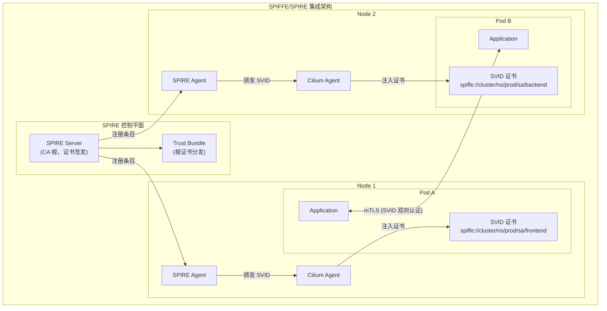

## 4.2 SPIFFE ID 与 Kubernetes 身份映射

```yaml
# SPIRE Server 注册条目配置
# 自动注册 Kubernetes 工作负载
apiVersion: spire.spiffe.io/v1alpha1
kind: ClusterSPIFFEID
metadata:
  name: cilium-workload-identity
spec:
  spiffeIDTemplate: >-
    spiffe://{{ .TrustDomain }}/ns/{{ .PodMeta.Namespace }}/
    sa/{{ .PodSpec.ServiceAccountName }}
  podSelector:
    matchLabels:
      app.kubernetes.io/managed-by: cilium
  workloadSelectorTemplates:
  - "k8s:ns:{{ .PodMeta.Namespace }}"
  - "k8s:sa:{{ .PodSpec.ServiceAccountName }}"
  - "k8s:pod-uid:{{ .PodMeta.UID }}"
```

```yaml
# Cilium 配置启用 SPIRE 集成
apiVersion: v1
kind: ConfigMap
metadata:
  name: cilium-config
  namespace: kube-system
data:
  # 启用 mTLS
  enable-wireguard: "false"
  enable-node-encryption: "false"
  
  # SPIRE 集成
  authentication-mutual-auth-listeners-port: "4244"
  
  # 身份分配模式
  identity-allocation-mode: "crd"
  
  # 证书生命周期
  certificates-directory: "/var/lib/cilium/certs"
```

## 4.3 mTLS 握手流程 (mTLS Handshake Flow)

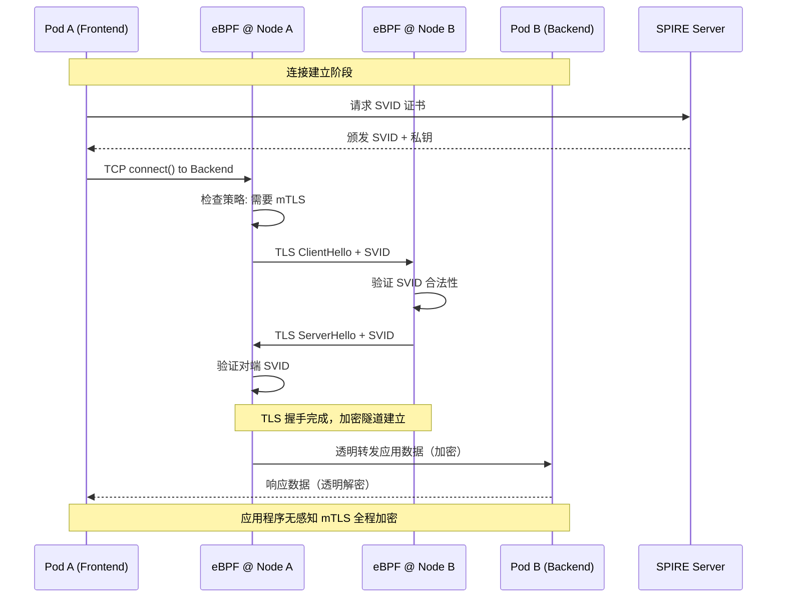

## 4.4 MutualAuthentication CRD 配置

```yaml
# 启用命名空间级别的 mTLS
apiVersion: cilium.io/v2alpha1
kind: CiliumNetworkPolicy
metadata:
  name: require-mutual-auth
  namespace: production
spec:
  endpointSelector:
    matchLabels:
      security: strict
  ingress:
  - fromEndpoints:
    - matchLabels:
        app.kubernetes.io/part-of: payment-system
    authentication:
      mode: "required"    # 必须 mTLS
  - fromEndpoints:
    - matchLabels:
        monitoring: prometheus
    authentication:
      mode: "disabled"    # Prometheus 抓取不需要 mTLS
```

```yaml
# CiliumClusterwideNetworkPolicy - 集群级 mTLS 默认策略
apiVersion: cilium.io/v2
kind: CiliumClusterwideNetworkPolicy
metadata:
  name: cluster-default-mtls
spec:
  endpointSelector:
    matchLabels:
      environment: production
  ingress:
  - fromEndpoints:
    - matchExpressions:
      - key: reserved:world
        operator: NotIn
        values:
        - "true"
    authentication:
      mode: "required"
  egress:
  - toEndpoints:
    - matchExpressions:
      - key: reserved:world
        operator: NotIn
        values:
        - "true"
    authentication:
      mode: "required"
```

---

<!-- chunk: 5. L7 流量管理 -->## 5. L7 流量管理

## 5.1 L7 流量管理架构 (L7 Traffic Management Architecture)

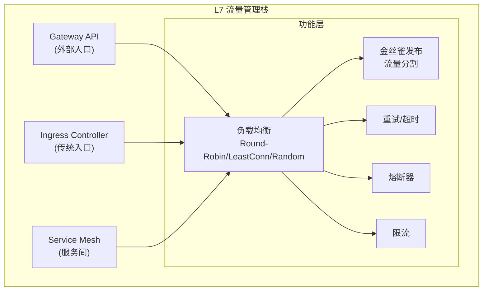

## 5.2 负载均衡策略 (Load Balancing Strategies)

## 5.2.1 Maglev 一致性哈希

Cilium 默认使用 Maglev 算法实现高效的一致性哈希负载均衡：

```yaml
# CiliumLoadBalancerIPPool - IP 池配置
apiVersion: "cilium.io/v2alpha1"
kind: CiliumLoadBalancerIPPool
metadata:
  name: production-pool
spec:
  cidrs:
  - cidr: "192.168.100.0/24"
  serviceSelector:
    matchLabels:
      environment: production
```

```yaml
# Service 注解配置负载均衡算法
apiVersion: v1
kind: Service
metadata:
  name: payment-service
  namespace: production
  annotations:
    # 负载均衡算法: maglev | random | first | source-ip
    service.cilium.io/lb-algorithm: "maglev"
    # 会话亲和性
    service.cilium.io/affinity: "client-ip"
    # Maglev 表大小（越大越均匀，内存越多）
    service.cilium.io/maglev-table-size: "16381"
    # 健康检查
    service.cilium.io/health-check-node-port: "10256"
spec:
  selector:
    app: payment
  ports:
  - port: 443
    targetPort: 8443
  type: LoadBalancer
  sessionAffinity: ClientIP
  sessionAffinityConfig:
    clientIP:
      timeoutSeconds: 3600
```

## 5.2.2 DSR（Direct Server Return）模式

```yaml
# 启用 DSR 减少返回流量经过 LB 节点
# cilium-config ConfigMap
data:
  # 启用 DSR 模式（仅支持 NodePort/LoadBalancer）
  kube-proxy-replacement-healthz-bind-address: "0.0.0.0:10256"
  node-port-mode: "dsr"           # dsr | snat
  node-port-algorithm: "maglev"  # 配合 Maglev 使用
  node-port-acceleration: "native" # 使用 XDP 加速
```

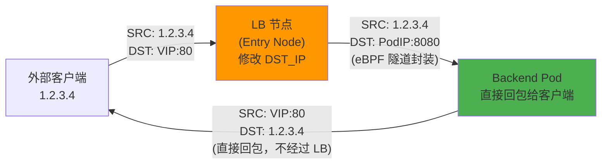

## 5.3 金丝雀发布与流量分割 (Canary Release & Traffic Splitting)

```yaml
# HTTPRoute 金丝雀发布 - 基于权重的流量分割
apiVersion: gateway.networking.k8s.io/v1
kind: HTTPRoute
metadata:
  name: product-service-canary
  namespace: production
spec:
  parentRefs:
  - name: prod-gateway
    namespace: ingress
  hostnames:
  - "api.example.com"
  rules:
  - matches:
    - path:
        type: PathPrefix
        value: /api/products
    backendRefs:
    # 稳定版本：90% 流量
    - name: product-service-stable
      port: 8080
      weight: 90
    # 金丝雀版本：10% 流量
    - name: product-service-canary
      port: 8080
      weight: 10
```

```yaml
# HTTPRoute 基于 Header 的金丝雀路由
apiVersion: gateway.networking.k8s.io/v1
kind: HTTPRoute
metadata:
  name: header-based-canary
  namespace: production
spec:
  parentRefs:
  - name: prod-gateway
  hostnames:
  - "api.example.com"
  rules:
  # 规则1: 特定用户路由到金丝雀版本
  - matches:
    - headers:
      - name: "X-Canary-User"
        value: "true"
    - headers:
      - name: "X-User-Group"
        value: "beta-testers"
    backendRefs:
    - name: product-service-canary
      port: 8080
      weight: 100
  # 规则2: 其余用户路由到稳定版本
  - matches:
    - path:
        type: PathPrefix
        value: /api/products
    backendRefs:
    - name: product-service-stable
      port: 8080
      weight: 100
```

```yaml
# CiliumEnvoyConfig - 高级流量分割（使用 Envoy xDS）
apiVersion: cilium.io/v2alpha1
kind: CiliumEnvoyConfig
metadata:
  name: advanced-traffic-split
  namespace: production
spec:
  services:
  - name: product-service
    namespace: production
  resources:
  - "@type": type.googleapis.com/envoy.config.route.v3.RouteConfiguration
    name: product-route-config
    virtual_hosts:
    - name: product-service
      domains:
      - product-service.production.svc.cluster.local
      routes:
      - matchers:
        - prefix="/"
        - headers=""
        - - name="content-type"
        - string_match=""
        - exact="application/json"
        - route=""
        - weighted_clusters=""
        - clusters=""
        - - name="product-stable"
        - weight="95"
        - - name="product-canary"
        - weight="5"
        - retry_policy=""
        - retry_on="5xx,connect-failure"
        - num_retries="3"
```

## 5.4 重试、超时与熔断 (Retry, Timeout & Circuit Breaking)

## 5.4.1 重试策略

```yaml
# HTTPRoute 重试配置
apiVersion: gateway.networking.k8s.io/v1
kind: HTTPRoute
metadata:
  name: api-with-retry
  namespace: production
spec:
  parentRefs:
  - name: prod-gateway
  rules:
  - matches:
    - path:
        type: PathPrefix
        value: /api
    backendRefs:
    - name: api-service
      port: 8080
    # Cilium 通过 filter 实现重试
    filters:
    - type: ExtensionRef
      extensionRef:
        group: cilium.io
        kind: RetryPolicy
        name: api-retry-policy
---
# RetryPolicy 配置（Cilium 扩展）
apiVersion: cilium.io/v1alpha1
kind: RetryPolicy
metadata:
  name: api-retry-policy
  namespace: production
spec:
  retryOn:
  - "5xx"
  - "connect-failure"
  - "retriable-4xx"
  numRetries: 3
  perTryTimeout: "5s"
  retryHostPredicate:
  - name: envoy.retry_host_predicates.previous_hosts
  hostSelectionRetryMaxAttempts: 5
  retriableStatusCodes:
  - 503
  - 504
```

## 5.4.2 超时配置

```yaml
# HTTPRoute 超时配置
apiVersion: gateway.networking.k8s.io/v1
kind: HTTPRoute
metadata:
  name: api-with-timeout
  namespace: production
spec:
  parentRefs:
  - name: prod-gateway
  rules:
  - matches:
    - path:
        type: PathPrefix
        value: /api/slow-endpoint
    backendRefs:
    - name: slow-service
      port: 8080
    timeouts:
      # 整个请求超时（包含重试）
      request: "30s"
      # 后端响应超时（单次尝试）
      backendRequest: "10s"
```

## 5.4.3 熔断器配置

```yaml
# CiliumEnvoyConfig - Envoy 熔断器配置
apiVersion: cilium.io/v2alpha1
kind: CiliumEnvoyConfig
metadata:
  name: circuit-breaker-config
  namespace: production
spec:
  services:
  - name: external-payment-api
    namespace: production
  resources:
  - "@type": type.googleapis.com/envoy.config.cluster.v3.Cluster
    name: external-payment-api
    connect_timeout: "5s"
    # 熔断器配置
    circuit_breakers:
      thresholds:
      - priority: DEFAULT
        max_connections: 1000        # 最大连接数
        max_pending_requests: 1000  # 最大排队请求
        max_requests: 1000          # 最大并发请求
        max_retries: 10             # 最大重试次数
        track_remaining: true
      - priority: HIGH
        max_connections: 2000
        max_requests: 2000
    # 异常检测（自动熔断）
    outlier_detection:
      consecutive_5xx: 5            # 连续 5xx 错误触发熔断
      interval: "10s"
      base_ejection_time: "30s"     # 熔断持续时间
      max_ejection_percent: 50      # 最多熔断 50% 的后端
      success_rate_minimum_hosts: 3
      success_rate_request_volume: 100
      success_rate_stdev_factor: 1900
```

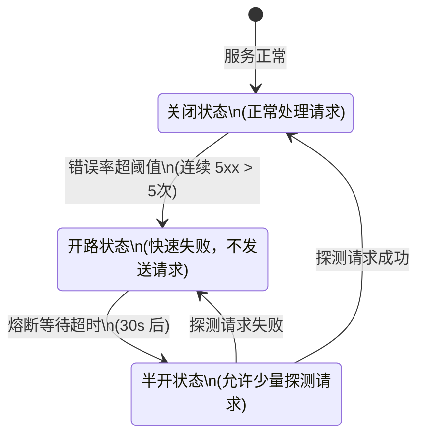

---

<!-- chunk: 6. Gateway API 集成 -->## 6. Gateway API 集成

## 6.1 Cilium Gateway API 架构 (Gateway API Architecture)

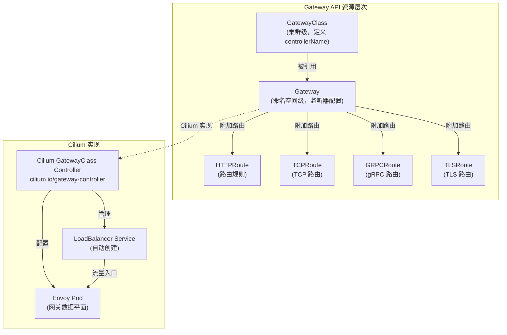

## 6.2 GatewayClass 与 Gateway 配置

```yaml
# GatewayClass - 定义 Cilium 作为 Gateway 控制器
apiVersion: gateway.networking.k8s.io/v1
kind: GatewayClass
metadata:
  name: cilium
spec:
  controllerName: io.cilium/gateway-controller
  description: "Cilium Gateway API implementation"
  parametersRef:
    group: cilium.io
    kind: CiliumGatewayConfiguration
    name: cilium-gateway-config
    namespace: kube-system
---
# Gateway - HTTP/HTTPS 监听器
apiVersion: gateway.networking.k8s.io/v1
kind: Gateway
metadata:
  name: prod-gateway
  namespace: ingress
  annotations:
    # 请求 LoadBalancer IP
    service.beta.kubernetes.io/aws-load-balancer-type: "nlb"
    service.beta.kubernetes.io/aws-load-balancer-scheme: "internet-facing"
spec:
  gatewayClassName: cilium
  listeners:
  # HTTP 监听器（重定向到 HTTPS）
  - name: http
    protocol: HTTP
    port: 80
    allowedRoutes:
      namespaces:
        from: Selector
        selector:
          matchLabels:
            gateway-access: "allowed"
  # HTTPS 监听器
  - name: https
    protocol: HTTPS
    port: 443
    tls:
      mode: Terminate
      certificateRefs:
      - name: prod-tls-secret
        namespace: ingress
    allowedRoutes:
      namespaces:
        from: Selector
        selector:
          matchLabels:
            gateway-access: "allowed"
  # gRPC 监听器
  - name: grpc
    protocol: HTTPS
    port: 8443
    tls:
      mode: Terminate
      certificateRefs:
      - name: grpc-tls-secret
```

## 6.3 高级 HTTPRoute 配置

```yaml
# HTTPRoute - 完整功能示例
apiVersion: gateway.networking.k8s.io/v1
kind: HTTPRoute
metadata:
  name: comprehensive-route
  namespace: production
spec:
  parentRefs:
  - name: prod-gateway
    namespace: ingress
    sectionName: https  # 指定具体监听器
  hostnames:
  - "api.example.com"
  - "api-v2.example.com"
  rules:
  # 规则1: 路径重写 + 请求头注入
  - name: api-v1-rewrite
    matches:
    - path:
        type: PathPrefix
        value: /v1/
    filters:
    - type: URLRewrite
      urlRewrite:
        hostname: api-internal.production.svc.cluster.local
        path:
          type: ReplacePrefixMatch
          replacePrefixMatch: /api/
    - type: RequestHeaderModifier
      requestHeaderModifier:
        add:
        - name: X-Gateway-Version
          value: "cilium-1.15"
        - name: X-Request-ID
          value: "$(request.id)"
        remove:
        - X-Internal-Token
    backendRefs:
    - name: api-service-v1
      port: 8080
  
  # 规则2: 响应头修改
  - name: api-v2-response-header
    matches:
    - path:
        type: PathPrefix
        value: /v2/
    filters:
    - type: ResponseHeaderModifier
      responseHeaderModifier:
        add:
        - name: X-API-Version
          value: "v2"
        - name: Strict-Transport-Security
          value: "max-age=31536000; includeSubDomains"
    backendRefs:
    - name: api-service-v2
      port: 8080
  
  # 规则3: 请求镜像（流量复制）
  - name: traffic-mirror
    matches:
    - path:
        type: PathPrefix
        value: /api/orders
    filters:
    - type: RequestMirror
      requestMirror:
        backendRef:
          name: order-service-shadow
          port: 8080
    backendRefs:
    - name: order-service-prod
      port: 8080
```

## 6.4 TLSRoute 与 TCPRoute

```yaml
# TLSRoute - TLS 透传（SNI 路由）
apiVersion: gateway.networking.k8s.io/v1alpha2
kind: TLSRoute
metadata:
  name: database-tls-route
  namespace: production
spec:
  parentRefs:
  - name: prod-gateway
    namespace: ingress
    sectionName: tls-passthrough
  rules:
  - backendRefs:
    - name: postgres-service
      port: 5432
---
# TCPRoute - 纯 TCP 代理
apiVersion: gateway.networking.k8s.io/v1alpha2
kind: TCPRoute
metadata:
  name: redis-tcp-route
  namespace: production
spec:
  parentRefs:
  - name: internal-gateway
    namespace: ingress
  rules:
  - backendRefs:
    - name: redis-service
      port: 6379
      weight: 100
```

---

<!-- chunk: 7. Ingress Controller 功能 -->## 7. Ingress Controller 功能

## 7.1 Cilium Ingress 架构 (Ingress Architecture)

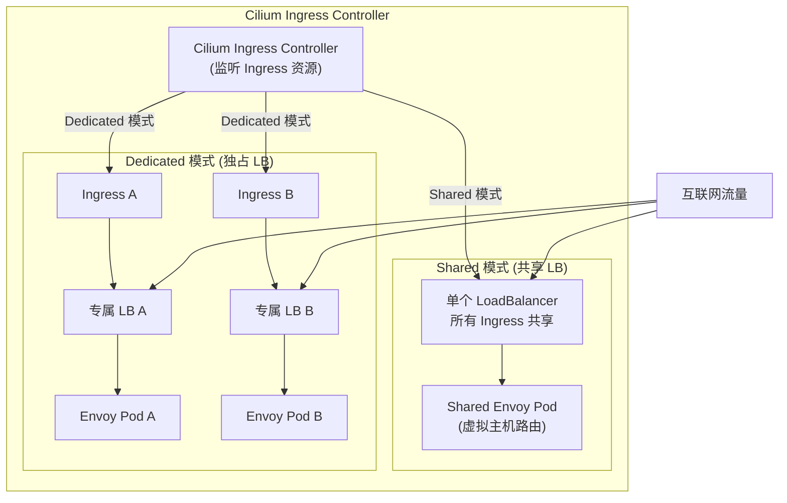

## 7.2 Ingress 资源配置

```yaml
# Ingress - 基础 HTTP/HTTPS 路由
apiVersion: networking.k8s.io/v1
kind: Ingress
metadata:
  name: web-ingress
  namespace: production
  annotations:
    # 指定 Cilium 作为 Ingress Controller
    kubernetes.io/ingress.class: "cilium"
    # 或使用 ingressClassName
    
    # 强制 HTTPS 重定向
    ingress.cilium.io/force-https: "true"
    
    # 负载均衡模式
    ingress.cilium.io/loadbalancer-mode: "dedicated"
    
    # 服务类型
    ingress.cilium.io/service-type: "LoadBalancer"
    
    # 超时配置
    ingress.cilium.io/idle-timeout-seconds: "300"
    ingress.cilium.io/request-timeout-seconds: "60"
    
    # 请求体大小限制
    ingress.cilium.io/max-request-body-size: "10485760"  # 10MB
spec:
  ingressClassName: cilium
  tls:
  - hosts:
    - www.example.com
    - api.example.com
    secretName: example-tls
  rules:
  - host: www.example.com
    http:
      paths:
      - path: /
        pathType: Prefix
        backend:
          service:
            name: frontend-service
            port:
              number: 80
  - host: api.example.com
    http:
      paths:
      - path: /v1
        pathType: Prefix
        backend:
          service:
            name: api-service-v1
            port:
              number: 8080
      - path: /v2
        pathType: Prefix
        backend:
          service:
            name: api-service-v2
            port:
              number: 8080
```

```yaml
# Ingress - gRPC 支持
apiVersion: networking.k8s.io/v1
kind: Ingress
metadata:
  name: grpc-ingress
  namespace: production
  annotations:
    kubernetes.io/ingress.class: "cilium"
    ingress.cilium.io/backend-protocol: "GRPC"
    ingress.cilium.io/grpc-web: "true"  # 启用 gRPC-Web 转换
spec:
  ingressClassName: cilium
  tls:
  - hosts:
    - grpc.example.com
    secretName: grpc-tls
  rules:
  - host: grpc.example.com
    http:
      paths:
      - path: /
        pathType: Prefix
        backend:
          service:
            name: grpc-service
            port:
              number: 50051
```

---

<!-- chunk: 8. 与 Istio Ambient Mesh 对比 -->## 8. 与 Istio Ambient Mesh 对比

## 8.1 架构对比图 (Architecture Comparison)

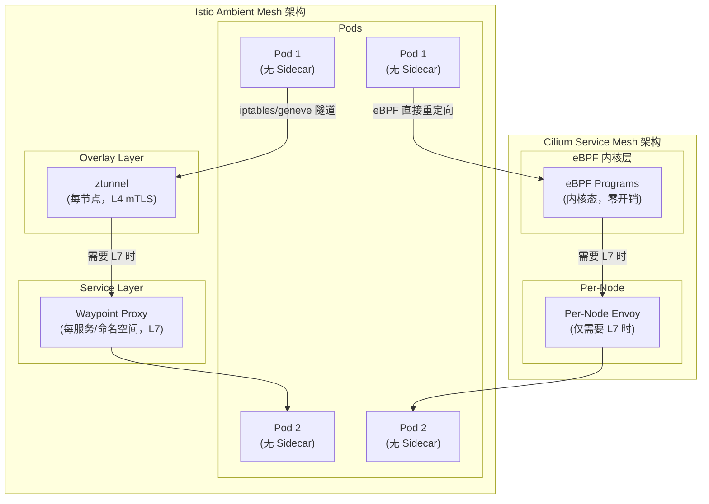

## 8.2 详细特性对比矩阵

| 特性 | Cilium Service Mesh | Istio Ambient Mesh | Istio Sidecar |
|------|--------------------|--------------------|---------------|
| **数据平面技术** | eBPF + Per-node Envoy | ztunnel + Waypoint Proxy | Per-pod Envoy |
| **L4 mTLS** | eBPF/WireGuard | ztunnel (Rust) | Envoy Sidecar |
| **L7 能力** | Per-node Envoy | Waypoint Proxy | Envoy Sidecar |
| **资源开销** | 极低（eBPF 内核态） | 低（ztunnel ~50MB/节点） | 高（每 Pod 100MB+） |
| **网络延迟** | 最低（内核级） | 低（用户态，1 次跳转） | 中（2 次 iptables 跳转） |
| **CNCF 毕业状态** | 已毕业 (2023) | 已毕业 (2022) | 已毕业 (2022) |
| **Gateway API** | 完整支持 (v1) | 完整支持 | 通过 Istio API |
| **可观测性** | Hubble (eBPF) | Prometheus + Kiali | Prometheus + Kiali |
| **Kubernetes 兼容性** | 作为 CNI 运行 | 叠加在 CNI 上 | 叠加在 CNI 上 |
| **Windows 节点** | 不支持 | 不支持 | 有限支持 |
| **WireGuard 加密** | 原生支持 | 不支持 | 不支持 |
| **eBPF 要求** | 必需 (内核 4.19+) | 不需要 | 不需要 |
| **学习曲线** | 中（需要 eBPF 知识） | 中 | 高（复杂配置） |
| **社区活跃度** | 非常活跃 | 非常活跃 | 非常活跃 |

## 8.3 性能对比场景分析

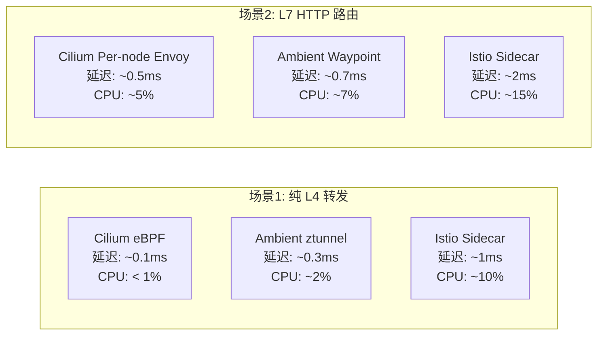

---

<!-- chunk: 9. 性能基准测试 (vs Envoy Sidecar) -->## 9. 性能基准测试 (vs Envoy Sidecar)

## 9.1 测试环境与方法论 (Test Environment & Methodology)

```
# 🟢 低风险：只读/信息收集，通常无副作用
测试集群配置:
- Kubernetes: 1.29
- 节点类型: c5.4xlarge (16 CPU, 32GB RAM)
- 节点数量: 10 个工作节点
- 网络: AWS VPC CNI 替换为 Cilium
- 测试工具: wrk2, fortio, iperf3, netperf
- 测试场景: Pod-to-Pod (同节点/跨节点), Pod-to-Service
```
## 9.2 吞吐量对比 (Throughput Comparison)

```mermaid
xychart-beta
    title "HTTP 请求吞吐量 (RPS, 越高越好)"
    x-axis ["1 并发", "10 并发", "50 并发", "100 并发", "500 并发"]
    y-axis "每秒请求数 (RPS)" 0 --> 120000
    bar [45000, 78000, 95000, 105000, 110000]
    bar [38000, 65000, 82000, 88000, 90000]
    bar [22000, 42000, 58000, 65000, 68000]
```

| 并发度 | Cilium eBPF | Cilium Per-node Envoy | Istio Sidecar | 提升比例 |
|--------|------------|----------------------|---------------|---------|
| 1 | 45,000 RPS | 40,000 RPS | 22,000 RPS | **+104%** |
| 10 | 78,000 RPS | 70,000 RPS | 42,000 RPS | **+86%** |
| 50 | 95,000 RPS | 88,000 RPS | 58,000 RPS | **+64%** |
| 100 | 105,000 RPS | 98,000 RPS | 65,000 RPS | **+62%** |
| 500 | 110,000 RPS | 102,000 RPS | 68,000 RPS | **+62%** |

## 9.3 延迟对比 (Latency Comparison)

| 百分位 | 无 Mesh (基线) | Cilium eBPF | Cilium Per-node | Istio Sidecar |
|--------|--------------|-------------|----------------|---------------|
| P50 | 0.8 ms | 1.0 ms (+25%) | 1.5 ms (+88%) | 3.2 ms (+300%) |
| P90 | 1.2 ms | 1.4 ms (+17%) | 2.1 ms (+75%) | 5.8 ms (+383%) |
| P99 | 2.5 ms | 2.8 ms (+12%) | 4.2 ms (+68%) | 12.4 ms (+396%) |
| P99.9 | 8.0 ms | 9.2 ms (+15%) | 13.5 ms (+69%) | 35.0 ms (+338%) |

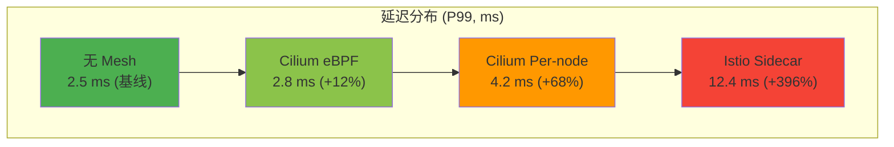

## 9.4 资源消耗对比 (Resource Consumption)

| 指标 | Cilium eBPF | Cilium Per-node Envoy | Istio Sidecar (每 Pod) |
|------|------------|----------------------|----------------------|
| **CPU (空闲)** | ~0.5 CPU/节点 | ~0.5 CPU/节点 | ~50m CPU/Pod |
| **CPU (高负载)** | ~1 CPU/节点 | ~2 CPU/节点 | ~200m CPU/Pod |
| **内存 (固定)** | ~100 MB/节点 | ~200 MB/节点 | ~100 MB/Pod |
| **启动延迟** | 无 (随 cilium-agent) | 无 | ~3-5 秒/Pod |
| **1000 Pod 集群总开销** | ~10 CPU, ~1 GB | ~20 CPU, ~2 GB | ~200 CPU, ~100 GB |

## 9.5 网络带宽测试 (Network Bandwidth)

> ⚠️ **🟡 中危变更** — 变更集群资源状态，建议先 --dry-run 或 diff 确认
> - `kubectl label/annotate`：改元数据可能影响选择器/控制器

``` bash
# 🟡 中风险：会修改集群/资源状态，执行前请确认目标、影响范围与授权
# iperf3 跨节点 TCP 带宽测试脚本
#!/bin/bash

echo "=== 测试1: 无 Cilium Service Mesh（基线）==="
kubectl run iperf-server --image=networkstatic/iperf3 -- -s
kubectl run iperf-client --image=networkstatic/iperf3 \
  -- -c iperf-server -t 30 -P 8 --json

echo "=== 测试2: Cilium eBPF 模式 ==="
# 确保 WireGuard 加密关闭（纯转发测试）
kubectl annotate node worker-1 \
  "cilium.io/nodeconfig=encrypt=false"
kubectl run iperf-client-cilium --image=networkstatic/iperf3 \
  -- -c iperf-server -t 30 -P 8 --json

echo "=== 测试3: WireGuard 加密模式 ==="
kubectl annotate node worker-1 \
  "cilium.io/nodeconfig=encrypt=wireguard"
kubectl run iperf-client-wg --image=networkstatic/iperf3 \
  -- -c iperf-server -t 30 -P 8 --json
```
| 场景 | 带宽 (Gbps) | CPU 利用率 |
|------|-----------|-----------|
| 基线（无加密） | 9.8 | 15% |
| Cilium eBPF（无加密） | 9.5 | 18% |
| Cilium WireGuard | 7.2 | 35% |
| Istio mTLS Sidecar | 5.8 | 52% |

---

<!-- chunk: 10. 迁移策略与最佳实践 -->## 10. 迁移策略与最佳实践

## 10.1 迁移路径规划 (Migration Path Planning)

```mermaid
flowchart TD
    START["现有环境评估"] --> ASSESS{评估现有方案}
    
    ASSESS -->|"使用 Istio + Envoy Sidecar"| ISTIO_PATH
    ASSESS -->|"使用其他 CNI (Flannel/Calico)"| CNI_PATH
    ASSESS -->|"无 Service Mesh"| GREENFIELD
    
    subgraph ISTIO_PATH["Istio 迁移路径"]
        I1["阶段1: 安装 Cilium 作为 CNI\n(替换 kube-proxy)"]
        I2["阶段2: 启用 Cilium 网络策略\n(与 Istio 并存)"]
        I3["阶段3: 逐步将 Ingress/Gateway 迁移到 Cilium"]
        I4["阶段4: 服务级别迁移\n(注释 Istio Sidecar Injection)"]
        I5["阶段5: 移除 Istio 控制平面"]
        I1 --> I2 --> I3 --> I4 --> I5
    end
    
    subgraph CNI_PATH["CNI 替换路径"]
        C1["阶段1: 测试集群验证 Cilium"]
        C2["阶段2: 蓝绿部署新节点池\n(运行 Cilium)"]
        C3["阶段3: 工作负载滚动迁移"]
        C4["阶段4: 旧节点池下线"]
        C1 --> C2 --> C3 --> C4
    end
    
    subgraph GREENFIELD["全新部署"]
        G1["直接部署 Cilium Service Mesh"]
        G2["配置 Gateway API"]
        G3["启用 mTLS + Hubble"]
        G1 --> G2 --> G3
    end
```

## 10.2 从 Istio 迁移的操作步骤 (Migration from Istio)

> ⚠️ **🔴 灾难性操作** — 含不可逆命令，执行前必须满足变更窗口+双人复核+事前备份+回滚方案
> - `kubectl delete namespace`：永久删除命名空间及全部资源，不可恢复
> - `helm upgrade/install`：部署/升级 release
> - `kubectl apply/create/replace`：创建/变更集群资源
> - `kubectl label/annotate`：改元数据可能影响选择器/控制器

> **🔴 高风险操作警告**
>
> 下方命令属于不可逆或高影响操作，执行前请确认：
> - 已备份关键数据与配置
> - 处于批准的变更窗口期
> - 已获得相关责任人授权
> - 已准备回滚或恢复方案
> - 目标集群、Namespace、节点/资源名称正确无误

``` bash
# 🔴 高风险：可能造成数据丢失或服务中断，执行前需备份、变更审批与回滚方案
#!/bin/bash
# Istio → Cilium Service Mesh 迁移脚本

echo "=== 阶段1: 安装 Cilium (与 Istio 共存) ==="

# 方案: 保留 Istio，在新节点上部署 Cilium
helm install cilium cilium/cilium \
  --version 1.15.0 \
  --namespace kube-system \
  --set kubeProxyReplacement=true \
  --set ingressController.enabled=true \
  --set gatewayAPI.enabled=true \
  --set hubble.enabled=true \
  --set hubble.relay.enabled=true

echo "=== 阶段2: 验证 Cilium 正常运行 ==="
cilium status --wait
cilium connectivity test --test-namespace cilium-test

echo "=== 阶段3: 迁移 Ingress 资源 ==="
# 将现有 Istio Ingress 转换为 Cilium Gateway API
kubectl get ingress -A -o yaml | \
  python3 migrate-to-gateway-api.py > gateway-routes.yaml
kubectl apply -f gateway-routes.yaml

echo "=== 阶段4: 逐命名空间迁移 ==="
NAMESPACES=("frontend" "backend" "api-gateway")
for NS in "${NAMESPACES[@]}"; do
  echo "迁移命名空间: $NS"
  
  # 禁用该命名空间的 Istio Sidecar 注入
  kubectl label namespace $NS istio-injection=disabled --overwrite
  
  # 重启 Pod 使其不再带有 Sidecar
  kubectl rollout restart deployment -n $NS
  kubectl rollout status deployment -n $NS --timeout=300s
  
  echo "命名空间 $NS 迁移完成"
  sleep 10
done

echo "=== 阶段5: 卸载 Istio ==="
istioctl uninstall --purge -y
kubectl delete namespace istio-system  # ⚠️ 不可逆：永久删除命名空间及全部资源
```
## 10.3 迁移期间的策略兼容性配置

```yaml
# 迁移期间同时支持 Istio 和 Cilium 策略
# CiliumNetworkPolicy - 允许 Istio 控制平面通信
apiVersion: cilium.io/v2
kind: CiliumNetworkPolicy
metadata:
  name: allow-istio-controlplane
  namespace: default
spec:
  endpointSelector: {}  # 适用所有 Pod
  ingress:
  # 允许 Istio Pilot (istiod) 通信
  - fromEndpoints:
    - matchLabels:
        app: istiod
        namespace: istio-system
    toPorts:
    - ports:
      - port: "15012"  # xDS
      - port: "15017"  # Webhook
        protocol: TCP
  # 允许 Envoy Sidecar 之间通信（迁移期间）
  - fromEndpoints:
    - matchLabels:
        security.istio.io/tlsMode: "istio"
    toPorts:
    - ports:
      - port: "15001"  # Envoy Outbound
      - port: "15006"  # Envoy Inbound
        protocol: TCP
```

## 10.4 生产环境最佳实践 (Production Best Practices)

## 10.4.1 资源配置建议

```yaml
# cilium-agent DaemonSet 资源配置
# 生产环境推荐配置
apiVersion: v1
kind: ConfigMap
metadata:
  name: cilium-production-tuning
  namespace: kube-system
data:
  # 连接跟踪表大小（根据 Pod 密度调整）
  # 公式: max(65536, 8*{max_pods})
  bpf-ct-global-tcp-max: "524288"
  bpf-ct-global-any-max: "262144"
  
  # NAT 表大小
  bpf-nat-global-max: "524288"
  
  # 策略 Map 大小（每 Pod）
  bpf-policy-map-max: "65536"
  
  # LB Map 大小
  bpf-lb-map-max: "65536"
  
  # 内核内存锁定限制
  bpf-map-dynamic-size-ratio: "0.0025"
  
  # Hubble 缓冲区大小（可观测性）
  hubble-event-buffer-capacity: "65535"
  hubble-event-queue-size: "50"
  
  # Envoy 配置
  envoy-log-level: "warning"
  
  # 监控采样率（降低高负载下的 CPU 开销）
  monitor-aggregation: "maximum"
  monitor-aggregation-interval: "5s"
  monitor-aggregation-flags: "all"
```

## 10.4.2 节点内核参数调优

> ⚠️ **🟠 高危操作** — 影响业务流量或节点状态，需变更工单+影响评估+计划回滚
> - `sysctl -w`：实时修改内核参数，全局生效

```bash
#!/bin/bash
# 生产环境节点内核参数调优

# 增加网络连接跟踪表大小
sysctl -w net.netfilter.nf_conntrack_max=2097152
sysctl -w net.netfilter.nf_conntrack_buckets=524288

# 增加套接字缓冲区
sysctl -w net.core.rmem_max=134217728
sysctl -w net.core.wmem_max=134217728
sysctl -w net.core.netdev_max_backlog=10000

# TCP 优化
sysctl -w net.ipv4.tcp_congestion_control=bbr
sysctl -w net.core.default_qdisc=fq
sysctl -w net.ipv4.tcp_fastopen=3
sysctl -w net.ipv4.ip_local_port_range="1024 65535"

# eBPF 内存解锁
ulimit -l unlimited

# 验证 eBPF JIT
sysctl -w net.core.bpf_jit_enable=1
sysctl -w net.core.bpf_jit_harden=1

echo "内核参数配置完成"
```

## 10.4.3 监控与告警配置

```yaml
# Cilium ServiceMonitor - Prometheus 监控配置
apiVersion: monitoring.coreos.com/v1
kind: ServiceMonitor
metadata:
  name: cilium-agent-monitor
  namespace: monitoring
spec:
  selector:
    matchLabels:
      k8s-app: cilium
  namespaceSelector:
    matchNames:
    - kube-system
  endpoints:
  - port: prometheus
    interval: 30s
    path: /metrics
    scheme: http
---
# PrometheusRule - Cilium 告警规则
apiVersion: monitoring.coreos.com/v1
kind: PrometheusRule
metadata:
  name: cilium-alerts
  namespace: monitoring
spec:
  groups:
  - name: cilium.rules
    rules:
    # eBPF Map 压力告警
    - alert: CiliumBPFMapPressureHigh
      expr: |
        cilium_bpf_map_pressure{map_name=~"cilium_.*"} > 0.8
      for: 5m
      labels:
        severity: warning
      annotations:
        summary: "Cilium eBPF Map 使用率超过 80%"
        description: "Map {{ $labels.map_name }} 使用率: {{ $value | humanizePercentage }}"
    
    # 策略丢弃率告警
    - alert: CiliumHighDropRate
      expr: |
        rate(cilium_drop_count_total[5m]) > 100
      for: 2m
      labels:
        severity: critical
      annotations:
        summary: "Cilium 高丢包率"
        description: "丢包率: {{ $value }} pkt/s, 原因: {{ $labels.reason }}"
    
    # Envoy 错误率告警
    - alert: CiliumEnvoyHighErrorRate
      expr: |
        rate(envoy_cluster_upstream_rq_5xx[5m]) / 
        rate(envoy_cluster_upstream_rq_total[5m]) > 0.05
      for: 3m
      labels:
        severity: warning
      annotations:
        summary: "Cilium Envoy 错误率超过 5%"
```

## 10.5 故障排查指南 (Troubleshooting Guide)

> ⚠️ **🟡 中危变更** — 变更集群资源状态，建议先 --dry-run 或 diff 确认
> - `kubectl exec`：进入容器执行命令，可能改变容器状态

``` bash
# 🟡 中风险：会修改集群/资源状态，执行前请确认目标、影响范围与授权
#!/bin/bash
# Cilium Service Mesh 故障排查命令集

echo "=== 1. 检查 Cilium Agent 状态 ==="
cilium status --verbose
kubectl get pods -n kube-system -l k8s-app=cilium -o wide

echo "=== 2. 检查 eBPF 程序加载状态 ==="
cilium bpf list
cilium bpf ct list global | head -20

echo "=== 3. 检查网络策略 ==="
cilium policy get
cilium endpoint list

echo "=== 4. 流量追踪（Hubble）==="
# 观察特定 Pod 的流量
hubble observe --pod frontend/pod-xxx --follow --type=drop
hubble observe --namespace production --protocol http --verdict DROPPED

echo "=== 5. 服务负载均衡检查 ==="
cilium service list
cilium bpf lb list

echo "=== 6. Envoy 状态检查 ==="
kubectl exec -n kube-system cilium-xxx -- \
  curl -s localhost:9901/config_dump | jq '.configs[].dynamic_route_configs'

echo "=== 7. 连接跟踪检查 ==="
cilium bpf ct list global | grep "10.0.0.1" | head -20

echo "=== 8. eBPF Map 使用率 ==="
cilium bpf map list
for map in $(cilium bpf map list -o json | jq -r '.[].name'); do
  echo "Map: $map"
  cilium bpf map get $map 2>/dev/null | wc -l
done

echo "=== 9. 节点连接性测试 ==="
cilium connectivity test --test-namespace cilium-test --test=pod-to-pod

echo "=== 10. 收集诊断信息 ==="
cilium sysdump --output-filename cilium-sysdump-$(date +%Y%m%d)
```
## 10.6 总结：选型决策树 (Decision Tree)

```mermaid
flowchart TD
    START["需要 Service Mesh?"] --> Y{是}
    Y --> PERF{性能是首要考虑?}
    
    PERF -->|"是"| CILIUM_CHECK{已使用 Cilium CNI?}
    CILIUM_CHECK -->|"是"| CILIUM_MESH["推荐: Cilium Service Mesh\n✅ 最低延迟\n✅ 最低资源\n✅ 无需额外组件"]
    CILIUM_CHECK -->|"否"| MIGRATE{愿意替换 CNI?}
    MIGRATE -->|"是"| CILIUM_MESH
    MIGRATE -->|"否"| AMBIENT["考虑: Istio Ambient Mesh\n✅ 低 Sidecar 开销\n⚠️ 需要额外组件"]
    
    PERF -->|"否"| L7_NEED{需要完整 L7 功能?}
    L7_NEED -->|"是，且团队熟悉 Istio"| ISTIO["考虑: Istio (传统模式)\n✅ 成熟生态\n✅ 丰富功能\n⚠️ 高资源开销"]
    L7_NEED -->|"是，性能也重要"| CILIUM_MESH
    L7_NEED -->|"仅需 L4"| CILIUM_EBPF["推荐: Cilium eBPF Only\n✅ 极低开销\n✅ 内核级安全"]
    
    style CILIUM_MESH fill:#4caf50,color:#fff
    style CILIUM_EBPF fill:#2196f3,color:#fff
    style AMBIENT fill:#ff9800,color:#fff
    style ISTIO fill:#9e9e9e,color:#fff
```

---

<!-- chunk: 附录 A：Cilium Service Mesh 完整配置参考 -->## 附录 A：Cilium Service Mesh 完整配置参考

```yaml
# 完整生产环境 Cilium Helm Values
# cilium-production-values.yaml
kubeProxyReplacement: "true"
k8sServiceHost: "k8s-api.internal.company.com"
k8sServicePort: "6443"

# 路由模式
routingMode: "native"
autoDirectNodeRoutes: true
ipv4NativeRoutingCIDR: "10.0.0.0/8"

# 带宽管理
bandwidthManager:
  enabled: true
  bbr: true

# 高可用 Operator
operator:
  replicas: 2
  resources:
    requests:
      cpu: 100m
      memory: 128Mi
    limits:
      cpu: 500m
      memory: 512Mi

# Hubble 可观测性
hubble:
  enabled: true
  metrics:
    enabled:
    - dns:query;ignoreAAAA
    - drop
    - tcp
    - flow
    - icmp
    - http
    serviceMonitor:
      enabled: true
  relay:
    enabled: true
    replicas: 2
    resources:
      requests:
        cpu: 100m
        memory: 64Mi
  ui:
    enabled: true
    replicas: 1

# Service Mesh 功能
ingressController:
  enabled: true
  default: true
  loadbalancerMode: shared
  enforceHttps: true

gatewayAPI:
  enabled: true
  gatewayClass:
    create: auto

# mTLS / SPIRE
authentication:
  mutual:
    spire:
      enabled: true
      install:
        enabled: true
        namespace: cilium-spire
        agent:
          serviceAccountName: spire-agent
        server:
          serviceAccountName: spire-server
          dataStorage:
            enabled: true
            size: 5Gi
            storageClass: ssd-retain

# WireGuard 节点间加密
encryption:
  enabled: true
  type: wireguard
  nodeEncryption: true

# eBPF 性能调优
bpf:
  masquerade: true
  preallocateMaps: true
  mapDynamicSizeRatio: 0.0025
  ctTcpMax: 524288
  ctAnyMax: 262144
  natMax: 524288
  lbMapMax: 65536

# Envoy 配置
envoy:
  enabled: true
  resources:
    requests:
      cpu: 100m
      memory: 128Mi
    limits:
      cpu: 2000m
      memory: 1Gi

# 监控
prometheus:
  enabled: true
  serviceMonitor:
    enabled: true
```

---

<!-- chunk: 附录 B：Cilium CLI 常用命令速查 -->## 附录 B：Cilium CLI 常用命令速查

```bash
# === Cilium 状态检查 ===
cilium status                          # 总体状态
cilium status --verbose               # 详细状态
cilium connectivity test              # 连接性测试

# === 端点管理 ===
cilium endpoint list                  # 列出所有端点
cilium endpoint get <id>             # 查看端点详情
cilium endpoint log <id>             # 端点日志

# === 网络策略 ===
cilium policy get                     # 查看所有策略
cilium policy trace --src-k8s-pod <ns>/<pod> --dst-k8s-pod <ns>/<pod>  # 策略追踪

# === 服务/负载均衡 ===
cilium service list                   # 列出所有服务
cilium bpf lb list                   # eBPF LB 表

# === Hubble 可观测性 ===
hubble observe --follow              # 实时流量观测
hubble observe --namespace <ns>     # 命名空间过滤
hubble observe --pod <ns/pod>       # Pod 过滤
hubble observe --verdict DROPPED    # 只看丢弃流量
hubble observe --protocol http      # HTTP 流量
hubble status                        # Hubble 状态

# === eBPF 调试 ===
cilium bpf map list                  # eBPF Map 列表
cilium bpf ct list global           # 连接跟踪表
cilium bpf nat list                  # NAT 表
cilium bpf tunnel list              # 隧道表

# === 诊断 ===
cilium sysdump                       # 收集诊断信息
cilium debuginfo                     # 调试信息
```

---

*文档版本: v1.0 | 最后更新: 2026-03-03 | 维护团队: Platform Engineering*

---

<!-- chunk: Obsidian 相关文档 -->## Obsidian 相关文档

- domain-35-ebpf-technology MOC
- [[网络/README.md|Domain 03: eBPF 技术体系 (eBPF Technology Stack)]]
- Domain-35 eBPF 技术 — 开源项目索引
- eBPF 架构基础与程序类型 (eBPF Architecture Fundamentals and Program T...
- eBPF Map 类型与数据结构 (eBPF Map Types and Data Structures)
- Cilium CNI 架构与部署 (Cilium CNI Architecture and Deployment)
- Cilium 网络策略 L3/L4/L7 (Cilium Network Policy L3/L4/L7)
- Tetragon 运行时安全 (Tetragon Runtime Security)
- Hubble 网络可观测性 (Hubble Network Observability)
- bcc 与 bpftrace 工具链 (bcc and bpftrace Tools)
- eBPF 性能优化实践 (eBPF Performance Optimization Practice)
- eBPF 安全应用案例 (eBPF Security Applications and Use Cases)

## See Also

- 03-cilium-cni-architecture
- 04-cilium-network-policy
- 06-tetragon-runtime-security
- 07-hubble-network-observability


<!-- risk-assessed -->
