> **生产环境安全提示**
>
> 本文档包含可直接执行的运维命令。执行前请确认：当前目标集群与 Namespace 是否正确；是否具备足够的 RBAC 权限；是否已在非生产环境验证。命令风险等级标注：🔴 高风险（可能造成数据丢失或服务中断）、🟡 中风险（会修改集群状态，但通常可回滚）、🟢 低风险/只读（信息收集，无副作用）。


# [[Cilium|Cilium]] CNI 架构与部署 (Cilium CNI Architecture and Deployment)

> **文档版本**: v1.0 | **适用版本**: Cilium 1.15/1.16 | **更新时间**: 2026-03  
> **CNCF 状态**: Graduated (2023年10月) | **许可证**: Apache 2.0

---

<!-- chunk: 目录 (Table of Contents) -->## 目录 (Table of Contents)

1. [Cilium 概述与 CNCF Graduated 地位](#1-cilium-概述与-cncf-graduated-地位)
2. [Cilium 核心组件架构](#2-cilium-核心组件架构)
3. [eBPF 数据路径详解](#3-ebpf-数据路径详解)
4. [kube-proxy 替代模式](#4-kube-proxy-替代模式)
5. [Cilium 部署方式](#5-cilium-部署方式)
6. [从传统 CNI 迁移到 Cilium](#6-从传统-cni-迁移到-cilium)
7. [多集群 Cluster Mesh 配置](#7-多集群-cluster-mesh-配置)
8. [Cilium 与 [[Kubernetes|Kubernetes]] 网络模型](#8-cilium-与-kubernetes-网络模型)
9. [故障排查与诊断](#9-故障排查与诊断)
10. [2026 最新特性](#10-2026-最新特性)

---

<!-- chunk: 1. Cilium 概述与 CNCF Graduated 地位 -->## 1. Cilium 概述与 CNCF Graduated 地位

## 1.1 什么是 Cilium (What is Cilium)

Cilium 是一个基于 **eBPF (extended Berkeley Packet Filter)** 技术构建的开源网络、安全和可观测性平台，专为云原生环境（特别是 Kubernetes）设计。它在 Linux 内核层面透明地插入安全可见性和控制逻辑，无需修改应用程序或容器配置。

**核心价值主张**:

| 特性维度 | 传统 CNI (iptables/ipvs) | Cilium (eBPF) |
|---------|--------------------------|---------------|
| 数据平面技术 | iptables / IPVS | eBPF 内核程序 |
| 策略粒度 | L3/L4 (IP/Port) | L3/L4/L7 (HTTP/gRPC/Kafka) |
| 性能开销 | O(n) 规则链遍历 | O(1) hash map 查找 |
| 可观测性 | 有限的连接跟踪 | 完整的网络流可见性 |
| kube-proxy 替代 | 不支持 | 完全替代，支持 DSR |
| 多集群 | 需要额外工具 | 原生 Cluster Mesh |
| 服务网格 | 需独立 Sidecar | 无 Sidecar 内核级方案 |

## 1.2 CNCF Graduated 历程 (CNCF Graduation Journey)

```
时间线:
2016年 ──► Cilium 项目在 GitHub 发布
2021年 ──► 加入 CNCF Sandbox
2022年 ──► 晋升 CNCF Incubating
2023年10月 ──► 正式 CNCF Graduated ✅
2024年 ──► Cilium 1.15 发布，Gateway API GA
2025年 ──► Cilium 1.16，Service Mesh Ambient 集成增强
2026年 ──► Cilium 1.17，多租户策略与 AI 工作负载优化
```

**为何获得 Graduated 状态**:
- 超过 **5000+ 生产集群**部署（包括 Adobe、Bell Canada、Google、Datadog）
- 完整的安全审计（CNCF 安全审计 2023）
- 活跃的维护者社区（50+ 核心维护者，来自 Isovalent/Cisco、Google、AWS）
- 完善的治理模型（GOVERNANCE.md，技术指导委员会）

## 1.3 Cilium 生态系统 (Cilium Ecosystem)

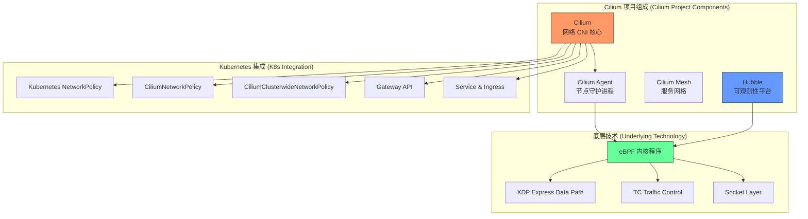

---

<!-- chunk: 2. Cilium 核心组件架构 -->## 2. Cilium 核心组件架构

## 2.1 整体架构图 (Overall Architecture)

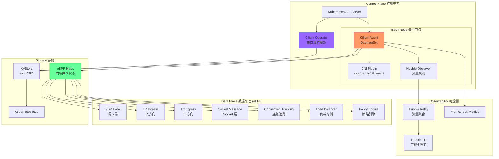

## 2.2 Cilium Agent (每节点 DaemonSet)

Cilium Agent 是整个系统的核心组件，以 DaemonSet 形式运行在每个 Kubernetes 节点上。

## 2.2.1 Agent 职责

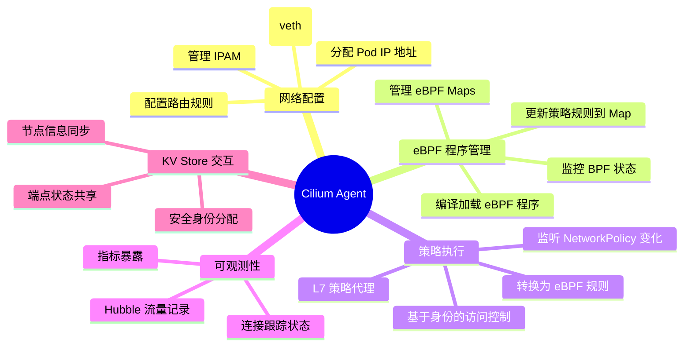

## 2.2.2 Agent DaemonSet 配置示例

```yaml
# cilium-agent-daemonset.yaml
apiVersion: apps/v1
kind: DaemonSet
metadata:
  name: cilium
  namespace: kube-system
  labels:
    k8s-app: cilium
spec:
  selector:
    matchLabels:
      k8s-app: cilium
  updateStrategy:
    type: RollingUpdate
    rollingUpdate:
      maxUnavailable: 2
  template:
    metadata:
      labels:
        k8s-app: cilium
    spec:
      # 关键：需要 hostNetwork 访问节点网络
      hostNetwork: true
      hostPID: false
      priorityClassName: system-node-critical
      serviceAccountName: cilium
      
      # 初始化容器：安装 CNI 插件二进制和配置
      initContainers:
      - name: install-cni-binaries
        image: quay.io/cilium/cilium:v1.16.0
        command: ["/install-plugin.sh"]
        securityContext:
          capabilities:
            add:
            - NET_ADMIN
            - SYS_ADMIN
            drop:
            - ALL
        volumeMounts:
        - name: cni-path
          mountPath: /host/opt/cni/bin
        - name: etc-cni-netd
          mountPath: /host/etc/cni/net.d
      
      - name: clean-cilium-state
        image: quay.io/cilium/cilium:v1.16.0
        command: ["/init-container.sh"]
        env:
        - name: CILIUM_WAIT_BPF_MOUNT
          valueFrom:
            configMapKeyRef:
              name: cilium-config
              key: wait-bpf-mount
              optional: true
        securityContext:
          privileged: true
      
      containers:
      - name: cilium-agent
        image: quay.io/cilium/cilium:v1.16.0
        imagePullPolicy: IfNotPresent
        
        # Cilium Agent 需要的关键特权
        securityContext:
          privileged: true
          # 或者使用更细粒度的 capabilities（推荐）
          # capabilities:
          #   add:
          #   - NET_ADMIN
          #   - NET_RAW
          #   - SYS_MODULE
          #   - SYS_ADMIN
          #   - SYS_RESOURCE
          #   - IPC_LOCK
        
        env:
        - name: K8S_NODE_NAME
          valueFrom:
            fieldRef:
              fieldPath: spec.nodeName
        - name: CILIUM_K8S_NAMESPACE
          valueFrom:
            fieldRef:
              fieldPath: metadata.namespace
        - name: CILIUM_CNI_CHAINED
          valueFrom:
            configMapKeyRef:
              name: cilium-config
              key: cni-chaining-mode
              optional: true
        
        # 关键挂载点
        volumeMounts:
        - name: bpf-maps
          mountPath: /sys/fs/bpf
          mountPropagation: Bidirectional
        - name: cilium-run
          mountPath: /var/run/cilium
        - name: cni-path
          mountPath: /host/opt/cni/bin
        - name: etc-cni-netd
          mountPath: /host/etc/cni/net.d
        - name: lib-modules
          mountPath: /lib/modules
          readOnly: true
        - name: xtables-lock
          mountPath: /run/xtables.lock
        - name: clustermesh-secrets
          mountPath: /var/lib/cilium/clustermesh
          readOnly: true
        
        # 健康探针
        livenessProbe:
          httpGet:
            host: "127.0.0.1"
            path: /healthz
            port: 9879
            scheme: HTTP
          periodSeconds: 30
          successThreshold: 1
          failureThreshold: 10
          timeoutSeconds: 5
        
        readinessProbe:
          httpGet:
            host: "127.0.0.1"
            path: /healthz
            port: 9879
            scheme: HTTP
          periodSeconds: 30
          successThreshold: 1
          failureThreshold: 3
          timeoutSeconds: 5
        
        resources:
          requests:
            cpu: 100m
            memory: 512Mi
          limits:
            cpu: "4"
            memory: 4Gi
      
      volumes:
      - name: bpf-maps
        hostPath:
          path: /sys/fs/bpf
          type: DirectoryOrCreate
      - name: cilium-run
        hostPath:
          path: /var/run/cilium
          type: DirectoryOrCreate
      - name: cni-path
        hostPath:
          path: /opt/cni/bin
          type: DirectoryOrCreate
      - name: etc-cni-netd
        hostPath:
          path: /etc/cni/net.d
          type: DirectoryOrCreate
      - name: lib-modules
        hostPath:
          path: /lib/modules
      - name: xtables-lock
        hostPath:
          path: /run/xtables.lock
          type: FileOrCreate
      - name: clustermesh-secrets
        secret:
          secretName: cilium-clustermesh
          optional: true
      
      tolerations:
      - operator: Exists
      
      nodeSelector:
        kubernetes.io/os: linux
```

## 2.2.3 Agent ConfigMap 关键配置

```yaml
# cilium-config.yaml
apiVersion: v1
kind: ConfigMap
metadata:
  name: cilium-config
  namespace: kube-system
data:
  # ============================================
  # 基础网络配置
  # ============================================
  
  # 隧道模式: vxlan, geneve, disabled (原生路由)
  tunnel: "vxlan"
  
  # IPAM 模式: cluster-pool, kubernetes, eni, azure
  ipam: "cluster-pool"
  
  # Pod CIDR 池
  cluster-pool-ipv4-cidr: "10.0.0.0/8"
  cluster-pool-ipv4-mask-size: "24"
  
  # 启用 IPv6
  enable-ipv6: "false"
  
  # ============================================
  # kube-proxy 替代
  # ============================================
  
  # 完全替代 kube-proxy
  kube-proxy-replacement: "true"
  
  # NodePort 范围
  node-port-range: "30000,32767"
  
  # 负载均衡算法: random, maglev
  load-balancer-algorithm: "maglev"
  
  # 启用 DSR (Direct Server Return)
  enable-node-port: "true"
  
  # ============================================
  # 安全策略
  # ============================================
  
  # 策略审计模式 (不阻断，仅记录)
  policy-audit-mode: "false"
  
  # 允许所有流量 (disable policy enforcement)
  enable-policy: "default"
  
  # ============================================
  # Hubble 可观测性
  # ============================================
  
  # 启用 Hubble
  enable-hubble: "true"
  
  # Hubble gRPC 监听地址
  hubble-listen-address: ":4244"
  
  # Hubble 流量记录大小
  hubble-flow-buffer-size: "4096"
  
  # Hubble 指标
  hubble-metrics-server: ":9965"
  hubble-metrics: >-
    dns:query;ignoreAAAA
    drop
    tcp
    flow
    icmp
    http
  
  # ============================================
  # 性能调优
  # ============================================
  
  # BPF Map 大小（影响可支持的并发连接数）
  bpf-ct-global-tcp-max: "524288"
  bpf-ct-global-any-max: "262144"
  bpf-lb-map-max: "65536"
  bpf-policy-map-max: "16384"
  
  # XDP 加速（需要网卡驱动支持）
  enable-xdp-prefilter: "false"
  
  # 启用 BBR 拥塞控制
  enable-bbr: "true"
  
  # ============================================
  # 调试
  # ============================================
  debug: "false"
  debug-verbose: ""
  monitor-aggregation: "medium"
  monitor-aggregation-interval: "5s"
```

## 2.3 Cilium Operator (集群控制器)

Cilium Operator 运行为 Deployment（通常 1-2 副本），负责**集群级**的操作，不处理节点级的细节。

## 2.3.1 Operator 核心职责

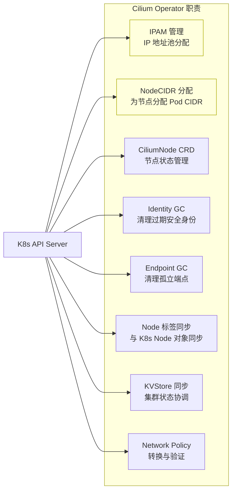

## 2.3.2 Operator Deployment

```yaml
# cilium-operator-deployment.yaml
apiVersion: apps/v1
kind: Deployment
metadata:
  name: cilium-operator
  namespace: kube-system
  labels:
    io.cilium/app: operator
spec:
  replicas: 2  # 建议生产环境 2 副本实现 HA
  selector:
    matchLabels:
      io.cilium/app: operator
  strategy:
    type: RollingUpdate
    rollingUpdate:
      maxSurge: 1
      maxUnavailable: 1
  template:
    metadata:
      labels:
        io.cilium/app: operator
    spec:
      priorityClassName: system-cluster-critical
      serviceAccountName: cilium-operator
      
      # Operator 需要调度到不同节点（HA）
      affinity:
        podAntiAffinity:
          requiredDuringSchedulingIgnoredDuringExecution:
          - labelSelector:
              matchLabels:
                io.cilium/app: operator
            topologyKey: kubernetes.io/hostname
      
      containers:
      - name: cilium-operator
        image: quay.io/cilium/operator-generic:v1.16.0
        
        args:
        - --config-dir=/tmp/cilium/config-map
        
        env:
        - name: K8S_NODE_NAME
          valueFrom:
            fieldRef:
              fieldPath: spec.nodeName
        - name: CILIUM_K8S_NAMESPACE
          valueFrom:
            fieldRef:
              fieldPath: metadata.namespace
        
        # 使用 Leader Election 确保单活
        - name: CILIUM_OPERATOR_NAMESPACE
          valueFrom:
            fieldRef:
              fieldPath: metadata.namespace
        
        livenessProbe:
          httpGet:
            host: "127.0.0.1"
            path: /healthz
            port: 9234
          initialDelaySeconds: 60
          periodSeconds: 10
          timeoutSeconds: 3
        
        volumeMounts:
        - name: cilium-config-path
          mountPath: /tmp/cilium/config-map
          readOnly: true
        
        resources:
          requests:
            cpu: 15m
            memory: 128Mi
          limits:
            cpu: "1"
            memory: 1Gi
      
      volumes:
      - name: cilium-config-path
        configMap:
          name: cilium-config
      
      tolerations:
      - key: node.kubernetes.io/not-ready
        effect: NoSchedule
      - key: node-role.kubernetes.io/control-plane
        effect: NoSchedule
```

## 2.4 CNI Plugin (容器网络接口)

CNI Plugin 是一个在 Pod 创建/删除时由容器运行时调用的**二进制程序**（`/opt/cni/bin/cilium-cni`），而非长期运行的进程。

## 2.4.1 CNI 调用流程

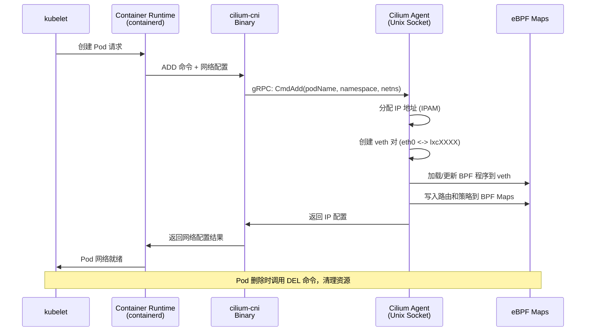

## 2.4.2 CNI 配置文件

```json
// /etc/cni/net.d/05-cilium.conflist
{
  "cniVersion": "0.3.1",
  "name": "cilium",
  "plugins": [
    {
      "type": "cilium-cni",
      "enable-debug": false,
      "log-file": "/var/run/cilium/cilium-cni.log"
    }
  ]
}
```

## 2.5 Hubble (可观测性组件)

Hubble 是 Cilium 内置的**网络可观测性**平台，基于 eBPF 在内核级别捕获所有网络事件，无需修改应用或注入 Sidecar。

## 2.5.1 Hubble 架构

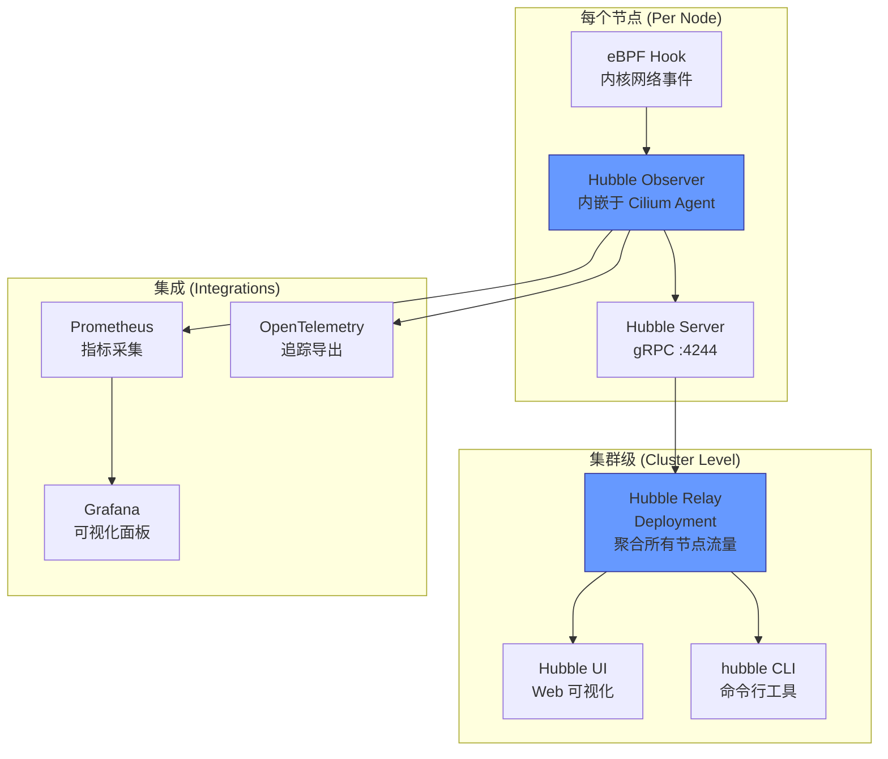

## 2.5.2 Hubble Relay 与 UI 部署

```yaml
# hubble-relay-deployment.yaml
apiVersion: apps/v1
kind: Deployment
metadata:
  name: hubble-relay
  namespace: kube-system
spec:
  replicas: 1
  selector:
    matchLabels:
      k8s-app: hubble-relay
  template:
    metadata:
      labels:
        k8s-app: hubble-relay
    spec:
      containers:
      - name: hubble-relay
        image: quay.io/cilium/hubble-relay:v1.16.0
        args:
        - relay
        - --hubble-listen-address=:4244
        - --dial-timeout=5s
        - --retry-timeout=30s
        ports:
        - name: grpc
          containerPort: 4245
        - name: prometheus
          containerPort: 9966
        volumeMounts:
        - name: hubble-tls
          mountPath: /var/lib/hubble-relay/tls
          readOnly: true
        - name: config
          mountPath: /etc/hubble-relay
          readOnly: true
        resources:
          requests:
            cpu: 10m
            memory: 64Mi
          limits:
            cpu: "1"
            memory: 1Gi
      volumes:
      - name: config
        configMap:
          name: hubble-relay-config
          items:
          - key: config.yaml
            path: config.yaml
      - name: hubble-tls
        projected:
          sources:
          - secret:
              name: hubble-relay-client-certs
              items:
              - key: tls.crt
                path: client.crt
              - key: tls.key
                path: client.key
              - key: ca.crt
                path: hubble-server-ca.crt
---
# hubble-ui-deployment.yaml
apiVersion: apps/v1
kind: Deployment
metadata:
  name: hubble-ui
  namespace: kube-system
spec:
  replicas: 1
  selector:
    matchLabels:
      k8s-app: hubble-ui
  template:
    metadata:
      labels:
        k8s-app: hubble-ui
    spec:
      containers:
      - name: frontend
        image: quay.io/cilium/hubble-ui:v0.13.0
        ports:
        - name: http
          containerPort: 8081
        resources:
          requests:
            cpu: 10m
            memory: 64Mi
          limits:
            cpu: "1"
            memory: 1Gi
      - name: backend
        image: quay.io/cilium/hubble-ui-backend:v0.13.0
        env:
        - name: EVENTS_SERVER_PORT
          value: "8090"
        - name: FLOWS_API_ADDR
          value: "hubble-relay:443"
        - name: TLS_TO_RELAY_ENABLED
          value: "true"
        ports:
        - name: grpc
          containerPort: 8090
```

---

<!-- chunk: 3. eBPF 数据路径详解 -->## 3. eBPF 数据路径详解

## 3.1 eBPF 在 Cilium 中的应用 (eBPF in Cilium)

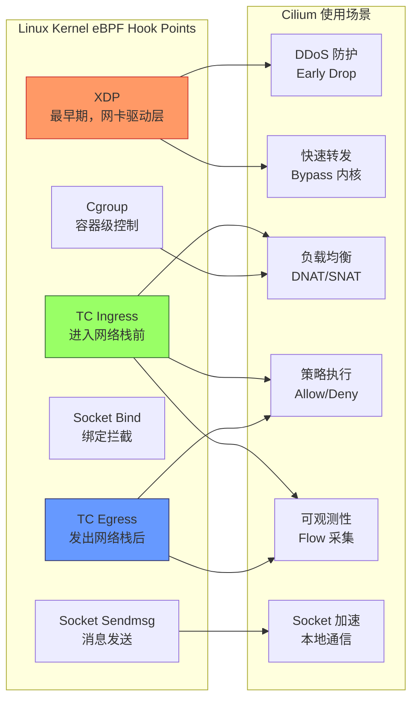

## 3.2 Pod 间通信数据路径 (Pod-to-Pod Data Path)

## 同节点通信 (Same Node Communication)

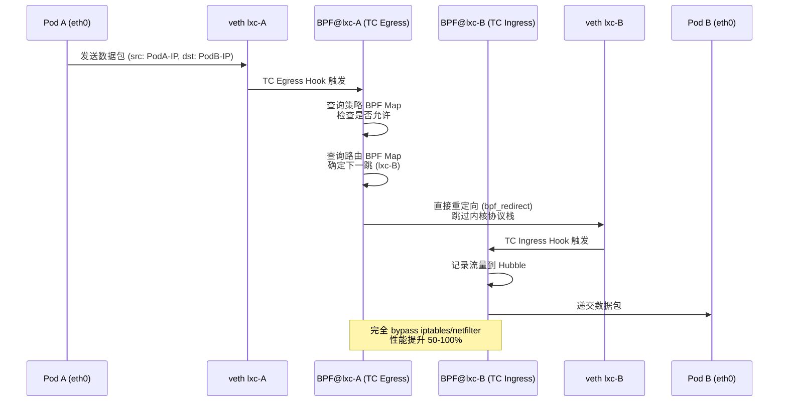

## 跨节点通信 (Cross-Node Communication) - VXLAN 模式

```
数据包路径 (VXLAN Tunnel Mode):

Pod A (Node1)
    │ eth0
    ▼
veth lxc-podA
    │ TC Egress BPF
    │ ┌─────────────────────────────┐
    │ │ 1. 策略检查 (Policy Check)   │
    │ │ 2. 查询 Node2 的隧道端点     │
    │ │ 3. VXLAN 封装               │
    │ │    外层: src=Node1-IP       │
    │ │          dst=Node2-IP       │
    │ │    VXLAN Header: VNI=1      │
    │ │    内层: src=PodA-IP        │
    │ │          dst=PodB-IP        │
    │ └─────────────────────────────┘
    │
    ▼
cilium_vxlan 接口 (UDP 8472)
    │
    ▼
Node1 物理网卡 (eth0)
    │
    ▼ (物理网络)
    │
Node2 物理网卡 (eth0)
    │
    ▼
cilium_vxlan 接口
    │ TC Ingress BPF
    │ ┌─────────────────────────────┐
    │ │ 1. VXLAN 解封装             │
    │ │ 2. 验证源节点身份           │
    │ │ 3. 查询目标 Pod (lxc-podB)  │
    │ └─────────────────────────────┘
    │
    ▼
veth lxc-podB
    │
    ▼
Pod B (Node2)
```

## 3.3 eBPF Maps 详解 (eBPF Maps Details)

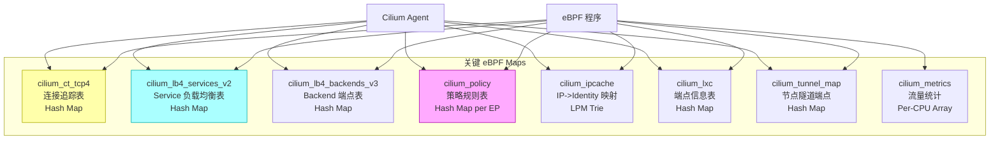

## 重要 Map 查看命令

```bash
# 查看所有 BPF Maps
cilium bpf map list

# 查看连接追踪表
cilium bpf ct list global

# 查看 IP Cache（IP 到安全身份的映射）
cilium bpf ipcache list

# 查看 Service 负载均衡表
cilium bpf lb list

# 查看策略 Map
cilium bpf policy get --all

# 查看隧道端点
cilium bpf tunnel list

# 实时监控 BPF 事件
cilium monitor --type drop
cilium monitor --type trace
```

## 3.4 安全身份 (Security Identity)

Cilium 的核心创新之一是**基于身份**的安全模型，而非传统的基于 IP 的模型。

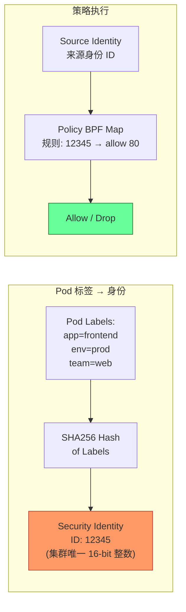

```bash
# 查看所有安全身份
cilium identity list

# 输出示例:
# ID      LABELS
# 1       reserved:host
# 2       reserved:world
# 3       reserved:unmanaged
# 4       reserved:health
# 12345   k8s:app=frontend;k8s:env=prod;k8s:io.kubernetes.pod.namespace=default

# 查看特定端点的身份
cilium endpoint list
```

---

<!-- chunk: 4. kube-proxy 替代模式 -->## 4. kube-proxy 替代模式

## 4.1 为什么替代 kube-proxy (Why Replace kube-proxy)

```
传统 kube-proxy 问题:
┌─────────────────────────────────────────────────┐
│  kube-proxy (iptables 模式)                      │
│                                                  │
│  Service 数量: 10,000                            │
│  iptables 规则数: ~100,000+                      │
│  规则更新时间: O(n) 全量更新                      │
│  CPU 开销: 高（内核频繁遍历规则链）               │
│  连接跟踪表: 容易满溢                             │
│  NAT 开销: 每个包都需要 NAT 处理                  │
└─────────────────────────────────────────────────┘

Cilium kube-proxy 替代方案:
┌─────────────────────────────────────────────────┐
│  Cilium BPF (kube-proxy replacement)            │
│                                                  │
│  Service 数量: 10,000                            │
│  BPF Map 查找: O(1) 哈希表                       │
│  规则更新时间: 微秒级增量更新                     │
│  CPU 开销: 极低（内核 BPF JIT 执行）             │
│  Direct Server Return: 支持（减少 NAT 跳数）     │
│  Maglev 一致性哈希: 无连接状态扰动               │
└─────────────────────────────────────────────────┘
```

## 4.2 DSR (Direct Server Return) 模式

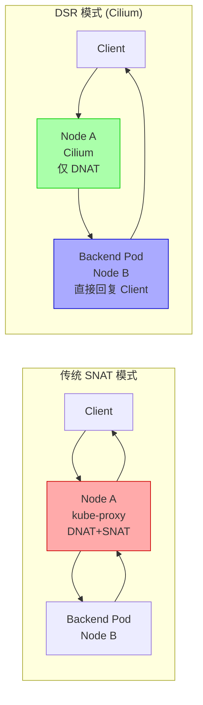

**DSR 配置**:

```yaml
# values.yaml (Helm)
loadBalancer:
  mode: dsr
  dsrDispatch: opt  # 使用 IP 选项传递原始目标

# 或在 ConfigMap 中
data:
  kube-proxy-replacement: "true"
  node-port-mode: "dsr"
  node-port-acceleration: "native"  # 需要网卡支持 XDP
```

## 4.3 Maglev 一致性哈希 (Maglev Consistent Hashing)

Google Maglev 算法确保在后端变化时，已有连接不受影响（最小化连接重新分配）。

```yaml
# 启用 Maglev 负载均衡
data:
  load-balancer-algorithm: "maglev"
  # Maglev 表大小 (质数，越大分布越均匀)
  bpf-lb-maglev-table-size: "16381"
```

## 4.4 完整 kube-proxy-free 配置

```yaml
# helm/values-kubeproxyfree.yaml
kubeProxyReplacement: "true"

# 确保 K8s API Server 地址配置正确
k8sServiceHost: "10.0.0.1"  # 你的 API Server IP
k8sServicePort: "6443"

# NodePort 配置
nodePort:
  enabled: true
  range: "30000,32767"
  acceleration: "native"  # native=XDP, best-effort=XDP后回退, disabled
  mode: "dsr"  # hybrid, snat, dsr

# 启用 HostPort 支持（替代 hostport CNI 插件）
hostPort:
  enabled: true

# ExternalIPs 支持
externalIPs:
  enabled: true

# 负载均衡
loadBalancer:
  algorithm: "maglev"
  mode: "dsr"
  
# sessionAffinity 支持
sessionAffinity: true
```

```bash
# 验证 kube-proxy replacement 状态
cilium status --verbose | grep "KubeProxyReplacement"

# 输出:
# KubeProxyReplacement: True
#   - NodePort:     Enabled (Range: 30000-32767)
#   - LoadBalancer: Enabled
#   - ExternalIPs:  Enabled
#   - HostPort:     Enabled

# 查看 Service 负载均衡详情
cilium service list
```

---

<!-- chunk: 5. Cilium 部署方式 -->## 5. Cilium 部署方式

## 5.1 使用 cilium-cli 部署 (Deploy with cilium-cli)

## 5.1.1 安装 cilium-cli

```bash
# macOS
brew install cilium-cli

# Linux (AMD64)
CILIUM_CLI_VERSION=$(curl -s https://raw.githubusercontent.com/cilium/cilium-cli/main/stable.txt)
CLI_ARCH=amd64
curl -L --fail --remote-name-all \
  https://github.com/cilium/cilium-cli/releases/download/${CILIUM_CLI_VERSION}/cilium-linux-${CLI_ARCH}.tar.gz{,.sha256sum}
sha256sum --check cilium-linux-${CLI_ARCH}.tar.gz.sha256sum
sudo tar xzvfC cilium-linux-${CLI_ARCH}.tar.gz /usr/local/bin
rm cilium-linux-${CLI_ARCH}.tar.gz{,.sha256sum}
```

## 5.1.2 快速安装

``` bash
# 🟢 低风险：只读/信息收集，通常无副作用
# 基础安装（自动检测 K8s 环境）
cilium install --version 1.16.0

# 指定 Helm values
cilium install \
  --version 1.16.0 \
  --set kubeProxyReplacement=true \
  --set hubble.relay.enabled=true \
  --set hubble.ui.enabled=true \
  --set prometheus.enabled=true \
  --set operator.prometheus.enabled=true

# 验证安装
cilium status --wait

# 运行连通性测试
cilium connectivity test
```
## 5.2 使用 Helm 部署 (Deploy with Helm)

## 5.2.1 添加 Helm Repository

``` bash
# 🟢 低风险：只读/信息收集，通常无副作用
helm repo add cilium https://helm.cilium.io/
helm repo update
```
## 5.2.2 生产级 values.yaml

```yaml
# production-values.yaml

# ============================================
# 镜像配置
# ============================================
image:
  repository: quay.io/cilium/cilium
  tag: v1.16.0
  pullPolicy: IfNotPresent

# 私有仓库（可选）
# image:
#   repository: your-registry.example.com/cilium/cilium
#   tag: v1.16.0

# ============================================
# 集群配置
# ============================================
cluster:
  name: production-cluster
  id: 1  # Cluster Mesh 时需要唯一 ID (1-255)

# ============================================
# 网络配置
# ============================================
ipam:
  mode: cluster-pool
  operator:
    clusterPoolIPv4PodCIDRList:
    - 10.0.0.0/8
    clusterPoolIPv4MaskSize: 24

# 路由模式
routingMode: tunnel  # tunnel 或 native
tunnelProtocol: vxlan  # vxlan 或 geneve

# 原生路由（BGP 环境）
# routingMode: native
# autoDirectNodeRoutes: true
# bgpControlPlane:
#   enabled: true

# ============================================
# kube-proxy 替代
# ============================================
kubeProxyReplacement: true
k8sServiceHost: "10.0.0.1"  # API Server VIP
k8sServicePort: "6443"

nodePort:
  enabled: true
  acceleration: best-effort

loadBalancer:
  algorithm: maglev
  mode: hybrid  # 非 DSR 兼容环境使用 hybrid

# ============================================
# 资源限制
# ============================================
resources:
  requests:
    cpu: 100m
    memory: 512Mi
  limits:
    cpu: "4"
    memory: 4Gi

operator:
  resources:
    requests:
      cpu: 15m
      memory: 128Mi
    limits:
      cpu: "1"
      memory: 1Gi
  
  replicas: 2  # HA

  affinity:
    podAntiAffinity:
      requiredDuringSchedulingIgnoredDuringExecution:
      - labelSelector:
          matchLabels:
            io.cilium/app: operator
        topologyKey: kubernetes.io/hostname

# ============================================
# Hubble 可观测性
# ============================================
hubble:
  enabled: true
  
  tls:
    auto:
      enabled: true
      method: helm
  
  relay:
    enabled: true
    replicas: 2
    resources:
      requests:
        cpu: 10m
        memory: 64Mi
      limits:
        cpu: "1"
        memory: 512Mi
  
  ui:
    enabled: true
    replicas: 1
    
    ingress:
      enabled: true
      annotations:
        kubernetes.io/ingress.class: nginx
      hosts:
      - hubble.example.com
      tls:
      - secretName: hubble-ui-tls
        hosts:
        - hubble.example.com
  
  metrics:
    enabled:
    - dns:query;ignoreAAAA
    - drop
    - tcp
    - flow
    - icmp
    - http:labelsContext=source_namespace\,destination_namespace
    serviceMonitor:
      enabled: true  # 需要 Prometheus Operator

# ============================================
# Prometheus 指标
# ============================================
prometheus:
  enabled: true
  serviceMonitor:
    enabled: true

# ============================================
# 安全策略
# ============================================
policyEnforcementMode: "default"

# L7 策略代理（Envoy）
envoy:
  enabled: true

# ============================================
# TLS 加密（WireGuard）
# ============================================
encryption:
  enabled: true
  type: wireguard
  nodeEncryption: true

# ============================================
# 高可用与调度
# ============================================
tolerations:
- operator: Exists

priorityClassName: system-node-critical

# BPF Map 调优（大集群）
bpf:
  ctTcpMax: 524288
  ctAnyMax: 262144
  lbMapMax: 65536
  policyMapMax: 16384
  monitorAggregation: medium
  monitorInterval: "5s"
```

> ⚠️ **🟡 中危变更** — 变更集群资源状态，建议先 --dry-run 或 diff 确认
> - `helm upgrade/install`：部署/升级 release

``` bash
# 🟡 中风险：会修改集群/资源状态，执行前请确认目标、影响范围与授权
# 安装命令
helm install cilium cilium/cilium \
  --version 1.16.0 \
  --namespace kube-system \
  --values production-values.yaml

# 升级
helm upgrade cilium cilium/cilium \
  --version 1.16.1 \
  --namespace kube-system \
  --values production-values.yaml \
  --reuse-values

# 查看已安装的配置
helm get values cilium -n kube-system
```
## 5.3 在不同 K8s 发行版上的部署 (Deployment on Different K8s Distributions)

## 5.3.1 EKS (AWS)

``` bash
# 🟢 低风险：只读/信息收集，通常无副作用
# EKS 需要启用 ENI IPAM 模式（可选，或使用 overlay）
cilium install \
  --version 1.16.0 \
  --helm-set eni.enabled=true \
  --helm-set ipam.mode=eni \
  --helm-set egressMasqueradeInterfaces=eth0 \
  --helm-set routingMode=native

# 使用 ENI IPAM 时的 values
# ipam:
#   mode: eni
# eni:
#   enabled: true
#   subnetTagsFilter:
#   - "kubernetes.io/cluster/<cluster-name>=owned"
```
## 5.3.2 GKE (Google Cloud)

> ⚠️ **🟡 中危变更** — 变更集群资源状态，建议先 --dry-run 或 diff 确认
> - `helm upgrade/install`：部署/升级 release

``` bash
# 🟡 中风险：会修改集群/资源状态，执行前请确认目标、影响范围与授权
# GKE 需要特殊配置（DatapathV2 是 Cilium 的商业版本）
helm install cilium cilium/cilium \
  --version 1.16.0 \
  --namespace kube-system \
  --set nodeinit.enabled=true \
  --set nodeinit.reconfigureKubelet=true \
  --set nodeinit.removeCbrBridge=true \
  --set cni.binPath=/home/kubernetes/bin \
  --set gke.enabled=true \
  --set ipam.mode=kubernetes \
  --set ipv4.enabled=true \
  --set nodePort.directRoutingDevice=eth0
```
## 5.3.3 Kind (本地开发)

``` bash
# 🟢 低风险：只读/信息收集，通常无副作用
# 创建 Kind 集群（禁用默认 CNI）
cat <<EOF > kind-config.yaml
kind: Cluster
apiVersion: kind.x-k8s.io/v1alpha4
nodes:
- role: control-plane
- role: worker
- role: worker
networking:
  disableDefaultCNI: true
  podSubnet: "10.244.0.0/16"
EOF

kind create cluster --config kind-config.yaml

# 安装 Cilium
cilium install \
  --version 1.16.0 \
  --helm-set routingMode=tunnel \
  --helm-set tunnelProtocol=vxlan \
  --helm-set kubeProxyReplacement=false  # kind 中保留 kube-proxy

cilium status --wait
cilium connectivity test
```
---

<!-- chunk: 6. 从传统 CNI 迁移到 Cilium -->## 6. 从传统 CNI 迁移到 Cilium

## 6.1 迁移前评估 (Pre-Migration Assessment)

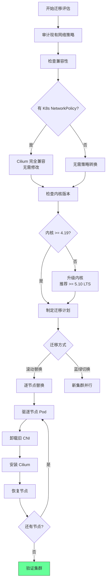

## 6.2 从 Flannel 迁移 (Migrate from Flannel)

> ⚠️ **🔴 灾难性操作** — 含不可逆命令，执行前必须满足变更窗口+双人复核+事前备份+回滚方案
> - `kubectl delete namespace`：永久删除命名空间及全部资源，不可恢复
> - `rm -rf (系统/数据路径)`：删除系统或数据文件，可能摧毁节点或丢失全部数据
> - `kubectl cordon`：标记节点不可调度
> - `kubectl drain`：驱逐节点所有 Pod，业务流量受影响

> **🔴 高风险操作警告**
>
> 下方命令属于不可逆或高影响操作，执行前请确认：
> - 已备份关键数据与配置
> - 处于批准的变更窗口期
> - 已获得相关责任人授权
> - 已准备回滚或恢复方案
> - 目标集群、Namespace、节点/资源名称正确无误

``` bash
# 🔴 高风险：可能造成数据丢失或服务中断，执行前需备份、变更审批与回滚方案
# Step 1: 备份当前 Flannel 配置
kubectl get configmap kube-flannel-cfg -n kube-flannel -o yaml > flannel-backup.yaml
kubectl get pods -n kube-flannel -o yaml > flannel-pods-backup.yaml

# Step 2: 禁止新 Pod 调度到某个节点
kubectl cordon node-1

# Step 3: 驱逐节点 Pod
kubectl drain node-1 \
  --ignore-daemonsets \
  --delete-emptydir-data \
  --force \
  --timeout=300s

# Step 4: SSH 到节点，清理 Flannel
# 在节点上执行:
# sudo rm -f /etc/cni/net.d/10-flannel.conflist
# sudo ip link delete flannel.1 2>/dev/null || true
# sudo rm -rf /run/flannel/  # ⚠️ 删除系统/数据文件

# Step 5: 安装 Cilium（如果是第一个节点）
helm install cilium cilium/cilium \
  --namespace kube-system \
  --version 1.16.0 \
  --values production-values.yaml

# Step 6: 恢复节点调度
kubectl uncordon node-1

# 重复 Step 2-6 直到所有节点完成迁移

# Step 7: 删除 Flannel DaemonSet
kubectl delete daemonset kube-flannel-ds -n kube-flannel
kubectl delete namespace kube-flannel  # ⚠️ 不可逆：永久删除命名空间及全部资源
```
## 6.3 CNI 链式模式 (CNI Chaining Mode)

对于不支持完全替换的场景，Cilium 可以作为链式 CNI 插件：

```yaml
# 链式模式示例（在 Flannel 之后插入 Cilium）
# /etc/cni/net.d/05-cilium.conflist
{
  "name": "generic-veth",
  "cniVersion": "0.3.1",
  "plugins": [
    {
      "type": "flannel",
      "delegate": {
        "hairpinMode": true,
        "isDefaultGateway": true
      }
    },
    {
      "type": "portmap",
      "capabilities": {
        "portMappings": true
      }
    },
    {
      "type": "cilium-cni",
      "chaining-mode": "flannel",
      "log-file": "/var/run/cilium/cilium-cni.log"
    }
  ]
}
```

```yaml
# Helm values for chaining mode
cni:
  chainingMode: "flannel"
  # 注意: 链式模式下部分功能受限
  # - 不支持 kube-proxy replacement
  # - 不支持 Cluster Mesh
  # 但仍可使用:
  # - NetworkPolicy (L3/L4/L7)
  # - Hubble 可观测性
```

---

<!-- chunk: 7. 多集群 Cluster Mesh 配置 -->## 7. 多集群 Cluster Mesh 配置

## 7.1 Cluster Mesh 架构 (Cluster Mesh Architecture)

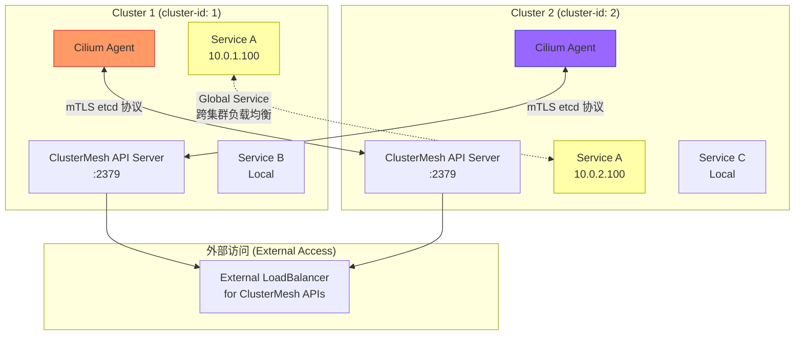

## 7.2 Cluster Mesh 部署步骤 (Deployment Steps)

> ⚠️ **🟡 中危变更** — 变更集群资源状态，建议先 --dry-run 或 diff 确认
> - `helm upgrade/install`：部署/升级 release

``` bash
# 🟡 中风险：会修改集群/资源状态，执行前请确认目标、影响范围与授权
# ============================================
# 前提条件:
# - 每个集群有唯一的 cluster ID (1-255)
# - 每个集群有唯一的名称
# - Pod CIDR 不重叠
# - Node CIDR 不重叠
# ============================================

# Cluster 1 配置
helm upgrade cilium cilium/cilium \
  --namespace kube-system \
  --reuse-values \
  --set cluster.name=cluster-1 \
  --set cluster.id=1

# Cluster 2 配置
helm upgrade cilium cilium/cilium \
  --namespace kube-system \
  --reuse-values \
  --set cluster.name=cluster-2 \
  --set cluster.id=2

# 启用 Cluster Mesh API Server
# 在 Cluster 1
cilium clustermesh enable \
  --service-type LoadBalancer  # 或 NodePort

# 在 Cluster 2
cilium clustermesh enable \
  --service-type LoadBalancer

# 等待 Cluster Mesh 就绪
cilium clustermesh status --wait

# 连接两个集群
# 从 Cluster 1 执行（需要 Cluster 2 的 kubeconfig）
cilium clustermesh connect \
  --context cluster-1 \
  --destination-context cluster-2

# 验证连接
cilium clustermesh status
```
## 7.3 Global Service 配置 (Global Service Configuration)

```yaml
# 在两个集群中都创建同名 Service，并添加 Global 注解
apiVersion: v1
kind: Service
metadata:
  name: my-service
  namespace: default
  annotations:
    # 标记为全局 Service（跨集群负载均衡）
    service.cilium.io/global: "true"
    # 可选：本集群失败时才路由到其他集群
    service.cilium.io/shared: "true"
    # 可选：此集群不对外提供（只接受外来流量）
    # service.cilium.io/global: "true"
    # service.cilium.io/shared: "false"
spec:
  selector:
    app: my-app
  ports:
  - port: 80
    targetPort: 8080
  type: ClusterIP
```

## 7.4 Cluster Mesh 网络策略 (Cluster Mesh Network Policy)

```yaml
# 允许来自 cluster-2 的特定 Pod 访问
apiVersion: "cilium.io/v2"
kind: CiliumNetworkPolicy
metadata:
  name: allow-from-cluster2
  namespace: production
spec:
  endpointSelector:
    matchLabels:
      app: backend
  ingress:
  - fromEndpoints:
    - matchLabels:
        app: frontend
        io.cilium.k8s.policy.cluster: cluster-2  # 指定来源集群
```

---

<!-- chunk: 8. Cilium 与 Kubernetes 网络模型 -->## 8. Cilium 与 Kubernetes 网络模型

## 8.1 IPAM 模式对比 (IPAM Mode Comparison)

| IPAM 模式 | 适用场景 | 特点 |
|-----------|---------|------|
| `cluster-pool` | 通用场景（默认） | Cilium 管理 IP 池，节点分配 /24 |
| `kubernetes` | 使用 K8s 原生 CIDR | 遵从 K8s --pod-cidr 配置 |
| `eni` | AWS EKS | 使用 AWS ENI 真实 IP，无 overlay |
| `azure` | Azure AKS | 使用 Azure CNI 集成 |
| `gke` | GKE | 集成 GKE 网络 |
| `alibabacloud-eni` | 阿里云 ACK | 使用阿里云 ENI |
| `multi-pool` | 多 IP 池 | 支持为不同命名空间分配不同 CIDR |

## 8.1.1 Multi-Pool IPAM 配置

```yaml
# 为不同命名空间/Pod 使用不同 IP 池
apiVersion: "cilium.io/v2alpha1"
kind: CiliumPodIPPool
metadata:
  name: pool-blue
spec:
  ipv4:
    cidrs:
    - "10.10.0.0/16"
    maskSize: 24
---
apiVersion: "cilium.io/v2alpha1"
kind: CiliumPodIPPool
metadata:
  name: pool-red
spec:
  ipv4:
    cidrs:
    - "10.20.0.0/16"
    maskSize: 24
---
# 为命名空间指定 IP 池
apiVersion: v1
kind: Namespace
metadata:
  name: team-blue
  annotations:
    ipam.cilium.io/ip-pool: pool-blue
---
apiVersion: v1
kind: Namespace
metadata:
  name: team-red
  annotations:
    ipam.cilium.io/ip-pool: pool-red
```

## 8.2 BGP 集成 (BGP Integration)

```yaml
# 启用 BGP 控制平面（替代 overlay 隧道）
# values.yaml
bgpControlPlane:
  enabled: true

routingMode: native
autoDirectNodeRoutes: true
ipv4NativeRoutingCIDR: "10.0.0.0/8"
```

```yaml
# CiliumBGPPeeringPolicy
apiVersion: "cilium.io/v2alpha1"
kind: CiliumBGPPeeringPolicy
metadata:
  name: bgp-peering-policy
spec:
  nodeSelector:
    matchLabels:
      kubernetes.io/os: linux
  virtualRouters:
  - localASN: 65001
    exportPodCIDR: true
    neighbors:
    - peerAddress: "192.168.0.1/32"
      peerASN: 65000
      connectRetryTimeSeconds: 120
      holdTimeSeconds: 90
      keepAliveTimeSeconds: 30
      gracefulRestart:
        enabled: true
        restartTimeSeconds: 120
    serviceSelector:
      matchLabels:
        expose-via-bgp: "true"
```

## 8.3 WireGuard 透明加密 (WireGuard Transparent Encryption)

```yaml
# 节点间流量自动加密
# values.yaml
encryption:
  enabled: true
  type: wireguard
  nodeEncryption: true
  wireguard:
    userspaceFallback: false  # 使用内核 WireGuard

# 验证加密状态
# cilium encrypt status
# 输出:
# Encryption: Wireguard
# Decryption interface(s): cilium_wg0
# Wireguard peers:
#   • node-2: 192.168.1.2 (last handshake: 5s ago)
#   • node-3: 192.168.1.3 (last handshake: 8s ago)
```

---

<!-- chunk: 9. 故障排查与诊断 -->## 9. 故障排查与诊断

## 9.1 诊断工具集 (Diagnostic Toolkit)

> ⚠️ **🟡 中危变更** — 变更集群资源状态，建议先 --dry-run 或 diff 确认
> - `kubectl exec`：进入容器执行命令，可能改变容器状态

``` bash
# 🟡 中风险：会修改集群/资源状态，执行前请确认目标、影响范围与授权
# ============================================
# 基础状态检查
# ============================================

# 1. Cilium 整体状态
cilium status
cilium status --verbose

# 2. 查看所有端点状态
cilium endpoint list

# 3. 检查特定端点
cilium endpoint get <endpoint-id>

# 4. 查看 Cilium 日志
kubectl logs -n kube-system -l k8s-app=cilium --tail=100

# 5. 进入 Cilium Agent Pod 执行命令
CILIUM_POD=$(kubectl get pods -n kube-system -l k8s-app=cilium -o jsonpath='{.items[0].metadata.name}')
kubectl exec -it -n kube-system $CILIUM_POD -- cilium status
```
## 9.2 网络连通性排查 (Network Connectivity Troubleshooting)

```bash
# ============================================
# 连通性测试
# ============================================

# 运行完整连通性测试套件
cilium connectivity test

# 从指定 Pod 测试网络
cilium connectivity test \
  --test-namespace cilium-test \
  --flow-validation disabled

# 检查两个 Pod 之间的策略
cilium policy trace \
  --src-k8s-pod default/frontend-xxx \
  --dst-k8s-pod default/backend-xxx \
  --dport 8080

# 输出示例:
# Resolving ingress policy for identity [reserved:world]
# * Rule {"matchLabels":{"app":"backend"}}: selected
#   Allows from labels {"app":"frontend"}: port 8080/TCP ✓

# 实时监控网络事件
cilium monitor
cilium monitor --type l7  # 仅 L7 事件
cilium monitor --type drop  # 仅 drop 事件
cilium monitor --from-pod default/frontend-xxx  # 指定 Pod

# Hubble 流量查询
hubble observe
hubble observe --namespace default
hubble observe --pod default/frontend-xxx
hubble observe --verdict DROPPED  # 只看被丢弃的流量
hubble observe --http-method GET --http-path "/api/*"  # HTTP 过滤
```

## 9.3 常见问题排查 (Common Issues)

```mermaid
flowchart TD
    ISSUE[网络问题] --> TYPE{问题类型}
    
    TYPE -->|Pod 无法启动| POD_START[检查 CNI]
    POD_START --> CNI_LOG[查看 cilium-cni 日志<br/>journalctl -u kubelet | grep CNI]
    CNI_LOG --> IP_EXHAUST{IP 地址耗尽?}
    IP_EXHAUST -->|是| EXPAND_POOL[扩展 IP 池<br/>或增加节点 mask]
    IP_EXHAUST -->|否| AGENT_STATUS[检查 Agent 状态]
    
    TYPE -->|Pod 间无法通信| POD_COMM[检查策略]
    POD_COMM --> POLICY_TRACE[cilium policy trace]
    POLICY_TRACE --> POLICY_DROP{策略丢包?}
    POLICY_DROP -->|是| FIX_POLICY[修复 NetworkPolicy]
    POLICY_DROP -->|否| CHECK_ENDPOINT[cilium endpoint list]
    CHECK_ENDPOINT --> EP_STATUS{端点状态?}
    EP_STATUS -->|not-ready| RESTART_EP[重启相关 Pod]
    EP_STATUS -->|ok| ROUTE_ISSUE[检查路由表]
    
    TYPE -->|Service 不可访问| SVC_ISSUE[检查 Service]
    SVC_ISSUE --> LB_LIST[cilium service list]
    LB_LIST --> BACKEND{后端存在?}
    BACKEND -->|否| EP_ISSUE[检查 Endpoint 和 Pod]
    BACKEND -->|是| KPR{kube-proxy-free?}
    KPR -->|是| BPF_LB[cilium bpf lb list]
    KPR -->|否| KUBE_PROXY[检查 kube-proxy]
    
    style EXPAND_POOL fill:#ffd,stroke:#aa0
    style FIX_POLICY fill:#ffd,stroke:#aa0
```

## 9.4 性能诊断 (Performance Diagnostics)

```bash
# ============================================
# BPF 性能指标
# ============================================

# 查看 eBPF 程序统计
cilium bpf perf list

# 查看连接跟踪表使用率
cilium bpf ct list global | wc -l
# 对比 bpf-ct-global-tcp-max 配置值

# 查看 BPF Map 使用情况
cilium bpf map list

# 检查是否有 Map 接近上限（会导致丢包）
# 如果 used/max > 80%，需要增加 Map 大小

# ============================================
# 节点级网络性能
# ============================================

# 检查 XDP 是否启用（XDP 开启后性能更好）
ip link show | grep xdp

# 检查 NIC 队列设置
ethtool -l eth0

# ============================================
# Hubble 流量分析
# ============================================

# 查看 Top 流量 Pod
hubble observe --output json | \
  jq -r '.flow | select(.verdict=="FORWARDED") | .source.pod_name' | \
  sort | uniq -c | sort -rn | head -20

# 查看被丢弃的连接（帮助排查策略问题）
hubble observe --verdict DROPPED --output json | \
  jq -r '[.flow.source.pod_name, .flow.destination.pod_name, 
          .flow.destination.port, .flow.drop_reason] | @tsv'
```

## 9.5 sysdump 收集诊断信息 (Collect Diagnostic Info)

```bash
# 收集完整的 Cilium 诊断包（提交 Issue 时使用）
cilium sysdump

# 指定输出目录
cilium sysdump --output-filename cilium-sysdump-$(date +%Y%m%d)

# 文件内容包括:
# - Cilium Agent 日志
# - Cilium Operator 日志
# - eBPF Map 内容
# - 网络策略状态
# - 端点状态
# - 节点信息
# - K8s 事件
```

---

<!-- chunk: 10. 2026 最新特性 -->## 10. 2026 最新特性

## 10.1 Gateway API GA (Gateway API 正式可用)

Cilium 1.15+ 提供对 Kubernetes Gateway API 的完整实现，替代 Ingress。

```yaml
# 安装 Gateway API CRDs
kubectl apply -f https://github.com/kubernetes-sigs/gateway-api/releases/download/v1.1.0/standard-install.yaml

# 创建 GatewayClass
apiVersion: gateway.networking.k8s.io/v1
kind: GatewayClass
metadata:
  name: cilium
spec:
  controllerName: io.cilium/gateway-controller
---
# 创建 Gateway
apiVersion: gateway.networking.k8s.io/v1
kind: Gateway
metadata:
  name: prod-gateway
  namespace: production
spec:
  gatewayClassName: cilium
  listeners:
  - name: http
    protocol: HTTP
    port: 80
  - name: https
    protocol: HTTPS
    port: 443
    tls:
      certificateRefs:
      - name: prod-tls-secret
---
# HTTPRoute - 高级流量路由
apiVersion: gateway.networking.k8s.io/v1
kind: HTTPRoute
metadata:
  name: api-route
  namespace: production
spec:
  parentRefs:
  - name: prod-gateway
    namespace: production
  hostnames:
  - "api.example.com"
  rules:
  # 路径路由
  - matches:
    - path:
        type: PathPrefix
        value: /api/v2
    filters:
    - type: URLRewrite
      urlRewrite:
        path:
          type: ReplacePrefixMatch
          replacePrefixMatch: /api
    backendRefs:
    - name: api-v2-service
      port: 8080
      weight: 90
    - name: api-v2-canary
      port: 8080
      weight: 10  # 金丝雀发布 10%
  
  # Header 路由
  - matches:
    - headers:
      - name: X-Canary
        value: "true"
    backendRefs:
    - name: api-canary-service
      port: 8080
```

## 10.2 Sidecar-Free Service Mesh (无 Sidecar 服务网格)

Cilium 通过 eBPF 实现了无需注入 Sidecar 的服务网格能力：

```yaml
# 启用 Cilium Service Mesh (Sidecar-Free)
# values.yaml
ingressController:
  enabled: true

# 启用 Envoy 代理（用于 L7 策略，但非 Sidecar 模式）
envoy:
  enabled: true

# mTLS 通过 WireGuard 在 eBPF 层实现
encryption:
  enabled: true
  type: wireguard

# L7 可观测性（无需 Sidecar）
hubble:
  enabled: true
  metrics:
    enabled:
    - http:labelsContext=source_namespace\,destination_namespace\,source_pod\,destination_pod
    - dns
    - tcp
```

## 10.3 Cilium 1.16/1.17 新特性 (New Features)

```
Cilium 1.16 (2024 Q4 - 2025 Q1):
├── Gateway API v1.1 完整支持（GRPCRoute, TCPRoute）
├── BBFD (BPF-based BFD) 集成
├── 增强的 Multi-Pool IPAM
├── Envoy 配置热加载
└── 改进的 WireGuard 性能

Cilium 1.17 (2025 Q3 - Q4):
├── AdminNetworkPolicy (ANP) 完整支持
├── 改进的 AI/ML 工作负载网络优化
│   └── RDMA over eBPF (实验性)
├── 增强的 Cluster Mesh 跨集群 IPAM
├── 细粒度的 L7 策略审计
└── 内置 Network Policy 可视化工具

Cilium 1.17 (2026 规划):
├── eBPF-native QUIC/HTTP3 支持
├── 更完整的 Sidecar-free mTLS
├── AI 驱动的异常检测集成
└── 改进的 IPv6 only 集群支持
```

## 10.4 CiliumEndpointSlice (性能优化)

```yaml
# 启用 CiliumEndpointSlice（大规模集群性能优化）
# values.yaml
operator:
  endpointSlice:
    enabled: true
    
# CiliumEndpointSlice 将端点信息分片，
# 减少 Operator 和 Agent 之间的同步压力
# 在 1000+ 节点的集群中效果显著
```

## 10.5 网络策略编辑器 (Network Policy Editor)

``` bash
# 🟡 中风险：会修改集群/资源状态，执行前请确认目标、影响范围与授权
# 2026 年 Cilium 引入内置策略编辑器和可视化工具
# 通过 Hubble UI 集成

# 访问 Hubble UI（包含策略可视化）
kubectl port-forward -n kube-system svc/hubble-ui 8080:80
# 打开 http://localhost:8080

# 使用 Cilium 策略编辑工具（命令行）
cilium policy generate \
  --namespace production \
  --from deployment/frontend \
  --to service/backend \
  --port 8080/TCP \
  --output yaml

# 策略影响分析
cilium policy impact \
  --policy-file new-policy.yaml \
  --namespace production
```
---

<!-- chunk: 附录 A: Cilium 版本兼容性矩阵 -->## 附录 A: Cilium 版本兼容性矩阵

| Cilium 版本 | K8s 版本 | 最低内核 | 推荐内核 | 状态 |
|------------|---------|---------|---------|------|
| 1.17.x | 1.28 - 1.32 | 4.19.57 | 5.15+ LTS | Latest |
| 1.16.x | 1.27 - 1.31 | 4.19.57 | 5.15+ LTS | Stable |
| 1.15.x | 1.26 - 1.30 | 4.19.57 | 5.10+ LTS | Maintenance |
| 1.14.x | 1.25 - 1.29 | 4.19.57 | 5.10+ LTS | EOL |

<!-- chunk: 附录 B: 关键内核特性需求 -->## 附录 B: 关键内核特性需求

| 功能 | 最低内核版本 | 说明 |
|------|------------|------|
| 基础 eBPF | 4.8 | 核心 BPF 功能 |
| BPF LRU Map | 4.10 | 连接跟踪性能 |
| kube-proxy replacement | 4.19 | Maglev, NodePort |
| WireGuard 加密 | 5.6 | 内核 WireGuard 模块 |
| BPF CO-RE | 5.2 | 跨内核版本兼容 |
| BTF (BPF Type Format) | 5.2 | 调试与可移植性 |
| XDP 原生模式 | 取决于 NIC | 高性能转发 |
| Socket Level LB | 4.17 | 本地服务加速 |

<!-- chunk: 附录 C: 常用 Cilium 命令速查 -->## 附录 C: 常用 Cilium 命令速查

```bash
# 状态与健康
cilium status                          # 整体状态
cilium health                          # 节点连通性健康
cilium version                         # 版本信息

# 端点管理
cilium endpoint list                   # 列出所有端点
cilium endpoint get <id>               # 端点详情
cilium endpoint healthz                # 端点健康

# 策略
cilium policy get                      # 查看所有策略
cilium policy trace ...                # 策略追踪
cilium policy import policy.json       # 导入策略

# BPF Maps
cilium bpf map list                    # 列出所有 BPF Map
cilium bpf lb list                     # Service 负载均衡表
cilium bpf ct list global              # 连接追踪表
cilium bpf ipcache list                # IP Cache
cilium bpf tunnel list                 # 隧道端点

# 监控
cilium monitor                         # 实时事件监控
cilium monitor --type drop             # 仅丢弃事件
cilium monitor --type l7               # 仅 L7 事件

# Hubble
hubble observe                         # 实时流量观测
hubble observe --verdict DROPPED       # 被丢弃流量
hubble status                          # Hubble 状态

# 诊断
cilium sysdump                         # 收集诊断信息
cilium connectivity test               # 连通性测试
cilium debuginfo                       # 调试信息
```

---

*文档维护: kudig.io 技术团队 | 参考: Cilium 官方文档 docs.cilium.io | 最后更新: 2026-03*

---

<!-- chunk: Obsidian 相关文档 -->## Obsidian 相关文档

- domain-35-ebpf-technology MOC
- [[网络/README.md|Domain 03: eBPF 技术体系 (eBPF Technology Stack)]]
- Domain-35 eBPF 技术 — 开源项目索引
- eBPF 架构基础与程序类型 (eBPF Architecture Fundamentals and Program T...
- eBPF Map 类型与数据结构 (eBPF Map Types and Data Structures)
- Cilium 网络策略 L3/L4/L7 (Cilium Network Policy L3/L4/L7)
- Cilium Service Mesh 无 Sidecar 架构 (Cilium Service Mesh Sideca...
- Tetragon 运行时安全 (Tetragon Runtime Security)
- Hubble 网络可观测性 (Hubble Network Observability)
- bcc 与 bpftrace 工具链 (bcc and bpftrace Tools)
- eBPF 性能优化实践 (eBPF Performance Optimization Practice)
- eBPF 安全应用案例 (eBPF Security Applications and Use Cases)

## See Also

- 01-ebpf-architecture-fundamentals
- 02-ebpf-map-types-data-structures
- 04-cilium-network-policy
- 05-cilium-service-mesh


<!-- risk-assessed -->
