> **生产环境安全提示**
>
> 本文档包含可直接执行的运维命令。执行前请确认：当前目标集群与 Namespace 是否正确；是否具备足够的 RBAC 权限；是否已在非生产环境验证。命令风险等级标注：🔴 高风险（可能造成数据丢失或服务中断）、🟡 中风险（会修改集群状态，但通常可回滚）、🟢 低风险/只读（信息收集，无副作用）。


# Hubble 网络可观测性 (Hubble Network Observability)

> Hubble 是构建在 [[Cilium|Cilium]] 和 eBPF 之上的完全分布式网络与安全可观测性平台，能够以完全透明的方式深度观测服务通信行为、网络基础设施以及应用层协议。

---

<!-- chunk: 目录 -->## 目录

1. [Hubble 概述与架构](#1-hubble-概述与架构)
2. [Hubble 组件详解](#2-hubble-组件详解)
3. [L3/L4/L7 流量可视化](#3-l3l4l7-流量可视化)
4. [[系统基础/知识字典/networking/service.md|Service]] Map 与依赖关系图](#4-service-map-与依赖关系图)
5. [网络策略可视化](#5-网络策略可视化)
6. [[实体/prometheus.md|Prometheus]] Metrics 导出](#6-prometheus-metrics-导出)
7. [Hubble 部署与配置 ([[Helm|Helm]])](#7-hubble-部署与配置-helm)
8. [与 Grafana 集成仪表板](#8-与-grafana-集成仪表板)
9. [故障排查与网络诊断](#9-故障排查与网络诊断)
10. [企业级可观测性实践](#10-企业级可观测性实践)

---

<!-- chunk: 1. Hubble 概述与架构 -->## 1. Hubble 概述与架构

## 1.1 什么是 Hubble (What is Hubble)

Hubble 是一个针对云原生工作负载的网络和安全可观测性工具，深度集成于 Cilium 生态系统。与传统的基于 sidecar 代理的可观测性方案不同，Hubble 直接利用 Linux 内核的 eBPF 技术，在**不修改任何应用代码、不注入 sidecar** 的前提下，获取完整的网络可见性。

**核心能力：**

| 能力维度 | 描述 |
|---------|------|
| **流量可见性** | 实时捕获 L3/L4/L7 层网络流量事件 |
| **服务依赖映射** | 自动发现并可视化服务间通信拓扑 |
| **网络策略监控** | 实时显示策略允许/拒绝决策 |
| **DNS 观测** | 捕获 DNS 查询与响应 |
| **HTTP/gRPC 分析** | 解析应用层 HTTP 状态码、方法、路径 |
| **Kafka 观测** | 追踪 Kafka 主题生产者/消费者 |
| **指标导出** | Prometheus 兼容的 metrics 导出 |

## 1.2 Hubble 整体架构 (Overall Architecture)

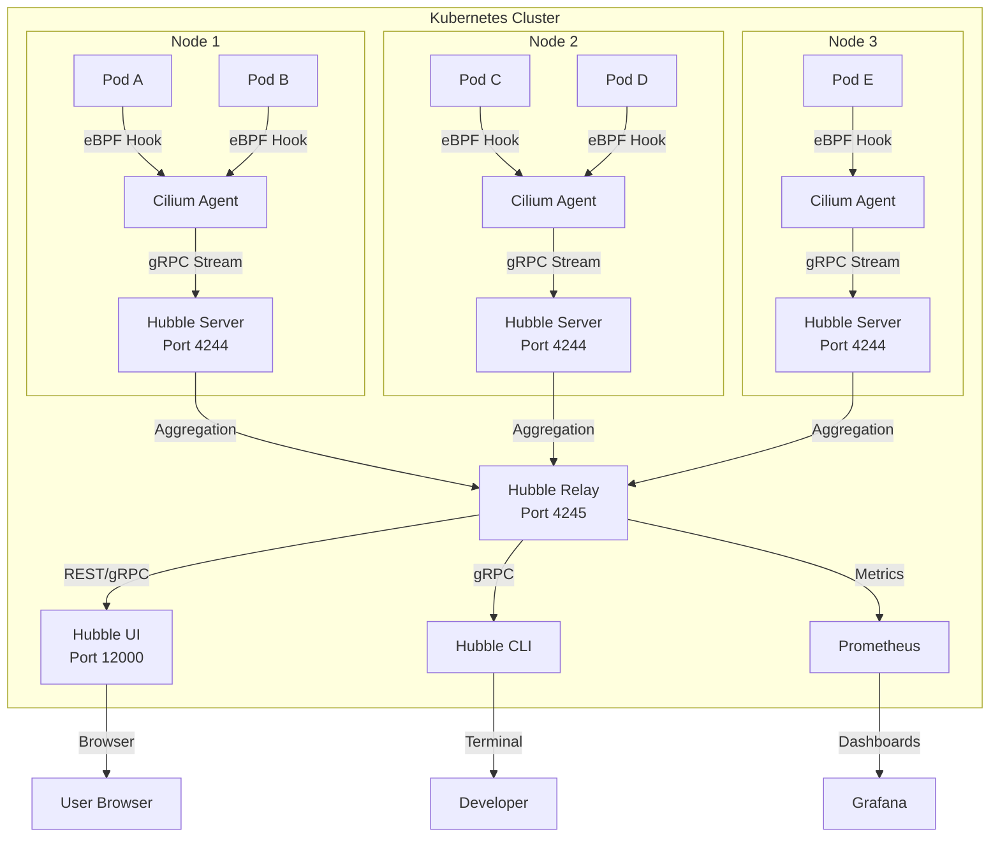

## 1.3 eBPF 数据采集原理 (eBPF Data Collection)

Hubble 的数据采集完全依赖 eBPF，无需任何 sidecar：

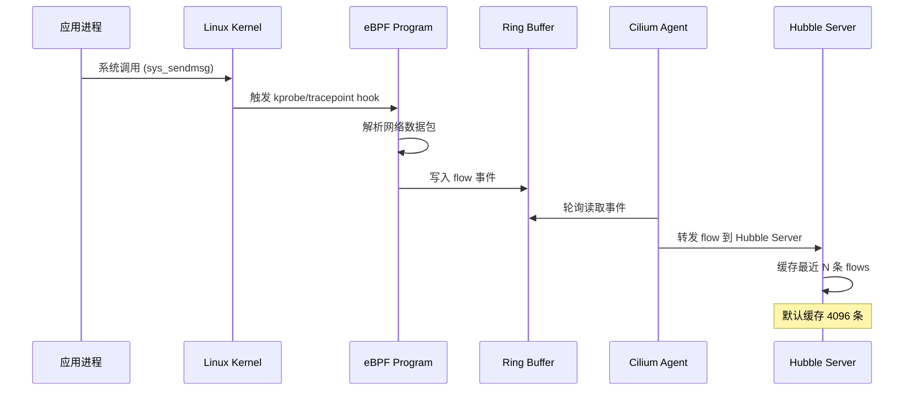

## 1.4 与传统可观测性方案对比 (Comparison with Traditional Solutions)

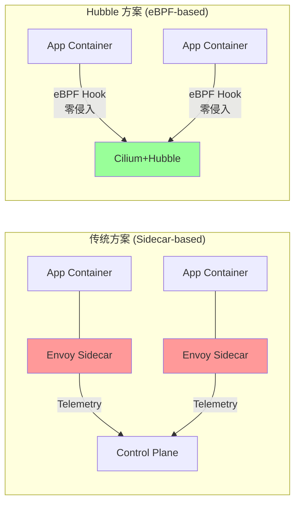

**性能对比：**

| 方案 | CPU 开销 | 内存开销 | 延迟影响 | 代码修改 |
|------|---------|---------|---------|---------|
| Sidecar (Envoy) | 高 (~15%) | 高 (~50MB/pod) | 有 (~1ms) | 无 |
| eBPF (Hubble) | 极低 (~1%) | 低 (~5MB/node) | 几乎无 | 无 |
| 手动埋点 | 无 | 无 | 无 | **需要** |

---

<!-- chunk: 2. Hubble 组件详解 -->## 2. Hubble 组件详解

## 2.1 Hubble Server (每节点组件)

Hubble Server 作为 Cilium Agent 的内嵌组件运行在每个节点上，负责从 eBPF 收集原始 flow 数据。

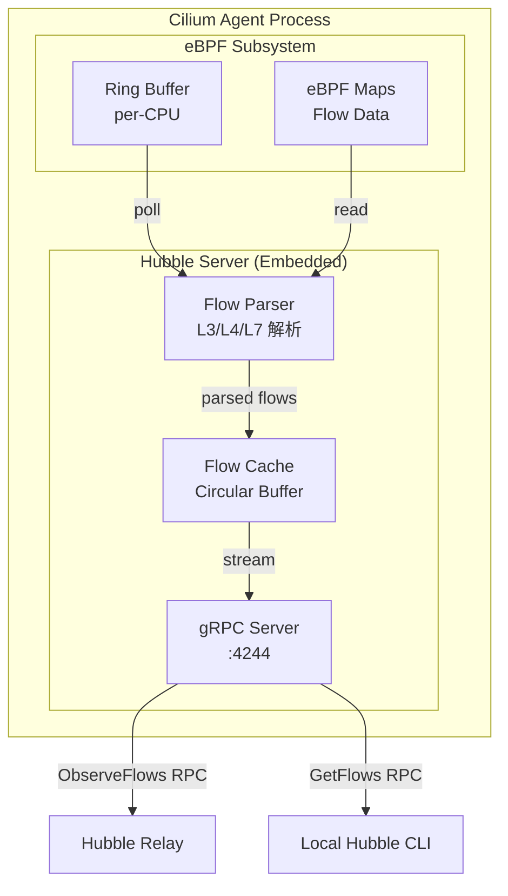

**Hubble Server 配置参数：**

```yaml
# cilium-config ConfigMap 配置
apiVersion: v1
kind: ConfigMap
metadata:
  name: cilium-config
  namespace: kube-system
data:
  # 启用 Hubble
  enable-hubble: "true"
  
  # Hubble Server 监听地址
  hubble-listen-address: ":4244"
  
  # Flow 缓存大小 (Ring Buffer 容量)
  hubble-flow-buffer-size: "4096"
  
  # metrics 配置
  hubble-metrics-server: ":9965"
  hubble-metrics: >-
    dns:query;ignoreAAAA
    drop
    tcp
    flow
    icmp
    http
  
  # TLS 配置
  hubble-tls-cert-file: /var/lib/cilium/tls/hubble/server.crt
  hubble-tls-key-file: /var/lib/cilium/tls/hubble/server.key
  hubble-tls-client-ca-files: /var/lib/cilium/tls/hubble/client-ca.crt
```

**Flow 缓冲区调优：**

> ⚠️ **🟡 中危变更** — 变更集群资源状态，建议先 --dry-run 或 diff 确认
> - `helm upgrade/install`：部署/升级 release
> - `kubectl exec`：进入容器执行命令，可能改变容器状态

``` bash
# 🟡 中风险：会修改集群/资源状态，执行前请确认目标、影响范围与授权
# 查看当前 Hubble Server 状态
kubectl exec -n kube-system ds/cilium -- hubble status

# 输出示例：
# Current/Max Flows:    4096/4096 (100.00%)
# Flows/s:              127.3
# Connected Nodes:      3/3

# 调整 flow 缓冲区大小 (建议高流量环境增大)
helm upgrade cilium cilium/cilium \
  --set hubble.enabled=true \
  --set hubble.bufferSize=16384
```
## 2.2 Hubble Relay (集群聚合组件)

Hubble Relay 是一个独立部署的服务，负责聚合所有节点的 Hubble Server 数据流，提供集群级别的统一视图。

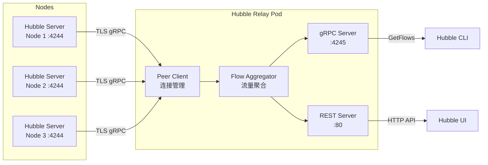

**Hubble Relay 部署配置：**

```yaml
apiVersion: apps/v1
kind: Deployment
metadata:
  name: hubble-relay
  namespace: kube-system
spec:
  replicas: 1
  selector:
    matchLabels:
      k8s-app: hubble-relay
  template:
    metadata:
      labels:
        k8s-app: hubble-relay
    spec:
      containers:
      - name: hubble-relay
        image: quay.io/cilium/hubble-relay:v1.15.0
        args:
        - serve
        - --peer-service=unix:///var/run/cilium/hubble.sock
        - --listen-client-urls=0.0.0.0:4245
        ports:
        - containerPort: 4245
          name: grpc
        volumeMounts:
        - mountPath: /var/run/cilium
          name: hubble-sock-dir
          readOnly: true
        - mountPath: /var/lib/hubble-relay/tls
          name: tls
          readOnly: true
        resources:
          requests:
            cpu: 100m
            memory: 64Mi
          limits:
            cpu: 1000m
            memory: 512Mi
      volumes:
      - name: hubble-sock-dir
        hostPath:
          path: /var/run/cilium
          type: Directory
      - name: tls
        projected:
          sources:
          - secret:
              name: hubble-relay-client-certs
```

**Relay Service 暴露：**

```yaml
apiVersion: v1
kind: Service
metadata:
  name: hubble-relay
  namespace: kube-system
  labels:
    k8s-app: hubble-relay
spec:
  selector:
    k8s-app: hubble-relay
  ports:
  - name: grpc
    port: 80
    targetPort: 4245
    protocol: TCP
  type: ClusterIP
```

## 2.3 Hubble UI (可视化界面)

Hubble UI 是一个基于 React 的前端应用，通过 Hubble Relay 获取数据并提供直观的服务依赖图和流量分析界面。

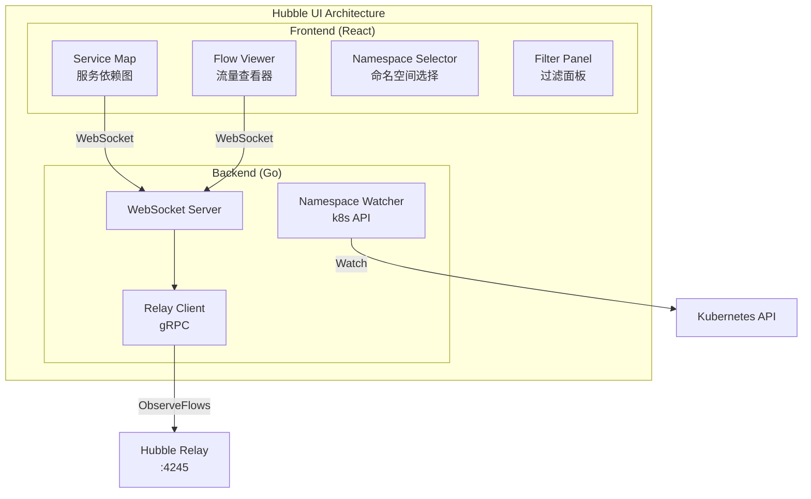

**Hubble UI 部署：**

```yaml
# Helm values.yaml 配置
hubble:
  ui:
    enabled: true
    replicas: 1
    
    # 后端配置
    backend:
      image:
        repository: quay.io/cilium/hubble-ui-backend
        tag: v0.13.0
      resources:
        limits:
          cpu: 1000m
          memory: 1024M
        requests:
          cpu: 100m
          memory: 64Mi
    
    # 前端配置
    frontend:
      image:
        repository: quay.io/cilium/hubble-ui
        tag: v0.13.0
      resources:
        limits:
          cpu: 1000m
          memory: 1024M
        requests:
          cpu: 100m
          memory: 64Mi
    
    # Ingress 配置
    ingress:
      enabled: true
      className: nginx
      hosts:
      - host: hubble.example.com
        paths:
        - path: /
          pathType: Prefix
      tls:
      - secretName: hubble-ui-tls
        hosts:
        - hubble.example.com
```

**访问 Hubble UI：**

> ⚠️ **🟡 中危变更** — 变更集群资源状态，建议先 --dry-run 或 diff 确认
> - `kubectl edit/patch`：修改运行中的资源

``` bash
# 🟡 中风险：会修改集群/资源状态，执行前请确认目标、影响范围与授权
# 方式 1: Port Forward
kubectl port-forward -n kube-system svc/hubble-ui 12000:80 &
open http://localhost:12000

# 方式 2: 通过 cilium CLI
cilium hubble ui

# 方式 3: NodePort
kubectl patch svc hubble-ui -n kube-system \
  -p '{"spec":{"type":"NodePort","ports":[{"port":80,"nodePort":30080}]}}'
```
## 2.4 Hubble CLI (命令行工具)

Hubble CLI 是强大的命令行工具，支持实时流量观测和历史流量查询。

**安装 Hubble CLI：**

```bash
# macOS
brew install hubble

# Linux (amd64)
HUBBLE_VERSION=$(curl -s https://raw.githubusercontent.com/cilium/hubble/master/stable.txt)
HUBBLE_ARCH=amd64
curl -L --fail --remote-name-all \
  https://github.com/cilium/hubble/releases/download/$HUBBLE_VERSION/hubble-linux-${HUBBLE_ARCH}.tar.gz
tar xzvf hubble-linux-${HUBBLE_ARCH}.tar.gz
sudo mv hubble /usr/local/bin

# 验证安装
hubble version
```

**CLI 基本用法：**

``` bash
# 🟡 中风险：会修改集群/资源状态，执行前请确认目标、影响范围与授权
# 配置 Hubble CLI 连接
export HUBBLE_SERVER=localhost:4245

# 或通过 port-forward
kubectl port-forward -n kube-system svc/hubble-relay 4245:80 &

# 检查 Hubble 状态
hubble status
# Current/Max Flows:    4096/4096 (100.00%)
# Flows/s:              98.7
# Connected Nodes:      5/5
# Unavailable Nodes:    0

# 观察所有流量
hubble observe

# 实时跟踪流量 (类似 tail -f)
hubble observe --follow

# 按命名空间过滤
hubble observe --namespace default

# 按 Pod 过滤
hubble observe --pod frontend-xxx

# 按协议过滤
hubble observe --protocol http
hubble observe --protocol tcp

# 按标签过滤
hubble observe --label app=frontend

# 查看被拒绝的流量
hubble observe --verdict DROPPED
hubble observe --verdict DENIED

# 查看 HTTP 流量详情
hubble observe --protocol http -o json | jq '.flow.l7.http'

# 输出格式控制
hubble observe -o json       # JSON 格式
hubble observe -o dict       # 字典格式
hubble observe -o compact    # 紧凑格式 (默认)
hubble observe -o table      # 表格格式
```
**高级过滤示例：**

```bash
# 查看特定服务间的流量
hubble observe \
  --from-label app=frontend \
  --to-label app=backend \
  --follow

# 查看特定 IP 的流量
hubble observe --ip 10.0.0.100

# 查看 DNS 查询
hubble observe --protocol DNS

# 查看 HTTP 错误 (4xx/5xx)
hubble observe --http-status-code 5 --protocol http

# 时间范围查询
hubble observe --since 5m
hubble observe --until 2024-01-01T12:00:00

# 输出到文件
hubble observe --namespace production -o json > flows.json

# 统计流量
hubble observe --namespace default --print-node-name --follow | \
  awk '{print $3}' | sort | uniq -c | sort -rn
```

---

<!-- chunk: 3. L3/L4/L7 流量可视化 -->## 3. L3/L4/L7 流量可视化

## 3.1 流量层次模型 (Traffic Layer Model)

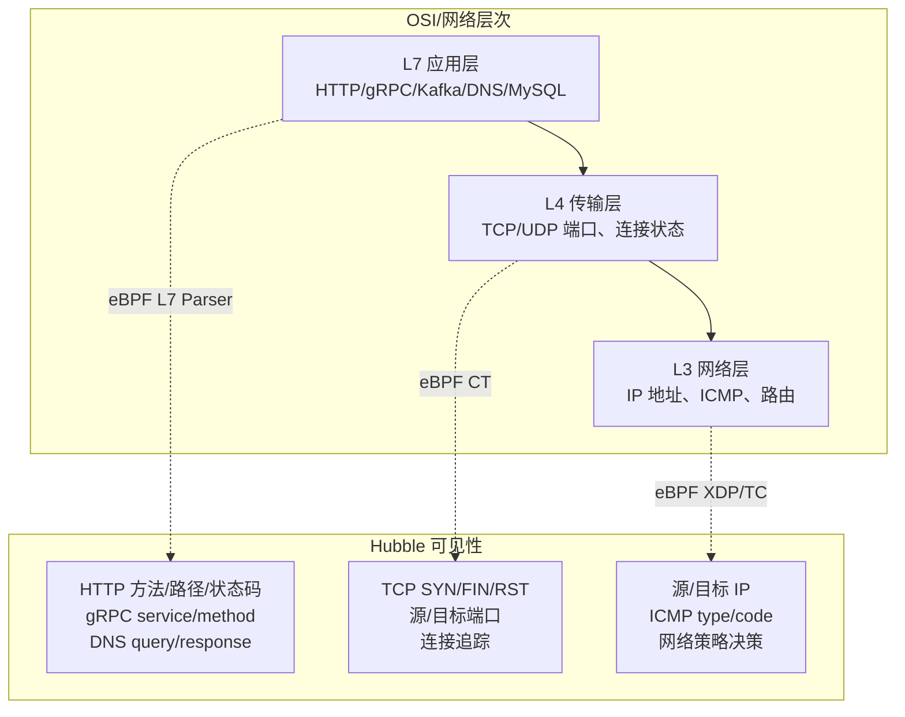

## 3.2 L3/L4 流量观测 (L3/L4 Flow Observation)

```bash
# 查看 TCP 连接建立
hubble observe --type trace --protocol tcp

# 典型输出:
# Jan  1 10:00:01.000: default/frontend-xxx:41234 -> default/backend-yyy:8080
#   TCP Flags: SYN

# 查看网络层流量
hubble observe --type trace:to-endpoint --protocol icmp

# 查看 UDP 流量 (DNS)
hubble observe --protocol udp --port 53

# 查看连接被拒绝
hubble observe --verdict DROPPED -o json | jq '{
  src: .flow.source.pod_name,
  dst: .flow.destination.pod_name,
  reason: .flow.drop_reason
}'
```

**L3/L4 Flow JSON 结构：**

```json
{
  "flow": {
    "time": "2024-01-01T10:00:01.000000000Z",
    "verdict": "FORWARDED",
    "ethernet": {
      "source": "aa:bb:cc:dd:ee:01",
      "destination": "aa:bb:cc:dd:ee:02"
    },
    "IP": {
      "source": "10.0.0.1",
      "destination": "10.0.0.2",
      "ipVersion": "IPv4"
    },
    "l4": {
      "TCP": {
        "source_port": 41234,
        "destination_port": 8080,
        "flags": {
          "SYN": true
        }
      }
    },
    "source": {
      "ID": 1234,
      "identity": 12345,
      "namespace": "default",
      "labels": ["app=frontend", "version=v1"],
      "pod_name": "frontend-xxx-yyy"
    },
    "destination": {
      "ID": 5678,
      "identity": 67890,
      "namespace": "default",
      "labels": ["app=backend", "version=v2"],
      "pod_name": "backend-aaa-bbb"
    },
    "Type": "L3_L4",
    "node_name": "node-1",
    "event_type": {
      "type": 4,
      "sub_type": 0
    }
  }
}
```

## 3.3 L7 流量观测 (L7 Flow Observation)

L7 可见性需要在 Cilium 网络策略中显式开启：

```yaml
# 启用 L7 HTTP 可见性的 CiliumNetworkPolicy
apiVersion: cilium.io/v2
kind: CiliumNetworkPolicy
metadata:
  name: l7-visibility-frontend
  namespace: default
spec:
  endpointSelector:
    matchLabels:
      app: frontend
  egress:
  - toEndpoints:
    - matchLabels:
        app: backend
    toPorts:
    - ports:
      - port: "8080"
        protocol: TCP
      rules:
        http:
        - method: "GET"
          path: "/api/.*"
```

**或使用 CiliumClusterwideNetworkPolicy 全局启用 L7 visibility：**

```yaml
# 全局 L7 可见性注解方式 (推荐用于生产)
apiVersion: v1
kind: Pod
metadata:
  name: frontend
  annotations:
    # 对所有 egress 启用 L7 HTTP 可见性
    policy.cilium.io/proxy-visibility: "<Egress/8080/TCP/HTTP>"
spec:
  containers:
  - name: frontend
    image: nginx:latest
```

**L7 HTTP 流量观测：**

```bash
# 观测 HTTP 流量
hubble observe --protocol http --follow

# 典型输出:
# Jan  1 10:00:01.000: default/frontend -> default/backend:8080
#   HTTP/1.1 GET /api/users -> 200 OK (3ms)

# JSON 格式查看 HTTP 详情
hubble observe --protocol http -o json | jq '.flow.l7.http | {
  method: .method,
  url: .url,
  status: .code,
  headers: .headers
}'

# 查看 HTTP 错误
hubble observe --protocol http \
  --http-method GET \
  --verdict FORWARDED \
  -o json | jq 'select(.flow.l7.http.code >= 500)'
```

**L7 HTTP Flow JSON 结构：**

```json
{
  "flow": {
    "verdict": "FORWARDED",
    "l7": {
      "type": "REQUEST",
      "latency_ns": 3000000,
      "http": {
        "code": 200,
        "method": "GET",
        "url": "http://backend:8080/api/users",
        "protocol": "HTTP/1.1",
        "headers": [
          {"key": "Content-Type", "value": "application/json"},
          {"key": "X-Request-ID", "value": "abc-123"}
        ]
      }
    },
    "is_reply": false,
    "Type": "L7"
  }
}
```

## 3.4 gRPC 流量观测 (gRPC Flow Observation)

```yaml
# 启用 gRPC L7 可见性
apiVersion: cilium.io/v2
kind: CiliumNetworkPolicy
metadata:
  name: grpc-visibility
  namespace: microservices
spec:
  endpointSelector:
    matchLabels:
      app: grpc-client
  egress:
  - toEndpoints:
    - matchLabels:
        app: grpc-server
    toPorts:
    - ports:
      - port: "50051"
        protocol: TCP
      rules:
        http:  # gRPC 基于 HTTP/2
        - method: "POST"
          path: "/.*"
```

```bash
# 观测 gRPC 流量
hubble observe --protocol grpc -o json | jq '.flow.l7.http | {
  service: (.url | split("/")[1]),
  method: (.url | split("/")[2]),
  status: .code
}'

# 典型 gRPC flow 输出示例:
# grpc-client -> grpc-server:50051
# POST /helloworld.Greeter/SayHello -> 0 (gRPC OK) (5ms)
```

## 3.5 DNS 流量观测 (DNS Flow Observation)

```bash
# 观测所有 DNS 查询
hubble observe --protocol dns --follow

# 典型输出:
# Jan  1 10:00:01.000: default/frontend -> kube-system/kube-dns:53
#   DNS Query backend.default.svc.cluster.local. A

# Jan  1 10:00:01.001: kube-system/kube-dns -> default/frontend
#   DNS Response backend.default.svc.cluster.local. A 10.96.0.100

# 查看 DNS 响应失败 (NXDOMAIN)
hubble observe --protocol dns -o json | \
  jq 'select(.flow.l7.dns.rcode != null and .flow.l7.dns.rcode != 0) | {
    query: .flow.l7.dns.query,
    rcode: .flow.l7.dns.rcode,
    pod: .flow.source.pod_name
  }'
```

---

<!-- chunk: 4. Service Map 与依赖关系图 -->## 4. Service Map 与依赖关系图

## 4.1 Service Map 概念 (Service Map Concept)

Service Map 是 Hubble UI 的核心功能，自动从实时流量中构建服务拓扑图，无需手动配置。

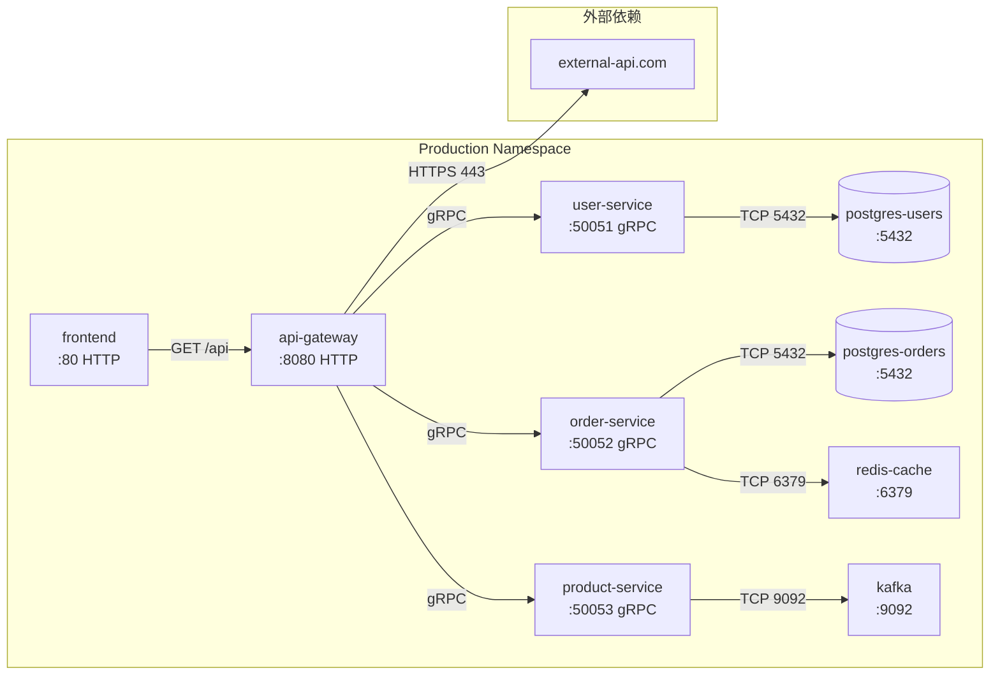

## 4.2 Hubble UI 服务图操作 (Service Map Operations)

**命名空间选择器：**

```
Hubble UI 界面操作流程:
┌─────────────────────────────────────────────┐
│  Namespace: [production ▼]  [Refresh]       │
├─────────────────────────────────────────────┤
│                                             │
│    [frontend] ──────► [api-gateway]         │
│                            │                │
│                    ┌───────┼───────┐        │
│                    ▼       ▼       ▼        │
│               [user-svc] [order] [product]  │
│                    │       │               │
│                   [pg]   [pg] [redis]      │
│                                             │
├─────────────────────────────────────────────┤
│  Flow Details: frontend → api-gateway       │
│  HTTP GET /api/orders 200 OK (2ms)         │
└─────────────────────────────────────────────┘
```

## 4.3 CLI 方式生成依赖关系 (CLI Dependency Analysis)

```bash
# 提取服务间通信关系
hubble observe \
  --namespace production \
  --since 1h \
  -o json | \
  jq -r '[.flow.source.workload.name, .flow.destination.workload.name] | @csv' | \
  sort | uniq -c | sort -rn | head -20

# 输出示例:
# 1523 "frontend","api-gateway"
#  892 "api-gateway","user-service"
#  756 "api-gateway","order-service"
#  445 "order-service","postgres-orders"
#  312 "order-service","redis-cache"

# 生成 DOT 格式依赖图
hubble observe --namespace production --since 1h -o json | \
  jq -r '"\"" + .flow.source.workload.name + "\" -> \"" + 
         .flow.destination.workload.name + "\""' | \
  sort | uniq | \
  awk 'BEGIN{print "digraph G {"} {print "  " $0} END{print "}"}'

# 保存为 graph.dot，然后:
dot -Tpng graph.dot -o service-map.png
```

## 4.4 服务延迟分析 (Service Latency Analysis)

```bash
# 分析 HTTP 请求延迟分布
hubble observe \
  --namespace production \
  --protocol http \
  --from-label app=api-gateway \
  --since 30m \
  -o json | \
  jq 'select(.flow.l7.http.code != null) | {
    service: .flow.destination.workload.name,
    latency_ms: (.flow.l7.latency_ns / 1000000),
    status: .flow.l7.http.code
  }' | \
  jq -s 'group_by(.service) | map({
    service: .[0].service,
    count: length,
    avg_ms: (map(.latency_ms) | add / length),
    p95_ms: (sort_by(.latency_ms) | .[length * 0.95 | floor].latency_ms),
    errors: map(select(.status >= 500)) | length
  })'
```

---

<!-- chunk: 5. 网络策略可视化 -->## 5. 网络策略可视化

## 5.1 策略决策可视化 (Policy Decision Visualization)

Hubble 实时显示每个网络流量的策略决策结果：

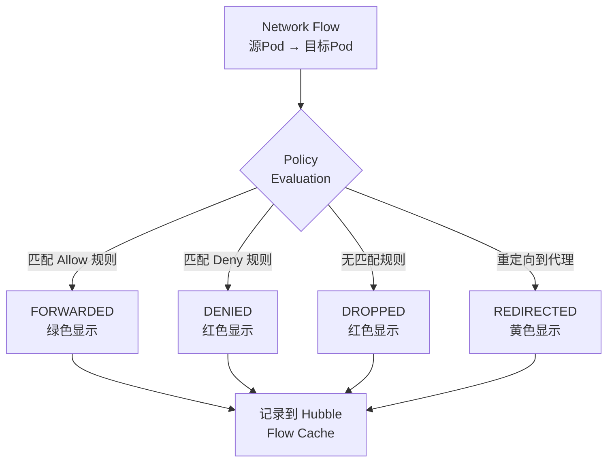

```bash
# 查看所有被拒绝的流量
hubble observe --verdict DROPPED --verdict DENIED --follow

# 按命名空间查看被拒绝流量
hubble observe \
  --namespace production \
  --verdict DROPPED \
  -o json | \
  jq '{
    time: .flow.time,
    src: .flow.source.pod_name,
    dst: .flow.destination.pod_name,
    dst_port: .flow.l4.TCP.destination_port,
    drop_reason: .flow.drop_reason_desc
  }'

# 统计被拒绝流量 Top 10
hubble observe --verdict DROPPED --since 1h -o json | \
  jq -r '[.flow.source.pod_name, .flow.destination.pod_name, 
          (.flow.l4.TCP.destination_port | tostring)] | join(" -> ")' | \
  sort | uniq -c | sort -rn | head -10
```

## 5.2 策略可视化配置 (Policy Visualization Config)

```yaml
# 启用审计模式 (策略违规可见但不阻断)
apiVersion: cilium.io/v2
kind: CiliumClusterwideNetworkPolicy
metadata:
  name: audit-mode-policy
spec:
  endpointSelector: {}
  ingress:
  - fromEntities:
    - cluster
  policyAuditMode: true  # 仅记录不阻断
```

```bash
# 查看审计模式中被"违规"的流量
hubble observe --verdict AUDIT -o json | \
  jq '{
    src: .flow.source.pod_name,
    dst: .flow.destination.pod_name,
    policy: .flow.policy_match_type
  }'
```

## 5.3 策略推断工具 (Policy Inference)

```bash
# 基于观测到的流量自动推断网络策略
# 使用 hubble 观测 + network-policy-editor

# Step 1: 收集实际流量
hubble observe \
  --namespace production \
  --verdict FORWARDED \
  --since 24h \
  -o json > production-flows.json

# Step 2: 分析哪些通信需要被允许
cat production-flows.json | \
  jq -r '{
    src_ns: .flow.source.namespace,
    src_label: (.flow.source.labels | map(select(startswith("app="))) | .[0]),
    dst_ns: .flow.destination.namespace,
    dst_label: (.flow.destination.labels | map(select(startswith("app="))) | .[0]),
    dst_port: (.flow.l4.TCP.destination_port // .flow.l4.UDP.destination_port)
  }' | \
  jq -s 'unique_by([.src_label, .dst_label, .dst_port])'
```

## 5.4 可视化网络策略验证 (Visual Policy Validation)

```yaml
# 测试网络策略前后的流量变化
apiVersion: cilium.io/v2
kind: CiliumNetworkPolicy
metadata:
  name: frontend-to-backend-only
  namespace: production
spec:
  endpointSelector:
    matchLabels:
      app: backend
  ingress:
  - fromEndpoints:
    - matchLabels:
        app: frontend
    toPorts:
    - ports:
      - port: "8080"
        protocol: TCP
```

> ⚠️ **🟡 中危变更** — 变更集群资源状态，建议先 --dry-run 或 diff 确认
> - `kubectl exec`：进入容器执行命令，可能改变容器状态

``` bash
# 🟡 中风险：会修改集群/资源状态，执行前请确认目标、影响范围与授权
# 验证策略效果: 从 frontend 访问 backend 应该成功
kubectl exec -n production deploy/frontend -- \
  curl -s http://backend:8080/health

# 验证策略效果: 从 other-service 访问 backend 应该失败
kubectl exec -n production deploy/other-service -- \
  curl -s --max-time 3 http://backend:8080/health

# 在 Hubble 中验证
hubble observe \
  --from-label app=frontend \
  --to-label app=backend \
  --verdict FORWARDED

hubble observe \
  --from-label app=other-service \
  --to-label app=backend \
  --verdict DROPPED
```
---

<!-- chunk: 6. Prometheus Metrics 导出 -->## 6. Prometheus Metrics 导出

## 6.1 Hubble Metrics 概述 (Metrics Overview)

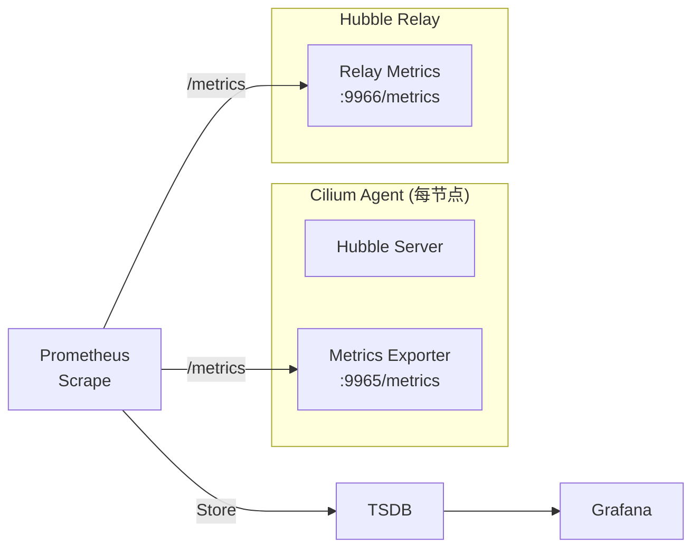

## 6.2 启用 Hubble Metrics (Enable Metrics)

```yaml
# Helm values.yaml
hubble:
  metrics:
    enabled: true
    port: 9965
    serviceMonitor:
      enabled: true  # 自动创建 ServiceMonitor
      labels:
        prometheus: kube-prometheus  # 匹配 Prometheus Operator
    
    # 启用的 metrics 列表
    enableOpenMetrics: true
    
    config: |
      - name: dns
        includeFilters:
        - source_pod: ["{namespace}/{pod}"]
        denyFilters:
        - source_pod: ["kube-system/.*"]
        fieldMask:
        - source
        - destination
        - verdict
        
      - name: drop
        
      - name: tcp
        
      - name: flow
        includeFilters:
        - source_pod: ["production/.*"]
        
      - name: icmp
      
      - name: http
        includeFilters:
        - source_pod: ["production/.*"]
        labelsContext:
        - source_namespace
        - source_pod
        - destination_namespace
        - destination_pod
        - traffic_direction
```

## 6.3 核心 Metrics 说明 (Core Metrics Reference)

**流量 Metrics：**

```promql
# HTTP 请求总数 (按命名空间、状态码)
hubble_http_requests_total{
  namespace="production",
  status="200"
}

# HTTP 请求延迟直方图
histogram_quantile(0.99,
  sum(rate(hubble_http_request_duration_seconds_bucket{
    namespace="production"
  }[5m])) by (le, destination)
)

# HTTP 错误率
sum(rate(hubble_http_requests_total{status=~"5.."}[5m]))
  by (namespace, destination)
/
sum(rate(hubble_http_requests_total[5m]))
  by (namespace, destination)
```

**网络策略 Metrics：**

```promql
# 被丢弃的数据包总数
sum(rate(hubble_drop_total[5m])) by (namespace, direction, reason)

# TCP 连接状态
hubble_tcp_flags_total{flag="SYN"} # 新连接
hubble_tcp_flags_total{flag="RST"} # 连接重置 (可能有问题)

# DNS 查询统计
sum(rate(hubble_dns_queries_total[5m])) by (namespace, qtypes)
sum(rate(hubble_dns_responses_total{rcode="Non-Existent Domain"}[5m])) 
  by (namespace) # NXDOMAIN 错误
```

**Flows Metrics：**

```promql
# 每秒 flow 事件数
rate(hubble_flows_processed_total[1m])

# 按 verdict 分组的 flow 数
sum(rate(hubble_flows_processed_total[5m])) 
  by (verdict, protocol, direction)

# Hubble Ring Buffer 使用率
hubble_drop_total / hubble_flows_processed_total
```

## 6.4 ServiceMonitor 配置 (ServiceMonitor Config)

```yaml
apiVersion: monitoring.coreos.com/v1
kind: ServiceMonitor
metadata:
  name: hubble-metrics
  namespace: monitoring
  labels:
    prometheus: kube-prometheus
spec:
  selector:
    matchLabels:
      k8s-app: cilium
  namespaceSelector:
    matchNames:
    - kube-system
  endpoints:
  - port: hubble-metrics
    path: /metrics
    interval: 30s
    honorLabels: true
    relabelings:
    - sourceLabels: [__meta_kubernetes_pod_node_name]
      targetLabel: node
      action: replace
---
apiVersion: monitoring.coreos.com/v1
kind: ServiceMonitor
metadata:
  name: hubble-relay-metrics
  namespace: monitoring
spec:
  selector:
    matchLabels:
      k8s-app: hubble-relay
  namespaceSelector:
    matchNames:
    - kube-system
  endpoints:
  - port: metrics
    path: /metrics
    interval: 30s
```

## 6.5 告警规则 (Alerting Rules)

```yaml
apiVersion: monitoring.coreos.com/v1
kind: PrometheusRule
metadata:
  name: hubble-alerts
  namespace: monitoring
spec:
  groups:
  - name: hubble.network
    interval: 30s
    rules:
    
    # 高 Drop 率告警
    - alert: HighNetworkDropRate
      expr: |
        sum(rate(hubble_drop_total[5m])) by (namespace) 
        / 
        sum(rate(hubble_flows_processed_total[5m])) by (namespace) > 0.05
      for: 5m
      labels:
        severity: warning
      annotations:
        summary: "命名空间 {{ $labels.namespace }} 网络丢包率超过 5%"
        description: "当前丢包率: {{ $value | humanizePercentage }}"
    
    # HTTP 错误率告警
    - alert: HighHTTPErrorRate
      expr: |
        sum(rate(hubble_http_requests_total{status=~"5.."}[5m])) 
          by (namespace, destination)
        /
        sum(rate(hubble_http_requests_total[5m])) 
          by (namespace, destination) > 0.01
      for: 3m
      labels:
        severity: critical
      annotations:
        summary: "服务 {{ $labels.destination }} HTTP 5xx 错误率超过 1%"
    
    # Hubble 节点连接丢失
    - alert: HubbleNodeNotConnected
      expr: |
        hubble_relay_nodes_available != hubble_relay_nodes_expected
      for: 2m
      labels:
        severity: warning
      annotations:
        summary: "Hubble Relay 部分节点连接断开"
    
    # DNS 解析失败率高
    - alert: HighDNSFailureRate
      expr: |
        sum(rate(hubble_dns_responses_total{rcode!="No Error"}[5m]))
          by (namespace)
        /
        sum(rate(hubble_dns_queries_total[5m]))
          by (namespace) > 0.1
      for: 5m
      labels:
        severity: warning
      annotations:
        summary: "命名空间 {{ $labels.namespace }} DNS 失败率超过 10%"
```

---

<!-- chunk: 7. Hubble 部署与配置 (Helm) -->## 7. Hubble 部署与配置 (Helm)

## 7.1 最小化部署 (Minimal Deployment)

> ⚠️ **🟡 中危变更** — 变更集群资源状态，建议先 --dry-run 或 diff 确认
> - `helm upgrade/install`：部署/升级 release

``` bash
# 🟡 中风险：会修改集群/资源状态，执行前请确认目标、影响范围与授权
# 添加 Cilium Helm 仓库
helm repo add cilium https://helm.cilium.io/
helm repo update

# 最小化部署 (仅启用 Hubble Server + Relay)
helm install cilium cilium/cilium \
  --namespace kube-system \
  --set hubble.enabled=true \
  --set hubble.relay.enabled=true \
  --set hubble.ui.enabled=false \
  --set hubble.metrics.enabled=true

# 验证部署
kubectl -n kube-system get pods -l k8s-app=hubble-relay
kubectl -n kube-system get pods -l k8s-app=cilium
```
## 7.2 完整生产级配置 (Full Production Config)

```yaml
# hubble-production-values.yaml
hubble:
  enabled: true
  
  # Hubble Server (嵌入在 Cilium Agent)
  bufferSize: 16384          # 增大 Ring Buffer
  listenAddress: ":4244"
  
  # TLS 安全配置
  tls:
    enabled: true
    auto:
      enabled: true
      method: helm          # helm/cronJob/certmanager
    server:
      extraDnsNames:
      - "hubble-relay.kube-system.svc.cluster.local"
  
  # Relay 配置
  relay:
    enabled: true
    replicas: 2              # 生产环境建议 2 副本
    
    resources:
      requests:
        cpu: 100m
        memory: 128Mi
      limits:
        cpu: 1000m
        memory: 1Gi
    
    affinity:
      podAntiAffinity:
        preferredDuringSchedulingIgnoredDuringExecution:
        - weight: 100
          podAffinityTerm:
            labelSelector:
              matchLabels:
                k8s-app: hubble-relay
            topologyKey: kubernetes.io/hostname
    
    # Relay 服务配置
    service:
      type: ClusterIP
      port: 80
    
    # 拨号超时配置
    dialTimeout: 5s
    retryTimeout: 30s
  
  # UI 配置
  ui:
    enabled: true
    replicas: 2
    
    backend:
      resources:
        requests:
          cpu: 50m
          memory: 64Mi
        limits:
          cpu: 500m
          memory: 512Mi
    
    frontend:
      resources:
        requests:
          cpu: 50m
          memory: 64Mi
        limits:
          cpu: 500m
          memory: 512Mi
    
    ingress:
      enabled: true
      annotations:
        kubernetes.io/ingress.class: nginx
        cert-manager.io/cluster-issuer: letsencrypt-prod
        nginx.ingress.kubernetes.io/auth-type: basic
        nginx.ingress.kubernetes.io/auth-secret: hubble-ui-auth
      hosts:
      - host: hubble.k8s.example.com
        paths:
        - path: /
          pathType: Prefix
      tls:
      - secretName: hubble-ui-tls
        hosts:
        - hubble.k8s.example.com
  
  # Metrics 配置
  metrics:
    enabled: true
    port: 9965
    
    serviceMonitor:
      enabled: true
      labels:
        release: prometheus
      interval: 30s
      scrapeTimeout: 10s
    
    # 详细 metrics 配置
    enableOpenMetrics: true
    
    config: |
      - name: dns
        denyFilters:
        - destination_pod: ["kube-system/coredns.*"]
      - name: drop
      - name: tcp
      - name: flow
      - name: port-distribution
      - name: icmp
      - name: httpV2
        labelsContext:
        - source_namespace
        - source_workload
        - destination_namespace
        - destination_workload
        - traffic_direction
        - protocol
```

> ⚠️ **🟡 中危变更** — 变更集群资源状态，建议先 --dry-run 或 diff 确认
> - `helm upgrade/install`：部署/升级 release

``` bash
# 🟡 中风险：会修改集群/资源状态，执行前请确认目标、影响范围与授权
# 应用完整配置
helm upgrade --install cilium cilium/cilium \
  --namespace kube-system \
  -f hubble-production-values.yaml \
  --version 1.15.0

# 等待所有组件就绪
kubectl wait --for=condition=ready pod \
  -l k8s-app=cilium \
  -n kube-system \
  --timeout=120s

kubectl wait --for=condition=ready pod \
  -l k8s-app=hubble-relay \
  -n kube-system \
  --timeout=60s
```
## 7.3 TLS 证书管理 (TLS Certificate Management)

> ⚠️ **🟡 中危变更** — 变更集群资源状态，建议先 --dry-run 或 diff 确认
> - `helm upgrade/install`：部署/升级 release
> - `kubectl apply/create/replace`：创建/变更集群资源

``` bash
# 🟡 中风险：会修改集群/资源状态，执行前请确认目标、影响范围与授权
# 方式 1: Helm 自动管理 (适合小集群)
helm upgrade cilium cilium/cilium \
  --set hubble.tls.enabled=true \
  --set hubble.tls.auto.enabled=true \
  --set hubble.tls.auto.method=helm

# 方式 2: cert-manager 管理 (推荐生产)
# 先安装 cert-manager
kubectl apply -f https://github.com/cert-manager/cert-manager/releases/latest/download/cert-manager.yaml

helm upgrade cilium cilium/cilium \
  --set hubble.tls.enabled=true \
  --set hubble.tls.auto.enabled=true \
  --set hubble.tls.auto.method=certmanager \
  --set hubble.tls.auto.certManagerIssuerRef.group=cert-manager.io \
  --set hubble.tls.auto.certManagerIssuerRef.kind=ClusterIssuer \
  --set hubble.tls.auto.certManagerIssuerRef.name=ca-issuer

# 方式 3: CronJob 自动轮换
helm upgrade cilium cilium/cilium \
  --set hubble.tls.enabled=true \
  --set hubble.tls.auto.enabled=true \
  --set hubble.tls.auto.method=cronJob \
  --set hubble.tls.auto.schedule="0 0 1 */4 *"  # 每4个月轮换
```
## 7.4 多集群 Hubble 配置 (Multi-Cluster)

```yaml
# Cluster Mesh 配置 (多集群场景)
# cluster1-values.yaml
cluster:
  name: cluster1
  id: 1

clustermesh:
  useAPIServer: true

hubble:
  relay:
    enabled: true
  
  # 跨集群 flow 聚合
  export:
    static:
      enabled: true
      filePath: /var/run/cilium/hubble/events.log
      fieldMask:
      - time
      - source
      - destination
      - verdict
      - drop_reason
      allowList:
      - '{"verdict":["DROPPED","AUDIT"]}'
```

---

<!-- chunk: 8. 与 Grafana 集成仪表板 -->## 8. 与 Grafana 集成仪表板

## 8.1 Grafana 数据源配置 (Grafana DataSource)

```yaml
# Grafana DataSource ConfigMap
apiVersion: v1
kind: ConfigMap
metadata:
  name: grafana-datasources
  namespace: monitoring
  labels:
    grafana_datasource: "1"
data:
  prometheus.yaml: |
    apiVersion: 1
    datasources:
    - name: Prometheus
      type: prometheus
      url: http://prometheus-operated:9090
      access: proxy
      isDefault: true
      jsonData:
        timeInterval: 30s
        exemplarTraceIdDestinations:
        - name: traceID
          datasourceUid: tempo
```

## 8.2 核心 Grafana 仪表板 (Core Dashboards)

**网络流量总览仪表板面板配置：**

```json
{
  "dashboard": {
    "title": "Hubble - Network Overview",
    "uid": "hubble-overview",
    "panels": [
      {
        "title": "每秒处理 Flows",
        "type": "stat",
        "targets": [{
          "expr": "sum(rate(hubble_flows_processed_total[1m]))",
          "legendFormat": "Flows/s"
        }]
      },
      {
        "title": "HTTP 请求成功率",
        "type": "gauge",
        "targets": [{
          "expr": "sum(rate(hubble_http_requests_total{status=~\"2..\"}[5m])) / sum(rate(hubble_http_requests_total[5m])) * 100",
          "legendFormat": "Success Rate %"
        }],
        "fieldConfig": {
          "defaults": {
            "min": 0,
            "max": 100,
            "thresholds": {
              "steps": [
                {"color": "red", "value": 0},
                {"color": "yellow", "value": 95},
                {"color": "green", "value": 99}
              ]
            }
          }
        }
      },
      {
        "title": "网络丢包率 by Namespace",
        "type": "timeseries",
        "targets": [{
          "expr": "sum(rate(hubble_drop_total[5m])) by (namespace)",
          "legendFormat": "{{namespace}}"
        }]
      },
      {
        "title": "HTTP 延迟 P99 by Service",
        "type": "timeseries",
        "targets": [{
          "expr": "histogram_quantile(0.99, sum(rate(hubble_http_request_duration_seconds_bucket[5m])) by (le, destination))",
          "legendFormat": "{{destination}} P99"
        }]
      },
      {
        "title": "DNS 解析失败 by Namespace",
        "type": "timeseries",
        "targets": [{
          "expr": "sum(rate(hubble_dns_responses_total{rcode!=\"No Error\"}[5m])) by (namespace, rcode)",
          "legendFormat": "{{namespace}} - {{rcode}}"
        }]
      },
      {
        "title": "TCP RST 连接重置",
        "type": "timeseries",
        "targets": [{
          "expr": "sum(rate(hubble_tcp_flags_total{flag=\"RST\"}[5m])) by (namespace)",
          "legendFormat": "{{namespace}}"
        }]
      }
    ]
  }
}
```

## 8.3 使用官方 Hubble Grafana Dashboard

> ⚠️ **🟡 中危变更** — 变更集群资源状态，建议先 --dry-run 或 diff 确认
> - `kubectl apply/create/replace`：创建/变更集群资源
> - `kubectl edit/patch`：修改运行中的资源

``` bash
# 🟡 中风险：会修改集群/资源状态，执行前请确认目标、影响范围与授权
# 导入官方 Hubble Dashboard (ID: 16611)
# 在 Grafana UI 中: + > Import > 输入 Dashboard ID: 16611

# 或使用 ConfigMap 方式导入
kubectl create configmap hubble-grafana-dashboard \
  --from-file=hubble-overview.json \
  -n monitoring \
  --dry-run=client -o yaml | \
  kubectl apply -f -

kubectl patch configmap hubble-grafana-dashboard \
  -n monitoring \
  --type merge \
  -p '{"metadata":{"labels":{"grafana_dashboard":"1"}}}'
```
## 8.4 服务级别指标仪表板 (Service-Level Dashboard)

```yaml
# 以 production 命名空间为例的 Grafana Dashboard
# 核心 PromQL 查询:

# 1. 服务 HTTP 错误率热图
sum by (source_workload, destination_workload) (
  rate(hubble_http_requests_total{
    source_namespace="production",
    status=~"5.."
  }[5m])
)

# 2. 服务间延迟矩阵
histogram_quantile(0.95,
  sum by (le, source_workload, destination_workload) (
    rate(hubble_http_request_duration_seconds_bucket{
      source_namespace="production"
    }[5m])
  )
)

# 3. 服务连接数
sum by (destination_workload) (
  hubble_tcp_flags_total{
    destination_namespace="production",
    flag="SYN"
  }
)

# 4. Drop 原因分布
sum by (drop_reason) (
  rate(hubble_drop_total{
    namespace="production"
  }[5m])
)
```

## 8.5 Kube-Prometheus-Stack 集成 (Complete Stack)

> ⚠️ **🟡 中危变更** — 变更集群资源状态，建议先 --dry-run 或 diff 确认
> - `helm upgrade/install`：部署/升级 release

``` bash
# 🟡 中风险：会修改集群/资源状态，执行前请确认目标、影响范围与授权
# 使用 kube-prometheus-stack + Cilium/Hubble 完整部署

# 1. 部署 kube-prometheus-stack
helm install prometheus-stack \
  prometheus-community/kube-prometheus-stack \
  --namespace monitoring \
  --create-namespace \
  --set prometheus.prometheusSpec.serviceMonitorSelectorNilUsesHelmValues=false \
  --set prometheus.prometheusSpec.podMonitorSelectorNilUsesHelmValues=false

# 2. 部署 Cilium with Hubble metrics + ServiceMonitor
helm upgrade --install cilium cilium/cilium \
  --namespace kube-system \
  --set hubble.enabled=true \
  --set hubble.relay.enabled=true \
  --set hubble.metrics.enabled=true \
  --set hubble.metrics.serviceMonitor.enabled=true \
  --set hubble.metrics.serviceMonitor.labels.release=prometheus-stack

# 3. 验证 ServiceMonitor 被 Prometheus 识别
kubectl get servicemonitor -n kube-system
kubectl get prometheusrule -n monitoring
```
---

<!-- chunk: 9. 故障排查与网络诊断 -->## 9. 故障排查与网络诊断

## 9.1 诊断工作流 (Diagnostic Workflow)

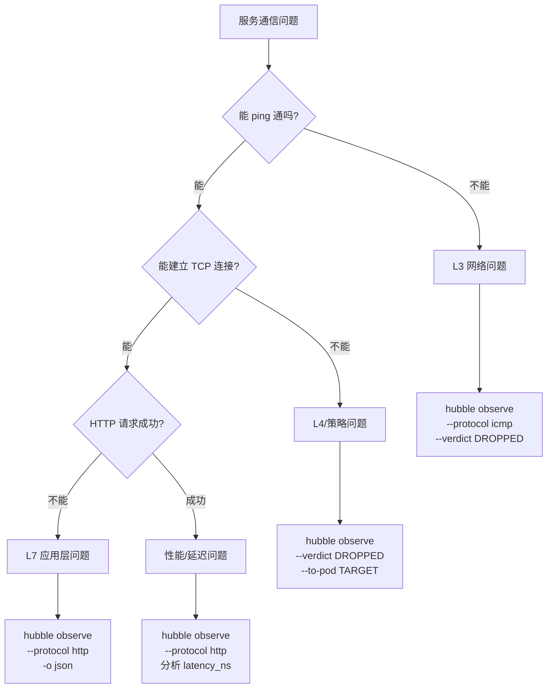

## 9.2 常见问题诊断 (Common Issue Diagnosis)

**问题 1: 服务无法访问**

```bash
# Step 1: 确认 Hubble 是否捕获到流量
hubble observe \
  --from-pod default/client-pod \
  --to-pod default/server-pod \
  --follow

# 如果没有输出 → 网络层面问题
# 如果有 DROPPED → 网络策略问题

# Step 2: 查看丢包原因
hubble observe \
  --to-pod default/server-pod \
  --verdict DROPPED \
  -o json | jq '{
    time: .flow.time,
    src: .flow.source.pod_name,
    reason: .flow.drop_reason_desc,
    policy: .flow.traffic_direction
  }'

# 常见 drop_reason:
# - Policy denied  → 被网络策略拒绝
# - Host unreachable → 路由问题
# - CT: Missing entry → 连接跟踪问题
```

**问题 2: 间歇性超时**

```bash
# 查看 TCP RST 事件
hubble observe \
  --namespace production \
  --protocol tcp \
  -o json | \
  jq 'select(.flow.l4.TCP.flags.RST == true) | {
    time: .flow.time,
    src: .flow.source.pod_name,
    dst: .flow.destination.pod_name,
    dst_port: .flow.l4.TCP.destination_port
  }'

# 查看 HTTP 5xx 错误
hubble observe \
  --namespace production \
  --protocol http \
  -o json | \
  jq 'select(.flow.l7.http.code >= 500) | {
    time: .flow.time,
    src: .flow.source.pod_name,
    dst: .flow.destination.pod_name,
    status: .flow.l7.http.code,
    path: .flow.l7.http.url,
    latency_ms: (.flow.l7.latency_ns / 1000000)
  }'
```

**问题 3: DNS 解析失败**

```bash
# 查看 DNS 查询失败
hubble observe \
  --namespace production \
  --protocol dns \
  -o json | \
  jq 'select(.flow.l7.dns.rcode != null and .flow.l7.dns.rcode != 0) | {
    time: .flow.time,
    pod: .flow.source.pod_name,
    query: .flow.l7.dns.query,
    rcode: .flow.l7.dns.rcode,
    qtypes: .flow.l7.dns.qtypes
  }'

# 常见 rcode:
# 0: No Error (成功)
# 1: Format Error
# 2: Server Failure
# 3: Non-Existent Domain (NXDOMAIN)
# 5: Refused

# 统计 NXDOMAIN Top 10 查询
hubble observe --protocol dns --since 1h -o json | \
  jq 'select(.flow.l7.dns.rcode == 3) | .flow.l7.dns.query' | \
  sort | uniq -c | sort -rn | head -10
```

## 9.3 Cilium 内置诊断工具 (Built-in Diagnostic Tools)

> ⚠️ **🟡 中危变更** — 变更集群资源状态，建议先 --dry-run 或 diff 确认
> - `kubectl exec`：进入容器执行命令，可能改变容器状态

``` bash
# 🟡 中风险：会修改集群/资源状态，执行前请确认目标、影响范围与授权
# 使用 cilium CLI 进行诊断
# 安装 cilium CLI
curl -L --fail --remote-name-all \
  https://github.com/cilium/cilium-cli/releases/latest/download/cilium-linux-amd64.tar.gz
tar xzvf cilium-linux-amd64.tar.gz
sudo mv cilium /usr/local/bin

# 检查 Cilium 整体状态
cilium status --wait

# 诊断特定 pod 的连通性
cilium connectivity test \
  --test-namespace default \
  --connect-timeout 10s

# 查看端点策略
kubectl exec -n kube-system ds/cilium -- \
  cilium endpoint list

# 查看特定端点的策略规则
ENDPOINT_ID=1234
kubectl exec -n kube-system ds/cilium -- \
  cilium endpoint get $ENDPOINT_ID -o json | \
  jq '.status.policy'

# 查看 BPF 连接跟踪表
kubectl exec -n kube-system ds/cilium -- \
  cilium bpf ct list global | head -20

# 检查 identity 信息
kubectl exec -n kube-system ds/cilium -- \
  cilium identity list | grep "app=frontend"
```
## 9.4 网络诊断脚本 (Network Diagnostic Scripts)

```bash
#!/bin/bash
# network-diagnose.sh - 快速网络诊断脚本

NAMESPACE=${1:-default}
SRC_POD=${2}
DST_POD=${3}
DURATION=${4:-60}

echo "=== Hubble 网络诊断报告 ==="
echo "命名空间: $NAMESPACE"
echo "时间范围: ${DURATION}s"
echo ""

# 1. 总体流量统计
echo "--- 1. 总体流量统计 ---"
hubble observe \
  --namespace $NAMESPACE \
  --since ${DURATION}s \
  -o json 2>/dev/null | \
  jq -r '.flow.verdict' | \
  sort | uniq -c

echo ""

# 2. Drop 分析
echo "--- 2. Drop 原因分析 ---"
hubble observe \
  --namespace $NAMESPACE \
  --verdict DROPPED \
  --since ${DURATION}s \
  -o json 2>/dev/null | \
  jq -r '.flow.drop_reason_desc' | \
  sort | uniq -c | sort -rn | head -10

echo ""

# 3. HTTP 错误分析
echo "--- 3. HTTP 错误分析 ---"
hubble observe \
  --namespace $NAMESPACE \
  --protocol http \
  --since ${DURATION}s \
  -o json 2>/dev/null | \
  jq 'select(.flow.l7.http.code >= 400) | 
    [.flow.source.workload.name, 
     .flow.destination.workload.name,
     (.flow.l7.http.code | tostring)] | join(" -> ")' | \
  sort | uniq -c | sort -rn | head -10

echo ""

# 4. DNS 失败分析
echo "--- 4. DNS 失败查询 ---"
hubble observe \
  --namespace $NAMESPACE \
  --protocol dns \
  --since ${DURATION}s \
  -o json 2>/dev/null | \
  jq 'select(.flow.l7.dns.rcode != null and .flow.l7.dns.rcode != 0) | 
    .flow.l7.dns.query' | \
  sort | uniq -c | sort -rn | head -10

echo ""
echo "=== 诊断完成 ==="
```

## 9.5 常见错误与解决方案 (Common Errors & Solutions)

| 错误现象 | Hubble 观测命令 | 可能原因 | 解决方案 |
|---------|--------------|---------|---------|
| Pod 间无法通信 | `hubble observe --to-pod X --verdict DROPPED` | 网络策略拒绝 | 检查并修正 NetworkPolicy |
| HTTP 间歇 503 | `hubble observe --protocol http -o json | jq 'select(.flow.l7.http.code==503)'` | 上游服务不可用 | 检查目标服务健康状态 |
| DNS 解析慢 | `hubble observe --protocol dns -o json | jq '.flow.l7.latency_ns'` | CoreDNS 过载 | 增加 CoreDNS 副本数 |
| 大量 TCP RST | `hubble observe --protocol tcp -o json | jq 'select(.flow.l4.TCP.flags.RST)'` | 连接超时/内核参数 | 调整连接超时配置 |
| Egress 被拒 | `hubble observe --verdict DROPPED --traffic-direction EGRESS` | Egress 策略过严 | 添加必要 Egress 规则 |

---

<!-- chunk: 10. 企业级可观测性实践 -->## 10. 企业级可观测性实践

## 10.1 可观测性成熟度模型 (Observability Maturity Model)

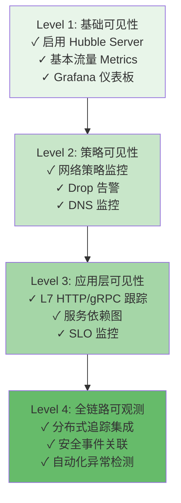

## 10.2 生产环境配置清单 (Production Checklist)

```yaml
# 生产环境 Hubble 配置最佳实践

# ✅ 1. 高可用 Relay 部署
hubble:
  relay:
    replicas: 2
    podDisruptionBudget:
      enabled: true
      maxUnavailable: 1

# ✅ 2. 资源限制配置
    resources:
      requests:
        cpu: 200m
        memory: 256Mi
      limits:
        cpu: 2000m
        memory: 2Gi

# ✅ 3. 增大 Flow 缓冲区 (高流量环境)
  bufferSize: 32768

# ✅ 4. TLS 加密通信
  tls:
    enabled: true
    auto:
      enabled: true
      method: certmanager

# ✅ 5. 完整 Metrics 配置
  metrics:
    enabled: true
    serviceMonitor:
      enabled: true
    
    config: |
      - name: dns
      - name: drop
      - name: tcp
      - name: flow
      - name: httpV2
        labelsContext:
        - source_namespace
        - source_workload  
        - destination_namespace
        - destination_workload

# ✅ 6. 审计日志导出
  export:
    static:
      enabled: true
      filePath: /var/run/cilium/hubble/events.log
      allowList:
      - '{"verdict":["DROPPED","AUDIT"]}'
```

## 10.3 SLO 监控配置 (SLO Monitoring)

```yaml
# 基于 Hubble Metrics 的 SLO 配置
# 使用 Pyrra 或 Sloth 工具自动生成 SLO recording rules

# 示例: production 命名空间 API 可用性 SLO
apiVersion: monitoring.coreos.com/v1
kind: PrometheusRule
metadata:
  name: hubble-slo-production
  namespace: monitoring
spec:
  groups:
  - name: slo.availability
    rules:
    # HTTP 可用性 (5xx 错误率 < 1%)
    - record: slo:hubble_http_availability:ratio_rate5m
      expr: |
        1 - (
          sum(rate(hubble_http_requests_total{
            destination_namespace="production",
            status=~"5.."
          }[5m]))
          /
          sum(rate(hubble_http_requests_total{
            destination_namespace="production"
          }[5m]))
        )
    
    # HTTP 延迟 SLO (P99 < 500ms)
    - record: slo:hubble_http_latency_p99:5m
      expr: |
        histogram_quantile(0.99,
          sum(rate(hubble_http_request_duration_seconds_bucket{
            destination_namespace="production"
          }[5m])) by (le)
        )
    
    # 告警: SLO 违反
    - alert: ProductionSLOViolation
      expr: slo:hubble_http_availability:ratio_rate5m < 0.99
      for: 5m
      labels:
        severity: critical
        team: platform
      annotations:
        summary: "Production HTTP 可用性低于 99% SLO"
        runbook: "https://wiki.internal/runbooks/slo-violation"
```

## 10.4 多租户可观测性 (Multi-Tenant Observability)

> ⚠️ **🟡 中危变更** — 变更集群资源状态，建议先 --dry-run 或 diff 确认
> - `kubectl apply/create/replace`：创建/变更集群资源

``` bash
# 🟡 中风险：会修改集群/资源状态，执行前请确认目标、影响范围与授权
# 按团队隔离 Hubble 访问权限
# 使用 RBAC 控制 Hubble CLI 访问

# 为 dev-team 创建受限的 Hubble 访问
cat <<EOF | kubectl apply -f -
apiVersion: rbac.authorization.k8s.io/v1
kind: ClusterRole
metadata:
  name: hubble-observer-dev
rules:
- apiGroups: [""]
  resources: ["pods", "services", "namespaces"]
  verbs: ["get", "list", "watch"]
---
apiVersion: rbac.authorization.k8s.io/v1
kind: ClusterRoleBinding
metadata:
  name: hubble-observer-dev-binding
subjects:
- kind: Group
  name: dev-team
  apiGroup: rbac.authorization.k8s.io
roleRef:
  kind: ClusterRole
  name: hubble-observer-dev
  apiGroup: rbac.authorization.k8s.io
EOF

# dev-team 只能观察自己命名空间的流量
hubble observe --namespace dev-namespace --follow
```
## 10.5 与分布式追踪集成 (Distributed Tracing Integration)

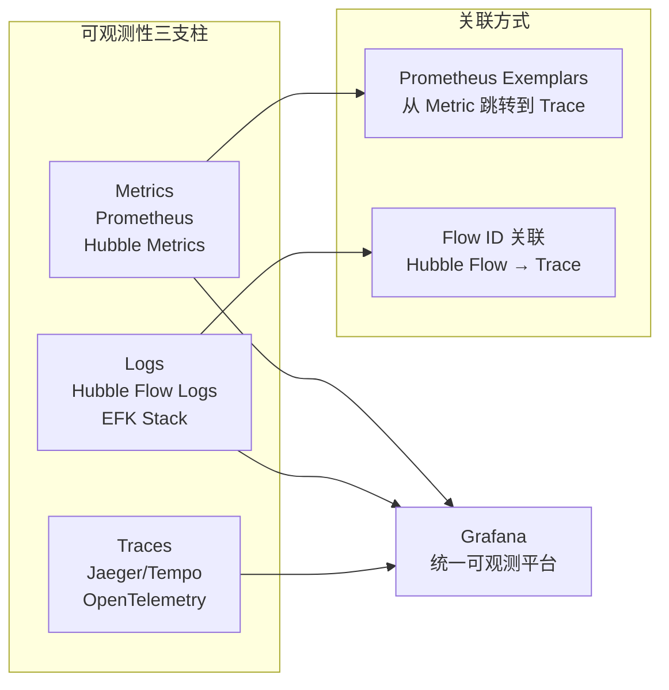

```yaml
# Hubble 导出 Flow 日志到 EFK
# Fluent Bit 配置收集 Hubble Flow 日志
apiVersion: v1
kind: ConfigMap
metadata:
  name: fluent-bit-hubble
  namespace: kube-system
data:
  fluent-bit.conf: |
    [SERVICE]
        Flush     1
        
    [INPUT]
        Name              tail
        Path              /var/run/cilium/hubble/events.log
        Parser            json
        Tag               hubble.*
        DB                /var/log/flb_hubble.db
        
    [FILTER]
        Name              record_modifier
        Match             hubble.*
        Record            cluster ${CLUSTER_NAME}
        Record            log_type hubble_flow
        
    [OUTPUT]
        Name              es
        Match             hubble.*
        Host              elasticsearch-master
        Port              9200
        Index             hubble-flows
        Type              _doc
```

## 10.6 容量规划建议 (Capacity Planning)

> ⚠️ **🟡 中危变更** — 变更集群资源状态，建议先 --dry-run 或 diff 确认
> - `kubectl exec`：进入容器执行命令，可能改变容器状态

``` bash
# 🟡 中风险：会修改集群/资源状态，执行前请确认目标、影响范围与授权
# 评估 Hubble 资源需求的指导原则

# 1. 估算每秒 Flow 数
# 典型: 每个 Pod 约 100-500 flows/s
# 公式: flows_per_second = pods * 300 (估算值)

# 2. Ring Buffer 大小
# bufferSize 应能容纳 ~10s 的 flows
# bufferSize = flows_per_second * 10

# 3. Relay 内存
# 每个活跃 flow 约 1KB
# relay_memory = peak_flows_per_second * 10 * 1KB

# 4. Prometheus 存储
# 每个 metric series 每天约 1-2 bytes
# 默认保留 15 天
# hubble_series * 15 * 2 bytes

# 监控 Hubble 自身资源使用
kubectl top pod -n kube-system -l k8s-app=cilium
kubectl top pod -n kube-system -l k8s-app=hubble-relay

# 查看 Hubble 内部统计
kubectl exec -n kube-system ds/cilium -- hubble status --all-nodes
```
## 10.7 安全加固 (Security Hardening)

```yaml
# Hubble 安全最佳实践

# 1. 启用 mTLS
hubble:
  tls:
    enabled: true
    server:
      extraDnsNames:
      - "hubble-relay.kube-system.svc"
    
# 2. 限制 UI 访问
  ui:
    ingress:
      annotations:
        # 仅允许内网访问
        nginx.ingress.kubernetes.io/whitelist-source-range: "10.0.0.0/8"
        # 启用认证
        nginx.ingress.kubernetes.io/auth-type: basic
        nginx.ingress.kubernetes.io/auth-secret: hubble-basic-auth

# 3. NetworkPolicy 保护 Hubble Relay
---
apiVersion: networking.k8s.io/v1
kind: NetworkPolicy
metadata:
  name: hubble-relay-netpol
  namespace: kube-system
spec:
  podSelector:
    matchLabels:
      k8s-app: hubble-relay
  policyTypes:
  - Ingress
  ingress:
  - from:
    - podSelector:
        matchLabels:
          k8s-app: hubble-ui
    - namespaceSelector:
        matchLabels:
          kubernetes.io/metadata.name: monitoring
    ports:
    - protocol: TCP
      port: 4245

# 4. 敏感数据过滤
  export:
    static:
      allowList:
      # 仅导出被拒绝的流量，不导出完整内容
      - '{"verdict":["DROPPED"]}'
      fieldMask:
      # 隐藏 L7 层数据 (可能含敏感信息)
      - time
      - source.namespace
      - destination.namespace
      - verdict
      - drop_reason
```

---

<!-- chunk: 参考资料 (References) -->## 参考资料 (References)

| 资源 | 链接 |
|------|------|
| Hubble 官方文档 | https://docs.cilium.io/en/stable/observability/hubble/ |
| Hubble GitHub | https://github.com/cilium/hubble |
| Cilium Slack #hubble | https://cilium.io/slack |
| Grafana Dashboard (官方) | https://grafana.com/grafana/dashboards/16611 |
| Hubble API Proto | https://github.com/cilium/cilium/tree/master/api/v1 |
| eBPF 可观测性博客 | https://isovalent.com/blog/ |

---

*文档版本: v1.0 | 适用 Cilium/Hubble 版本: >= 1.14 | 最后更新: 2026-03-03*

---

<!-- chunk: Obsidian 相关文档 -->## Obsidian 相关文档

- domain-35-ebpf-technology MOC
- [[网络/README.md|Domain 03: eBPF 技术体系 (eBPF Technology Stack)]]
- Domain-35 eBPF 技术 — 开源项目索引
- eBPF 架构基础与程序类型 (eBPF Architecture Fundamentals and Program T...
- eBPF Map 类型与数据结构 (eBPF Map Types and Data Structures)
- Cilium CNI 架构与部署 (Cilium CNI Architecture and Deployment)
- Cilium 网络策略 L3/L4/L7 (Cilium Network Policy L3/L4/L7)
- Cilium Service Mesh 无 Sidecar 架构 (Cilium Service Mesh Sideca...
- Tetragon 运行时安全 (Tetragon Runtime Security)
- bcc 与 bpftrace 工具链 (bcc and bpftrace Tools)
- eBPF 性能优化实践 (eBPF Performance Optimization Practice)
- eBPF 安全应用案例 (eBPF Security Applications and Use Cases)

## See Also

- 05-cilium-service-mesh
- 06-tetragon-runtime-security
- 08-bcc-bpftrace-tools
- 09-ebpf-performance-optimization


<!-- risk-assessed -->
