> **生产环境安全提示**
>
> 本文档包含可直接执行的运维命令。执行前请确认：当前目标集群与 Namespace 是否正确；是否具备足够的 RBAC 权限；是否已在非生产环境验证。命令风险等级标注：🔴 高风险（可能造成数据丢失或服务中断）、🟡 中风险（会修改集群状态，但通常可回滚）、🟢 低风险/只读（信息收集，无副作用）。


# Kubernetes [组件/技术名称] 全栈进阶培训 (从入门到专家)

> **适用版本**: Kubernetes v1.28 - v1.32 | **文档类型**: 全栈技术实战指南
> **目标受众**: 初级运维/开发、资深 SRE、架构师
> **培训时长**: 4-6 小时 | **难度等级**: ⭐⭐ - ⭐⭐⭐⭐⭐ (全覆盖)
> **核心原则**: 由浅入深、模块化教学、生产闭环

---

## 演示文稿模板结构（Standard Presentation Structure）

每篇 Presentation 必须严格遵循以下标准化结构。该结构经过教学实践验证，确保知识传递效率和学员吸收率。

### 结构总览

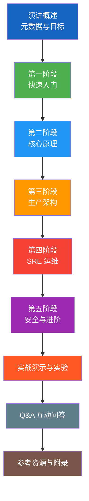
```mermaid
graph TD
    A[演讲概述<br/>元数据与目标] --> B[第一阶段<br/>快速入门]
    B --> C[第二阶段<br/>核心原理]
    C --> D[第三阶段<br/>生产架构]
    D --> E[第四阶段<br/>SRE 运维]
    E --> F[第五阶段<br/>安全与进阶]
    F --> G[实战演示与实验]
    G --> H[Q&A 互动问答]
    H --> I[参考资源与附录]

    style A fill:#1565C0,color:#fff
    style B fill:#4CAF50,color:#fff
    style C fill:#2196F3,color:#fff
    style D fill:#FF9800,color:#fff
    style E fill:#F44336,color:#fff
    style F fill:#9C27B0,color:#fff
    style G fill:#FF5722,color:#fff
    style H fill:#607D8B,color:#fff
    style I fill:#795548,color:#fff
```

### 标准章节列表

| 序号 | 章节 | 类型 | 必选 | 说明 |
|:---:|:---|:---:|:---:|:---|
| 0 | 演讲概述（Overview） | 元数据 | ✅ | 目标受众、时长、学习目标 |
| 1 | 第一阶段：快速入门与核心概念 | 理论 | ✅ | 为什么需要、最小示例、基础操作 |
| 2 | 第二阶段：核心架构与深度原理 | 理论 | ✅ | 设计哲学、工作机制、版本演进 |
| 3 | 第三阶段：生产部署与高可用架构 | 理论+实践 | ✅ | HA 架构、配置规范、性能优化 |
| 4 | 第四阶段：故障诊断与 SRE 运维 | 实践 | ✅ | 排障方法论、应急 SOP、巡检清单 |
| 5 | 第五阶段：高级进阶与安全加固 | 理论 | ○ | RBAC、安全策略、扩展开发 |
| 6 | 实战演示与动手实验 | 实验 | ✅ | 完整实验步骤、预期输出、验证方法 |
| 7 | Q&A 互动问答 | 互动 | ✅ | 预设问题、讨论引导 |
| 8 | 参考资源与附录 | 资料 | ✅ | 文档链接、命令速查、延伸阅读 |

---

## 每个章节的详细要求（Detailed Section Requirements）

### 第 0 章：演讲概述（Overview）

**目的：** 让学员和讲师快速了解本篇 Presentation 的定位、范围和预期成果。

**必须包含的内容：**

| 子项 | 说明 | 示例 |
|:---|:---|:---|
| 适用版本 | Kubernetes 版本范围 | `v1.28 - v1.32` |
| 文档类型 | 内容定位 | `全栈技术实战指南` / `安全治理专项` / `运维排障专项` |
| 核心原则 | 3 个关键词概括 | `掌握服务发现入口、极致性能调优、深度故障排查` |
| 目标受众 | 按角色分级（至少 3 类） | `网络初学者 / SRE 工程师 / 架构师 / 应用开发者` |
| 预计时长 | 按阶段拆分的时长表 | 见下方时长模板 |
| 核心学习目标 | 5-8 条可量化的学习目标 | `能够独立部署并配置 CoreDNS` |
| 前置要求 | 需要先完成的课程和技能 | `架构基础课程、DNS 基本概念` |
| 难度评级 | ⭐ 到 ⭐⭐⭐⭐⭐ | 见难度定义 |

**难度等级定义：**

| 等级 | 标记 | 适用人群 | 内容深度 |
|:---|:---:|:---|:---|
| 入门 | ⭐ | 零基础 | 概念解释、比喻说明、最简示例 |
| 基础 | ⭐⭐ | 有 [[实体/kubernetes.md|k8s]] 基础 | 核心资源对象、标准操作流程 |
| 中级 | ⭐⭐⭐ | 日常使用者 | 内部机制、性能分析、配置调优 |
| 高级 | ⭐⭐⭐⭐ | 资深运维/SRE | 生产架构设计、极限性能优化 |
| 专家 | ⭐⭐⭐⭐⭐ | 架构师/贡献者 | 源码分析、二次开发、前沿特性 |

**预计时长模板：**

```markdown
| 阶段 | 内容 | 时长 |
|------|------|------|
| 第一阶段 | [阶段名称] | XX 分钟 |
| 第二阶段 | [阶段名称] | XX 分钟 |
| 第三阶段 | [阶段名称] | XX 分钟 |
| 第四阶段 | [阶段名称] | XX 分钟 |
| 第五阶段 | [阶段名称] | XX 分钟 |
| 第六阶段 | 实战演示与动手实验 | XX 分钟 |
| Q&A | 互动问答 | 15 分钟 |
| **合计** | | **约 X 小时** |
```

---

### 第 1 章：快速入门与核心概念（Beginner — 45min）

**目的：** 建立认知基线，让零基础学员理解"为什么"和"是什么"。

**结构要求：**

```markdown
### 🔰 第一阶段：快速入门与核心概念 (Beginner - 45min)

1. **为什么需要 [组件名称]？** (10min)
   - 解决什么痛点？（用具体的生产场景举例）
   - 没有它会怎样？（对比 Before/After）
   - 在 K8S 整体架构中的位置（架构图标注）

2. **核心资源对象初识** (20min)
   - 最小配置示例（Hello World YAML）
   - 关键字段及其含义逐行解析
   - 使用生活化比喻解释抽象概念

3. **常用操作与简单实验** (15min)
   - 基础命令行操作（CRUD: Create/Read/Update/Delete）
   - 查看状态与基本排障
   - 学员跟随操作的微实验（5 分钟可完成）

```

**写作要求：**

- 痛点描述必须引用真实生产场景，不得使用虚构案例
- 最小配置示例必须是可直接 `kubectl apply` 的完整 YAML
- 比喻应贴近日常生活（如"调度器像公司的 HR 分配工位"）
- 每个概念后附"一句话总结"框

---

### 第 2 章：核心架构与深度原理（Deep Dive — 60min）

**目的：** 深入理解内部机制，建立系统性认知模型。

**结构要求：**

```markdown
### 📘 第二阶段：核心架构与深度原理 (Deep Dive - 60min)

4. **架构演进与设计哲学** (20min)
   - 原生设计理念分析（Why it was built this way）
   - 核心组件交互模型（Informer / Control Loop / Event 驱动）
   - 数据结构与存储模型解析

5. **核心工作机制详解** (25min)
   - 全生命周期流量/状态追踪（从请求到响应的完整链路）
   - 底层内核/网络交互逻辑（系统调用、Netfilter、eBPF 等）
   - 并发冲突处理与一致性保障（ResourceVersion、CAS、Finalizer）

6. **版本特性差异与演进** (15min)
   - 关键版本的 Breaking Changes
   - Alpha → Beta → GA 的特性成熟路径
   - 废弃 API 的迁移指南
```

**必须包含的 Mermaid 图表：**

1. **组件交互图** — 展示本组件与 K8s 其他组件的调用关系
2. **状态流转图** — 展示资源对象的完整生命周期
3. **数据流图** — 展示请求在系统中的流转路径

**写作要求：**

- 每个原理需配合源码级别的注释或伪代码
- 使用 `kubectl get -o yaml` 的真实输出展示关键字段
- 底层机制需引用 Linux 内核文档或 RFC

---

### 第 3 章：生产部署与高可用架构（Architecture — 90min）

**目的：** 掌握生产级架构设计、配置规范和性能调优。

**结构要求：**

```markdown
### ⚡ 第三阶段：生产部署与高可用架构 (Architecture - 90min)

7. **企业级高可用与配置规范** (30min)
   - 高可用拓扑设计（多副本/多可用区/多集群）
   - 容灾逻辑与故障域定义
   - 生产环境基准配置（Baseline）与优化参数
   - 配置模板（可直接用于生产环境的 YAML）

8. **监控、告警与可观测性** (25min)
   - 黄金指标体系（Latency / Errors / Saturation / Throughput）
   - Prometheus + Grafana 深度集成方案
   - 关键告警规则（含 PromQL 表达式）
   - Dashboard JSON 模板引用

9. **极致性能优化实践** (35min)
   - 性能瓶颈识别方法论（FlameGraph / pprof / benchmark）
   - 内核级调优参数（sysctl / etcd / gRPC）
   - 横向扩展策略与容量规划
   - 性能基准对比表（调优前后 QPS/延迟/资源消耗）
```

**必须包含的配置示例：**

- 生产级 YAML（含注释说明每个字段的含义和推荐值）
- Prometheus 告警规则（含阈值依据）
- 性能调优参数表（含默认值、推荐值、影响范围）

---

### 第 4 章：故障诊断与 SRE 运维（SRE Ops — 60min）

**目的：** 建立系统化的故障排查能力和运维 SOP。

**结构要求：**

```markdown
### 🛠️ 第四阶段：故障诊断与 SRE 运维 (SRE Ops - 60min)

10. **故障排查方法论与实战** (30min)
    - 分层诊断模型（应用层 → 网络层 → 存储层 → 节点层 → 控制平面）
    - 诊断工具箱实战（kubectl / crictl / tcpdump / strace / ebpf）
    - 典型案例复盘（至少 3 个真实问题案例）
      - 问题现象 → 排查过程 → 根因 → 修复方案 → 预防措施

11. **应急响应与预防性维护** (30min)
    - 止损/降级 SOP（标准操作流程）
    - 自动化健康检查与自愈机制
    - 定期巡检清单（按频率分级：每日/每周/每月）
    - Change Management 最佳实践
```

**问题案例模板：**

```markdown
#### 案例 X: [问题标题]

| 属性 | 内容 |
|:---|:---|
| **问题等级** | P1/P2/P3/P4 |
| **问题现象** | [具体现象描述] |
| **影响范围** | [受影响的服务/用户/数据量] |
| **排查过程** | [按时间线的排查步骤] |
| **根因分析** | [技术根因 + 流程根因] |
| **修复方案** | [临时修复 + 长期修复] |
| **预防措施** | [监控/告警/流程改进] |
| **经验教训** | [关键 Takeaway] |
```

---

### 第 5 章：高级进阶与安全加固（Advanced — 30min）

**目的：** 补充安全、扩展和前沿话题，满足专家级学员需求。

**结构要求：**

```markdown
### 🛡️ 第五阶段：高级进阶与安全加固 (Advanced - 30min)

12. **安全加固、扩展功能与未来演进**
    - RBAC 最小权限配置
    - Pod Security Standards (PSS) 策略
    - NetworkPolicy 网络隔离
    - 自定义扩展开发（CRD / Operator / Webhook）
    - 第三方集成方案
    - 社区演进方向与 Roadmap
```

---

## 视觉设计指南（Visual Design Guidelines）

### 配色规范

本培训体系采用统一的配色方案，确保所有 Presentation 视觉风格一致。

| 用途 | 颜色 | 色值 | 使用场景 |
|:---|:---|:---:|:---|
| 主色 — Kubernetes 蓝 | 🔵 | `#326CE5` | 标题、核心组件、架构图 |
| 辅助色 — 成功绿 | 🟢 | `#4CAF50` | 正常状态、入门级内容 |
| 警告色 — 橙色 | 🟠 | `#FF9800` | 注意事项、中级内容 |
| 危险色 — 红色 | 🔴 | `#F44336` | 红线规则、高危操作 |
| 高级色 — 紫色 | 🟣 | `#9C27B0` | 高级内容、扩展话题 |
| 中性色 — 灰色 | ⚪ | `#607D8B` | 注释、次要信息 |
| 背景色 — 浅灰 | ◻️ | `#F5F5F5` | 代码块背景 |

### Mermaid 图表配色

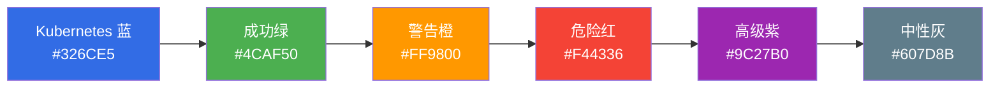
```mermaid
graph LR
    A[Kubernetes 蓝<br/>#326CE5] --> B[成功绿<br/>#4CAF50]
    B --> C[警告橙<br/>#FF9800]
    C --> D[危险红<br/>#F44336]
    D --> E[高级紫<br/>#9C27B0]
    E --> F[中性灰<br/>#607D8B]

    style A fill:#326CE5,color:#fff
    style B fill:#4CAF50,color:#fff
    style C fill:#FF9800,color:#fff
    style D fill:#F44336,color:#fff
    style E fill:#9C27B0,color:#fff
    style F fill:#607D8B,color:#fff
```

### Mermaid 样式模板

在所有 Mermaid 图表中使用以下统一样式：

```
%% 节点样式
style Kubernetes组件 fill:#326CE5,color:#fff
style 正常状态 fill:#4CAF50,color:#fff
style 警告状态 fill:#FF9800,color:#fff
style 错误状态 fill:#F44336,color:#fff
style 高级概念 fill:#9C27B0,color:#fff
style 外部系统 fill:#607D8B,color:#fff
```

### Markdown 格式规范

| 元素 | 格式 | 示例 |
|:---|:---|:---|
| 难度标记 | Emoji + 粗体 | `🔰 **入门级**` / `📘 **中级**` / `⚡ **高级**` |
| 命令 | 反引号代码块 | `` ```bash ``` `` |
| YAML | 带语法高亮 | `` ```yaml ``` `` |
| 关键术语 | 加粗 + 英文 | `**声明式 API (Declarative API)**` |
| 警告信息 | 引用块 + 红线标记 | `> **🔴 红线:** 严禁...` |
| 对比 | 表格 | Before/After 对比表 |
| 输出示例 | 纯文本代码块 | `` ```text ``` `` |

### 代码块规范

```yaml
# ✅ 正确示例：每个关键字段都有注释
apiVersion: apps/v1
kind: Deployment
metadata:
  name: my-app              # 应用名称
  namespace: production     # 生产环境命名空间
spec:
  replicas: 3               # 生产环境至少 3 副本
  selector:
    matchLabels:
      app: my-app
  template:
    spec:
      containers:
      - name: my-app
        image: my-app:v1.2.3  # 使用明确的版本标签，禁止 :latest
        resources:
          requests:             # 🔴 红线：必须设置 requests
            cpu: 100m
            memory: 128Mi
          limits:
            cpu: 500m
            memory: 512Mi
```

---

## Mermaid 图表模板库（Mermaid Diagram Template Library）

以下提供 12 种常用 Mermaid 图表模板，可直接复制使用。

### 1. 组件交互架构图（Component Architecture）

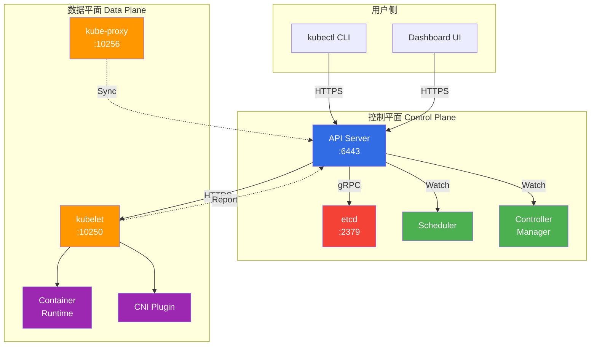
```mermaid
graph TB
    subgraph 用户侧
        CLI[kubectl CLI]
        UI[Dashboard UI]
    end

    subgraph 控制平面 Control Plane
        API[API Server<br/>:6443]
        ETCD[etcd<br/>:2379]
        SCHED[Scheduler]
        CM[Controller<br/>Manager]
    end

    subgraph 数据平面 Data Plane
        KUBELET[kubelet<br/>:10250]
        PROXY[kube-proxy<br/>:10256]
        CRI[Container<br/>Runtime]
        CNI[CNI Plugin]
    end

    CLI -->|HTTPS| API
    UI -->|HTTPS| API
    API -->|gRPC| ETCD
    API -->|Watch| SCHED
    API -->|Watch| CM
    API -->|HTTPS| KUBELET
    KUBELET --> CRI
    KUBELET --> CNI
    KUBELET -.->|Report| API
    PROXY -.->|Sync| API

    style API fill:#326CE5,color:#fff
    style ETCD fill:#F44336,color:#fff
    style SCHED fill:#4CAF50,color:#fff
    style CM fill:#4CAF50,color:#fff
    style KUBELET fill:#FF9800,color:#fff
    style PROXY fill:#FF9800,color:#fff
    style CRI fill:#9C27B0,color:#fff
    style CNI fill:#9C27B0,color:#fff
```

### 2. 请求生命周期时序图（Request Lifecycle Sequence）

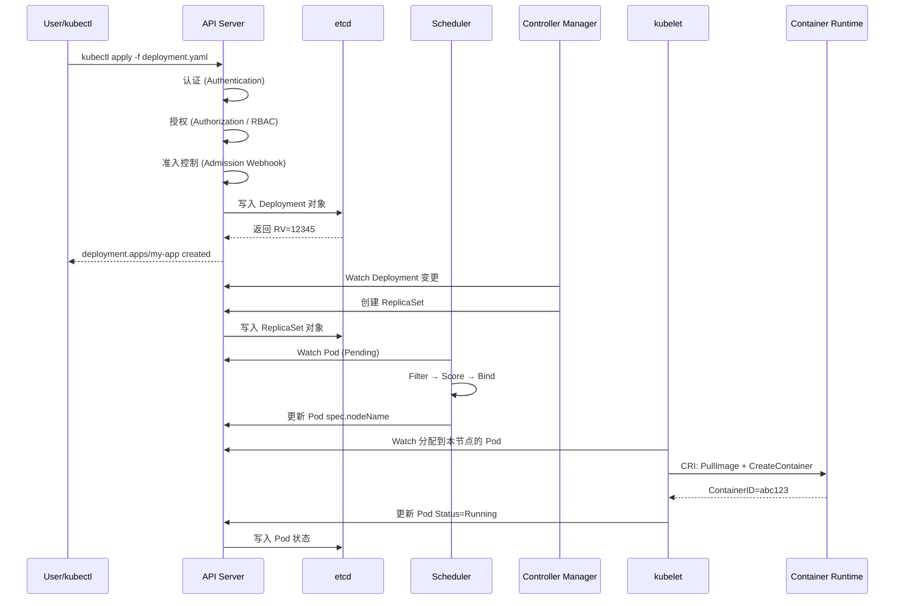
```mermaid
sequenceDiagram
    participant U as User/kubectl
    participant A as API Server
    participant E as etcd
    participant S as Scheduler
    participant CM as Controller Manager
    participant K as kubelet
    participant C as Container Runtime

    U->>A: kubectl apply -f deployment.yaml
    A->>A: 认证 (Authentication)
    A->>A: 授权 (Authorization / RBAC)
    A->>A: 准入控制 (Admission Webhook)
    A->>E: 写入 Deployment 对象
    E-->>A: 返回 RV=12345
    A-->>U: deployment.apps/my-app created

    CM->>A: Watch Deployment 变更
    CM->>A: 创建 ReplicaSet
    A->>E: 写入 ReplicaSet 对象

    S->>A: Watch Pod (Pending)
    S->>S: Filter → Score → Bind
    S->>A: 更新 Pod spec.nodeName

    K->>A: Watch 分配到本节点的 Pod
    K->>C: CRI: PullImage + CreateContainer
    C-->>K: ContainerID=abc123
    K->>A: 更新 Pod Status=Running
    A->>E: 写入 Pod 状态
```

### 3. 状态流转图（State Machine）

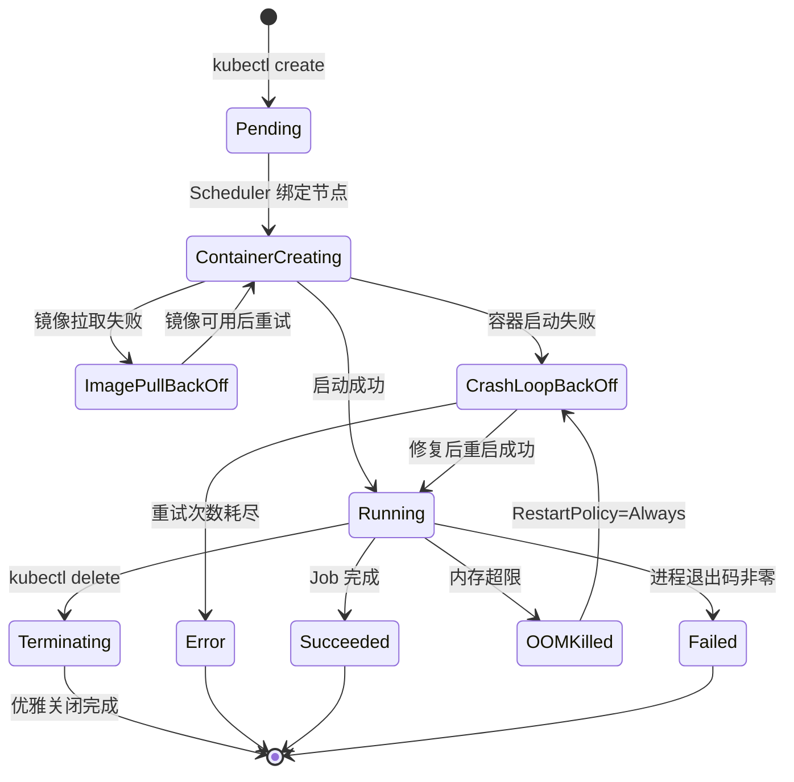
```mermaid
stateDiagram-v2
    [*] --> Pending: kubectl create
    Pending --> ContainerCreating: Scheduler 绑定节点
    ContainerCreating --> ImagePullBackOff: 镜像拉取失败
    ImagePullBackOff --> ContainerCreating: 镜像可用后重试
    ContainerCreating --> CrashLoopBackOff: 容器启动失败
    ContainerCreating --> Running: 启动成功
    CrashLoopBackOff --> Running: 修复后重启成功
    CrashLoopBackOff --> Error: 重试次数耗尽
    Running --> Succeeded: Job 完成
    Running --> Failed: 进程退出码非零
    Running --> OOMKilled: 内存超限
    Running --> Terminating: kubectl delete
    Terminating --> [*]: 优雅关闭完成
    Error --> [*]
    Succeeded --> [*]
    Failed --> [*]
    OOMKilled --> CrashLoopBackOff: RestartPolicy=Always
```

### 4. 网络流量路径图（Network Traffic Flow）

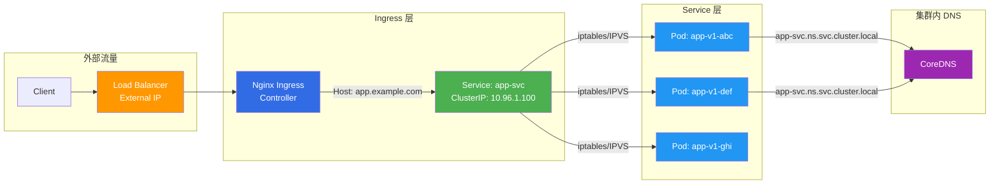
```mermaid
graph LR
    subgraph 外部流量
        CLIENT[Client] --> LB[Load Balancer<br/>External IP]
    end

    subgraph Ingress 层
        LB --> ING[Nginx Ingress<br/>Controller]
        ING -->|Host: app.example.com| SVC1[Service: app-svc<br/>ClusterIP: 10.96.1.100]
    end

    subgraph Service 层
        SVC1 -->|iptables/IPVS| POD1[Pod: app-v1-abc]
        SVC1 -->|iptables/IPVS| POD2[Pod: app-v1-def]
        SVC1 -->|iptables/IPVS| POD3[Pod: app-v1-ghi]
    end

    subgraph 集群内 DNS
        POD1 -->|app-svc.ns.svc.cluster.local| DNS[CoreDNS]
        POD2 -->|app-svc.ns.svc.cluster.local| DNS
    end

    style LB fill:#FF9800,color:#fff
    style ING fill:#326CE5,color:#fff
    style SVC1 fill:#4CAF50,color:#fff
    style POD1 fill:#2196F3,color:#fff
    style POD2 fill:#2196F3,color:#fff
    style POD3 fill:#2196F3,color:#fff
    style DNS fill:#9C27B0,color:#fff
```

### 5. 控制器 Reconcile Loop 流程图

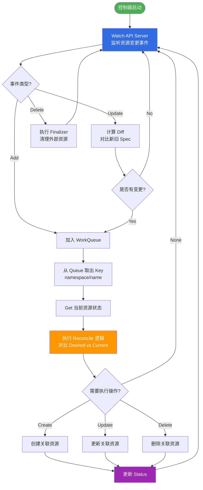
```mermaid
flowchart TD
    START([控制器启动]) --> WATCH[Watch API Server<br/>监听资源变更事件]
    WATCH --> EVENT{事件类型?}

    EVENT -->|Add| ADD_Q[加入 WorkQueue]
    EVENT -->|Update| DIFF[计算 Diff<br/>对比新旧 Spec]
    EVENT -->|Delete| CLEANUP[执行 Finalizer<br/>清理外部资源]

    DIFF --> CHANGE{是否有变更?}
    CHANGE -->|Yes| ADD_Q
    CHANGE -->|No| WATCH

    ADD_Q --> DEQUEUE[从 Queue 取出 Key<br/>namespace/name]
    DEQUEUE --> GET[Get 当前资源状态]
    GET --> RECONCILE[执行 Reconcile 逻辑<br/>对比 Desired vs Current]
    RECONCILE --> ACTION{需要执行操作?}

    ACTION -->|Create| CREATE[创建关联资源]
    ACTION -->|Update| UPDATE[更新关联资源]
    ACTION -->|Delete| DEL[删除关联资源]
    ACTION -->|None| WATCH

    CREATE --> UPDATE_STATUS[更新 Status]
    UPDATE --> UPDATE_STATUS
    DEL --> UPDATE_STATUS
    UPDATE_STATUS --> WATCH
    CLEANUP --> WATCH

    style START fill:#4CAF50,color:#fff
    style WATCH fill:#326CE5,color:#fff
    style RECONCILE fill:#FF9800,color:#fff
    style UPDATE_STATUS fill:#9C27B0,color:#fff
```

### 6. CSI 卷挂载流程图（CSI Volume Mount）

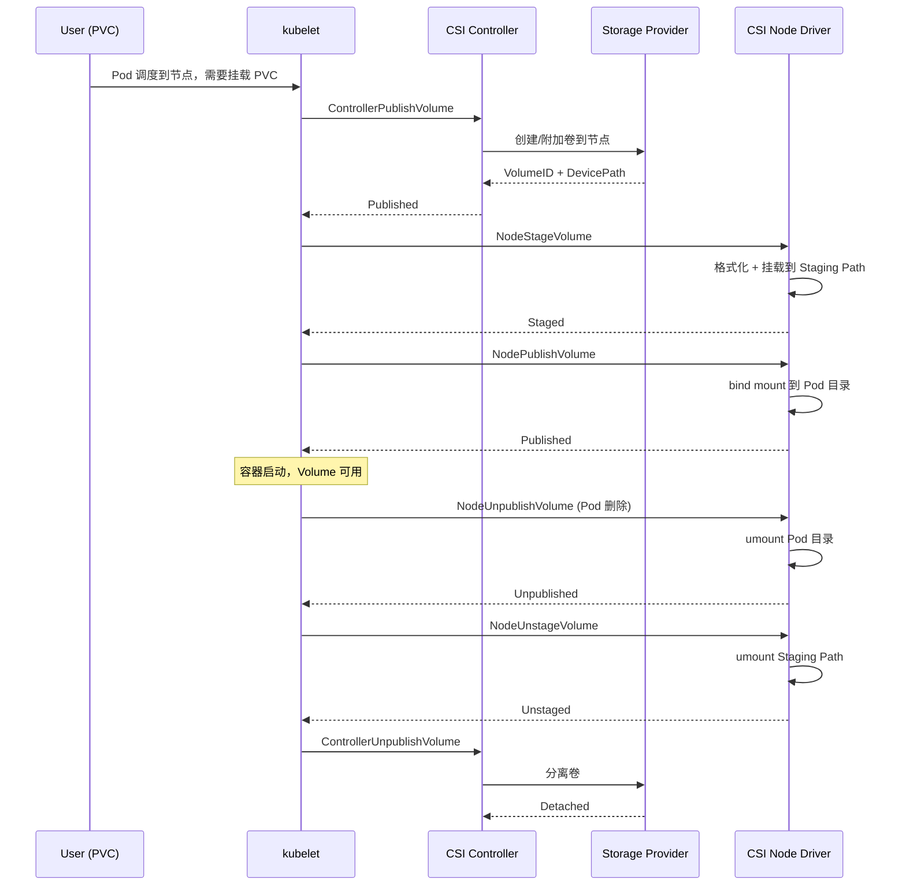
```mermaid
sequenceDiagram
    participant U as User (PVC)
    participant K as kubelet
    participant CSI as CSI Controller
    participant SP as Storage Provider
    participant NC as CSI Node Driver

    U->>K: Pod 调度到节点，需要挂载 PVC
    K->>CSI: ControllerPublishVolume
    CSI->>SP: 创建/附加卷到节点
    SP-->>CSI: VolumeID + DevicePath
    CSI-->>K: Published

    K->>NC: NodeStageVolume
    NC->>NC: 格式化 + 挂载到 Staging Path
    NC-->>K: Staged

    K->>NC: NodePublishVolume
    NC->>NC: bind mount 到 Pod 目录
    NC-->>K: Published

    Note over K: 容器启动，Volume 可用

    K->>NC: NodeUnpublishVolume (Pod 删除)
    NC->>NC: umount Pod 目录
    NC-->>K: Unpublished

    K->>NC: NodeUnstageVolume
    NC->>NC: umount Staging Path
    NC-->>K: Unstaged

    K->>CSI: ControllerUnpublishVolume
    CSI->>SP: 分离卷
    SP-->>CSI: Detached
```

### 7. RBAC 权限模型类图（RBAC Class Diagram）

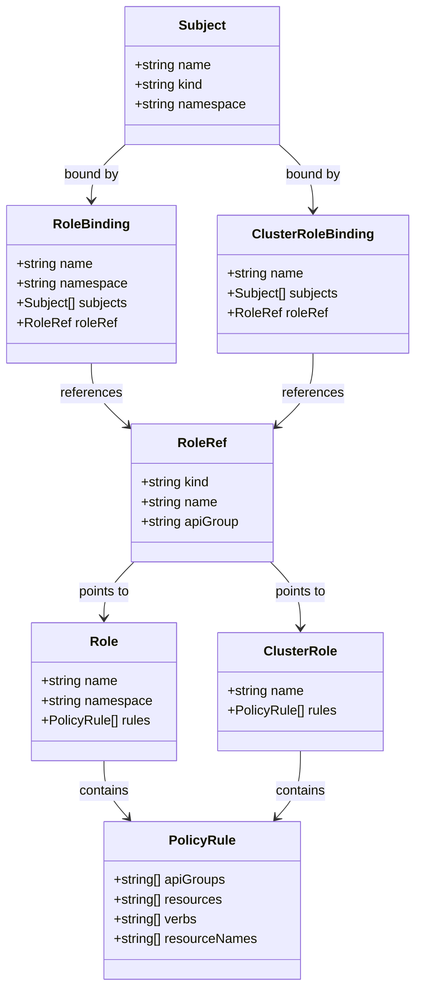
```mermaid
classDiagram
    class Subject {
        +string name
        +string kind
        +string namespace
    }

    class RoleBinding {
        +string name
        +string namespace
        +Subject[] subjects
        +RoleRef roleRef
    }

    class ClusterRoleBinding {
        +string name
        +Subject[] subjects
        +RoleRef roleRef
    }

    class RoleRef {
        +string kind
        +string name
        +string apiGroup
    }

    class Role {
        +string name
        +string namespace
        +PolicyRule[] rules
    }

    class ClusterRole {
        +string name
        +PolicyRule[] rules
    }

    class PolicyRule {
        +string[] apiGroups
        +string[] resources
        +string[] verbs
        +string[] resourceNames
    }

    Subject --> RoleBinding : bound by
    RoleBinding --> RoleRef : references
    RoleRef --> Role : points to
    RoleRef --> ClusterRole : points to
    Role --> PolicyRule : contains
    ClusterRole --> PolicyRule : contains
    Subject --> ClusterRoleBinding : bound by
    ClusterRoleBinding --> RoleRef : references
```

### 8. 调度器决策流程图（Scheduler Decision）

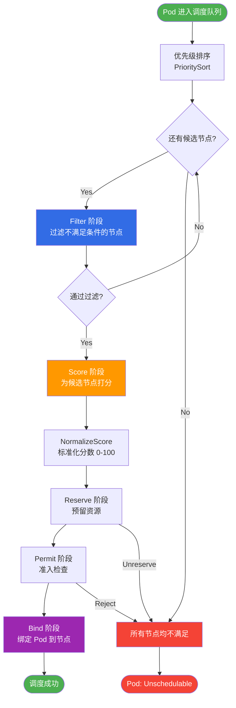
```mermaid
flowchart TD
    START([Pod 进入调度队列]) --> SORT[优先级排序<br/>PrioritySort]

    SORT --> CYCLE{还有候选节点?}
    CYCLE -->|Yes| FILTER[Filter 阶段<br/>过滤不满足条件的节点]

    FILTER --> FILTER_RESULT{通过过滤?}
    FILTER_RESULT -->|No| CYCLE
    FILTER_RESULT -->|Yes| SCORE[Score 阶段<br/>为候选节点打分]

    SCORE --> NORMALIZE[NormalizeScore<br/>标准化分数 0-100]
    NORMALIZE --> RESERVE[Reserve 阶段<br/>预留资源]
    RESERVE --> PERMIT[Permit 阶段<br/>准入检查]
    PERMIT --> BIND[Bind 阶段<br/>绑定 Pod 到节点]
    BIND --> SUCCESS([调度成功])

    CYCLE -->|No| FAIL[所有节点均不满足]
    PERMIT -->|Reject| FAIL
    RESERVE -->|Unreserve| FAIL
    FAIL --> UNSCHEDULABLE([Pod: Unschedulable])

    style START fill:#4CAF50,color:#fff
    style SUCCESS fill:#4CAF50,color:#fff
    style FILTER fill:#326CE5,color:#fff
    style SCORE fill:#FF9800,color:#fff
    style BIND fill:#9C27B0,color:#fff
    style FAIL fill:#F44336,color:#fff
    style UNSCHEDULABLE fill:#F44336,color:#fff
```

### 9. 可观测性三大支柱关系图（Observability Three Pillars）

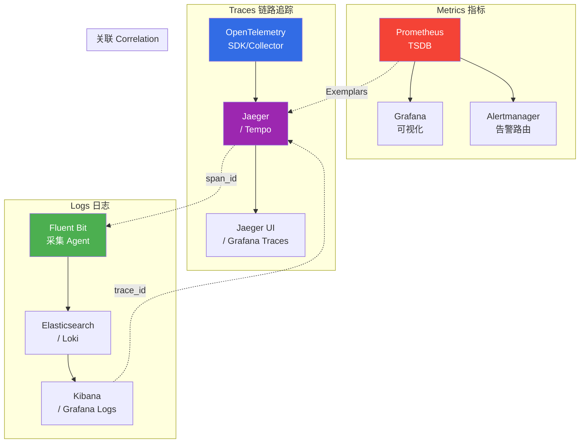
```mermaid
graph TB
    subgraph Metrics 指标
        PROM[Prometheus<br/>TSDB]
        GRF[Grafana<br/>可视化]
        AM[Alertmanager<br/>告警路由]
        PROM --> GRF
        PROM --> AM
    end

    subgraph Logs 日志
        FLB[Fluent Bit<br/>采集 Agent]
        ES[Elasticsearch<br/>/ Loki]
        KIB[Kibana<br/>/ Grafana Logs]
        FLB --> ES
        ES --> KIB
    end

    subgraph Traces 链路追踪
        OTEL[OpenTelemetry<br/>SDK/Collector]
        JAEGER[Jaeger<br/>/ Tempo]
        JUI[Jaeger UI<br/>/ Grafana Traces]
        OTEL --> JAEGER
        JAEGER --> JUI
    end

    subgraph 关联 Correlation
        PROM -.->|Exemplars| JAEGER
        KIB -.->|trace_id| JAEGER
        JAEGER -.->|span_id| FLB
    end

    style PROM fill:#F44336,color:#fff
    style FLB fill:#4CAF50,color:#fff
    style OTEL fill:#326CE5,color:#fff
    style JAEGER fill:#9C27B0,color:#fff
```

### 10. Deployment 滚动更新流程图（Rolling Update）

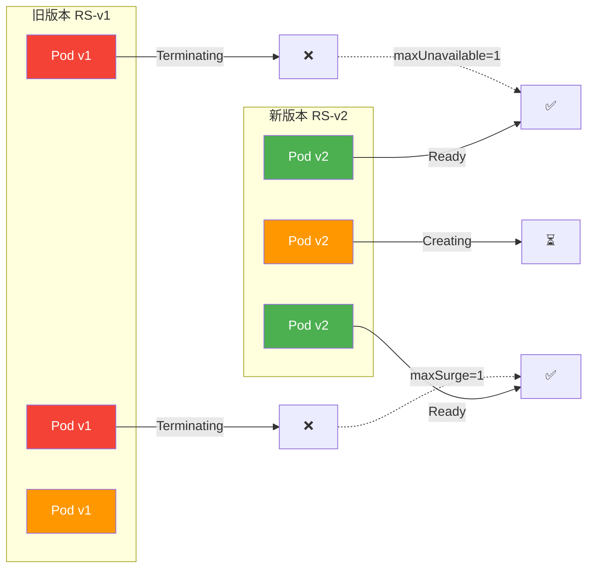
```mermaid
flowchart LR
    subgraph 旧版本 RS-v1
        P1[Pod v1]
        P2[Pod v1]
        P3[Pod v1]
    end

    subgraph 新版本 RS-v2
        P4[Pod v2]
        P5[Pod v2]
        P6[Pod v2]
    end

    P1 -->|Terminating| X1[❌]
    P2 -->|Terminating| X2[❌]

    P4 -->|Ready| R1[✅]
    P5 -->|Ready| R2[✅]
    P6 -->|Creating| R3[⏳]

    X1 -.->|maxUnavailable=1| R1
    X2 -.->|maxSurge=1| R2

    style P1 fill:#F44336,color:#fff
    style P2 fill:#F44336,color:#fff
    style P3 fill:#FF9800,color:#fff
    style P4 fill:#4CAF50,color:#fff
    style P5 fill:#4CAF50,color:#fff
    style P6 fill:#FF9800,color:#fff
```

### 11. 分层排障模型图（Layered Troubleshooting）

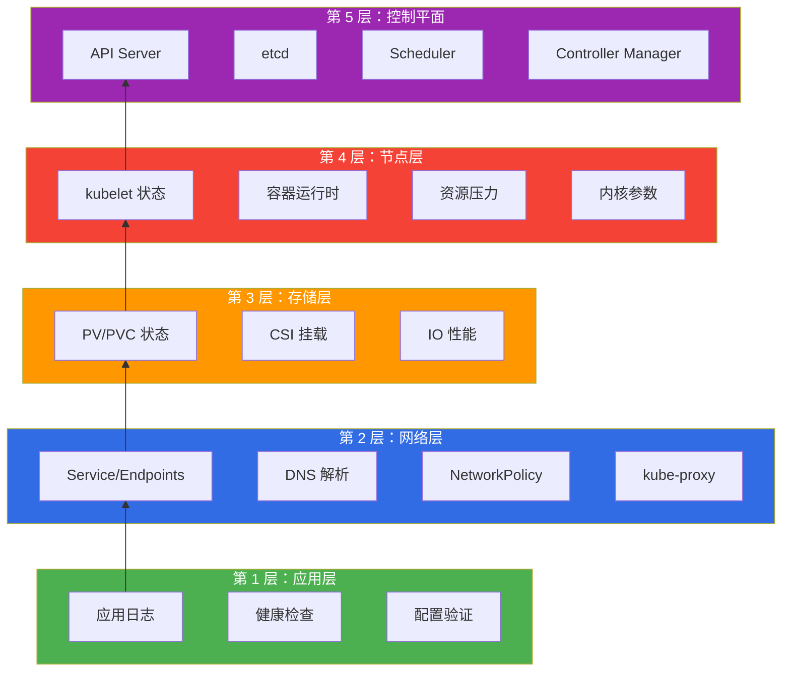
```mermaid
graph BT
    subgraph L1["第 1 层：应用层"]
        A1[应用日志]
        A2[健康检查]
        A3[配置验证]
    end

    subgraph L2["第 2 层：网络层"]
        N1[Service/Endpoints]
        N2[DNS 解析]
        N3[NetworkPolicy]
        N4[kube-proxy]
    end

    subgraph L3["第 3 层：存储层"]
        S1[PV/PVC 状态]
        S2[CSI 挂载]
        S3[IO 性能]
    end

    subgraph L4["第 4 层：节点层"]
        D1[kubelet 状态]
        D2[容器运行时]
        D3[资源压力]
        D4[内核参数]
    end

    subgraph L5["第 5 层：控制平面"]
        C1[API Server]
        C2[etcd]
        C3[Scheduler]
        C4[Controller Manager]
    end

    A1 --> N1
    N1 --> S1
    S1 --> D1
    D1 --> C1

    style L1 fill:#4CAF50,color:#fff
    style L2 fill:#326CE5,color:#fff
    style L3 fill:#FF9800,color:#fff
    style L4 fill:#F44336,color:#fff
    style L5 fill:#9C27B0,color:#fff
```

### 12. Service 类型对比图（Service Types Comparison）

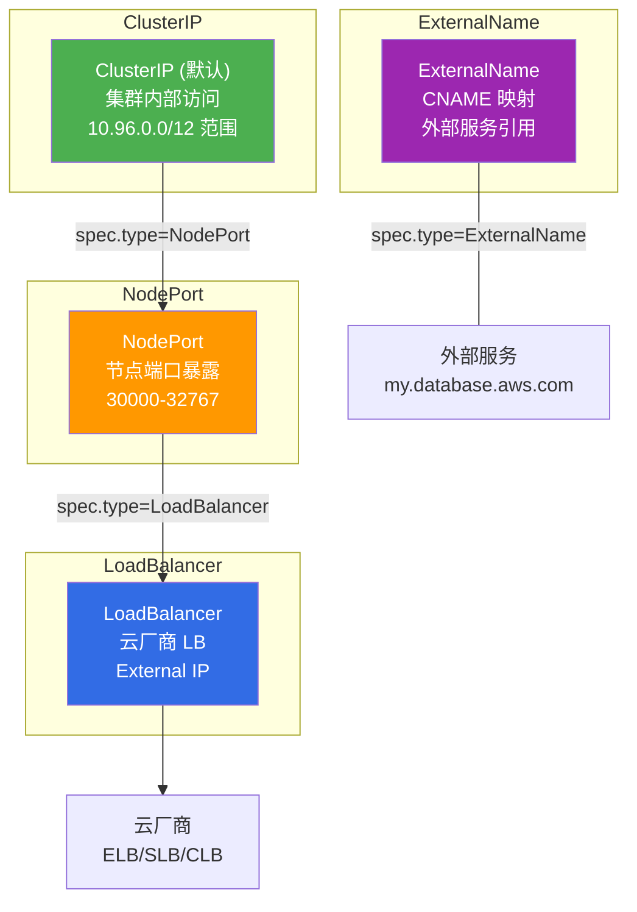
```mermaid
graph TB
    subgraph ClusterIP
        CIP["ClusterIP (默认)<br/>集群内部访问<br/>10.96.0.0/12 范围"]
    end

    subgraph NodePort
        NP["NodePort<br/>节点端口暴露<br/>30000-32767"]
    end

    subgraph LoadBalancer
        LB_SVC["LoadBalancer<br/>云厂商 LB<br/>External IP"]
    end

    subgraph ExternalName
        EN["ExternalName<br/>CNAME 映射<br/>外部服务引用"]
    end

    CIP -->|spec.type=NodePort| NP
    NP -->|spec.type=LoadBalancer| LB_SVC
    EN ---|spec.type=ExternalName| EXT[外部服务<br/>my.database.aws.com]

    LB_SVC --> CLOUD[云厂商<br/>ELB/SLB/CLB]

    style CIP fill:#4CAF50,color:#fff
    style NP fill:#FF9800,color:#fff
    style LB_SVC fill:#326CE5,color:#fff
    style EN fill:#9C27B0,color:#fff
```

---

## 实验设计模板（Lab Design Template）

每个 Presentation 的实验环节必须按以下标准化模板编写：

### 实验模板结构

```markdown
## 🧪 实验模块：[实验名称]

### 实验概述

| 属性 | 内容 |
|:---|:---|
| **实验目标** | [一句话描述实验要验证/掌握什么] |
| **预计时长** | XX 分钟 |
| **难度等级** | ⭐⭐ / ⭐⭐⭐ / ⭐⭐⭐⭐ |
| **前置条件** | [已完成的实验/课程] |
| **所需资源** | [集群规模/节点数/特殊组件] |

### 环境准备

\`\`\`bash
# Step 0: 确认环境就绪
kubectl get nodes
kubectl get namespaces
# [其他前置验证命令]
\`\`\`

### 实验 X.1: [实验子任务名称]（XX 分钟）

**目标：** [具体目标]

\`\`\`bash
# Step 1: [操作描述]
kubectl apply -f - <<EOF
[YAML 配置]
EOF

# Step 2: [验证操作]
kubectl get [资源] -o wide

# 预期输出:
# NAME          READY   STATUS    RESTARTS   AGE
# my-app-xxx    1/1     Running   0          10s

# Step 3: [进一步操作]
\`\`\`

**验证检查点：**
- [ ] [检查项 1]
- [ ] [检查项 2]
- [ ] [检查项 3]

**常见问题：**

| 问题 | 原因 | 解决方案 |
|:---|:---|:---|
| [问题现象] | [根因] | `kubectl [命令]` |

### 实验 X.2: [实验子任务名称]（XX 分钟）

[同上结构]

### 清理环境

\`\`\`bash
# 清理所有实验资源
kubectl delete [资源] --all -n [namespace]
\`\`\`

### 实验总结

| 知识点 | 本次实验验证了什么 |
|:---|:---|
| [知识点 1] | [验证内容] |
| [知识点 2] | [验证内容] |
```

### 实验难度分级

| 难度 | 标记 | 内容要求 | 通过标准 |
|:---|:---:|:---|:---|
| 基础 | ⭐⭐ | 按步骤操作，验证基本功能 | 完成所有步骤，输出与预期一致 |
| 中级 | ⭐⭐⭐ | 需要自行修改参数并分析结果 | 完成实验并回答附加问题 |
| 高级 | ⭐⭐⭐⭐ | 开放式场景，需自行设计方案 | 完成设计并验证方案可行 |

---

## Q&A 设计模板（Q&A Design Template）

### 预设问题设计

每个 Presentation 必须准备至少 15 个预设 Q&A，按难度分级：

```markdown
## ❓ Q&A 互动问答

### 入门级问题 (🔰)

**Q1: [简短的问题]？**

> [预设回答方向]
>
> 关键要点:
> - [要点 1]
> - [要点 2]

**Q2: [问题]？**

> [预设回答方向]

### 中级问题 (📘)

**Q3: [需要一定深度的问题]？**

> [预设回答方向]
>
> 延伸讨论:
> - [讨论方向 1]
> - [讨论方向 2]

**Q4: [问题]？**

> [预设回答方向]

### 高级问题 (⚡)

**Q5: [架构设计或生产场景问题]？**

> [预设回答方向]
>
> 生产建议:
> - [建议 1]
> - [建议 2]

### 互动讨论题

**讨论 1: [开放式讨论话题]**
- 分组讨论（5 分钟）
- 每组分享一个观点
- 讲师总结最佳实践
```

### Q&A 问题类型分布

| 类型 | 数量 | 说明 |
|:---|:---:|:---|
| 概念澄清题 | 3-4 | 确认基础理解正确 |
| 对比辨析题 | 2-3 | 区分容易混淆的概念 |
| 场景应用题 | 3-4 | 将知识应用到实际场景 |
| 故障排查题 | 2-3 | 给出问题现象，引导分析 |
| 设计讨论题 | 2-3 | 开放式架构设计讨论 |

---

## 时间分配指南（Time Allocation Guide）

### 按总时长分配

不同培训场景需要不同的时间分配策略。以下是 4 种常见时长的标准分配方案：

#### 30 分钟版本（技术分享/Lightning Talk）

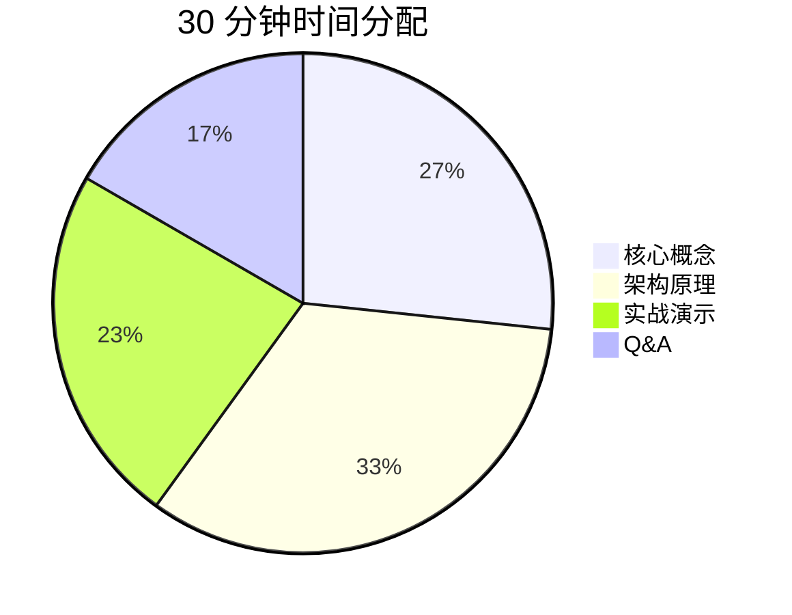
```mermaid
pie title 30 分钟时间分配
    "核心概念" : 8
    "架构原理" : 10
    "实战演示" : 7
    "Q&A" : 5
```

| 章节 | 时间 | 内容策略 |
|:---|:---:|:---|
| 核心概念 | 8min | 只讲"为什么需要"和最小示例 |
| 架构原理 | 10min | 选最重要的一个机制深入讲解 |
| 实战演示 | 7min | 1 个提前准备好的演示命令 |
| Q&A | 5min | 2-3 个预设问题 |

**裁剪规则：**
- 跳过所有阶段标签（🔰/📘/⚡），直接讲核心
- 只展示 1 个架构图
- 实验改为讲师演示，不做学员动手

#### 60 分钟版本（部门培训）

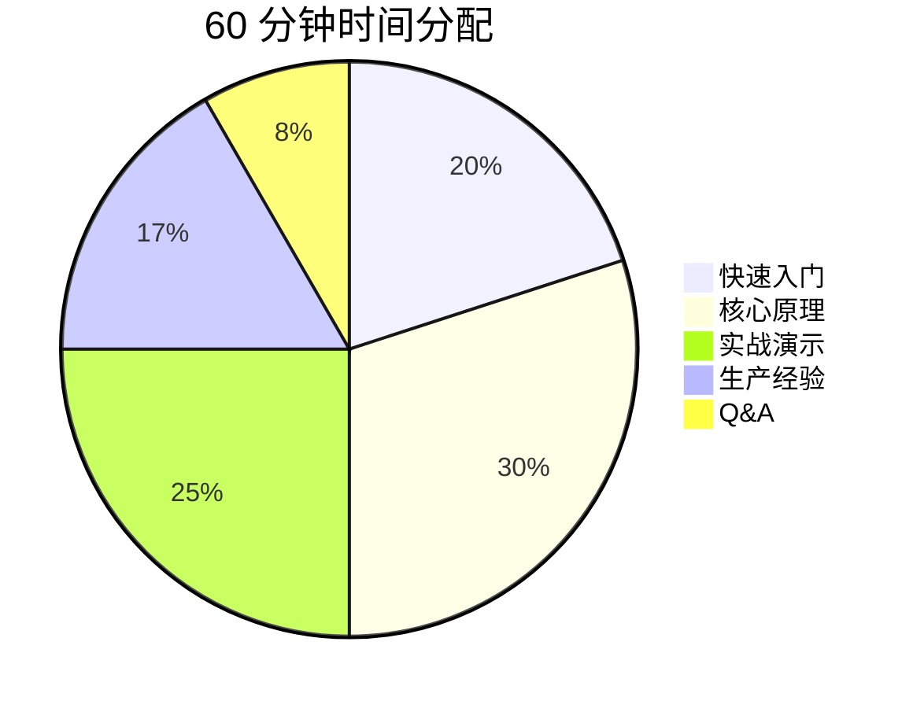
```mermaid
pie title 60 分钟时间分配
    "快速入门" : 12
    "核心原理" : 18
    "实战演示" : 15
    "生产经验" : 10
    "Q&A" : 5
```

| 章节 | 时间 | 内容策略 |
|:---|:---:|:---|
| 快速入门 | 12min | 痛点 + 最小示例 + 基础操作 |
| 核心原理 | 18min | 最重要的 2-3 个机制 |
| 实战演示 | 15min | 2-3 个关键操作演示 |
| 生产经验 | 10min | 1 个问题案例 + 最佳实践 |
| Q&A | 5min | 3-5 个预设问题 |

**裁剪规则：**
- 合并第二、三阶段为核心原理
- 跳过第四、五阶段，用"生产经验"替代
- 实验改为讲师演示 + 1 个简单学员练习

#### 90 分钟版本（Workshop 精华）

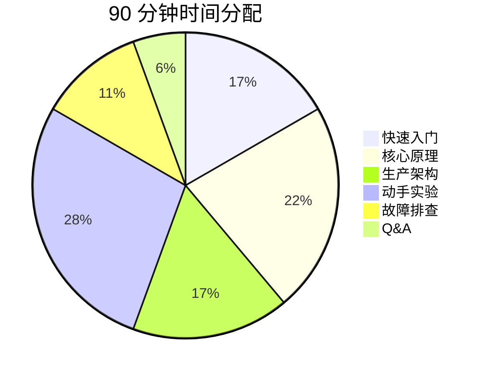
```mermaid
pie title 90 分钟时间分配
    "快速入门" : 15
    "核心原理" : 20
    "生产架构" : 15
    "动手实验" : 25
    "故障排查" : 10
    "Q&A" : 5
```

| 章节 | 时间 | 内容策略 |
|:---|:---:|:---|
| 快速入门 | 15min | 完整第一阶段 |
| 核心原理 | 20min | 2 个最重要机制 |
| 生产架构 | 15min | 配置规范 + HA 设计 |
| 动手实验 | 25min | 2-3 个学员实验 |
| 故障排查 | 10min | 1 个问题案例 |
| Q&A | 5min | 开放提问 |

**裁剪规则：**
- 第二阶段精简（保留最重要的部分）
- 第三阶段只讲配置规范，跳过监控和性能优化
- 第五阶段完全跳过
- 实验环节保证学员动手

#### 120 分钟版本（完整 Workshop）

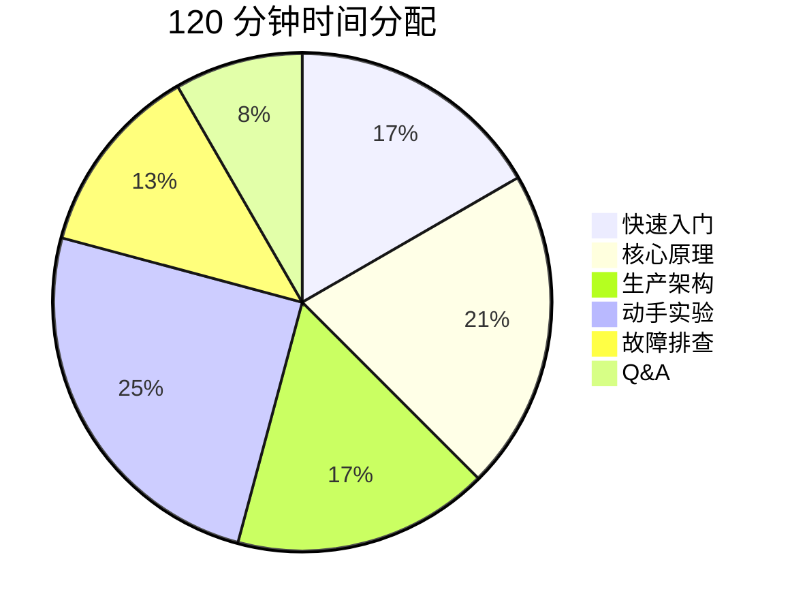
```mermaid
pie title 120 分钟时间分配
    "快速入门" : 20
    "核心原理" : 25
    "生产架构" : 20
    "动手实验" : 30
    "故障排查" : 15
    "Q&A" : 10
```

| 章节 | 时间 | 内容策略 |
|:---|:---:|:---|
| 快速入门 | 20min | 完整第一阶段 |
| 核心原理 | 25min | 完整第二阶段核心内容 |
| 生产架构 | 20min | 配置规范 + HA + 关键告警 |
| 动手实验 | 30min | 4-5 个学员实验 |
| 故障排查 | 15min | 2 个问题案例 + SOP |
| Q&A | 10min | 开放提问 + 讨论 |

**裁剪规则：**
- 保留第一、二、三、四阶段核心内容
- 第五阶段用 5 分钟快速过
- 实验环节充足，包含基础+进阶实验

### 时间弹性策略

| 情况 | 调整方案 |
|:---|:---|
| 时间不足（剩余 < 10min） | 跳过 Q&A，改为课后收集问题 |
| 时间不足（剩余 < 20min） | 精简实验环节，改为讲师演示 |
| 时间充裕（剩余 > 15min） | 增加互动讨论题或补充案例 |
| 学员提问过多 | 将部分问题移到课后，控制在 15min 内 |

---

## 文档约定与标记系统

### 难度标记

| 符号 | 级别 | 建议内容 |
|:---|:---|:---|
| 🔰 | **入门级** | 浅显易懂的比喻、基础概念图 |
| 📘 | **中级** | 内部组件交互图、状态机转换图 |
| ⚡ | **高级** | 生产级 YAML、性能对比图表、内核参数 |
| 🔧 | **工具/实战** | 终端操作演示、抓包分析记录 |
| 🛡️ | **安全** | 安全策略、RBAC 配置、合规要求 |
| 🧪 | **实验** | 动手操作、验证步骤 |

### 提示框类型

| 标记 | 用途 | Markdown 语法 |
|:---|:---|:---|
| 💡 **提示** | 补充说明、实用技巧 | `> 💡 **提示:** ...` |
| ⚠️ **注意** | 容易踩坑的点 | `> ⚠️ **注意:** ...` |
| 🔴 **红线** | 必须遵守的规则 | `> 🔴 **红线:** ...` |
| 📌 **要点** | 核心知识点总结 | `> 📌 **要点:** ...` |
| 🔗 **参考** | 外部文档链接 | `> 🔗 **参考:** ...` |

---

## SRE 运维红线（SRE Guardrails）

每篇 Presentation 必须在正文前明确列出本专题的运维红线，作为安全底线：

```markdown
## 🏆 SRE 运维红线 (SRE Guardrails)

- 🔴 *红线 1: [入门必知规则] (Beginner 必修)*
- 🔴 *红线 2: [生产环境硬性要求] (Intermediate 标准)*
- 🔴 *红线 3: [变更必须遵守的流程] (All levels)*
- 🔴 *红线 4: [本专题特有的安全/稳定性规则] (Advanced 准则)*
```

**红线设计原则：**
1. 每条红线必须有明确的技术依据（不得使用模糊表述）
2. 每条红线必须说明违反后果（附带真实问题案例）
3. 入门级红线不超过 3 条，总红线数不超过 6 条

---

## 学习成果预期

- **新手**: 能够理解基本概念，独立部署并进行简单的日常维护。
- **中级**: 掌握核心原理，能够进行配置调优和基础故障排查。
- **专家**: 掌握底层原理，具备大规模集群架构设计、极端性能调优及复杂故障处理能力。

---

## 文档质量检查清单

在提交每篇 Presentation 前，按此清单逐项检查：

| # | 检查项 | 标准 | 状态 |
|:---:|:---|:---|:---:|
| 1 | 演讲概述完整 | 包含版本/受众/时长/目标/前置要求 | ☐ |
| 2 | 阶段标签一致 | 🔰/📘/⚡/🔧/🛡️/🧪 使用正确 | ☐ |
| 3 | Mermaid 图表 ≥ 3 个 | 至少包含架构图、流程图、状态图各 1 个 | ☐ |
| 4 | YAML 示例可直接执行 | 所有 YAML 已在集群中验证通过 | ☐ |
| 5 | 命令示例有预期输出 | 每个 kubectl 命令附带预期输出 | ☐ |
| 6 | 实验步骤可复现 | 按步骤可完整走通 | ☐ |
| 7 | Q&A ≥ 10 个问题 | 覆盖入门/中级/高级 | ☐ |
| 8 | SRE 红线明确 | 3-6 条，有技术依据和后果说明 | ☐ |
| 9 | 参考链接有效 | 所有外部链接可访问 | ☐ |
| 10 | 字数达标 | ≥ 3000 字（`wc -w`） | ☐ |

---

*本文档遵循 KUDIG 全栈技术人才培养标准 | 版本: 2026.05.V4*

```

<!-- risk-assessed -->
