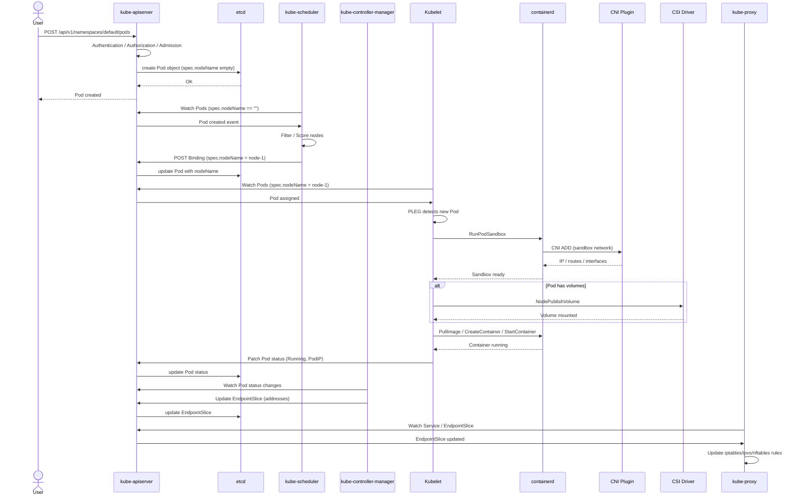

> **生产环境安全提示**
>
> 本文档包含可直接执行的运维命令。执行前请确认：当前目标集群与 Namespace 是否正确；是否具备足够的 RBAC 权限；是否已在非生产环境验证。命令风险等级标注：🔴 高风险（可能造成数据丢失或服务中断）、🟡 中风险（会修改集群状态，但通常可回滚）、🟢 低风险/只读（信息收集，无副作用）。


# Pod 创建端到端流程与组件联动排障

> **目标**：建立从 `kubectl apply` 到 Pod 可被 Service 访问的完整链路视图，帮助快速定位"Pod 为什么没起来"或"Pod 起来但访问不通"的问题。

---

<!-- chunk: 1. 整体流程概览 -->
## 1. 整体流程概览

```
用户/Controller
    ↓ kubectl apply / API
kube-apiserver
    ↓ 写入
etcd
    ↓ Watch 通知
kube-scheduler  →  选择节点
    ↓ 绑定（Binding）
kube-apiserver  →  更新 Pod spec.nodeName
    ↓ Watch 通知
kubelet
    ↓ CRI
containerd (RunPodSandbox / CreateContainer)
    ↓ CNI
CNI Plugin (ADD)
    ↓ CSI
CSI Driver (NodePublishVolume)
    ↓ 启动容器
Container Running
    ↓ 状态上报
kube-apiserver  ←  kubelet
    ↓ EndpointSlice 更新
kube-controller-manager (EndpointSlice Controller)
    ↓ 规则更新
kube-proxy (iptables/ipvs/nftables)
    ↓ Service 可访问
客户端访问 Pod
```

---

<!-- chunk: 2. Sequence 图 -->
## 2. 组件交互 Sequence 图



---

<!-- chunk: 3. 各阶段详解 -->
## 3. 各阶段详解

### 3.1 API Server 接收与持久化

- **关键动作**：认证、鉴权、准入（Mutating/Validating Webhook）、schema 校验、写入 etcd。
- **可能卡点**：
  - Webhook 不可用导致 Pod 无法创建
  - ResourceQuota / LimitRange 拒绝
  - etcd 写入慢导致请求超时

```bash
# 🟢 查看 Pod 创建事件
kubectl describe pod <pod>
kubectl get events --field-selector involvedObject.name=<pod>

# 🟢 检查 Admission Webhook
kubectl get mutatingwebhookconfigurations
kubectl get validatingwebhookconfigurations
```

### 3.2 Scheduler 调度

- **关键动作**：过滤不满足条件的节点 → 打分 → 选择最优节点 → 发送 Binding。
- **可能卡点**：
  - 资源不足、污点/亲和性不匹配
  - 自定义调度器配置错误
  - Scheduler 未运行或 Leader 丢失

```bash
# 🟢 查看调度失败原因
kubectl get events --field-selector reason=FailedScheduling
kubectl describe pod <pod> | grep -A20 Events
```

### 3.3 kubelet 接收与同步

- **关键动作**：通过 Watch 感知分配到本节点的 Pod，PLEG 触发 syncPod。
- **可能卡点**：
  - kubelet 未运行
  - 证书过期
  - 节点资源压力触发驱逐

```bash
# 🟢 查看节点状态与 kubelet 日志
kubectl describe node <node>
journalctl -u kubelet --since "5 min ago"
```

### 3.4 CRI / containerd 创建 Sandbox 与容器

- **关键动作**：`RunPodSandbox` 创建 pause 容器和网络命名空间 → `PullImage` → `CreateContainer` / `StartContainer`。
- **可能卡点**：
  - 镜像拉取失败（ImagePullBackOff）
  - containerd socket 不可达
  - 磁盘/inode 不足

```bash
# 🟢 查看容器运行时状态
crictl ps -a
crictl info
journalctl -u containerd --since "5 min ago"
```

### 3.5 CNI 配置网络

- **关键动作**：CNI `ADD` 为 Pod 分配 IP、配置 veth/bridge/路由、应用网络策略。
- **可能卡点**：
  - CNI 插件 Pod 未运行
  - IPAM 地址池耗尽
  - 节点路由不可达

```bash
# 🟢 检查 CNI 配置与 Pod IP
ls /etc/cni/net.d/
kubectl get pod <pod> -o jsonpath='{.status.podIP}'
ip route
```

### 3.6 CSI 挂载卷

- **关键动作**：kubelet VolumeManager 调用 CSI `NodePublishVolume`，将远程存储挂载到 Pod 路径。
- **可能卡点**：
  - CSI driver Pod 未运行
  - 存储后端不可用
  - 权限/SELinux 问题

```bash
# 🟢 检查 PVC/PV 状态
kubectl get pvc,pv
kubectl describe pvc <pvc>
kubectl logs -n kube-system -l app=csi-node-driver
```

### 3.7 Controller Manager 更新 EndpointSlice

- **关键动作**：EndpointSlice Controller 监听 Pod Ready 状态，更新 Service 后端地址列表。
- **可能卡点**：
  - KCM 异常导致 EndpointSlice 不更新
  - Pod 未通过 readinessProbe

```bash
# 🟢 检查 EndpointSlice
kubectl get endpointslices -l kubernetes.io/service-name=<svc>
kubectl get endpoints <svc>
```

### 3.8 kube-proxy 更新转发规则

- **关键动作**：根据 Service 和 EndpointSlice 更新 iptables/ipvs/nftables 规则。
- **可能卡点**：
  - kube-proxy 未运行
  - conntrack 表满
  - 规则未同步

```bash
# 🟢 检查 Service 转发规则
kubectl get svc <svc>
iptables -t nat -L KUBE-SERVICES -n | grep <cluster-ip>
# 或
ipvsadm -Ln
```

---

<!-- chunk: 4. 常见问题定位决策树 -->
## 4. 常见问题定位决策树

```
Pod 创建失败？
├── kubectl get pod 显示 Pending？
│   ├── describe 看到 FailedScheduling → 检查 scheduler / 资源 / 亲和性
│   └── describe 看到 ContainerCreating → 检查 CNI / CSI / 镜像
├── kubectl get pod 显示 ImagePullBackOff？
│   └── 检查镜像存在性、仓库认证、网络可达性
├── kubectl get pod 显示 CrashLoopBackOff？
│   └── 检查应用日志、探针配置、启动命令
├── Pod Running 但无法通过 Service 访问？
│   ├── 检查 EndpointSlice 是否包含 Pod IP
│   ├── 检查 kube-proxy 规则是否生成
│   └── 检查 CNI 网络策略 / 安全组
└── Pod Running 但无法挂载卷？
    └── 检查 CSI driver / PVC / 存储后端
```

---

<!-- chunk: 5. 关键接口速查 -->
## 5. 关键接口速查

| 组件交互 | 协议/接口 | 默认端口 | 排查命令 |
|---------|----------|---------|---------|
| kubectl ↔ API Server | HTTPS REST | 6443 | `kubectl get --raw /healthz` |
| API Server ↔ etcd | gRPC over TLS | 2379 | `etcdctl endpoint health` |
| Scheduler ↔ API Server | HTTPS Watch/List | 6443 | `kubectl get lease -n kube-system` |
| kubelet ↔ API Server | HTTPS | 6443 | `openssl x509 -dates` |
| kubelet ↔ CRI | gRPC | unix:///run/containerd/containerd.sock | `crictl info` |
| CRI ↔ CNI | CNI exec | - | `cat /etc/cni/net.d/*.conflist` |
| kubelet ↔ CSI | gRPC | unix:///csi/csi.sock | `kubectl get csidrivers` |
| kube-proxy ↔ API Server | HTTPS Watch | 6443 | `kubectl logs -n kube-system -l k8s-app=kube-proxy` |

---

<!-- chunk: 6. 检查清单 -->
## 6. 检查清单

- [ ] API Server 认证/授权/准入正常
- [ ] Scheduler 能成功为 Pod 分配节点
- [ ] kubelet 正常运行且证书有效
- [ ] containerd/CRI-O 正常运行且磁盘充足
- [ ] CNI 插件为 Pod 成功分配 IP
- [ ] CSI Driver 成功挂载卷（如有）
- [ ] Pod 通过 readinessProbe
- [ ] EndpointSlice 包含正确的 Pod IP
- [ ] kube-proxy 在所有节点生成一致的转发规则
- [ ] 安全组/防火墙允许 Service 访问

---

## Related

- [[集群基础/架构总览/02-core-components-deep-dive.md|Kubernetes 核心组件深度剖析]]
- [[集群基础/控制平面/20-kube-scheduler-deep-dive.md|kube-scheduler 深度解析]]
- [[集群基础/控制平面/13-kube-controller-manager-deep-dive.md|kube-controller-manager 深度解析]]
- [[集群基础/控制平面/15-kubelet-deep-dive.md|kubelet 深度解析]]
- [[集群基础/控制平面/16-kube-proxy-deep-dive.md|kube-proxy 深度解析]]
- [[集群基础/控制平面/23-container-network-deep-dive.md|容器网络深度解析]]
- [[集群基础/控制平面/22-container-storage-deep-dive.md|容器存储深度解析]]
- [[故障诊断/FTA故障树/list/pod-fta.md|Pod 异常故障树分析]]
- [[故障诊断/FTA故障树/list/service-fta.md|Service 异常故障树分析]]


<!-- risk-assessed -->
